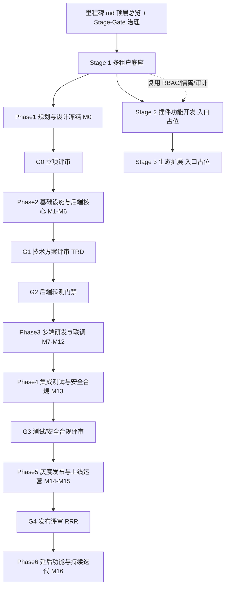
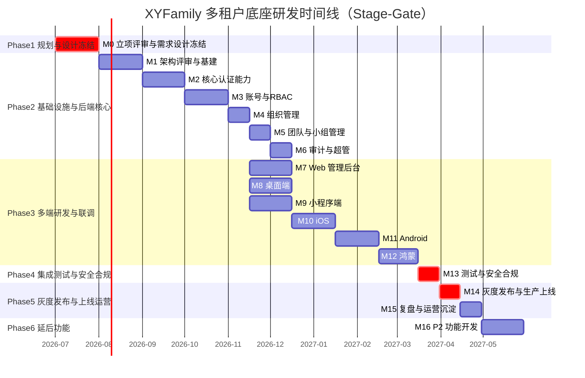

## 用户需求

- 忽略 `wiki/01-项目总览/03-里程碑` 目录全部内容（不读取、不引用其任何格式与结论），仅作为"被替代文档"存在。
- 依据 `wiki/02-需求与产品设计`（多租户底座 PRD 8 大模块 + 非功能需求 + 四端高保真原型）重新设计项目开发里程碑，输出至空目录 `wiki/01-项目总览/03-里程碑-New`。
- 严格遵循互联网大厂软件开发规范：以「敏捷迭代 + 阶段评审门禁(Stage-Gate)」混合研发模式为方法论内核，内嵌评审决策点、质量门禁(Quality Gate)、完成定义(DOD)、工程化基建、灰度/金丝雀发布、迭代复盘与风险登记册。

## 产品概述

重构 XYFamily 项目里程碑知识体系，建立一套以"需求驱动、交付端对齐原型、门禁驱动质量"为核心的项目研发里程碑体系。体系以多租户账号权限底座为详细设计主体，并为插件功能开发、生态扩展预留可扩展入口，便于后续阶段按需填充。

## 核心特性

- **三级文档结构**：顶层总览(`里程碑.md`) + 按 Stage 分子目录；每个 Stage 内再分该 Stage 顶层总览 + 按 Phase 子目录(每个 Phase 含 `Phase总览.md` 与各里程碑独立 `.md`)。
- **Stage-Gate 混合研发模型**：设置 G0 立项评审、G1 技术方案评审(TRD)、G2 后端转测门禁、G3 测试/安全合规评审、G4 发布评审(RRR) 五道门禁，每道门禁含明确准入/准出条件与决策人。
- **质量门禁与 DOD**：单测覆盖率阈值、接口契约测试、SAST/依赖扫描、性能基线压测、安全渗透作为硬性门禁；每个里程碑定义完成定义。
- **多端交付对齐原型**：交付端统一为后端、Web 端、桌面端、小程序端、移动端(iOS/Android/鸿蒙)，与 `02-原型与UI设计` 四端原型一致（去旧 H5、增桌面端）。
- **工程化与发布规范**：CI/CD 流水线、多环境(DEV/TEST/STAGING/PROD)、灰度/金丝雀发布、回滚预案、可观测性、迭代复盘 Retro。
- **Stage2/Stage3 入口占位**：插件功能开发、生态扩展仅建立阶段总览占位文档(含预期方向与底座衔接点)，不展开到里程碑。

## 技术栈选择

- 纯 Markdown 文档体系，无额外构建工具；遵循现有 wiki 文档约定（文档信息表 + 变更记录表 + 相对路径交叉引用）。
- 图表统一使用 Mermaid（flowchart / gantt），与现有 wiki 风格一致。
- 状态标识使用纯文本：待开始 / 进行中 / 已完成 / 已阻塞 / 待排期（不使用图形符号，满足输出规范）。

## 实现方案

本任务为文档体系重构，核心是将里程碑从"旧线性阶段"升级为"大厂 Stage-Gate 混合研发模式"。策略如下：

1. **门禁驱动拆解**：以 PRD 8 大模块 + 非功能需求为 Stage 1 内容源；按"规划冻结 → 架构评审 → 后端迭代 → 多端研发 → 测试合规 → 灰度上线 → 延后迭代"划分 6 个 Phase，并在关键节点嵌入 G0-G4 门禁。
2. **交付端重对齐**：前端 Phase 去独立 H5、增桌面端，移动端拆 iOS/Android/鸿蒙三里程碑，与四端原型完全一致。
3. **三级目录落地**：顶层 `里程碑.md` 给出全周期路线、阶段依赖、甘特图、质量门禁矩阵、风险登记册、管理规范；`01-多租户底座/` 下设 Stage 总览 + 6 个 Phase 子目录；`02-插件功能开发/`、`03-生态扩展/` 仅放入口占位文档。
4. **状态与进度可维护**：M0 沿用"进行中"基线（需求与设计冻结），后端核心 M1-M6 标注"已完成"（参考既有交付记录），其余标注"待开始/待排期"；门禁状态单独维护。

### 关键大厂机制

- **Stage-Gate 五门禁**：G0 立项评审（PRD Review 通过）→ G1 技术方案评审（TRD/架构/安全方案评审通过）→ G2 后端转测门禁（接口契约测试 + 单测≥80% + SAST 通过）→ G3 测试/安全合规评审（集成测试 + 渗透 + 多租户隔离验证通过）→ G4 发布评审 RRR（容量评估 + 灰度方案 + 回滚预案 + 监控告警就绪）。
- **质量门禁 Quality Gate**：单测覆盖率≥80%、接口契约(OpenAPI)一致性、SAST/依赖扫描零高危、性能基线压测（API 95%<100ms）、安全渗透无高危、审计保留合规。
- **DOD（Definition of Done）**：每里程碑定义代码合入、测试通过、文档更新、可观测埋点、安全自查等完成条件。
- **工程化基建**：CI/CD 流水线、多环境(DEV/TEST/STAGING/PROD)、代码评审(CR)机制、可观测性（日志/指标/链路）。
- **发布规范**：灰度/金丝雀发布、回滚预案、监控告警、容量评估。
- **迭代复盘 Retro**：每 Phase 结束复盘并沉淀改进项。
- **风险登记册 Risk Register**：跨阶段风险跟踪与应对措施。

## 实现注意事项

- **禁止参考旧目录**：`03-里程碑/` 内容一律不读取、不引用、不修改；所有产出写入 `03-里程碑-New/`。
- **路径与交叉引用**：相对链接以 `03-里程碑-New/` 为基准；引用 PRD/架构/接口文档使用正确 `../` 或 `../../` 层级。
- **命名一致性**：Stage 子目录用 `01-`/`02-`/`03-` 前缀；Phase 子目录用 `01-Phase1-规划与设计冻结` 形式；里程碑文件用 `Mx-名称.md`。
- **范围控制**：Stage2/Stage3 不展开里程碑，避免与未定义需求冲突；衔接点仅引用底座已确定的 RBAC/多租户隔离/审计能力。

## 架构设计

整体采用"总览 → Stage → Phase → 里程碑"四级信息架构，顶层负责跨阶段编排与门禁治理，Stage 负责阶段内编排，Phase 承载阶段化分组，单里程碑文档承载任务清单、质量门禁、DOD、接口清单与风险。



## 目录结构

```
03-里程碑-New/
├── 里程碑.md                          # [NEW] 顶层总览：Stage-Gate 模型、阶段依赖、甘特图、质量门禁矩阵、风险登记册、管理规范
├── 01-多租户底座/
│   ├── 多租户底座.md                  # [NEW] Stage1 总览：Phase 分组、里程碑总表、模块依赖、门禁状态、数据统计、风险
│   ├── 01-Phase1-规划与设计冻结/
│   │   ├── Phase总览.md               # [NEW] Phase1 范围/时间/目标/准入门禁 G0
│   │   └── M0-立项评审与需求设计冻结.md # [NEW] PRD Review + TRD 冻结 + 原型确认（进行中，G0 门禁）
│   ├── 02-Phase2-基础设施与后端核心/
│   │   ├── Phase总览.md               # [NEW] Phase2 后端主线串行 + 准入 G1/准出 G2
│   │   ├── M1-技术架构评审与基础设施搭建.md # [NEW] TRD 评审 + 脚手架 + DB 初始化（已完成，G1）
│   │   ├── M2-核心认证能力.md          # [NEW] 注册/登录/Token/验证码/限流（已完成）
│   │   ├── M3-账号管理与RBAC权限引擎.md # [NEW] 个人信息/密码/注销/权限中间件（已完成）
│   │   ├── M4-组织管理.md              # [NEW] 组织CRUD/成员/角色（已完成）
│   │   ├── M5-团队与小组管理.md        # [NEW] 团队+小组 CRUD/接棒（已完成）
│   │   └── M6-审计日志与超级管理员.md  # [NEW] 异步审计/超管/强制降级（已完成，G2 转测门禁）
│   ├── 03-Phase3-多端研发与联调/
│   │   ├── Phase总览.md               # [NEW] Phase3 多端并行 + 联调规范（M4 后启动）
│   │   ├── M7-Web管理后台.md           # [NEW] React+AntD 管理后台
│   │   ├── M8-桌面端.md                # [NEW] 原生外壳 + 复用 Web 视图（新增，替旧 H5）
│   │   ├── M9-小程序端.md              # [NEW] 微信小程序（扫码加入/分享）
│   │   ├── M10-iOS原生App.md           # [NEW] SwiftUI 移动端第一阶段
│   │   ├── M11-Android原生App.md       # [NEW] Compose 移动端第二阶段
│   │   └── M12-鸿蒙HarmonyOS.md        # [NEW] ArkUI 移动端第三阶段
│   ├── 04-Phase4-集成测试与安全合规/
│   │   ├── Phase总览.md               # [NEW] Phase4 测试与合规 + 准入 G3
│   │   └── M13-集成测试与安全合规审查.md # [NEW] 覆盖率/渗透/隔离验证/合规（G3 门禁）
│   ├── 05-Phase5-灰度发布与上线运营/
│   │   ├── Phase总览.md               # [NEW] Phase5 发布与运营 + 准入 G4
│   │   ├── M14-灰度发布与生产上线.md    # [NEW] 金丝雀/灰度/K8s/监控/回滚（G4 RRR）
│   │   └── M15-迭代复盘与运营沉淀.md    # [NEW] Retro + 运营指标 + 知识沉淀
│   └── 06-Phase6-延后功能与持续迭代/
│       ├── Phase总览.md               # [NEW] Phase6 延后范围说明
│       └── M16-P2功能开发.md           # [NEW] 微信登录/第三方绑定/自动注册
├── 02-插件功能开发/
│   └── 插件功能开发.md                 # [NEW] Stage2 入口占位：阶段定位/预期方向/与底座衔接点
└── 03-生态扩展/
    └── 生态扩展.md                     # [NEW] Stage3 入口占位：远期方向/开放平台/商业化
```

## 关键文档结构（单里程碑）

单里程碑 `.md` 统一章节：一、里程碑概览(ID/所属阶段/起止/状态/前置/后续/目标/关联门禁)；二、任务清单(任务/优先级/状态/验收标准/涉及表)；三、交付产物(路径/说明)；四、技术要点；五、接口清单；六、质量门禁与 DOD(准入条件/准出条件/覆盖率/扫描/压测)；七、风险评估；八、关联文档。

## 顶层总览关键图表（甘特示意）

