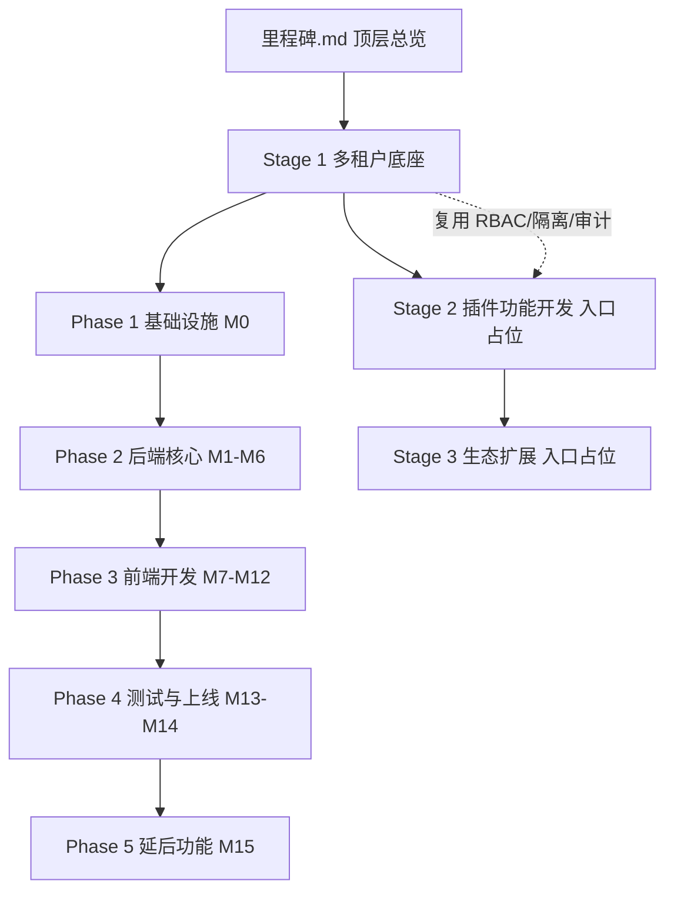

## 用户需求

- 忽略 `wiki/01-项目总览/03-里程碑` 目录现有内容，不作为设计依据（仅可参考其文档格式）。
- 依据 `wiki/02-需求与产品设计` 的项目需求（多租户底座 PRD 8 大模块 + 非功能需求 + 四端高保真原型）重新设计项目开发里程碑。
- 全新输出至 `wiki/01-项目总览/03-里程碑-New` 目录，该目录当前为空。

## 产品概述

对 XYFamily 项目里程碑知识体系进行重构，建立一套以「需求驱动、交付端对齐原型」为核心的项目开发里程碑体系。体系以多租户账号权限底座为详细设计主体，并为插件功能开发、生态扩展预留可扩展入口，便于后续阶段按需填充。

## 核心特性

- **三级文档结构**：顶层总览（`里程碑.md`） + 按 Stage 分子目录；每个 Stage 内再分该 Stage 顶层总览 + 按 Phase 子目录（每个 Phase 含 `Phase总览.md` 与各里程碑独立 `.md`）。
- **Stage 1 多租户底座详细化**：覆盖 5 个 Phase、16 个里程碑（M0–M15），从文档冻结、后端核心、前端开发、测试上线到延后功能。
- **交付端对齐原型设计**：交付端统一为「后端、Web 端、桌面端、小程序端、移动端（iOS / Android / 鸿蒙）」，相比旧里程碑去掉独立 H5 端、新增桌面端，与 `02-原型与UI设计` 四端原型一致。
- **Stage 2 / Stage 3 入口占位**：插件功能开发、生态扩展仅建立阶段总览占位文档（含预期方向与底座衔接点），不展开到里程碑级别，保留后续扩展能力。
- **统一规范**：沿用项目既有文档头部（文档信息表 + 变更记录表）、状态图例（待开始 / 进行中 / 已完成 / 已阻塞 / 待排期）与交叉引用约定。

## 技术栈选择

- 纯 Markdown 文档体系，无额外构建工具；遵循现有 wiki 文档约定（文档信息表、变更记录表、状态图例、相对路径交叉引用）。
- 图表使用 Mermaid（flowchart / gantt），与现有 wiki 风格一致。

## 实现方案

本任务为文档体系重构，目标是将里程碑从「旧三阶段 + 两层目录」升级为「需求驱动的三级目录结构」。核心策略：

1. **需求驱动拆解**：以 PRD 的 8 大功能模块（认证 / 账号 / 组织 / 团队 / 小组 / 权限 / 超管 / 审计）+ 非功能需求为 Stage 1 的内容源，按模块依赖关系排定后端核心里程碑（M1–M6）；以原型四端为前端开发里程碑（M7–M12）的内容源。
2. **交付端重对齐**：前端开发 Phase 去旧「H5」独立端、增「桌面端」，移动端拆 iOS / Android / 鸿蒙三里程碑，使交付端与 `02-需求与产品设计/02-原型与UI设计` 完全一致。
3. **三级目录落地**：顶层 `里程碑.md` 给出全周期路线、阶段依赖、甘特图、跨阶段风险与管理规范；`01-多租户底座/` 下设 `多租户底座.md` 总览 + 5 个 Phase 子目录；`02-插件功能开发/`、`03-生态扩展/` 仅放入口占位文档。
4. **状态与进度可维护**：沿用既有状态图例与周更新规范；M0 沿用「进行中」基线（文档与设计冻结，旧文档显示约 86%），M1–M6 标注「已完成」（旧目录记录后端核心已交付 36 接口），其余标「待开始 / 待排期」。

## 实现注意事项

- **禁止修改旧目录**：`03-里程碑/` 内容仅作格式参考，不改动；所有产出写入 `03-里程碑-New/`。
- **路径与交叉引用**：所有相对链接基于 `03-里程碑-New/` 为基准；引用 PRD / 架构 / 接口文档时使用 `../` 或 `../../` 正确层级（参考 `wiki/01-项目总览/项目总览.md`、`wiki/02-需求与产品设计/01-产品PRD/产品PRD.md`、`wiki/03-架构与方案设计/`、`wiki/04-接口文档/`）。
- **命名一致性**：Stage 子目录沿用 `01-` `02-` `03-` 前缀；Phase 子目录使用 `01-Phase1-基础设施` 形式；里程碑文件使用 `Mx-名称.md`，名称与旧体系对齐以便追溯。
- **性能/范围控制**：Stage 2 / Stage 3 不展开里程碑，避免与尚未定义的需求冲突；其衔接点仅引用底座已确定的 RBAC / 多租户隔离 / 审计等能力。

## 架构设计

整体采用「总览 → Stage → Phase → 里程碑」四级信息架构，顶层负责跨阶段编排，Stage 负责阶段内编排，Phase 负责阶段内阶段化分组，单里程碑文档承载任务清单、交付产物、技术要点、接口清单与风险。



## 目录结构

```
03-里程碑-New/
├── 里程碑.md                       # [NEW] 顶层总览：三阶段路线、阶段依赖、甘特图、跨阶段风险、管理规范、状态图例
├── 01-多租户底座/
│   ├── 多租户底座.md               # [NEW] Stage1 总览：Phase 分组、里程碑总表、模块依赖、数据统计、风险
│   ├── 01-Phase1-基础设施/
│   │   ├── Phase总览.md            # [NEW] Phase1 范围/时间/目标摘要
│   │   └── M0-文档与设计冻结.md    # [NEW] PRD/架构/规范/接口/原型冻结（进行中）
│   ├── 02-Phase2-后端核心/
│   │   ├── Phase总览.md            # [NEW] Phase2 后端主线串行说明
│   │   ├── M1-项目脚手架与数据库初始化.md   # [NEW] 脚手架+DB 初始化（已完成）
│   │   ├── M2-核心认证能力.md               # [NEW] 注册/登录/Token/验证码/限流（已完成）
│   │   ├── M3-账号管理与RBAC权限引擎.md      # [NEW] 个人信息/密码/注销/权限中间件（已完成）
│   │   ├── M4-组织管理.md                   # [NEW] 组织CRUD/成员/角色（已完成）
│   │   ├── M5-团队与小组管理.md             # [NEW] 团队+小组 CRUD/接棒（已完成）
│   │   └── M6-审计日志与超级管理员.md        # [NEW] 异步审计/超管/强制降级（已完成）
│   ├── 03-Phase3-前端开发/
│   │   ├── Phase总览.md            # [NEW] Phase3 多端并行说明（M4 后启动）
│   │   ├── M7-前端Web管理后台.md   # [NEW] React+AntD 管理后台
│   │   ├── M8-前端桌面端.md        # [NEW] 原生外壳+复用Web视图（新增，替旧 H5）
│   │   ├── M9-前端小程序端.md      # [NEW] 微信小程序（含扫码加入/分享）
│   │   ├── M10-前端iOS原生App.md   # [NEW] SwiftUI 移动端第一阶段
│   │   ├── M11-前端Android原生App.md # [NEW] Compose 移动端第二阶段
│   │   └── M12-前端鸿蒙HarmonyOS.md # [NEW] ArkUI 移动端第三阶段
│   ├── 04-Phase4-测试与上线/
│   │   ├── Phase总览.md            # [NEW] Phase4 测试与部署说明
│   │   ├── M13-集成测试与安全审查.md  # [NEW] 覆盖率/渗透/隔离验证
│   │   └── M14-生产部署与上线.md      # [NEW] K8s/PG/Redis/监控/灰度
│   └── 05-Phase5-延后功能/
│       ├── Phase总览.md            # [NEW] Phase5 延后范围说明
│       └── M15-P2功能开发.md       # [NEW] 微信登录/第三方绑定/自动注册
├── 02-插件功能开发/
│   └── 插件功能开发.md             # [NEW] Stage2 入口占位：阶段定位/预期方向/与底座衔接点
└── 03-生态扩展/
    └── 生态扩展.md                 # [NEW] Stage3 入口占位：远期方向/开放平台/商业化
```

## 关键文档结构（单里程碑）

单里程碑 `.md` 统一章节：一、里程碑概览（ID / 所属阶段 / 起止 / 状态 / 前置 / 后续 / 目标）；二、任务清单（任务 / 优先级 / 状态 / 验收标准 / 涉及表）；三、交付产物（路径 / 说明）；四、技术要点；五、接口清单；六、风险评估；七、关联文档。与现有 `M2-核心认证能力.md` 格式保持一致。