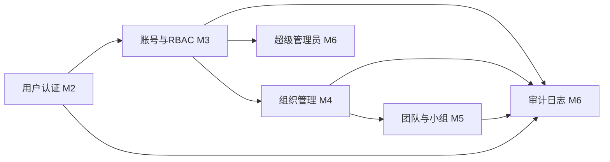

# 多租户底座

> Stage 1 是 XYFamily 项目的详细设计主体，目标是交付一套稳定、可扩展的多租户账号权限底座，为后续业务工具（插件）与生态扩展提供统一的身份认证、权限管理与数据隔离能力。本 Stage 共 6 个 Phase、17 个里程碑（M0–M16），并在关键节点设置 G0–G4 五道评审门禁。

---

## 文档信息

| 项目 | 内容 |
|------|------|
| 文档密级 | 内部 |
| 文档版本 | V1.0.0 |
| 编写人 | CodeBuddy |
| 审核人 | - |
| 生效时间 | 2026-07-18 |
| 废弃时间 | - |
| 关联标签 | Stage1、多租户底座、里程碑 |
| 关联目录 | 01-项目总览/03-里程碑/01-多租户底座 |

## 变更记录

| 版本 | 日期 | 变更内容 | 变更人 |
|------|------|----------|--------|
| V1.0.0 | 2026-07-18 | 创建 Stage 1 多租户底座里程碑总览 | CodeBuddy |

---

## 1. Stage 定位与目标

- **业务目标**：构建统一身份管理、多租户隔离（组织→团队→小组三级）、精细化权限控制（9 角色 + 45 权限点）、可扩展架构。
- **技术目标**：满足非功能需求（API 95% < 100ms、登录 95% < 200ms、吞吐 ≥ 1000 req/s、bcrypt cost12、JWT、审计保留 1 年）。
- **交付目标**：后端 + Web 端 + 桌面端 + 小程序端 + 移动端（iOS / Android / 鸿蒙）四端原型对齐交付。

## 2. Phase 分组与里程碑总表

| Phase | 名称 | 里程碑 | 关联门禁 | 状态 |
|-------|------|--------|----------|------|
| Phase 1 | 规划与设计冻结 | M0 立项评审与需求设计冻结 | G0 | 进行中（交付产物待补全） |
| Phase 2 | 基础设施与后端核心 | M1 技术架构评审与基础设施搭建 | G1 | 已完成 |
| Phase 2 | 基础设施与后端核心 | M2 核心认证能力 | - | 已完成 |
| Phase 2 | 基础设施与后端核心 | M3 账号管理与 RBAC 权限引擎 | - | 进行中（关键链路未闭环） |
| Phase 2 | 基础设施与后端核心 | M4 组织管理 | - | 进行中（关键链路未闭环） |
| Phase 2 | 基础设施与后端核心 | M5 团队与小组管理 | - | 进行中（关键链路未闭环） |
| Phase 2 | 基础设施与后端核心 | M6 审计日志与超级管理员 | G2 | 进行中（关键链路未闭环） |
| Phase 3 | 多端研发与联调 | M7 Web 管理后台 | - | 待开始 |
| Phase 3 | 多端研发与联调 | M8 桌面端 | - | 待开始 |
| Phase 3 | 多端研发与联调 | M9 小程序端 | - | 待开始 |
| Phase 3 | 多端研发与联调 | M10 iOS 原生 App | - | 待开始 |
| Phase 3 | 多端研发与联调 | M11 Android 原生 App | - | 待开始 |
| Phase 3 | 多端研发与联调 | M12 鸿蒙 HarmonyOS | - | 待开始 |
| Phase 4 | 集成测试与安全合规 | M13 集成测试与安全合规审查 | G3 | 待开始 |
| Phase 5 | 灰度发布与上线运营 | M14 灰度发布与生产上线 | G4 | 待开始 |
| Phase 5 | 灰度发布与上线运营 | M15 迭代复盘与运营沉淀 | - | 待开始 |
| Phase 6 | 延后功能与持续迭代 | M16 P2 功能开发 | - | 待排期 |

## 3. 模块依赖关系

> 认证 → 权限引擎 → 三级租户 → 审计/超管 构成后端核心的依赖主链；前端多端（M7–M12）均依赖后端核心（G2 通过）后并行启动。

## 4. 门禁状态

| 门禁 | 名称 | 状态 | 说明 |
|------|------|------|------|
| G0 | 立项评审 | 进行中 | M0 进行中，PRD 已基本评审 |
| G1 | 技术方案评审 | 已完成 | M1 已交付架构评审与基建 |
| G2 | 后端转测门禁 | 待评审 | 待 M6 完成后组织转测评审 |
| G3 | 测试 / 安全合规评审 | 待评审 | 待 M13 |
| G4 | 发布评审 RRR | 待评审 | 待 M14 |

## 5. 数据统计

| 指标 | 数值 |
|------|------|
| 功能模块 | 9 大模块 + 非功能需求 |
| 功能需求 | 约 65 条（P0 / P1 首期，P2 延后） |
| 角色 / 权限 | 9 角色 + 45 权限点 |
| 租户层级 | 组织 → 团队 → 小组 |
| 里程碑总数 | 17（M0–M16） |
| 评审门禁 | 5（G0–G4） |

## 6. 风险摘要

详见顶层 [里程碑](../里程碑.md#7-风险登记册-risk-register) 与各里程碑「风险评估」章节。重点关注：跨组织数据隔离（RISK-003）、JWT 密钥管理（RISK-001）、多端联调接口一致性（RISK-007）。

---

## 7. 关联文档

- 顶层里程碑：[里程碑](../里程碑.md)
- 多租户底座 PRD：[多租户底座](../../../02-需求与产品设计/01-产品PRD/01-多租户底座/多租户底座.md)
- 原型与 UI 设计：[原型与UI设计](../../../02-需求与产品设计/02-原型与UI设计/原型与UI设计.md)
- Phase 1：[Phase总览](./01-Phase1-规划与设计冻结/Phase总览.md)
- Phase 2：[Phase总览](./02-Phase2-基础设施与后端核心/Phase总览.md)
- Phase 3：[Phase总览](./03-Phase3-多端研发与联调/Phase总览.md)
- Phase 4：[Phase总览](./04-Phase4-集成测试与安全合规/Phase总览.md)
- Phase 5：[Phase总览](./05-Phase5-灰度发布与上线运营/Phase总览.md)
- Phase 6：[Phase总览](./06-Phase6-延后功能与持续迭代/Phase总览.md)
