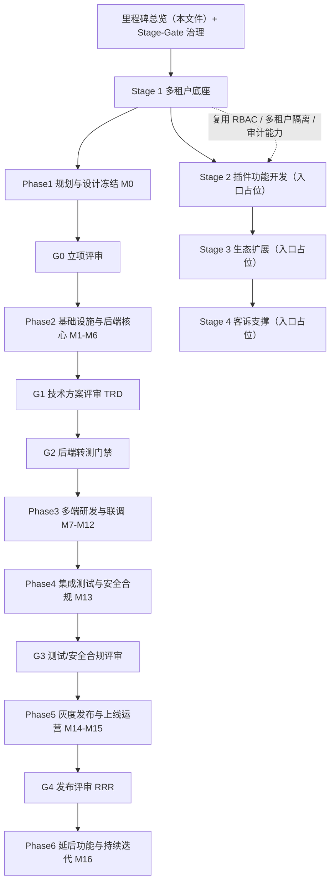
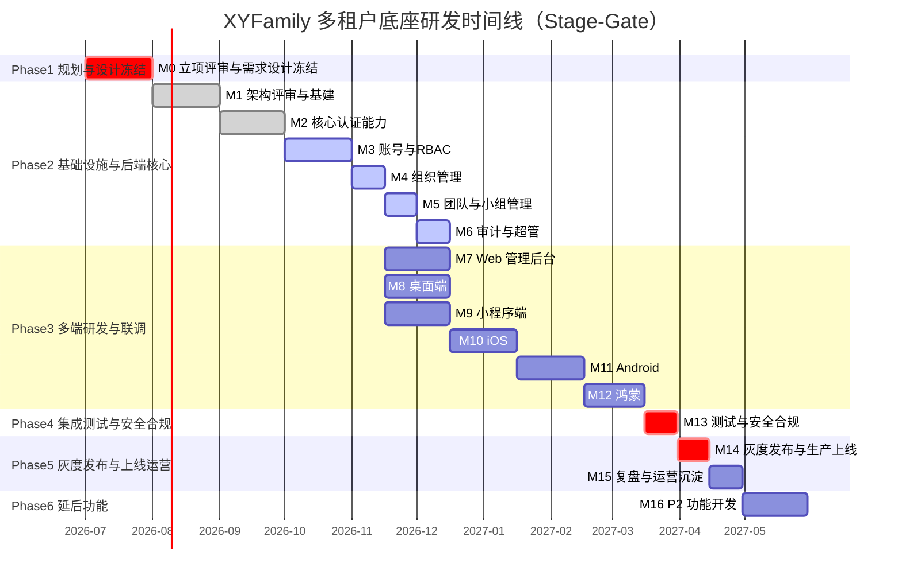

# 里程碑

> 基于 `02-需求与产品设计`（多租户底座 PRD + 四端高保真原型）重新设计的项目研发里程碑体系。采用互联网大厂「敏捷迭代 + 阶段评审门禁（Stage-Gate）」混合研发模式，以需求驱动、交付端对齐原型、门禁驱动质量为原则。

---

## 文档信息

| 项目 | 内容 |
|------|------|
| 文档密级 | 内部 |
| 文档版本 | V1.0.0 |
| 编写人 | CodeBuddy |
| 审核人 | - |
| 生效时间 | 2026-07-18 |
| 废弃时间 | - |
| 关联标签 | 里程碑、Stage-Gate、研发规划、项目管理 |
| 关联目录 | 01-项目总览/03-里程碑 |

## 变更记录

| 版本 | 日期 | 变更内容 | 变更人 |
|------|------|----------|--------|
| V1.0.0 | 2026-07-18 | 基于需求文档重建里程碑体系（Stage-Gate 模式） | CodeBuddy |

---

## 1. 研发方法论

本里程碑体系遵循互联网大厂通用的研发规范，采用 **敏捷迭代（Agile Sprint） + 阶段评审门禁（Stage-Gate）** 混合模式：

- **敏捷迭代**：后端核心与前端多端以 2 周为一个 Sprint 进行增量交付，每个 Sprint 有可演示的产出。
- **阶段评审门禁（Stage-Gate）**：在关键节点设置评审决策点（G0–G4），门禁不通过不得进入下一阶段。门禁由指定决策人（产品经理 / 技术负责人 / 架构师 / 安全负责人 / 运维负责人）评审放行。
- **质量门禁（Quality Gate）**：每道门禁内置硬性质量指标（单测覆盖率、接口契约、安全扫描、性能基线等），以自动化流水线卡点，不达标自动阻断。
- **完成定义（DOD）**：每个里程碑均定义明确的 Done 标准，避免"开发完即上线"的误区。
- **灰度发布与回滚**：生产发布一律走灰度/金丝雀，配套回滚预案与监控告警。
- **迭代复盘（Retro）**：每个 Phase 结束进行复盘，沉淀改进项进入下一期 Backlog。

### 1.1 阶段全景

| Stage | 名称 | 定位 | 状态 |
|-------|------|------|------|
| Stage 1 | 多租户底座 | 详细设计主体：9 大功能模块 + 非功能需求 + 四端交付 | 进行中 |
| Stage 2 | 插件功能开发 | 业务工具插件化接入能力（预留入口） | 待排期 |
| Stage 3 | 生态扩展 | 开放平台 / 商业化 / 跨组织协作（预留入口） | 待排期 |
| Stage 4 | 客诉支撑 | 客诉处理流程 / FAQ / 联系方式（预留入口） | 待排期 |

> Stage 2 / Stage 3 / Stage 4 当前仅建立入口占位，待 Stage 1 底座能力稳定后再行细化。

---

## 2. 评审门禁体系（Stage-Gate G0–G4）

| 门禁 | 名称 | 触发里程碑 | 决策人 | 准入条件（进入前一阶段需具备） | 准出条件（通过本门禁） |
|------|------|-----------|--------|-------------------------------|------------------------|
| G0 | 立项评审（PRD Review） | M0 | 产品经理 / 技术负责人 | 业务目标清晰、资源到位 | PRD 评审通过、范围与优先级（P0/P1）锁定、验收标准基线化、原型确认 |
| G1 | 技术方案评审（TRD） | M1 | 技术负责人 / 架构师 | G0 通过、PRD 冻结 | 架构设计、DB Schema、OpenAPI 契约、安全方案评审通过 |
| G2 | 后端转测门禁 | M6 | 技术负责人 / QA 负责人 | G1 通过、后端核心开发完成 | 接口契约测试通过、单测覆盖率 ≥ 80%、SAST/依赖扫描零高危、后端联调冒烟通过 |
| G3 | 测试 / 安全合规评审 | M13 | QA 负责人 / 安全负责人 | G2 通过、前后端联调完成 | 集成测试通过、渗透测试无高危、多租户隔离验证通过、性能基线达标 |
| G4 | 发布评审（RRR） | M14 | 技术负责人 / 运维负责人 / 安全负责人 | G3 通过、灰度方案与回滚预案就绪 | 容量评估完成、监控告警就绪、发布计划批准、灰度/全量策略确认 |

---

## 3. 质量门禁矩阵（Quality Gate）

| 指标 | 阈值 / 标准 | 检测方式 | 卡点门禁 |
|------|------------|----------|----------|
| 单元测试覆盖率 | 后端 ≥ 80%，前端 ≥ 70% | CI 覆盖率工具（如 JaCoCo / Vitest） | G2 / G3 |
| 接口契约一致性 | OpenAPI 文档与实现 100% 一致 | 契约测试（如 Dredd / Swagger Diff） | G2 |
| 静态安全扫描（SAST） | 零高危（High）漏洞 | SonarQube / CodeQL | G2 |
| 依赖漏洞扫描 | 零 Critical / High 开源组件漏洞 | SCA（如 Trivy / Dependabot） | G2 |
| 性能基线 | API 95% < 100ms；登录 95% < 200ms；吞吐 ≥ 1000 req/s | 压测（如 k6 / JMeter） | G3 |
| 安全渗透 | 无高危及以上风险 | 渗透测试 / 漏洞扫描 | G3 |
| 多租户隔离 | 跨组织数据零泄露 | 隔离专项用例 + 数据校验 | G3 |
| 审计合规 | 审计日志保留 1 年、注销后匿名化 | 合规检查脚本 | G3 |
| 可观测性 | 日志 / 指标 / 链路三件套接入率 100% | 探针检查 | G4 |

---

## 4. 里程碑总表（Stage 1 多租户底座）

> 状态图例：待开始 / 进行中 / 已完成 / 已阻塞 / 待排期

| 里程碑 | 名称 | 所属 Phase | 关联门禁 | 交付端 | 优先级 | 状态 |
|--------|------|-----------|----------|--------|--------|------|
| M0 | 立项评审与需求设计冻结 | Phase 1 规划与设计冻结 | G0 | 全端 | P0 | 进行中（交付产物待补全） |
| M1 | 技术架构评审与基础设施搭建 | Phase 2 基础设施与后端核心 | G1 | 后端 | P0 | 已完成 |
| M2 | 核心认证能力 | Phase 2 基础设施与后端核心 | - | 后端 | P0 | 已完成 |
| M3 | 账号管理与 RBAC 权限引擎 | Phase 2 基础设施与后端核心 | - | 后端 | P0 | 进行中（关键链路未闭环） |
| M4 | 组织管理 | Phase 2 基础设施与后端核心 | - | 后端 | P0 | 进行中（关键链路未闭环） |
| M5 | 团队与小组管理 | Phase 2 基础设施与后端核心 | - | 后端 | P0 | 进行中（关键链路未闭环） |
| M6 | 审计日志与超级管理员 | Phase 2 基础设施与后端核心 | G2 | 后端 | P1 | 进行中（关键链路未闭环） |
| M7 | Web 管理后台 | Phase 3 多端研发与联调 | - | Web 端 | P0 | 待开始 |
| M8 | 桌面端 | Phase 3 多端研发与联调 | - | 桌面端 | P1 | 待开始 |
| M9 | 小程序端 | Phase 3 多端研发与联调 | - | 小程序端 | P1 | 待开始 |
| M10 | iOS 原生 App | Phase 3 多端研发与联调 | - | 移动端(iOS) | P1 | 待开始 |
| M11 | Android 原生 App | Phase 3 多端研发与联调 | - | 移动端(安卓) | P1 | 待开始 |
| M12 | 鸿蒙 HarmonyOS | Phase 3 多端研发与联调 | - | 移动端(鸿蒙) | P2 | 待开始 |
| M13 | 集成测试与安全合规审查 | Phase 4 集成测试与安全合规 | G3 | 全端 | P0 | 待开始 |
| M14 | 灰度发布与生产上线 | Phase 5 灰度发布与上线运营 | G4 | 全端 | P0 | 待开始 |
| M15 | 迭代复盘与运营沉淀 | Phase 5 灰度发布与上线运营 | - | 全端 | P1 | 待开始 |
| M16 | P2 功能开发（延后功能） | Phase 6 延后功能与持续迭代 | - | 全端 | P2 | 待排期 |

---

## 5. 阶段依赖关系

---

## 6. 研发时间线（甘特图）

> 以下为 Stage 1 参考排期，以月（M）与半月（15d）为粒度；实际以 Sprint 节奏滚动调整。

---

## 7. 风险登记册（Risk Register）

| ID | 风险描述 | 概率 | 影响 | 阶段 | 应对措施 | 状态 |
|----|----------|------|------|------|----------|------|
| RISK-001 | JWT 密钥泄露 | 低 | 高 | Phase2 | 密钥托管（KMS）、定期轮换、jti 黑名单 | 进行中 |
| RISK-002 | 暴力破解密码 | 中 | 高 | Phase2 | 登录限流（IP 5分钟5次锁定15分钟）、验证码 | 已闭环 |
| RISK-003 | 跨组织数据泄露 | 低 | 高 | Phase2/3 | 强制 X-Organization-ID 上下文校验、隔离专项测试 | 进行中 |
| RISK-004 | Token 过期体验差 | 中 | 中 | Phase3 | 无感刷新机制（Refresh Token） | 待开始 |
| RISK-005 | 数据库性能瓶颈 | 中 | 中 | Phase2/4 | 合理索引、预留读写分离、连接池调优 | 进行中 |
| RISK-006 | 短信 / 邮箱发送失败 | 中 | 中 | Phase2 | 多服务商故障切换 | 待开始 |
| RISK-007 | 多端联调接口不一致 | 中 | 中 | Phase3 | OpenAPI 契约测试前置、Mock Server | 待开始 |
| RISK-008 | 灰度期间线上故障 | 低 | 高 | Phase5 | 金丝雀发布、自动回滚、全链路监控 | 待开始 |

> 风险登记册随里程碑推进每周更新，详见各里程碑「风险评估」章节与 Stage 总览。

---

## 8. 研发管理规范

### 8.1 完成定义（DOD）

每个里程碑达到"完成"必须满足：

1. 代码已合入主干（通过 CR，至少 1 名 Reviewer 批准）。
2. 单测 / 集成测试通过，覆盖率达到质量门禁阈值。
3. 接口契约与 OpenAPI 文档一致。
4. SAFe 安全扫描与依赖扫描零高危。
5. 可观测性埋点（日志 / 指标 / 链路）已接入。
6. 相关 Wiki 文档（需求 / 接口 / 本里程碑）已同步更新。
7. 验收标准经 QA 确认通过。

### 8.2 工程化与 CI/CD

- 多环境：DEV → TEST → STAGING → PROD，环境配置与密钥隔离。
- 流水线：提交即触发构建 → 单测 → 静态扫描 → 镜像构建 → 部署 TEST；发布需手动审批进入 STAGING/PROD。
- 代码评审：所有合入主干的 MR/PR 必须 CR，禁止自合入。

### 8.3 评审与决策流程

- 各门禁（G0–G4）需在里程碑准出前发起评审会议，输出《门禁评审记录》并归档。
- 门禁不通过时，里程碑回退至上一稳定状态，问题进入专项整改 Backlog。

### 8.4 文档与进度维护

- 本体系文档由项目 PM 每周更新一次（状态、进度、风险）。
- 里程碑状态变更需同步更新 Stage 总览与顶层总表。
- 门禁状态单独维护，门禁评审记录随里程碑归档。

---

## 9. 关联文档

- 项目总览：[项目总览](../项目总览.md)
- 产品 PRD 总览：[产品PRD](../../02-需求与产品设计/01-产品PRD/产品PRD.md)
- 多租户底座 PRD：[多租户底座](../../02-需求与产品设计/01-产品PRD/01-多租户底座/多租户底座.md)
- 原型与 UI 设计：[原型与UI设计](../../02-需求与产品设计/02-原型与UI设计/原型与UI设计.md)
- 架构与方案设计：[架构与方案设计](../../03-架构与方案设计/)
- 接口文档：[接口文档](../../04-接口文档/)
- 代码仓库：`code/`（后端 Go 位于 `code/backend/`）
- Stage 1 详细总览：[多租户底座](./01-多租户底座/多租户底座.md)
- Stage 2 入口占位：[插件功能开发](./02-插件功能开发/插件功能开发.md)
- Stage 3 入口占位：[生态扩展](./03-生态扩展/生态扩展.md)
- Stage 4 入口占位：[客诉支持](../../10-客诉支持/客诉支持.md)
