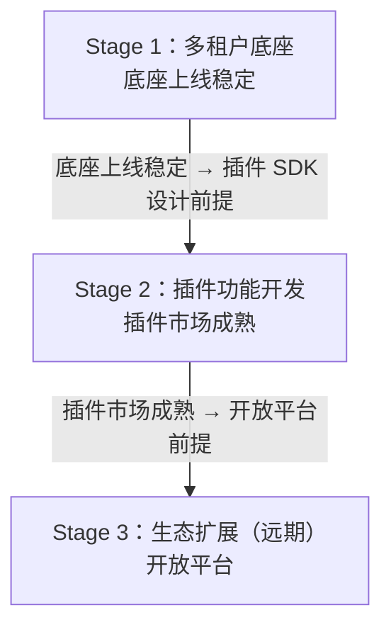
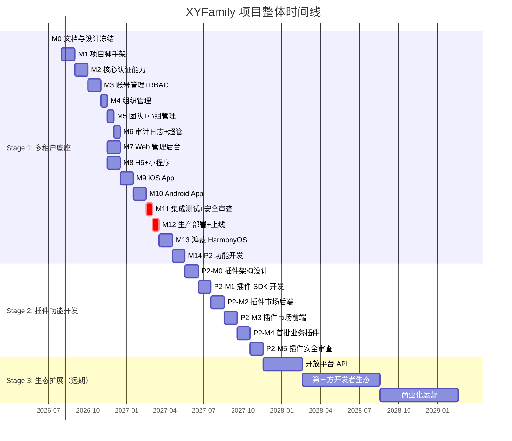

# 项目里程碑

> XYFamily 项目整体里程碑总览，覆盖从多租户底座到插件生态的完整演进路线。

---

## 文档信息

| 项目 | 内容 |
|------|------|
| 文档密级 | 内部 |
| 文档版本 | V1.0.0 |
| 编写人 | CatPaw |
| 审核人 | - |
| 生效时间 | 2026-07-16 |
| 废弃时间 | - |
| 关联标签 | 核心文档、系统基础、里程碑 |
| 关联目录 | 01-项目总览/03-里程碑 |

## 变更记录

| 版本 | 日期 | 变更内容 | 变更人 |
|------|------|----------|--------|
| V1.0.0 | 2026-07-16 | 初始创建：顶层项目里程碑，定义三大阶段（多租户底座 → 插件功能开发 → 生态扩展），引用阶段详细文档 | CatPaw |

---

## 目录

1. [里程碑总览](#一里程碑总览)
2. [阶段依赖关系](#二阶段依赖关系)
3. [Stage 1：多租户底座](#三stage-1多租户底座)
4. [Stage 2：插件功能开发](#四stage-2插件功能开发)
5. [Stage 3：生态扩展（远期）](#五stage-3生态扩展远期)
6. [项目时间线甘特图](#六项目时间线甘特图)
7. [跨阶段风险](#七跨阶段风险)
8. [里程碑管理规范](#八里程碑管理规范)
9. [关联文档](#九关联文档)

---

## 一、里程碑总览

XYFamily 定位为**通用多功能工具集平台**，项目采用「底座先行、插件迭代、生态远期」的三阶段演进策略。当前处于 **Stage 1：多租户底座**阶段。

| 阶段 | 名称 | 预计周期 | 状态 | 核心目标 | 阶段文档 |
|------|------|---------|------|---------|----------|
| **Stage 1** | 多租户底座 | 2026-07 ~ 2027-Q1 | 🔄 进行中 | 构建统一身份认证、多租户隔离、RBAC 权限引擎、审计日志底座，完成全端（后端 + Web/H5/小程序/iOS/Android/鸿蒙）交付与上线 | [多租户底座.md](./01-多租户底座/多租户底座.md) |
| **Stage 2** | 插件功能开发 | 2027-Q2 ~ 2027-Q4 | 🔲 待排期 | 基于底座能力，开发插件 SDK 与插件市场，实现业务工具的快速接入与动态管理 | [插件功能开发.md](./02-插件功能开发/插件功能开发.md) |
| **Stage 3** | 生态扩展 | 2028+ | 🔲 待规划 | 开放平台 API、第三方开发者生态、插件市场商业化运营 | - |

### 阶段定位一览

### 项目总体进度

| 维度 | 数值 | 说明 |
|------|------|------|
| 项目阶段 | 1 / 3 | 当前处于 Stage 1（多租户底座） |
| Stage 1 完成度 | ~64% | M0 文档与设计冻结进行中，M1-M14 待开始 |
| Stage 2 完成度 | 0% | 待 Stage 1 上线后启动 |
| Stage 3 完成度 | 0% | 远期规划，待 Stage 2 稳定后启动 |

---

## 二、阶段依赖关系

**关键依赖关系：**

| 前置阶段 | 后续阶段 | 依赖说明 |
|----------|----------|---------|
| Stage 1 (M12 上线) | Stage 2 | 底座生产环境稳定运行后，才能开始插件 SDK 设计；插件权限管控依赖底座 RBAC 引擎 |
| Stage 1 (M6 审计+超管) | Stage 2 | 插件操作审计、插件管理权限依赖底座审计与超管能力 |
| Stage 2 (插件市场) | Stage 3 | 插件市场运营成熟后，才能开放第三方开发者注册与上架 |
| Stage 1 (M14 P2 功能) | Stage 2 | 微信登录等 P2 功能完成后，插件可利用第三方身份实现联合登录 |

---

## 三、Stage 1：多租户底座

> 📄 **详细文档**：[多租户底座.md](./01-多租户底座/多租户底座.md)

### 3.1 阶段概述

| 项目 | 内容 |
|------|------|
| 阶段定位 | 平台基础设施层，为后续业务工具接入提供统一认证、权限、隔离与审计能力 |
| 预计周期 | 2026-07 ~ 2027-Q1（含延后功能） |
| 当前状态 | 🔄 进行中（M0 文档与设计冻结阶段，约 64%） |
| 里程碑数量 | 15（M0-M14） |
| 交付端 | 7（后端 Go + Web + H5 + 小程序 + iOS + Android + 鸿蒙） |

### 3.2 里程碑概览

| 里程碑 | 名称 | 预计时间 | 状态 | 关键交付物 |
|--------|------|---------|------|-----------|
| **Stage 1-A: 基础设施** | | | | |
| M0 | [文档与设计冻结](./01-多租户底座/M0-文档与设计冻结.md) | 2026-07 | 🔄 进行中 | 39 篇 PRD + 架构文档 + 开发规范 + 接口设计 |
| **Stage 1-B: 后端核心** | | | | |
| M1 | [项目脚手架与数据库初始化](./01-多租户底座/M1-项目脚手架与数据库初始化.md) | 2026-08 W1-W2 | 🔲 待开始 | go.mod、项目结构、Makefile、DB 迁移、CI |
| M2 | [核心认证能力](./01-多租户底座/M2-核心认证能力.md) | 2026-08 W3-W4 | 🔲 待开始 | 注册、登录、登出、Token 刷新、验证码 |
| M3 | [账号管理与RBAC权限引擎](./01-多租户底座/M3-账号管理与RBAC权限引擎.md) | 2026-09 W1-W2 | 🔲 待开始 | 个人信息、密码修改、权限中间件、Redis 缓存 |
| M4 | [组织管理](./01-多租户底座/M4-组织管理.md) | 2026-09 W3 | 🔲 待开始 | 组织 CRUD、成员邀请、角色分配 |
| M5 | [团队与小组管理](./01-多租户底座/M5-团队与小组管理.md) | 2026-09 W4 | 🔲 待开始 | 团队/小组 CRUD、成员管理、接棒机制 |
| M6 | [审计日志与超级管理员](./01-多租户底座/M6-审计日志与超级管理员.md) | 2026-10 W1 | 🔲 待开始 | 审计中间件、CLI init、系统配置 |
| **Stage 1-C: 前端开发** | | | | |
| M7 | [前端 Web 管理后台](./01-多租户底座/M7-前端Web管理后台.md) | 2026-10 W2-W3 | 🔲 待开始 | React + Ant Design，登录/Dashboard/组织 UI |
| M8 | [前端 H5 与微信小程序](./01-多租户底座/M8-前端H5与微信小程序.md) | 2026-10 W4 - 2026-11 W1 | 🔲 待开始 | H5 (React+Vant) + 小程序 |
| M9 | [前端 iOS 原生 App](./01-多租户底座/M9-前端iOS原生App.md) | 2026-11 W2-W3 | 🔲 待开始 | Swift + SwiftUI |
| M10 | [前端 Android 原生 App](./01-多租户底座/M10-前端Android原生App.md) | 2026-11 W4 - 2026-12 W1 | 🔲 待开始 | Kotlin + Jetpack Compose |
| **Stage 1-D: 测试与上线** | | | | |
| M11 | [集成测试与安全审查](./01-多租户底座/M11-集成测试与安全审查.md) | 2026-12 W2 | 🔲 待开始 | 覆盖率 ≥ 80%、渗透测试、多租户隔离验证 |
| M12 | [生产部署与上线](./01-多租户底座/M12-生产部署与上线.md) | 2026-12 W3-W4 | 🔲 待开始 | K8s 部署、PG 主从、监控告警 |
| **Stage 1-E: 延后功能** | | | | |
| M13 | [前端鸿蒙 HarmonyOS](./01-多租户底座/M13-前端鸿蒙HarmonyOS.md) | 2027-01 W1-W2 | 🔲 待排期 | ArkTS + ArkUI |
| M14 | [P2 功能开发](./01-多租户底座/M14-P2功能开发.md) | 2027-Q1 | 🔲 待排期 | 微信登录、第三方身份绑定 |

### 3.3 M0 子里程碑状态（当前进行中）

> V2.3.0 拆分为 6 个子里程碑逐项校验。

| 子里程碑 | 名称 | 状态 | 完成度 |
|----------|------|------|--------|
| M0a | PRD 文档与审查 | ✅ 已完成 | 100% |
| M0b | 架构设计文档 | 🔄 进行中 | 87.5% |
| M0c | 开发规范 | ✅ 已完成 | 100% |
| M0d | 接口设计与标准接口 | 🔄 进行中 | 32% |
| M0e | 项目总览补充 | 🔄 进行中 | 67% |
| M0f | 需求配套文档 | 🔲 待开始 | 0% |

> 完整任务清单、依赖关系图与风险详见 [多租户底座.md](./01-多租户底座/多租户底座.md)。

---

## 四、Stage 2：插件功能开发

> 📄 **详细文档**：[插件功能开发.md](./02-插件功能开发/插件功能开发.md)（待编写）

### 4.1 阶段概述

| 项目 | 内容 |
|------|------|
| 阶段定位 | 业务扩展层，基于底座的认证/权限/隔离能力，实现插件化业务工具的快速接入与动态管理 |
| 预计周期 | 2027-Q2 ~ 2027-Q4 |
| 当前状态 | 🔲 待排期 |
| 前置条件 | Stage 1 M12（生产上线）完成且稳定运行 |
| 核心价值 | 让平台从「单一底座」升级为「可插拔工具集」，业务工具无需重复造轮子 |

### 4.2 预期里程碑（草案）

> ⚠️ 以下为初步规划，具体任务清单将在 Stage 1 上线后细化。

| 里程碑 | 名称 | 预计时间 | 状态 | 关键交付物 |
|--------|------|---------|------|-----------|
| P2-M0 | 插件架构设计 | 2027-Q2 W1-W2 | 🔲 待排期 | 插件 SDK 接口定义、插件生命周期设计、插件权限模型 ADR |
| P2-M1 | 插件 SDK 开发 | 2027-Q2 W3-W4 | 🔲 待排期 | Go Plugin SDK、前端 SDK、插件脚手架工具 |
| P2-M2 | 插件市场后端 | 2027-Q3 W1-W2 | 🔲 待排期 | 插件注册/上架/审核 API、插件依赖管理、版本管理 |
| P2-M3 | 插件市场前端 | 2027-Q3 W3-W4 | 🔲 待排期 | Web 端插件市场 UI、H5/小程序插件入口 |
| P2-M4 | 首批业务插件 | 2027-Q4 W1-W2 | 🔲 待排期 | 1-2 个示范业务插件开发与上线 |
| P2-M5 | 插件安全审查 | 2027-Q4 W3-W4 | 🔲 待排期 | 插件沙箱隔离验证、权限越界检测、安全扫描 |

### 4.3 预期核心能力

| 能力域 | 说明 |
|--------|------|
| **插件生命周期** | 安装 → 启用 → 配置 → 停用 → 卸载，全程审计可追溯 |
| **插件权限模型** | 复用底座 RBAC，插件声明所需权限点，组织管理员审批授权 |
| **插件隔离** | 插件间数据隔离、插件与底座数据隔离（复用多租户 org_id 隔离机制） |
| **插件 SDK** | 提供统一 API（用户上下文、权限校验、数据访问、事件订阅），屏蔽底座细节 |
| **插件市场** | 插件发现、安装、评分、更新、版本回滚 |
| **动态加载** | 热插拔，不停机安装/卸载插件（后端 Go plugin 或微服务方案待 ADR 决策） |

### 4.4 与 Stage 1 的衔接点

| 底座能力（Stage 1） | 插件复用方式（Stage 2） |
|---------------------|------------------------|
| JWT 认证体系 | 插件 SDK 自动注入当前用户上下文 |
| RBAC 权限引擎 | 插件声明权限点 → 底座统一校验 |
| 多租户 org_id 隔离 | 插件数据自动按 org_id 隔离 |
| 审计日志中间件 | 插件操作自动记录审计日志 |
| 组织/团队/小组层级 | 插件可挂载到不同层级（组织级插件 / 团队级插件 / 小组级插件） |
| 超级管理员 | 超管可管理全局插件市场、审核上架申请 |

---

## 五、Stage 3：生态扩展（远期）

> 远期规划，待 Stage 2 插件市场成熟后细化。

### 5.1 阶段概述

| 项目 | 内容 |
|------|------|
| 阶段定位 | 生态运营层，开放平台能力，引入第三方开发者，实现商业化运营 |
| 预计周期 | 2028+ |
| 当前状态 | 🔲 待规划 |
| 前置条件 | Stage 2 插件市场稳定运营 |

### 5.2 预期方向

| 方向 | 说明 |
|------|------|
| 开放平台 API | 对外暴露标准化 API，第三方可独立开发应用接入 XYFamily |
| 第三方开发者生态 | 开发者注册、文档中心、沙箱环境、审核上架流程 |
| 插件市场商业化 | 插件付费、分成机制、开发者激励 |
| 跨平台集成 | 与钉钉/飞书/企业微信等平台的打通 |
| AI 能力接入 | 基于 AI 的智能插件、自动化工作流 |

---

## 六、项目时间线甘特图

---

## 七、跨阶段风险

| 风险 | 关联阶段 | 应对措施 |
|------|----------|---------|
| 底座能力不足以支撑插件化 | Stage 1 → Stage 2 | M0 阶段预留插件扩展点设计；Stage 2 启动前做底座能力评估 |
| 插件沙箱隔离方案不成熟 | Stage 2 | 提前调研 Go plugin / 微服务 / WASM 等方案，ADR 决策 |
| Stage 2 排期受 Stage 1 延期影响 | Stage 1 → Stage 2 | Stage 1 聚焦 P0 功能交付，P2 功能延后不阻塞 Stage 2 |
| 插件权限模型与底座 RBAC 冲突 | Stage 1 ↔ Stage 2 | 插件权限点纳入底座权限点体系统一管理，不另建权限模型 |
| 插件市场冷启动 | Stage 2 → Stage 3 | 首批示范插件由内部团队开发，验证流程后开放第三方 |
| 开放平台安全合规 | Stage 3 | 第三方应用审核机制、API 限流、数据最小化暴露 |

---

## 八、里程碑管理规范

| 规则 | 说明 |
|------|------|
| 文档结构 | 每个大阶段在 `03-里程碑/` 下独立子目录（如 `01-多租户底座/`、`02-插件功能开发/`），子目录内包含阶段总览 + 各里程碑详细文档 |
| 状态定义 | 🔲 待开始 / 🔄 进行中 / ✅ 已完成 / ⛔ 已阻塞 / 🔃 待排期 |
| 更新频率 | 每周一更新里程碑状态；里程碑完成时同步更新本文件与阶段文档 |
| 变更管理 | 里程碑增减或排期变更需在本文件变更记录中登记，并更新对应阶段文档 |
| 阶段切换 | 新阶段启动前需完成前置阶段的上线验收（M12 或等价里程碑），并更新本文件阶段状态 |
| 详细文档 | 各里程碑详细任务清单、验收标准、技术方案在阶段子目录的独立 .md 文件中维护 |

---

## 九、关联文档

### 阶段里程碑详细文档

#### Stage 1：多租户底座

- [多租户底座.md](./01-多租户底座/多租户底座.md) — Stage 1 阶段总览
- [M0 — 文档与设计冻结](./01-多租户底座/M0-文档与设计冻结.md)
- [M1 — 项目脚手架与数据库初始化](./01-多租户底座/M1-项目脚手架与数据库初始化.md)
- [M2 — 核心认证能力](./01-多租户底座/M2-核心认证能力.md)
- [M3 — 账号管理与RBAC权限引擎](./01-多租户底座/M3-账号管理与RBAC权限引擎.md)
- [M4 — 组织管理](./01-多租户底座/M4-组织管理.md)
- [M5 — 团队与小组管理](./01-多租户底座/M5-团队与小组管理.md)
- [M6 — 审计日志与超级管理员](./01-多租户底座/M6-审计日志与超级管理员.md)
- [M7 — 前端 Web 管理后台](./01-多租户底座/M7-前端Web管理后台.md)
- [M8 — 前端 H5 与微信小程序](./01-多租户底座/M8-前端H5与微信小程序.md)
- [M9 — 前端 iOS 原生 App](./01-多租户底座/M9-前端iOS原生App.md)
- [M10 — 前端 Android 原生 App](./01-多租户底座/M10-前端Android原生App.md)
- [M11 — 集成测试与安全审查](./01-多租户底座/M11-集成测试与安全审查.md)
- [M12 — 生产部署与上线](./01-多租户底座/M12-生产部署与上线.md)
- [M13 — 前端鸿蒙 HarmonyOS](./01-多租户底座/M13-前端鸿蒙HarmonyOS.md)
- [M14 — P2 功能开发](./01-多租户底座/M14-P2功能开发.md)

#### Stage 2：插件功能开发

- [插件功能开发.md](./02-插件功能开发/插件功能开发.md) — Stage 2 阶段总览（待编写）

### 项目关联文档

- [项目总览](../项目总览.md)
- [整体架构设计](../../03-架构与方案设计/01-基座/01-整体架构设计.md)
- [数据库设计](../../03-架构与方案设计/03-数据模型与契约/01-数据库设计/数据库设计.md)
- [接口文档](../../04-接口文档/接口文档.md)
- [需求背景与目标](../../02-需求与产品设计/01-产品PRD/01-多租户底座/01-需求背景与目标/需求背景与目标.md)

---

> 以下为知识图谱自动推荐的交叉引用，建议人工审阅确认后保留。

- [04-审计域](../../03-架构与方案设计/03-数据模型与契约/01-数据库设计/04-审计域.md) — 共享术语：审计、数据库（置信度 0.75）
- [03-权限域](../../03-架构与方案设计/03-数据模型与契约/01-数据库设计/03-权限域.md) — 共享术语：rbac、数据库、权限（置信度 0.75）
- [01-多租户底座](../../04-接口文档/02-错误码/01-多租户底座.md) — 共享术语：团队、小组、权限、认证、账号（置信度 0.75）
