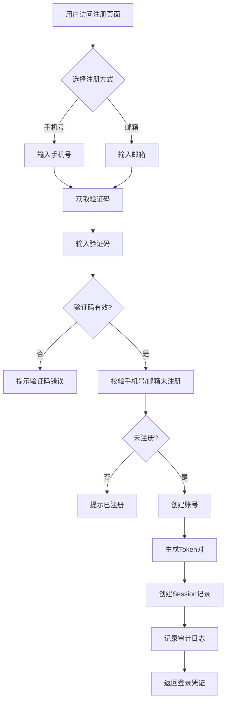

# 用户认证 · 注册认证

> 用户注册功能，支持手机号 / 邮箱验证码注册。注册成功后自动创建账号并返回登录凭证（Access Token + Refresh Token），无需二次登录。

---

## 文档信息

| 项目 | 内容 |
|------|------|
| 文档密级 | 内部 |
| 文档版本 | V1.0.0 |
| 编写人 | CatPaw |
| 审核人 | - |
| 生效时间 | 2026-07-14 |
| 废弃时间 | - |
| 关联标签 | 需求PRD、认证模块、注册 |
| 关联目录 | 02-需求与产品设计/01-产品PRD/01-多租户底座/01-用户认证模块 |

## 变更记录

| 版本 | 日期 | 变更内容 | 变更人 |
|------|------|----------|--------|
| V1.0.0 | 2026-07-14 | 创建文档 | CodeBuddy |

---

## 一、功能需求

### FR-AUTH-001：手机号 + 验证码注册

| 项目 | 内容 |
|------|------|
| **优先级** | P0 |
| **描述** | 用户通过手机号 + 短信验证码进行注册 |
| **验收标准** | 验证通过后创建账号，返回登录凭证（Access Token + Refresh Token） |

#### 1.1 业务规则

**前置条件：**
- 用户未被注册（phone 在 accounts 表中唯一）
- 手机号格式正确（中国大陆手机号，以 1 开头，第二位 3-9，总长度 11 位）

**注册流程：**
1. 用户在注册页面输入手机号
2. 系统验证手机号格式
3. 系统发送 6 位数字验证码（有效期 5 分钟）
4. 用户输入验证码（可选设置密码）
5. 系统校验验证码有效性（未过期、未超限、状态为 pending）
6. 系统校验手机号未被注册
7. 系统创建账号：
   - 生成 UUID（account_id）
   - 生成默认用户名（格式：`用户` + 6 位随机数字，000000-999999；若冲突则重新生成）
   - 设置默认头像 URL（系统预设 CDN 地址）
   - 密码字段为空（用户后续可设置，注册时可选）
   - 状态为 active
   - 记录创建时间 created_at
8. 若注册来自邀请链接（预填邀请信息）：
   - 自动接受邀请，加入目标组织 / 团队 / 小组
   - 分配邀请时指定的角色
9. 系统生成 Token 对（Access Token 30min + Refresh Token 7 天）
10. 系统创建 session 记录
11. 系统记录注册成功审计日志
12. 返回登录凭证

**限流规则：**
- 同一手机号 1 分钟内最多发送 1 次验证码
- 同一 IP 5 分钟内最多发送 5 次验证码
- 同一验证码最多尝试 5 次，超限后验证码失效

#### 1.2 输入与输出

**用户输入：**

| 输入项 | 类型 | 必填 | 说明 | 示例 |
|--------|------|------|------|------|
| 手机号 | string | 是 | 中国大陆手机号 | 13800138000 |
| 验证码 | string | 是 | 6 位数字 | 123456 |
| 密码 | string | 否 | 可选，需符合强度要求 | Abc123!@#def |
| 昵称 | string | 否 | 默认 `用户{account_id 后 4 位}`，用户可后续修改 | 用户8a3f |

**系统输出（注册成功）：**

| 输出项 | 说明 |
|--------|------|
| 账号基本信息 | account_id、nickname、phone、avatar_url、status、created_at |
| 登录凭证 | Access Token、Refresh Token、有效期、Token 类型 |

**系统输出（注册失败）：**

| 场景 | 错误提示 |
|------|----------|
| 手机号格式错误 | 手机号格式不正确 |
| 手机号已注册 | 该手机号已注册 |
| 验证码错误 | 验证码错误，请重新输入 |
| 验证码已过期 | 验证码已过期，请重新获取 |
| 验证码尝试次数超限 | 验证码尝试次数过多，请重新获取 |
| 验证码发送频率超限 | 验证码发送过于频繁，请稍后重试 |
| 密码强度不足 | 密码强度不足，最少 12 位，需包含大小写字母和数字 |
| 密码与手机号相同 | 密码不能与手机号相同 |

---

### FR-AUTH-002：邮箱 + 验证码注册

| 项目 | 内容 |
|------|------|
| **优先级** | P0 |
| **描述** | 用户通过邮箱 + 邮件验证码进行注册 |
| **验收标准** | 验证通过后创建账号，返回登录凭证（Access Token + Refresh Token） |

#### 2.1 业务规则

**前置条件：**
- 用户未被注册（email 在 accounts 表中唯一）
- 邮箱格式正确（标准邮箱格式）

**注册流程：**
1. 用户在注册页面输入邮箱
2. 系统验证邮箱格式
3. 系统发送 6 位数字验证码（有效期 5 分钟）
4. 用户输入验证码（可选设置密码）
5. 系统校验验证码有效性
6. 系统校验邮箱未被注册
7. 系统创建账号（流程同 FR-AUTH-001）
8. 系统生成 Token 对
9. 系统创建 session 记录
10. 记录注册成功日志
11. 返回登录凭证

**限流规则：**
- 同一邮箱 1 分钟内最多发送 1 次验证码
- 同一 IP 5 分钟内最多发送 5 次验证码
- 同一验证码最多尝试 5 次，超限后验证码失效

#### 2.2 输入与输出

**用户输入：**

| 输入项 | 类型 | 必填 | 说明 | 示例 |
|--------|------|------|------|------|
| 邮箱 | string | 是 | 标准邮箱格式 | user@example.com |
| 验证码 | string | 是 | 6 位数字 | 123456 |
| 密码 | string | 否 | 可选，需符合强度要求 | Abc123!@#def |
| 昵称 | string | 否 | 默认 `用户{account_id 后 4 位}`，用户可后续修改 | 用户8a3f |

**系统输出：** 同 FR-AUTH-001

---

## 二、密码强度规则

当用户在注册时设置密码，需满足以下强度要求：

| 规则 | 要求 | 说明 |
|------|------|------|
| 最小长度 | 12 位 | - |
| 最大长度 | 64 位 | - |
| 字符类型 | 至少包含大小写字母、数字 | 建议包含特殊字符 |
| 禁止项 | 不可与手机号 / 邮箱相同 | 防止弱密码 |
| 禁止项 | 不可包含连续 3 个以上相同字符 | 如 aaa、111 |

**密码强度等级：**

| 等级 | 描述 | 判断条件 |
|------|------|----------|
| 弱 | 仅满足基本长度要求 | 长度 ≥ 12，但缺少大小写或数字 |
| 中 | 满足基本规则 | 长度 ≥ 12，包含大小写字母和数字 |
| 强 | 满足所有规则 + 包含特殊字符 | 长度 ≥ 14，包含大小写字母、数字和特殊字符 |

**示例：**
- ✅ `Abc123!@#def`（符合要求）
- ❌ `12345678`（长度不足、字符类型单一）
- ❌ `13800138000`（与手机号相同）
- ❌ `user@example.com`（与邮箱相同）
- ❌ `Abc123!@#`（长度不足，仅 9 位）
- ❌ `Abcde111111f`（包含连续 6 个相同字符）

---

## 三、验证码规则

| 规则 | 要求 | 说明 |
|------|------|------|
| 格式 | 6 位数字 | 纯数字，无前导零限制 |
| 有效期 | 5 分钟 | 超期自动失效 |
| 最大尝试次数 | 5 次 | 超限后验证码失效 |
| 发送频率限制（目标） | 同一目标 1 分钟内最多 1 次 | 防止滥发 |
| 发送频率限制（IP） | 同一 IP 5 分钟内最多 5 次 | 防止短信 / 邮件轰炸 |
| 发送频率限制（账号） | 同一账号 1 小时内最多 10 次 | 防止账号级别验证码轰炸 |
| 一次性使用 | 验证成功后立即失效 | 防止重放攻击 |
| 场景隔离 | 各场景验证码独立存储（如 `register:{phone}`、`login:{phone}`、`reset:{phone}`、`recover:{phone}`） | 避免跨场景误用 |

---

## 四、账号创建规则

### 4.1 账号初始状态

| 字段 | 初始值 | 说明 |
|------|--------|------|
| account_id | UUID | 账号唯一标识，对外使用 |
| phone | 用户输入或 null | 手机号注册时填入 |
| email | 用户输入或 null | 邮箱注册时填入 |
| username | `用户` + 6 位随机数字 | 系统生成，全局唯一，不可修改 |
| password_hash | null 或 bcrypt 哈希 | 未设置密码时为 null |
| nickname | 用户输入或默认 | 默认 `用户{account_id 后 4 位}`，用户可后续修改 |
| avatar_url | 系统默认 CDN 地址 | 预设头像 URL |
| status | active | 正常状态 |
| created_at | 当前时间 | 注册时间 |
| updated_at | 当前时间 | 更新时间 |
| last_login_at | 当前时间 | 首次注册即视为首次登录 |

### 4.2 唯一性约束

- `phone`：全局唯一，允许 null（未绑定手机号的账号）
- `email`：全局唯一，允许 null（未绑定邮箱的账号）
- `username`：全局唯一，系统生成，**不可修改**
- `account_id`：全局唯一，对外标识

---

## 五、边界与异常处理

### 5.1 通用异常

| 场景 | 处理方式 |
|------|----------|
| 参数校验失败 | 返回参数校验错误，具体说明哪个字段不合法 |
| 服务器内部错误 | 记录错误日志，返回通用错误信息 |

### 5.2 手机号注册异常

| 场景 | 处理方式 |
|------|----------|
| 手机号格式无效 | 返回参数校验错误 |
| 手机号已被注册 | 返回资源冲突错误，提示已注册 |
| 验证码错误 | 返回错误，attempt_count + 1 |
| 验证码过期 | 返回错误，提示验证码已过期 |
| 验证码尝试次数超限 | 返回错误，验证码失效 |
| 短信发送失败 | 返回错误，提示稍后重试；多服务商故障切换 |
| 密码强度不足 | 返回错误，提示密码强度要求 |
| 密码与手机号相同 | 返回错误，提示密码不能与手机号相同 |

### 5.3 邮箱注册异常

| 场景 | 处理方式 |
|------|----------|
| 邮箱格式无效 | 返回参数校验错误 |
| 邮箱已被注册 | 返回资源冲突错误，提示已注册 |
| 验证码错误 | 返回错误，attempt_count + 1 |
| 验证码过期 | 返回错误，提示验证码已过期 |
| 验证码尝试次数超限 | 返回错误，验证码失效 |
| 邮件发送失败 | 返回错误，提示稍后重试；多服务商故障切换 |
| 密码强度不足 | 返回错误，提示密码强度要求 |
| 密码与邮箱相同 | 返回错误，提示密码不能与邮箱相同 |

### 5.4 限流处理

| 场景 | 处理方式 |
|------|----------|
| 验证码发送频率超限（目标） | 返回错误，提示稍后重试，返回剩余冷却时间 |
| 验证码发送频率超限（IP） | 返回错误，提示稍后重试 |

---

## 六、业务流程

### 6.1 注册流程

| 步骤 | 说明 | 关联需求 |
|------|------|----------|
| 选择注册方式 | 手机号或邮箱，二选一 | FR-AUTH-001/002 |
| 获取验证码 | 发送 6 位数字验证码，有效期 5 分钟 | NFR-SEC-003 |
| 验证码校验 | 校验有效性、attempt_count < 5、未过期 | FR-AUTH-001/002 |
| 重复校验 | 确保手机号 / 邮箱未被注册 | FR-AUTH-001/002 |
| 创建账号 | 生成 UUID、默认用户名、默认头像，状态 active | FR-AUTH-001/002 |
| 生成 Token | Access Token 30min + Refresh Token 7 天 | FR-AUTH-009 |
| 审计日志 | 记录注册成功 | FR-AUDIT-001 |

---

## 七、关联文档

| 文档 | 路径 | 说明 |
|------|------|------|
| 用户认证模块 README | [./用户认证模块](./用户认证模块.md) | 模块总览 |
| 登录认证 | [02-登录认证](./02-登录认证.md) | 登录功能详细规格 |
| 密码管理 | [03-密码管理](./03-密码管理.md) | 密码管理详细规格 |
| Token 管理 | [04-Token管理](./04-Token管理.md) | Token 管理详细规格 |
| 多租户底座 PRD 总览 | [../多租户底座](../多租户底座.md) | 完整产品需求规格 |

## 八、附录

### 8.1 手机号格式校验规则

支持中国大陆手机号格式：
- 以 1 开头
- 第二位为 3-9
- 总长度 11 位

正则表达式：`^1[3-9]\d{9}$`

### 8.2 邮箱格式校验规则

支持标准邮箱格式。

正则表达式：`^[a-zA-Z0-9._%+-]+@[a-zA-Z0-9.-]+\.[a-zA-Z]{2,}$`

### 8.3 默认用户名生成规则

格式：`用户` + 6 位随机数字（000000-999999）

示例：`用户123456`、`用户654321`

若生成后与现有用户名冲突，则重新生成。

### 8.4 密码强度规则

| 规则 | 要求 | 说明 |
|------|------|------|
| 最小长度 | 12 位 | - |
| 最大长度 | 64 位 | - |
| 字符类型 | 至少包含大小写字母、数字 | 建议包含特殊字符 |
| 禁止项 | 不可与手机号 / 邮箱相同 | 防止弱密码 |
| 禁止项 | 不可包含连续 3 个以上相同字符 | 如 aaa、111 |

### 8.5 密码哈希规则

- 算法：bcrypt
- Cost factor：12
- 明文密码不落库、不落日志
- 未设置密码时 password_hash 为 null

## 关联文档

> 以下为知识图谱自动推荐的交叉引用，建议人工审阅确认后保留。

- [权限管理模块](../06-权限管理模块/权限管理模块.md) — 共享术语：多租户、认证、账号（置信度 0.75）
- [PRD审核记录](../../审核记录/PRD审核记录.md) — 共享术语：多租户、认证、账号（置信度 0.75）
