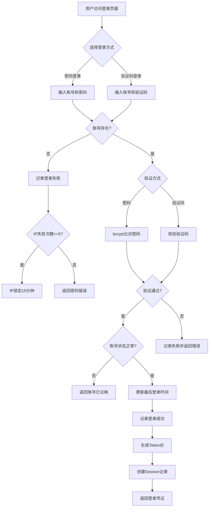

# PRD: 多租户底座 - 用户认证 - 登录认证

> 用户登录功能，支持多种登录方式：密码登录（4 种账号标识）、验证码登录（2 种）。首期不支持微信登录（延后 P2）。

---

## 文档信息

| 项目 | 内容 |
|------|------|
| 文档密级 | 内部 |
| 文档版本 | V1.0.0 |
| 编写人 | CatPaw |
| 审核人 | - |
| 生效时间 | 2026-07-14 |
| 废弃时间 | - |
| 关联标签 | 需求PRD、认证模块、登录 |
| 关联目录 | 02-需求与产品设计/01-产品PRD/01-多租户底座/01-用户认证模块 |

## 变更记录

| 版本 | 日期 | 变更内容 | 变更人 |
|------|------|----------|--------|
| V1.0.0 | 2026-07-14 | 初始创建，第一版正式发布（重新梳理，变更记录重置） | CatPaw |

---

## 一、功能需求

### 1.1 密码登录

密码登录支持 4 种账号标识类型，用户可选择任意一种进行登录：

#### FR-AUTH-003：手机号 + 密码登录

| 项目 | 内容 |
|------|------|
| **优先级** | P0 |
| **描述** | 用户通过手机号 + 密码进行登录 |
| **验收标准** | 验证通过后返回登录凭证（Access Token + Refresh Token） |

#### FR-AUTH-005：邮箱 + 密码登录

| 项目 | 内容 |
|------|------|
| **优先级** | P0 |
| **描述** | 用户通过邮箱 + 密码进行登录 |
| **验收标准** | 验证通过后返回登录凭证（Access Token + Refresh Token） |

#### FR-AUTH-007：用户名 + 密码登录

| 项目 | 内容 |
|------|------|
| **优先级** | P0 |
| **描述** | 用户通过用户名 + 密码进行登录 |
| **验收标准** | 验证通过后返回登录凭证（Access Token + Refresh Token） |

#### FR-AUTH-008：用户 ID + 密码登录

| 项目 | 内容 |
|------|------|
| **优先级** | P0 |
| **描述** | 用户通过用户 ID（account_id，UUID 格式）+ 密码进行登录 |
| **验收标准** | 验证通过后返回登录凭证（Access Token + Refresh Token） |

### 1.2 验证码登录

验证码登录支持 2 种账号标识类型：

#### FR-AUTH-004：手机号 + 验证码登录

| 项目 | 内容 |
|------|------|
| **优先级** | P0 |
| **描述** | 用户通过手机号 + 短信验证码进行登录 |
| **验收标准** | 验证通过后返回登录凭证（Access Token + Refresh Token） |

#### FR-AUTH-006：邮箱 + 验证码登录

| 项目 | 内容 |
|------|------|
| **优先级** | P0 |
| **描述** | 用户通过邮箱 + 邮件验证码进行登录 |
| **验收标准** | 验证通过后返回登录凭证（Access Token + Refresh Token） |

---

## 二、输入与输出

### 2.1 用户输入

**密码登录输入：**

| 输入项 | 类型 | 必填 | 说明 | 示例 |
|--------|------|------|------|------|
| 账号标识 | string | 是 | 手机号 / 邮箱 / 用户名 / 用户 ID，四选一 | 13800138000 |
| 密码 | string | 是 | 用户设置的密码 | Abc123!@#def |

**验证码登录输入：**

| 输入项 | 类型 | 必填 | 说明 | 示例 |
|--------|------|------|------|------|
| 账号标识 | string | 是 | 手机号或邮箱，二选一 | 13800138000 |
| 验证码 | string | 是 | 6 位数字验证码 | 123456 |

### 2.2 系统输出（登录成功）

| 输出项 | 说明 |
|--------|------|
| 登录凭证 | Access Token、Refresh Token、有效期、Token 类型 |
| 账号信息 | account_id、nickname、avatar_url、status |
| 状态标记 | 正常账号标记 active；注销宽限期账号标记 deactivating，附带宽限期到期时间 |

### 2.3 系统输出（登录失败）

| 场景 | 错误提示 |
|------|----------|
| 账号标识格式错误 | 账号格式不正确 |
| 账号不存在（密码登录） | 账号或密码错误（安全考虑，不区分账号不存在和密码错误） |
| 账号不存在（验证码登录） | 账号不存在 |
| 密码错误 | 账号或密码错误（不提示账号是否存在） |
| 验证码错误 | 验证码错误，请重新输入 |
| 验证码已过期 | 验证码已过期，请重新获取 |
| 验证码尝试次数超限 | 验证码尝试次数过多，请重新获取 |
| IP 被锁定 | 登录失败次数过多，请 15 分钟后再试 |
| 账号已注销（宽限期外） | 账号已注销 |
| 账号未设置密码 | 账号未设置密码，请通过验证码登录 |

---

## 三、业务规则

### 3.1 通用规则

**账号识别：**
- 系统根据用户提供的账号标识自动识别账号类型
- 识别优先级：用户 ID → 手机号 → 邮箱 → 用户名
- 仅允许提供一个账号标识，提供多个时返回参数错误

**登录成功后处理：**
- 更新账号最后登录时间
- 生成 Access Token（30 分钟有效）和 Refresh Token（7 天有效）
- 创建会话记录
- 记录登录成功审计日志

**登录失败处理：**
- 记录失败审计日志
- 累加 IP 级别失败计数器
- 密码错误时累加账号级别失败计数器

**IP 锁定规则：**
- 同一 IP 5 分钟内 5 次失败后锁定 15 分钟
- 锁定期间所有来自该 IP 的登录请求拒绝

**账号状态校验：**
- 状态为 `active` 的账号：正常登录
- 状态为 `deactivating` 的账号（注销宽限期内）：允许登录，但响应中标记状态为 deactivating，附带宽限期到期时间
- 状态为 `deactivated` 的账号（宽限期外）：拒绝登录

### 3.2 密码登录规则

**密码校验：**
- 使用 bcrypt 算法比对密码（cost factor 12）
- 密码错误时返回通用错误信息「账号或密码错误」，不区分「账号不存在」和「密码错误」
- 密码错误时返回剩余尝试次数提示

**账号查找逻辑：**
- 按账号标识类型依次查询：用户 ID → 手机号 → 邮箱 → 用户名
- 若均未找到，返回「账号或密码错误」（安全考虑，不暴露账号是否存在）

**密码为空处理：**
- 若账号未设置密码（如注册时未填写），密码登录提示「账号未设置密码，请通过验证码登录」

### 3.3 验证码登录规则

**验证码校验：**
- 从缓存 / 数据库读取验证码记录
- 校验验证码有效性（code 匹配、attempt_count < 5、未过期）
- 每次验证后 attempt_count + 1
- 验证成功后标记验证码为已使用
- 验证码超限后（attempt_count ≥ 5）标记为失效

**账号存在性检查：**
- 验证码登录需要账号已存在
- 若账号不存在，返回「账号不存在」错误
- 【延后 P2】登录自动注册功能暂不启用

---

## 四、边界与异常处理

### 4.1 通用异常

| 场景 | 处理方式 |
|------|----------|
| 参数校验失败 | 返回参数校验错误，具体说明哪个字段不合法 |
| 服务器内部错误 | 记录错误日志，返回通用错误信息 |

### 4.2 密码登录异常

| 场景 | 处理方式 |
|------|----------|
| 账号标识格式无效 | 返回参数校验错误 |
| 账号不存在 | 返回「账号或密码错误」，不提示具体原因（安全考虑） |
| 密码错误 | 返回「账号或密码错误」，不区分「账号不存在」和「密码错误」 |
| 账号未设置密码 | 返回错误，提示通过验证码登录 |
| IP 被锁定 | 返回错误，提示锁定剩余时间 |
| 账号已注销（宽限期外） | 返回错误，提示账号已注销 |

### 4.3 验证码登录异常

| 场景 | 处理方式 |
|------|----------|
| 账号标识格式无效 | 返回参数校验错误 |
| 账号不存在 | 返回「账号不存在」 |
| 验证码错误 | 返回「验证码错误」，attempt_count + 1 |
| 验证码过期 | 返回「验证码已过期，请重新获取」 |
| 验证码尝试次数超限 | 返回「验证码尝试次数过多，请重新获取」 |
| IP 被锁定 | 返回错误，提示锁定剩余时间 |
| 账号已注销（宽限期外） | 返回错误，提示账号已注销 |

### 4.4 安全异常

| 场景 | 处理方式 |
|------|----------|
| 连续失败 | 记录失败日志，累加 IP 和账号级别计数器 |
| IP 锁定 | 记录安全事件到审计日志 |
| 异常登录行为（如短时间内来自不同国家的登录） | 记录安全事件，可触发告警 |

---

## 五、业务流程

### 5.1 登录流程

| 步骤 | 说明 | 关联需求 |
|------|------|----------|
| 选择登录方式 | 密码 / 验证码（【延后 P2】微信登录） | FR-AUTH-003~008 |
| 账号校验 | 根据账号标识自动识别类型（手机号 / 邮箱 / 用户名 / 用户 ID） | FR-AUTH-003~008 |
| 验证 | 密码使用 bcrypt 比对 / 验证码校验有效性 | NFR-SEC-001/003 |
| 登录限流 | 同一 IP 5 分钟 5 次失败锁定 15 分钟 | NFR-SEC-002 |
| 账号状态校验 | active 正常登录；deactivating 允许登录但标记状态；deactivated 拒绝 | FR-AUTH-003~008 |
| 生成 Token | Access Token + Refresh Token | FR-AUTH-009 |
| 审计日志 | 记录登录尝试（成功 / 失败） | FR-AUDIT-001 |

---

## 六、关联文档

| 文档 | 路径 | 说明 |
|------|------|------|
| 用户认证模块 README | [./README.md](./README.md) | 模块总览 |
| 注册认证 | [01-注册认证-V1.0.0.md](./01-注册认证-V1.0.0.md) | 注册功能详细规格 |
| 密码管理 | [03-密码管理-V1.0.0.md](./03-密码管理-V1.0.0.md) | 密码管理详细规格 |
| Token 管理 | [04-Token管理-V1.0.0.md](./04-Token管理-V1.0.0.md) | Token 管理详细规格 |
| 多租户底座 PRD 总览 | [../README.md](../README.md) | 完整产品需求规格 |

## 七、附录

### 7.1 登录响应 Token 载荷结构

Access Token 载荷包含以下信息：

| 字段 | 说明 |
|------|------|
| 账号 ID | 用户唯一标识 |
| 签发时间 | Token 签发时间 |
| 过期时间 | Token 过期时间 |
| Token 唯一标识 | 用于黑名单校验 |
| 组织列表 | 用户所属组织 ID 列表 |
| 角色信息 | 各组织下最高角色 |

详见 [04-Token管理-V1.0.0.md](./04-Token管理-V1.0.0.md)。

### 7.2 安全建议

**服务端：**
- 使用 HTTPS 加密传输
- 密码使用 bcrypt 存储（cost factor 12）
- 限制密码最大尝试次数（IP 级别）
- 记录所有登录尝试（成功和失败）
- 监控异常登录行为（异地登录、短时间内多次失败）

**客户端：**
- 不要在前端缓存密码
- Token 存储在安全的存储位置（如 HttpOnly Cookie 或安全的本地存储）
- 定期刷新 Access Token
- 登出时清除本地 Token

---

## 八、延后需求（P2）

### FR-AUTH-012：微信登录

| 项目 | 内容 |
|------|------|
| **优先级** | P2 |
| **描述** | 用户通过微信扫码进行登录 |
| **说明** | 微信登录需绑定手机号 / 邮箱，延后到 P2 阶段。接入方案将在第三方集成统一方案中设计。 |

### FR-AUTH-013：登录自动注册

| 项目 | 内容 |
|------|------|
| **优先级** | P2 |
| **描述** | 用户使用验证码登录时，如果账号不存在则自动注册 |
| **说明** | 首期验证码登录时，如果账号不存在，直接返回「账号不存在」错误。延后到 P2 阶段支持自动注册。 |
