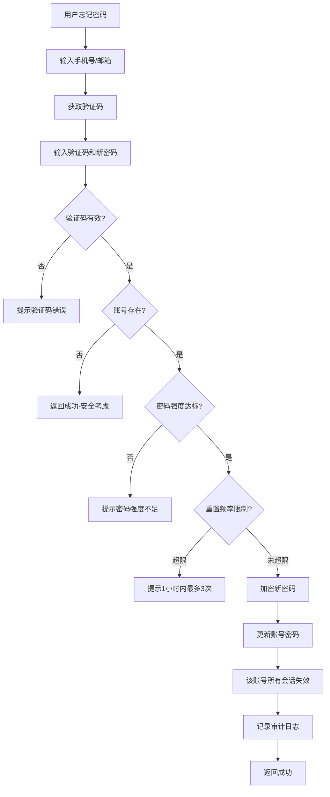

# PRD: 多租户底座 - 用户认证 - 密码管理

> 密码重置功能，用户忘记密码时通过验证码重置密码。密码重置后该账号所有会话立即失效。（注：已登录用户的主动改密归属账号管理模块，参见 [../02-账号管理模块/02-密码与安全-V1.0.0.md](../02-账号管理模块/02-密码与安全-V1.0.0.md)）

---

## 文档信息

| 项目 | 内容 |
|------|------|
| 文档密级 | 内部 |
| 文档版本 | V1.0.0 |
| 编写人 | CatPaw |
| 审核人 | - |
| 生效时间 | 2026-07-14 |
| 废弃时间 | - |
| 关联标签 | 需求PRD、认证模块、密码重置 |
| 关联目录 | 02-需求与产品设计/01-产品PRD/01-多租户底座/01-用户认证模块 |

## 变更记录

| 版本 | 日期 | 变更内容 | 变更人 |
|------|------|----------|--------|
| V1.0.0 | 2026-07-14 | 初始创建，第一版正式发布（重新梳理，变更记录重置） | CatPaw |

---

## 一、功能需求

### FR-AUTH-011：密码重置

| 项目 | 内容 |
|------|------|
| **优先级** | P0 |
| **描述** | 用户通过验证码重置密码 |
| **验收标准** | 验证码校验通过后允许设置新密码，密码重置后该账号所有会话立即失效 |

#### 1.1 业务规则

**前置条件：**
- 用户知道注册时使用的手机号或邮箱
- 手机号 / 邮箱格式正确

**密码重置流程：**
1. 用户在密码重置页面输入手机号或邮箱
2. 系统验证手机号 / 邮箱格式
3. 系统发送 6 位数字验证码（有效期 5 分钟）
4. 用户输入验证码和新密码
5. 系统校验验证码有效性（未过期、attempt_count < 5、状态有效）
6. 系统校验新密码强度（最少 12 位，包含大小写字母、数字）
7. 系统校验新密码不能与手机号 / 邮箱相同
8. 系统校验重置频率限制（同一账号 1 小时内最多 3 次）
9. 系统查询账号是否存在：
   - 若账号存在：继续执行密码重置
   - 若账号不存在：**返回成功**（安全考虑，防止账号枚举攻击）
10. 系统校验新密码不能与原密码相同（如果账号存在且已设置密码）
11. 系统使用 bcrypt 加密新密码（cost factor 12）
12. 系统更新账号密码哈希和更新时间
13. 系统使该账号所有会话失效
14. 系统记录密码重置审计日志
15. 返回成功

**限流规则：**
- 同一手机号 / 邮箱 1 分钟内最多发送 1 次验证码
- 同一验证码最多尝试 5 次，超限后验证码失效
- 同一账号 1 小时内最多重置 3 次密码

#### 1.2 输入与输出

**用户输入：**

| 输入项 | 类型 | 必填 | 说明 | 示例 |
|--------|------|------|------|------|
| 手机号 | string | ⚠️ | phone / email 至少提供一个 | 13800138000 |
| 邮箱 | string | ⚠️ | phone / email 至少提供一个 | user@example.com |
| 验证码 | string | 是 | 6 位数字 | 123456 |
| 新密码 | string | 是 | 新密码（需符合强度要求） | Abc123!@#def |

**系统输出（重置成功）：**

| 输出项 | 说明 |
|--------|------|
| 成功提示 | 密码重置成功 |
| 账号信息 | account_id、reset_at（重置时间） |

> **安全考虑**：即使账号不存在，也返回相同的成功响应，防止攻击者通过密码重置接口枚举账号是否存在。

**系统输出（重置失败）：**

| 场景 | 错误提示 |
|------|----------|
| 手机号 / 邮箱格式错误 | 账号格式不正确 |
| 验证码错误 | 验证码错误，请重新输入 |
| 验证码已过期 | 验证码已过期，请重新获取 |
| 验证码尝试次数超限 | 验证码尝试次数过多，请重新获取 |
| 新密码强度不足 | 密码强度不足，最少 12 位，需包含大小写字母和数字 |
| 新密码与原密码相同 | 新密码不能与原密码相同 |
| 密码重置频率超限 | 1 小时内最多重置 3 次密码，请稍后再试 |
| 验证码发送频率超限 | 验证码发送过于频繁，请稍后重试 |

---

## 二、密码强度规则

### 2.1 基本规则

| 规则 | 要求 | 说明 |
|------|------|------|
| 最小长度 | 12 位 | - |
| 最大长度 | 64 位 | - |
| 字符类型 | 至少包含大小写字母、数字 | 建议包含特殊字符 |
| 禁止项 | 不可与手机号 / 邮箱相同 | 防止弱密码 |
| 禁止项 | 不可与原密码相同 | 必须设置新密码 |
| 禁止项 | 不可包含连续 3 个以上相同字符 | 如 aaa、111 |

### 2.2 密码强度等级

| 等级 | 描述 | 判断条件 |
|------|------|----------|
| 弱 | 仅满足基本长度要求 | 长度 ≥ 12，但缺少大小写或数字 |
| 中 | 满足基本规则 | 长度 ≥ 12，包含大小写字母和数字 |
| 强 | 满足所有规则 + 包含特殊字符 | 长度 ≥ 14，包含大小写字母、数字和特殊字符 |

### 2.3 密码强度校验示例

| 密码 | 是否通过 | 原因 |
|------|----------|------|
| `Abc123!@#def` | ✅ | 符合要求 |
| `12345678` | ❌ | 长度不足、字符类型单一 |
| `13800138000` | ❌ | 与手机号相同 |
| `user@example.com` | ❌ | 与邮箱相同 |
| `Abc123!@#` | ❌ | 长度不足（仅 9 位） |
| `Abcde111111f` | ❌ | 包含连续 6 个相同字符 |

---

## 三、限流规则

### 3.1 验证码发送限流

| 维度 | 规则 |
|------|------|
| 单目标 | 1 分钟内最多发送 1 次 |
| 单 IP | 5 分钟内最多发送 5 次 |

### 3.2 验证码使用限流

| 规则 | 说明 |
|------|------|
| 同一验证码最多尝试 5 次 | 超限后验证码失效 |

### 3.3 密码重置频率限制

| 维度 | 规则 |
|------|------|
| 单账号 | 1 小时内最多重置 3 次 |

---

## 四、安全规则

### 4.1 账号存在性处理

- 密码重置接口在账号不存在时返回成功（安全考虑，防止账号枚举攻击）
- 返回成功后，攻击者无法区分账号是否真的存在
- 响应格式与账号存在时完全一致

### 4.2 会话失效

- 密码重置成功后，该账号所有会话立即失效
- 用户使用旧 Token 发起请求时会收到未授权错误，需重新登录
- 全部失效是更安全的做法，防止攻击者使用其他会话继续访问

### 4.3 审计日志

- 记录密码重置操作到审计日志
- 记录字段：账号 ID、操作类型、客户端 IP、客户端 UA、状态、失败原因、操作时间
- 不记录密码明文或哈希

---

## 五、边界与异常处理

### 5.1 通用异常

| 场景 | 处理方式 |
|------|----------|
| 参数校验失败 | 返回参数校验错误，具体说明哪个字段不合法 |
| 服务器内部错误 | 记录错误日志，返回通用错误信息 |

### 5.2 密码重置异常

| 场景 | 处理方式 |
|------|----------|
| 账号标识格式无效 | 返回参数校验错误 |
| 验证码错误 | 返回错误，attempt_count + 1 |
| 验证码过期 | 返回错误，提示验证码已过期 |
| 验证码尝试次数超限 | 返回错误，验证码失效 |
| 新密码强度不足 | 返回错误，提示密码强度要求 |
| 新密码与原密码相同 | 返回错误，提示必须设置新密码 |
| 密码重置频率超限 | 返回错误，提示 1 小时内最多 3 次 |
| 账号不存在 | **返回成功**（安全考虑，防止账号枚举攻击） |
| 账号已注销 | **返回成功**（安全考虑） |

### 5.3 安全异常

| 场景 | 处理方式 |
|------|----------|
| 连续重置失败 | 记录失败日志，不累加重置频率计数器 |
| 异常重置行为（如短时间内来自不同地区的重置） | 记录安全事件，可触发告警 |

---

## 六、业务流程

### 6.1 密码重置流程

| 步骤 | 说明 | 关联需求 |
|------|------|----------|
| 验证码校验 | 校验有效性、attempt_count < 5、未过期 | FR-AUTH-011 |
| 账号存在性 | 安全考虑，账号不存在时也可返回成功 | FR-AUTH-011 |
| 密码强度校验 | 最少 12 位，包含大小写字母、数字 | FR-AUTH-011 |
| 重置频率限制 | 同一账号 1 小时内最多 3 次 | NFR-SEC-001 |
| 会话失效 | 密码重置后所有会话立即失效 | FR-AUTH-011 |
| 审计日志 | 记录密码重置操作 | FR-AUDIT-002 |

---

## 七、关联文档

| 文档 | 路径 | 说明 |
|------|------|------|
| 用户认证模块 README | [./README.md](./README.md) | 模块总览 |
| 注册认证 | [01-注册认证-V1.0.0.md](./01-注册认证-V1.0.0.md) | 注册功能详细规格 |
| 登录认证 | [02-登录认证-V1.0.0.md](./02-登录认证-V1.0.0.md) | 登录功能详细规格 |
| Token 管理 | [04-Token管理-V1.0.0.md](./04-Token管理-V1.0.0.md) | Token 管理详细规格 |
| 多租户底座 PRD 总览 | [../README.md](../README.md) | 完整产品需求规格 |
| 账号管理 - 密码与安全 | [../02-账号管理模块/02-密码与安全-V1.0.0.md](../02-账号管理模块/02-密码与安全-V1.0.0.md) | 已登录用户修改密码（区别于密码重置） |

## 八、附录

### 8.1 密码重置 vs 修改密码

| 维度 | 密码重置（FR-AUTH-011） | 修改密码（FR-ACCT-003） |
|------|------------------------|------------------------|
| **场景** | 用户忘记密码，无法登录 | 已登录，知道旧密码 |
| **验证方式** | 验证手机号 / 邮箱验证码 | 验证旧密码 |
| **登录状态** | 无需登录 | 需要登录（Access Token） |
| **会话处理** | 所有会话失效 | 保留当前会话，其他会话失效 |
| **操作类型** | 密码重置 | 密码修改 |
| **所属模块** | 用户认证模块（本模块） | 账号管理模块 |

> 修改密码详见：[../02-账号管理模块/02-密码与安全-V1.0.0.md](../02-账号管理模块/02-密码与安全-V1.0.0.md)

### 8.2 会话失效要求

密码重置成功后，该账号的所有会话必须立即失效，用户使用旧 Token 发起请求时应收到未授权错误，需重新登录。会话失效的具体实现方式（如物理删除或标记撤销）不在本 PRD 中定义。

### 8.3 安全建议

**服务端：**
- 使用 HTTPS 加密传输
- 密码使用 bcrypt 存储（cost factor 12）
- 限制密码重置频率（1 小时 3 次）
- 记录所有密码重置操作（成功和失败）
- 监控异常重置行为（短时间内多次请求、异地请求）

**客户端：**
- 不要在前端缓存新密码
- 密码重置成功后清除本地 Token
- 引导用户重新登录
- 密码输入框显示强度指示器
