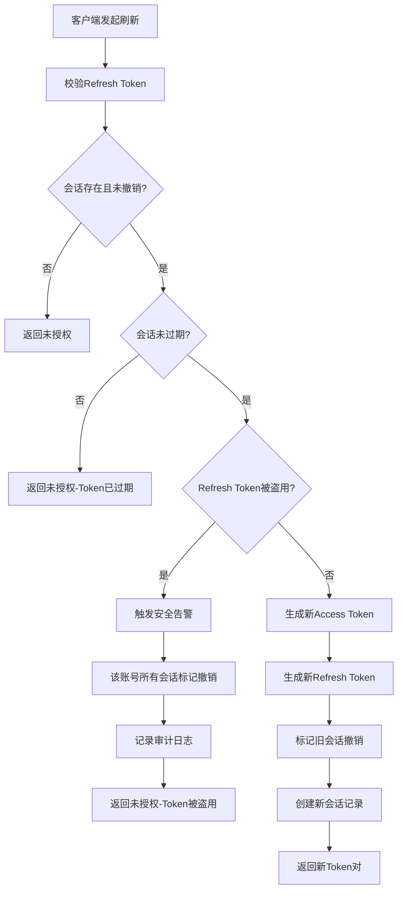
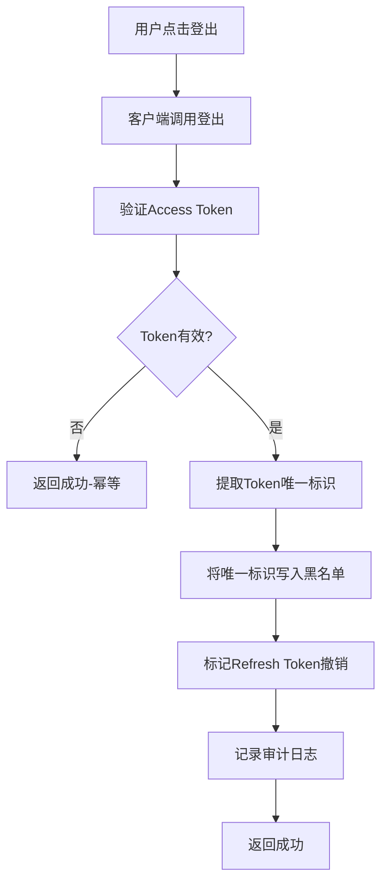
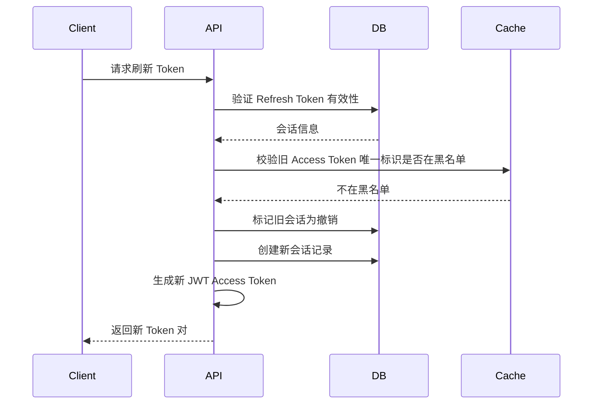
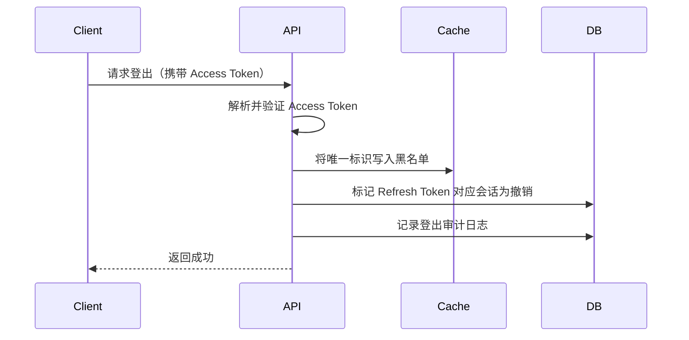

# PRD: 多租户底座 - 用户认证 - Token 管理

> Token 刷新与登出功能，管理用户会话生命周期。基于 JWT 双 Token 机制（Access Token + Refresh Token），支持 Token Rotation 与黑名单机制。

---

## 文档信息

| 项目 | 内容 |
|------|------|
| 文档密级 | 内部 |
| 文档版本 | V1.0.0 |
| 编写人 | CatPaw |
| 审核人 | - |
| 生效时间 | 2026-07-14 |
| 废弃时间 | - |
| 关联标签 | 需求PRD、认证模块、Token、会话 |
| 关联目录 | 02-需求与产品设计/01-产品PRD/01-多租户底座/01-用户认证模块 |

## 变更记录

| 版本 | 日期 | 变更内容 | 变更人 |
|------|------|----------|--------|
| V1.0.0 | 2026-07-14 | 初始创建，第一版正式发布（重新梳理，变更记录重置） | CatPaw |

---

## 一、功能需求

### FR-AUTH-009：Token 刷新

| 项目 | 内容 |
|------|------|
| **优先级** | P0 |
| **描述** | 使用 Refresh Token 获取新的 Access Token |
| **验收标准** | Refresh Token 有效且未撤销时返回新的 Access Token 和新的 Refresh Token |

#### 1.1 业务规则

**Token 基本参数：**
- Access Token 有效期：30 分钟
- Refresh Token 有效期：7 天
- Access Token 为无状态 JWT，Refresh Token 为有状态存储

**刷新规则：**
- 刷新时校验 Refresh Token 有效性（存在于会话存储中、未撤销、未过期）
- **Refresh Token Rotation**：刷新成功返回新的 Access Token + 新的 Refresh Token，旧 Refresh Token 立即作废
- 若旧 Refresh Token 再次被使用（说明被窃取），触发安全告警，该账号所有会话立即失效
- Refresh Token 过期后需重新登录
- Token 载荷包含：账号 ID、组织上下文、角色信息、过期时间、Token 唯一标识

**并发刷新处理：**
- 仅第一个请求成功，后续请求使用新 Token 或返回未授权
- 通过唯一约束或分布式锁防止并发问题

#### 1.2 输入与输出

**用户输入：**

| 输入项 | 类型 | 必填 | 说明 | 示例 |
|--------|------|------|------|------|
| Refresh Token | string | 是 | 当前会话的 Refresh Token | UUID 格式字符串 |

**系统输出（刷新成功）：**

| 输出项 | 说明 |
|--------|------|
| 新登录凭证 | 新的 Access Token、新的 Refresh Token、有效期、Token 类型 |

> 注意：刷新成功后返回全新的 Refresh Token，旧 Refresh Token 立即失效。

**系统输出（刷新失败）：**

| 场景 | 错误提示 |
|------|----------|
| Refresh Token 无效 | Refresh Token 无效，请重新登录 |
| Refresh Token 已过期 | Refresh Token 已过期，请重新登录 |
| Refresh Token 已撤销 | Refresh Token 已被撤销，请重新登录 |
| Refresh Token 被盗用 | 检测到异常登录行为，所有会话已失效，请重新登录 |
| 刷新频率超限 | 刷新过于频繁，请稍后重试 |

---

### FR-AUTH-010：登出

| 项目 | 内容 |
|------|------|
| **优先级** | P0 |
| **描述** | 用户登出系统，清除会话并使 Token 失效 |
| **验收标准** | 登出后 Access Token 和 Refresh Token 均失效，不可再使用 |

#### 2.1 业务规则

**登出规则：**
- 登出时必须同时提供当前 Access Token 和 Refresh Token
- 登出时将 Access Token 的唯一标识写入黑名单（TTL = Access Token 剩余有效期）
- 登出后 Refresh Token 标记为撤销
- 登出后 Token 立即失效，不可再使用
- 登出操作记录审计日志
- 支持单设备登出（仅撤销当前会话）
- 如 Token 已失效，登出接口返回成功（幂等）

#### 2.2 输入与输出

**用户输入：**

| 输入项 | 类型 | 必填 | 说明 |
|--------|------|------|------|
| Access Token | string | 是 | 当前会话的 Access Token（通过 Header 携带） |
| Refresh Token | string | 是 | 当前会话的 Refresh Token |

**系统输出（登出成功）：**

| 输出项 | 说明 |
|--------|------|
| 成功提示 | 登出成功 |

> 幂等性：Token 已失效时仍返回成功。

**系统输出（登出失败）：**

| 场景 | 错误提示 |
|------|----------|
| 缺少 Access Token | 缺少认证信息 |
| Access Token 无效 | Token 无效或已过期 |

---

## 二、Token 上下文与生命周期要求

> 本节仅描述需求层面的约束；Token 的具体字段结构、签名算法、存储与校验方式不在本 PRD 中定义。

### 2.1 Access Token 上下文要求

Access Token（无状态凭证）在鉴权时，需能识别以下上下文：

| 上下文项 | 说明 | 用途 |
|----------|------|------|
| 账号 ID | 用户唯一标识 | 身份识别 |
| Token 唯一标识 | 每个 Token 唯一 | 黑名单校验 |
| 组织上下文 | 用户所属组织 ID 列表 | 多租户隔离 |
| 角色信息 | 各组织下最高角色 | 权限判定 |
| 签发 / 过期时间 | Token 有效期 | 时效控制 |

### 2.2 Refresh Token 要求

- Refresh Token 为有状态凭证，服务端可对其做存在性、撤销状态、过期校验
- 有效期 7 天，与具体账号、设备、客户端 IP 关联，便于安全审计与主动撤销
- 不携带业务明文信息

---

## 三、业务规则

### 3.1 Token 刷新流程

| 步骤 | 说明 | 关联需求 |
|------|------|----------|
| 校验 Refresh Token | 查询会话存储确认存在、未撤销、未过期 | FR-AUTH-009 |
| 会话验证 | 确认 Refresh Token 与账号 ID 匹配 | FR-AUTH-009 |
| Refresh Token Rotation | 刷新成功后旧 Refresh Token 立即作废 | FR-AUTH-009 |
| 安全检测 | 若旧 Refresh Token 再次被使用，说明被盗用 | NFR-SEC-005 |
| 生成新 Token | 新 Access Token + 新 Refresh Token | FR-AUTH-009 |

### 3.2 登出流程

| 步骤 | 说明 | 关联需求 |
|------|------|----------|
| 提取唯一标识 | 从 Access Token 载荷中获取 Token 唯一标识 | FR-AUTH-010 |
| 写入黑名单 | 将唯一标识写入黑名单，TTL = Access Token 剩余有效期 | FR-AUTH-010 |
| 撤销 Refresh Token | 标记会话存储中的 Refresh Token 为已撤销 | FR-AUTH-010 |
| 幂等性 | Token 已失效时仍返回成功 | FR-AUTH-010 |
| 审计日志 | 记录登出操作 | FR-AUDIT-002 |

### 3.3 黑名单机制

**黑名单写入：**
- 登出时：将 Access Token 的唯一标识写入黑名单
- 修改密码时：将当前 Access Token 的唯一标识写入黑名单
- TTL = Access Token 剩余有效期（避免永久存储）

**黑名单校验：**
- 每次请求携带 Access Token 时，先校验唯一标识是否在黑名单中
- 若命中黑名单，返回未授权（Token 已被撤销）

### 3.4 会话管理规则

**会话创建：**
- 登录成功时创建
- 刷新 Token 时创建新会话，旧会话标记撤销

**会话撤销：**
- 登出时：撤销当前会话
- 刷新 Token 时：撤销旧会话
- 密码重置时：撤销该账号所有会话
- 修改密码时：撤销该账号其他会话（保留当前会话）

**会话清理：**
- 定期清理已过期且已撤销的会话记录
- 保留时间：至少 30 天（用于审计）

---

## 四、边界与异常处理

### 4.1 Token 刷新异常

| 场景 | 处理方式 |
|------|----------|
| Refresh Token 无效 | 返回未授权，前端跳转登录页 |
| Refresh Token 已过期 | 返回未授权，提示需重新登录 |
| Refresh Token 已撤销 | 返回未授权，提示需重新登录 |
| Access Token 唯一标识在黑名单 | 返回未授权，提示 Token 已被撤销 |
| Refresh Token 被盗用 | 触发安全告警，所有会话失效，返回未授权 |
| 并发刷新 | 仅第一个请求成功，后续返回新 Token 或未授权 |
| 刷新频率超限 | 返回限流错误 |

### 4.2 登出异常

| 场景 | 处理方式 |
|------|----------|
| 缺少 Access Token | 返回未授权 |
| Access Token 无效 | 返回成功（幂等） |
| Access Token 已过期 | 返回成功（幂等） |
| Refresh Token 不存在 | 仅将 Access Token 唯一标识加入黑名单 |
| 服务器内部错误 | 记录错误日志 |

---

## 五、业务流程

### 5.1 Token 刷新流程

### 5.2 登出流程

---

## 六、关联文档

| 文档 | 路径 | 说明 |
|------|------|------|
| 用户认证模块 README | [./README.md](./README.md) | 模块总览 |
| 注册认证 | [01-注册认证-V1.0.0.md](./01-注册认证-V1.0.0.md) | 注册功能详细规格 |
| 登录认证 | [02-登录认证-V1.0.0.md](./02-登录认证-V1.0.0.md) | 登录功能详细规格 |
| 密码管理 | [03-密码管理-V1.0.0.md](./03-密码管理-V1.0.0.md) | 密码管理详细规格 |
| 多租户底座 PRD 总览 | [../README.md](../README.md) | 完整产品需求规格 |

## 七、附录

### 7.1 安全建议

**服务端：**
- Access Token 使用短有效期（30 分钟），减少泄露影响
- Refresh Token 使用 Rotation 机制，防止重放攻击
- 黑名单 TTL 与 Access Token 剩余有效期一致，避免永久存储
- 定期清理已过期且已撤销的会话记录
- 监控异常刷新行为（短时间内大量刷新请求）

**客户端：**
- Access Token 存储在内存中（减少持久化泄露风险）
- Refresh Token 存储在安全的持久化存储中（如 HttpOnly Cookie 或 Keychain）
- 定期刷新 Access Token（建议每 25 分钟）
- 收到未授权后尝试刷新，刷新失败则引导用户重新登录
- 登出时清除本地所有 Token

### 7.2 与账号管理模块的交互

| 操作 | Token 影响 | 说明 |
|------|-----------|------|
| 修改密码 | 当前 Access Token 加入黑名单，其他会话撤销 | 保留当前会话，用户无需重新登录 |
| 密码重置 | 所有会话撤销 | 用户需重新登录 |
| 账号注销 | 所有会话撤销 | 用户无法继续使用 |

> 修改密码详见：[../02-账号管理模块/02-密码与安全-V1.0.0.md](../02-账号管理模块/02-密码与安全-V1.0.0.md)
