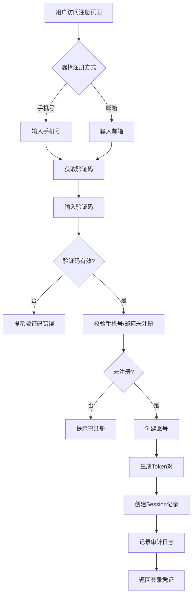
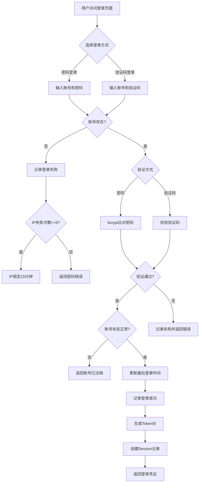
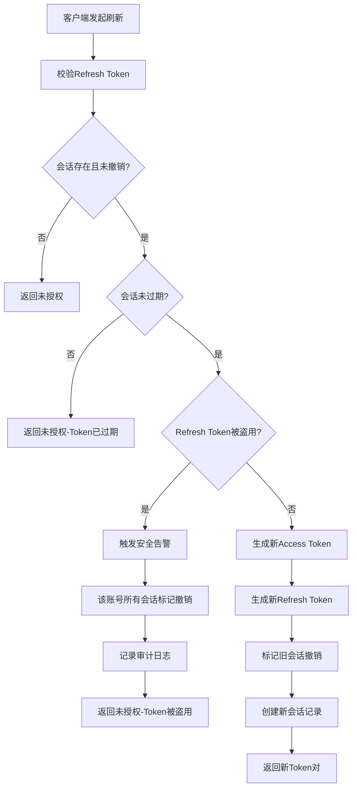
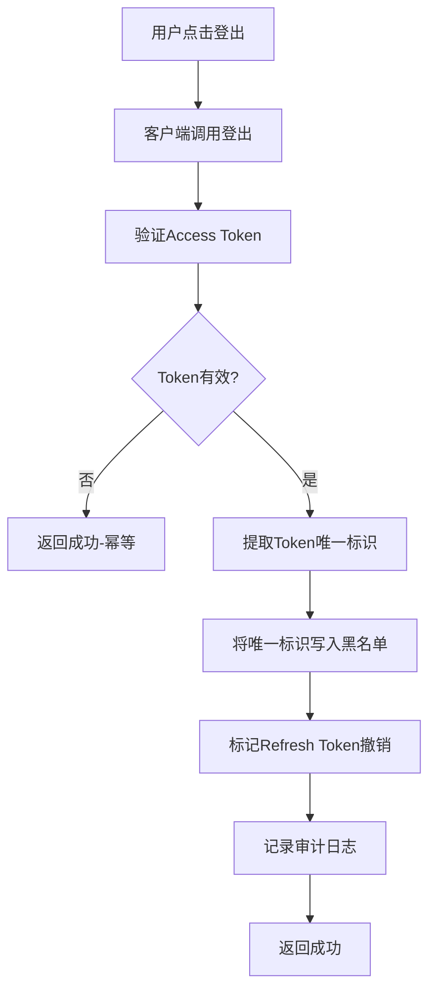
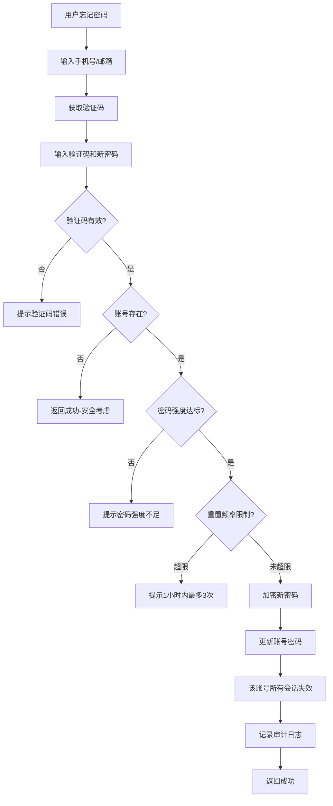

# 用户认证 · 模块概述

> 用户认证模块负责用户身份的创建、验证与会话生命周期管理，是整个账号权限底座的入口模块。所有后续业务操作（组织、团队、权限、审计等）均依赖本模块颁发的 Token 进行身份识别与鉴权。

---

## 文档信息

| 项目 | 内容 |
|------|------|
| 文档密级 | 内部 |
| 文档版本 | V1.0.0 |
| 编写人 | CatPaw |
| 审核人 | - |
| 生效时间 | 2026-07-14 |
| 废弃时间 | - |
| 关联标签 | 需求PRD、认证模块、核心文档、多租户底座 |
| 关联目录 | 02-需求与产品设计/01-产品PRD/01-多租户底座/01-用户认证模块 |

## 变更记录

| 版本 | 日期 | 变更内容 | 变更人 |
|------|------|----------|--------|
| V1.0.0 | 2026-07-14 | 创建文档 | CodeBuddy |

---

## 一、模块定位与边界

### 1.1 模块定位

用户认证模块是 XYFamily 多租户账号权限底座的**入口模块**，承担用户身份管理的核心职责：

- **身份创建**：支持手机号 / 邮箱验证码注册，注册成功后自动创建账号并直接返回登录凭证（无需二次登录）。
- **身份验证**：提供多种登录方式（密码登录 4 种账号标识 + 验证码登录 2 种账号标识）。
- **会话管理**：基于 JWT 的双 Token 机制（Access Token 30min 无状态 + Refresh Token 7 天有状态），支持 Refresh Token Rotation 与黑名单主动失效。
- **密码管理**：密码强度校验、验证码重置密码、重置后该账号所有会话立即失效。
- **安全控制**：登录限流、验证码限流、IP 锁定、Token 黑名单、Refresh Token Rotation、异常登录安全检测。

本模块为后续所有业务操作（组织 / 团队 / 小组 / 权限 / 审计等）提供统一的身份认证能力，是整个权限体系的基础。

### 1.2 模块边界

| 属于本模块 | 不属于本模块（其余模块负责） |
|------------|------------------------------|
| 注册、登录、登出、Token 刷新 | 已登录用户的个人信息修改（账号管理模块） |
| 验证码发送与校验（注册 / 登录 / 重置） | 已登录用户的主动改密（账号管理模块） |
| 密码重置（忘记密码场景） | 组织 / 团队 / 小组的创建与关系管理 |
| 账号创建时的初始密码设置 | 角色与权限点的绑定、鉴权判定 |
| 会话生命周期与失效策略 | 第三方身份绑定（微信等，P2） |
| 登录 / 注册 / 登出 / 刷新的审计日志 | 业务操作审计（审计日志模块） |

> 密码重置（忘记密码，无需登录）归属本模块；修改密码（已知旧密码，需登录）归属账号管理模块，详见 [02-账号管理模块/02-密码与安全](../02-账号管理模块/02-密码与安全.md)。

---

## 二、子功能分组

| 序号 | 子功能 | 详细文档 | 功能需求数 | 优先级 |
|------|--------|----------|-----------|--------|
| 01 | 注册认证 | [01-注册认证](./01-注册认证.md) | 2 | P0 |
| 02 | 登录认证 | [02-登录认证](./02-登录认证.md) | 6 | P0 |
| 03 | 密码管理 | [03-密码管理](./03-密码管理.md) | 1 | P0 |
| 04 | Token 管理 | [04-Token管理](./04-Token管理.md) | 2 | P0 |

---

## 三、功能需求清单

### 3.1 注册认证（P0）

| ID | 需求描述 | 优先级 | 验收标准 |
|----|----------|--------|----------|
| FR-AUTH-001 | 手机号 + 验证码注册 | P0 | 验证通过后创建账号，返回登录凭证（Access Token + Refresh Token） |
| FR-AUTH-002 | 邮箱 + 验证码注册 | P0 | 验证通过后创建账号，返回登录凭证（Access Token + Refresh Token） |

### 3.2 登录认证（P0）

| ID | 需求描述 | 优先级 | 验收标准 |
|----|----------|--------|----------|
| FR-AUTH-003 | 手机号 + 密码登录 | P0 | 验证通过后返回登录凭证 |
| FR-AUTH-004 | 手机号 + 验证码登录 | P0 | 验证通过后返回登录凭证 |
| FR-AUTH-005 | 邮箱 + 密码登录 | P0 | 验证通过后返回登录凭证 |
| FR-AUTH-006 | 邮箱 + 验证码登录 | P0 | 验证通过后返回登录凭证 |
| FR-AUTH-007 | 用户名 + 密码登录 | P0 | 验证通过后返回登录凭证 |
| FR-AUTH-008 | 用户 ID（account_id）+ 密码登录 | P0 | 验证通过后返回登录凭证 |

### 3.3 密码管理（P0）

| ID | 需求描述 | 优先级 | 验收标准 |
|----|----------|--------|----------|
| FR-AUTH-011 | 密码重置（忘记密码） | P0 | 通过验证码重置密码，重置后该账号所有会话立即失效 |

### 3.4 Token 管理（P0）

| ID | 需求描述 | 优先级 | 验收标准 |
|----|----------|--------|----------|
| FR-AUTH-009 | Token 刷新 | P0 | 使用 Refresh Token 获取新 Access Token，支持 Rotation |
| FR-AUTH-010 | 登出 | P0 | 清除会话并使 Token 失效，支持幂等 |

### 3.5 延后需求（P2）

| ID | 需求描述 | 优先级 | 子功能 | 说明 |
|----|----------|--------|--------|------|
| FR-AUTH-012 | 微信登录 | P2 | 登录认证 | 需绑定手机号 / 邮箱，延后到 P2，方案见第三方集成统一方案 |
| FR-AUTH-013 | 登录自动注册 | P2 | 登录认证 | 验证码登录时账号不存在自动注册，延后到 P2 |

---

## 四、业务流程

### 4.1 注册流程

| 步骤 | 说明 | 关联需求 |
|------|------|----------|
| 选择注册方式 | 手机号或邮箱，二选一 | FR-AUTH-001/002 |
| 获取验证码 | 发送 6 位数字验证码，有效期 5 分钟 | NFR-SEC-003 |
| 验证码校验 | 校验有效性、attempt_count < 5、未过期 | FR-AUTH-001/002 |
| 重复校验 | 确保手机号 / 邮箱未被注册 | FR-AUTH-001/002 |
| 创建账号 | 生成 UUID、默认用户名、默认头像，状态 active | FR-AUTH-001/002 |
| 生成 Token | Access Token 30min + Refresh Token 7 天 | FR-AUTH-009 |
| 审计日志 | 记录注册成功 | FR-AUDIT-001 |

### 4.2 登录流程

| 步骤 | 说明 | 关联需求 |
|------|------|----------|
| 选择登录方式 | 密码 / 验证码（【延后 P2】微信登录） | FR-AUTH-003~008 |
| 账号校验 | 根据账号标识自动识别类型（手机号 / 邮箱 / 用户名 / 用户 ID） | FR-AUTH-003~008 |
| 验证 | 密码使用 bcrypt 比对 / 验证码校验有效性 | NFR-SEC-001/003 |
| 登录限流 | 同一 IP 5 分钟 5 次失败锁定 15 分钟 | NFR-SEC-002 |
| 账号状态校验 | active 正常登录；deactivating 允许登录但标记状态；deactivated 拒绝 | FR-AUTH-003~008 |
| 生成 Token | Access Token + Refresh Token | FR-AUTH-009 |
| 审计日志 | 记录登录尝试（成功 / 失败） | FR-AUDIT-001 |

### 4.3 Token 刷新流程

| 步骤 | 说明 | 关联需求 |
|------|------|----------|
| 校验 Refresh Token | 查询会话存储确认存在、未撤销、未过期 | FR-AUTH-009 |
| 会话验证 | 确认 Refresh Token 与账号 ID 匹配 | FR-AUTH-009 |
| Refresh Token Rotation | 刷新成功后旧 Refresh Token 立即作废 | FR-AUTH-009 |
| 安全检测 | 若旧 Refresh Token 再次被使用，说明被盗用 | NFR-SEC-005 |
| 生成新 Token | 新 Access Token + 新 Refresh Token | FR-AUTH-009 |

### 4.4 登出流程

| 步骤 | 说明 | 关联需求 |
|------|------|----------|
| 提取唯一标识 | 从 Access Token 载荷中获取 Token 唯一标识 | FR-AUTH-010 |
| 写入黑名单 | 将唯一标识写入缓存黑名单，TTL = Access Token 剩余有效期 | FR-AUTH-010 |
| 撤销 Refresh Token | 标记会话存储中的 Refresh Token 为已撤销 | FR-AUTH-010 |
| 幂等性 | Token 已失效时仍返回成功 | FR-AUTH-010 |
| 审计日志 | 记录登出操作 | FR-AUDIT-002 |

### 4.5 密码重置流程

| 步骤 | 说明 | 关联需求 |
|------|------|----------|
| 验证码校验 | 校验有效性、attempt_count < 5、未过期 | FR-AUTH-011 |
| 账号存在性 | 安全考虑，账号不存在时也可返回成功 | FR-AUTH-011 |
| 密码强度校验 | 最少 12 位，包含大小写字母、数字 | FR-AUTH-011 |
| 重置频率限制 | 同一账号 1 小时内最多 3 次 | NFR-SEC-001 |
| 会话失效 | 密码重置后所有会话立即失效 | FR-AUTH-011 |
| 审计日志 | 记录密码重置操作 | FR-AUDIT-002 |

---

## 五、关联非功能需求

### 5.1 安全需求

| ID | 需求描述 | 指标 | 关联功能 |
|----|----------|------|----------|
| NFR-SEC-001 | 密码存储 | bcrypt，cost factor 12 | 注册、密码重置 |
| NFR-SEC-002 | 登录限流 | 同一 IP 5 分钟 5 次失败，锁定 15 分钟 | 登录认证 |
| NFR-SEC-003 | 验证码安全 | 6 位数字，有效期 5 分钟，最多尝试 5 次 | 注册、登录、密码重置 |
| NFR-SEC-004 | Token 安全 | Access Token 30min，Refresh Token 7 天 | Token 管理 |
| NFR-SEC-005 | Token 签名 | HS256（预留升级 RS256），支持黑名单 | Token 管理 |
| NFR-SEC-006 | HTTPS | 所有接口必须 HTTPS | 全部接口 |
| NFR-SEC-007 | 审计日志保留 | 保留 1 年，账号注销后匿名化 | 全部操作 |

### 5.2 性能需求

| ID | 需求描述 | 指标 | 关联功能 |
|----|----------|------|----------|
| NFR-PERF-001 | API 响应时间 | 95% < 100ms | 全部接口 |
| NFR-PERF-002 | 登录请求响应时间 | 95% < 200ms | 登录认证 |
| NFR-PERF-003 | 注册请求响应时间 | 95% < 200ms | 注册认证 |
| NFR-PERF-004 | Token 刷新响应时间 | 95% < 100ms | Token 管理 |

### 5.3 兼容性需求

| ID | 需求描述 | 指标 |
|----|----------|------|
| NFR-COMP-001 | API 版本 | `/api/v1/` |
| NFR-COMP-002 | JSON 格式 | 所有接口请求 / 响应 JSON |
| NFR-COMP-003 | 跨域支持 | CORS |

---

## 六、关键产品约束

> 本节仅列出从需求视角必须固化的产品级约束；具体技术实现（双 Token 机制、签名算法、黑名单存储、限流实现等）不在本 PRD 中定义。

| 约束 | 说明 | 关联需求 |
|------|------|----------|
| 账号唯一性 | phone / email / username 均全局唯一，account_id 为聚合根标识 | FR-AUTH-001~008 |
| 软删除与宽限期 | 账号注销采用软删除，30 天宽限期可恢复 | 登录状态校验 |
| 密码重置防枚举 | 账号不存在时仍返回成功，防止账号枚举攻击 | FR-AUTH-011 |
| 会话失效策略 | 密码重置后该账号所有会话立即失效 | FR-AUTH-011 |

---

## 七、关联文档

### 7.1 PRD 文档

| 文档 | 路径 | 说明 |
|------|------|------|
| 多租户底座 PRD 总览 | [../多租户底座](../多租户底座.md) | 完整产品需求规格 |
| 注册认证 | [01-注册认证](./01-注册认证.md) | 注册功能详细规格 |
| 登录认证 | [02-登录认证](./02-登录认证.md) | 登录功能详细规格 |
| 密码管理 | [03-密码管理](./03-密码管理.md) | 密码管理详细规格 |
| Token 管理 | [04-Token管理](./04-Token管理.md) | Token 管理详细规格 |
| 账号管理 - 密码与安全 | [../02-账号管理模块/02-密码与安全](../02-账号管理模块/02-密码与安全.md) | 已登录用户修改密码（区别于密码重置） |

## 八、附录

### 8.1 错误码定义

| HTTP 状态码 | 业务 Code | 说明 | 关联功能 |
|-------------|-----------|------|----------|
| 400 | 100001 | 请求参数错误 | 全部接口 |
| 401 | 101001 | 缺少 Token | 登出 |
| 401 | 101002 | Token 无效或已过期 | 登录、刷新、登出 |
| 401 | 101003 | Token 已被撤销（黑名单） | 刷新 |
| 401 | 101004 | Refresh Token 无效 | 刷新 |
| 401 | 101005 | Refresh Token 已撤销 | 刷新 |
| 401 | 101006 | Refresh Token 已过期 | 刷新 |
| 401 | 101007 | 账号不存在 | 登录 |
| 401 | 101008 | 密码错误 | 登录 |
| 401 | 101009 | 账号已注销（deactivated） | 登录 |
| 401 | 101010 | Refresh Token 被盗用 | 刷新 |
| 400 | 110001 | 验证码错误 | 注册、登录、重置 |
| 400 | 110002 | 验证码已过期 | 注册、登录、重置 |
| 400 | 110003 | 验证码已被使用 | 注册、登录、重置 |
| 400 | 110004 | 验证码尝试次数超限 | 注册、登录、重置 |
| 429 | 114290 | 验证码发送频率超限（目标） | 注册、登录、重置 |
| 429 | 114291 | 验证码发送频率超限（IP） | 注册、登录、重置 |
| 429 | 114292 | 密码重置频率超限 | 密码重置 |
| 429 | 104290 | 登录失败过多已锁定 | 登录 |
| 429 | 104291 | 刷新频率超限 | Token 刷新 |
| 400 | 200001 | 密码强度不足 | 注册、密码重置 |
| 400 | 200002 | 手机号已被注册 | 注册 |
| 400 | 200003 | 邮箱已被注册 | 注册 |
| 400 | 200005 | 新密码与原密码相同 | 密码重置 |
| 400 | 200007 | 账号处于注销宽限期，无法登录 | 登录 |
| 500 | 800001 | 服务器内部错误 | 全部接口 |

### 8.2 审计日志字段

**登录 / 注册审计日志：**

| 字段 | 说明 |
|------|------|
| 账号 ID | 操作账号的唯一标识 |
| 登录 / 注册方式 | 如手机号 + 密码、邮箱 + 验证码注册等 |
| 结果 | 成功或失败 |
| 失败原因 | 失败时的具体原因 |
| 客户端 IP | 用户操作时的 IP 地址 |
| 客户端 UA | 用户浏览器 / 设备信息 |
| 操作时间 | 记录时间 |

**操作审计日志（密码重置 / 登出 / 刷新）：**

| 字段 | 说明 |
|------|------|
| 账号 ID | 操作账号的唯一标识 |
| 操作类型 | 如密码重置、登出、Token 刷新等 |
| 目标类型 | 操作对象类型 |
| 目标 ID | 操作对象标识 |
| 操作详情 | JSON 格式，不记录密码等敏感信息 |
| 客户端 IP | 用户操作时的 IP 地址 |
| 操作时间 | 记录时间 |
