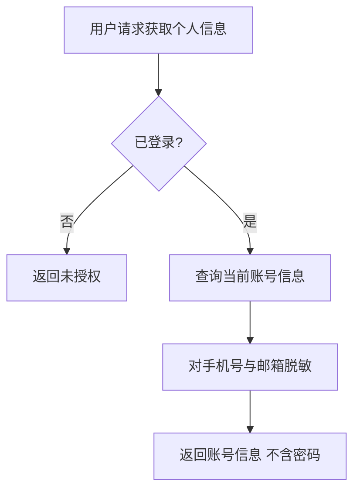
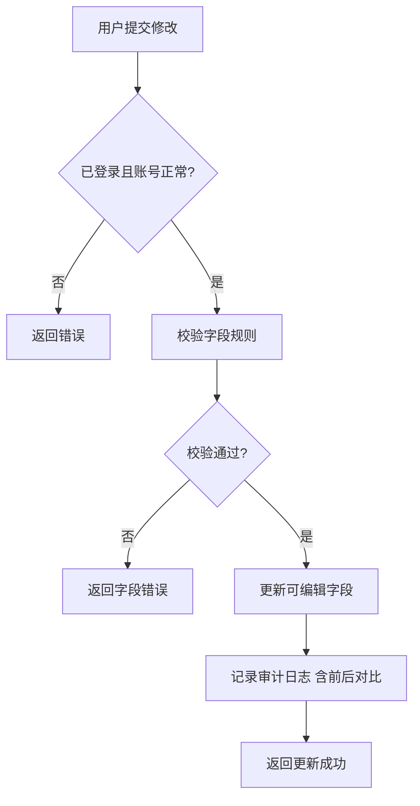

# 账号管理 · 个人信息管理

> 已登录用户个人信息的查看与修改功能。

---

## 文档信息

| 项目 | 内容 |
|------|------|
| 文档密级 | 内部 |
| 文档版本 | V1.0.0 |
| 编写人 | CatPaw |
| 审核人 | - |
| 生效时间 | 2026-07-14 |
| 废弃时间 | - |
| 关联标签 | 需求PRD、账号模块、个人信息 |
| 关联目录 | 02-需求与产品设计/01-产品PRD/01-多租户底座/02-账号管理模块/01-个人信息管理 |

## 变更记录

| 版本 | 日期 | 变更内容 | 变更人 |
|------|------|----------|--------|
| V1.0.0 | 2026-07-14 | 创建文档 | CodeBuddy |

---

## 一、功能需求

### FR-ACCT-001：获取个人信息

| 项目 | 内容 |
|------|------|
| **优先级** | P0 |
| **描述** | 用户查看自己的账号基本信息 |
| **验收标准** | 用户可查看自己的账号信息（不含密码），手机号和邮箱脱敏显示 |
| **前置条件** | 用户已登录 |

**详细规则：**
- 用户仅能查看自己的账号信息，不可查看其他用户信息
- 显示的信息包括：用户名、显示名、头像、手机号、邮箱、账号状态、创建时间
- 手机号脱敏显示（如：138****1234）
- 邮箱脱敏显示（如：z***@example.com）
- 不显示密码等敏感信息

---

### FR-ACCT-002：更新个人信息

| 项目 | 内容 |
|------|------|
| **优先级** | P0 |
| **描述** | 用户修改自己的昵称、头像等可编辑信息 |
| **验收标准** | 修改成功后信息即时更新，其他用户可见更新后的信息 |
| **前置条件** | 用户已登录，账号状态为正常 |

**详细规则：**

#### 可修改字段

| 字段 | 说明 | 修改限制 |
|------|------|----------|
| 用户名 | 用户登录和显示使用的名称 | 长度 2-32 字符，支持中文、英文、数字、下划线，需唯一 |
| 显示名 | 用户自定义的昵称 | 长度 1-64 字符，可空 |
| 头像 | 用户个人头像 | 支持 URL 格式，可空 |

#### 不可修改字段

| 字段 | 原因 |
|------|------|
| 手机号 | 需通过独立的换绑流程修改，确保账号安全 |
| 邮箱 | 需通过独立的换绑流程修改，确保账号安全 |
| 账号 ID | 系统生成，不可修改 |
| 账号状态 | 系统自动管理，用户不可修改 |

#### 校验规则

| 规则 | 说明 |
|------|------|
| 用户名校验 | 长度 2-32 字符，仅支持中文、英文、数字、下划线，不能与其他用户重复，不能包含敏感词 |
| 旧用户名保留 | 修改成功后，旧用户名进入 30 天保留期，期间不可被其他用户注册 |
| 显示名校验 | 长度 1-64 字符，不能包含敏感词 |
| 头像校验 | 必须为有效的 URL 地址 |

#### 审计要求

- 更新个人信息操作需记录审计日志
- 日志需包含修改前和修改后的信息对比

---

## 二、业务流程

### 2.1 获取个人信息流程

### 2.2 更新个人信息流程

---

## 三、边界与异常处理

| 场景 | 处理方式 | 错误信息 |
|------|----------|----------|
| 用户名已被占用 | 禁止修改，提示用户 | 用户名已被占用 |
| 用户名长度不合规 | 禁止修改，提示用户 | 用户名长度必须在 2-32 个字符之间 |
| 用户名包含非法字符 | 禁止修改，提示用户 | 用户名只能包含中文、英文、数字和下划线 |
| 显示名长度不合规 | 禁止修改，提示用户 | 显示名长度不能超过 64 个字符 |
| 头像 URL 格式无效 | 禁止修改，提示用户 | 头像 URL 格式无效 |
| 账号正在注销中 | 禁止修改，提示用户 | 账号正在注销中，暂无法修改 |
| 账号已注销 | 禁止修改，提示用户 | 账号已注销，无法修改 |
| 未登录 | 禁止访问，提示用户 | 请先登录 |

---

## 四、审计要求

- 更新个人信息操作需记录审计日志
- 日志需包含操作类型、操作时间、操作人、操作 IP、修改前与修改后的字段对比
- 日志中不得包含密码等敏感明文

---

## 五、关联 PRD 文档（平级）

- 账号管理模块 README：[./账号管理模块](./账号管理模块.md)
- 用户认证模块 - 注册认证（初始信息由注册创建）：[../01-用户认证模块/01-注册认证](../01-用户认证模块/01-注册认证.md)
- 审计日志模块：[../09-审计日志模块/审计日志模块](../09-审计日志模块/审计日志模块.md)
- 非功能需求：[../10-非功能需求/非功能需求](../10-非功能需求/非功能需求.md)

## 关联文档

> 以下为知识图谱自动推荐的交叉引用，建议人工审阅确认后保留。

- [04-第三方身份绑定](./04-第三方身份绑定.md) — 共享术语：多租户、审计、账号（置信度 0.75）
- [02-密码与安全](./02-密码与安全.md) — 共享术语：多租户、审计、账号（置信度 0.75）
- [03-账号生命周期](./03-账号生命周期.md) — 共享术语：多租户、审计、账号（置信度 0.75）
- [03-密码管理](../01-用户认证模块/03-密码管理.md) — 共享术语：多租户、审计、账号（置信度 0.75）
- [权限管理模块](../06-权限管理模块/权限管理模块.md) — 共享术语：多租户、审计、账号（置信度 0.75）
- [PRD审核记录](../../审核记录/PRD审核记录.md) — 共享术语：多租户、审计、账号（置信度 0.75）
