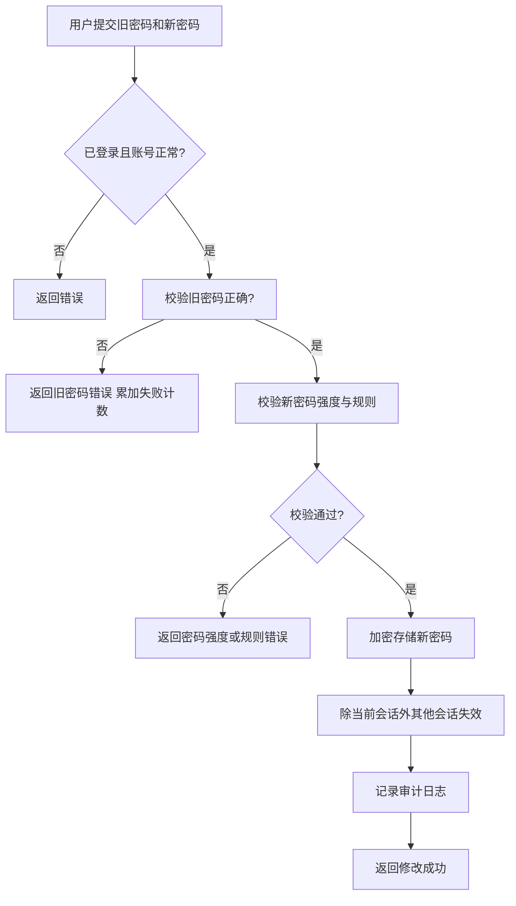

# 账号管理 · 密码与安全

> 已登录用户修改密码功能，保障账号密码安全。

---

## 文档信息

| 项目 | 内容 |
|------|------|
| 文档密级 | 内部 |
| 文档版本 | V1.0.0 |
| 编写人 | CatPaw |
| 审核人 | - |
| 生效时间 | 2026-07-14 |
| 废弃时间 | - |
| 关联标签 | 需求PRD、账号模块、密码安全 |
| 关联目录 | 02-需求与产品设计/01-产品PRD/01-多租户底座/02-账号管理模块/02-密码与安全 |

## 变更记录

| 版本 | 日期 | 变更内容 | 变更人 |
|------|------|----------|--------|
| V1.0.0 | 2026-07-14 | 创建文档 | CodeBuddy |

---

## 一、功能需求

### FR-ACCT-003：修改密码

| 项目 | 内容 |
|------|------|
| **优先级** | P0 |
| **描述** | 已登录用户通过验证旧密码来修改密码 |
| **验收标准** | 用户验证旧密码通过后成功设置新密码，除当前登录会话外其他会话失效 |
| **前置条件** | 用户已登录，账号状态为正常 |

**详细规则：**
- 用户需输入旧密码和新密码
- 系统需校验旧密码正确性
- 系统需校验新密码强度（最少 12 位，包含大小写字母和数字）
- 新密码不能与旧密码相同
- 新密码不能与用户名、手机号相同
- 密码修改成功后，该账号除当前登录会话外的所有其他会话立即失效
- 密码修改操作需记录审计日志
- 密码修改成功后系统需告知用户操作成功

---

## 二、密码强度规则

### 2.1 基本规则

| 规则 | 说明 |
|------|------|
| 最小长度 | 12 位 |
| 最大长度 | 64 位 |
| 大小写字母 | 至少包含一个大写字母和一个小写字母 |
| 数字 | 至少包含一个数字 |
| 特殊字符 | 建议包含特殊字符（!@#$%^&* 等），但不强制 |

### 2.2 禁止规则

| 规则 | 说明 |
|------|------|
| 不可与旧密码相同 | 新密码不能与当前密码一致 |
| 不可与用户名相同 | 新密码不能包含或等于用户名 |
| 不可与手机号相同 | 新密码不能包含或等于手机号 |
| 不可包含连续字符 | 不能包含连续 3 个以上相同字符（如 aaa、111） |

### 2.3 密码强度等级

| 等级 | 描述 | 判断条件 |
|------|------|----------|
| 弱 | 仅满足基本长度要求 | 长度 ≥ 12，但缺少大小写或数字 |
| 中 | 满足基本规则 | 长度 ≥ 12，包含大小写字母和数字 |
| 强 | 满足所有规则 + 包含特殊字符 | 长度 ≥ 14，包含大小写字母、数字和特殊字符 |

---

## 三、与密码重置的区别

| 维度 | 修改密码（FR-ACCT-003） | 密码重置（FR-AUTH-011） |
|------|------------------------|------------------------|
| **场景** | 用户已登录，知道旧密码 | 用户忘记密码，无法登录 |
| **验证方式** | 验证旧密码 | 验证手机号 / 邮箱验证码 |
| **登录状态** | 需要登录 | 无需登录 |
| **会话处理** | 保留当前会话，其他会话失效 | 所有会话失效 |
| **所属模块** | 账号管理模块（本模块） | 用户认证模块 |

---

## 四、安全策略（需求约束）

### 4.1 密码存储

- 密码需使用不可逆加密算法存储（具体算法不在本 PRD 中定义）
- 明文密码不得存储在任何地方（数据库、日志等）
- 密码修改时需重新加密存储

### 4.2 会话管理

- 密码修改成功后，该账号除当前会话外的所有其他会话立即失效
- 当前登录会话继续有效，避免用户被迫重新登录

### 4.3 操作频率限制

| 限制项 | 规则 |
|--------|------|
| 修改频率 | 同一账号 1 分钟内最多修改 1 次密码 |
| 失败次数 | 同一账号连续 5 次旧密码错误，锁定 15 分钟 |

---

## 五、业务流程

### 5.1 修改密码流程

---

## 六、边界与异常处理

| 场景 | 处理方式 | 错误信息 |
|------|----------|----------|
| 旧密码错误 | 禁止修改，提示用户 | 密码错误，请重试 |
| 新密码强度不足 | 禁止修改，提示用户 | 密码强度不足，请设置 12 位以上包含大小写字母和数字的密码 |
| 新密码缺少大写字母 | 禁止修改，提示用户 | 密码必须包含大写字母 |
| 新密码缺少小写字母 | 禁止修改，提示用户 | 密码必须包含小写字母 |
| 新密码缺少数字 | 禁止修改，提示用户 | 密码必须包含数字 |
| 新旧密码相同 | 禁止修改，提示用户 | 新密码不能与旧密码相同 |
| 新密码与用户名相同 | 禁止修改，提示用户 | 新密码不能与用户名相同 |
| 新密码与手机号相同 | 禁止修改，提示用户 | 新密码不能与手机号相同 |
| 账号未设置密码 | 禁止修改，提示用户通过忘记密码设置 | 账号未设置密码，请通过忘记密码设置 |
| 账号正在注销中 | 禁止修改，提示用户 | 账号正在注销中，暂无法修改密码 |
| 账号已注销 | 禁止修改，提示用户 | 账号已注销，无法修改密码 |
| 未登录 | 禁止访问，提示用户 | 请先登录 |
| 修改频率超限 | 暂时禁止操作，提示用户 | 操作过于频繁，请稍后重试 |
| 连续失败锁定 | 暂时禁止操作，提示用户 | 密码错误次数过多，请 15 分钟后重试 |

---

## 七、审计要求

- 修改密码操作需记录审计日志
- 日志需记录操作类型、操作时间、操作人、操作 IP 等信息
- 日志中不得包含密码明文

---

## 八、关联 PRD 文档（平级）

- 账号管理模块 README：[./账号管理模块](./账号管理模块.md)
- 用户认证模块 - 密码管理（密码重置，无需登录）：[../01-用户认证模块/03-密码管理](../01-用户认证模块/03-密码管理.md)
- 审计日志模块：[../09-审计日志模块/审计日志模块](../09-审计日志模块/审计日志模块.md)
- 非功能需求：[../10-非功能需求/非功能需求](../10-非功能需求/非功能需求.md)
