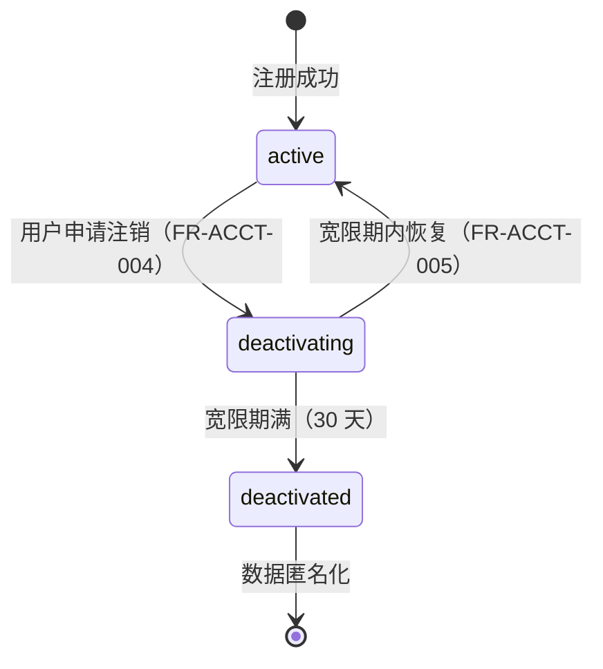
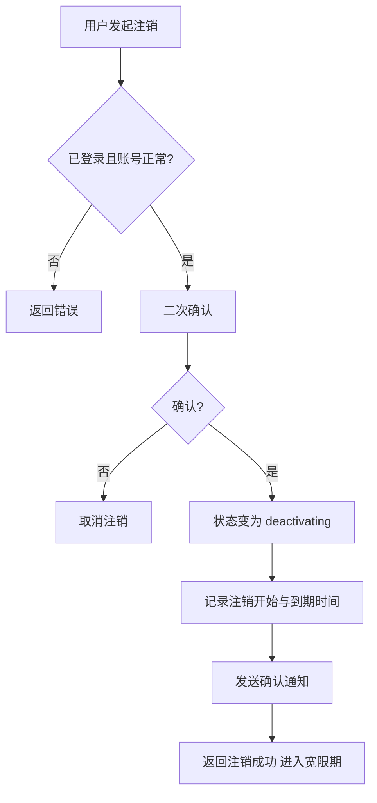
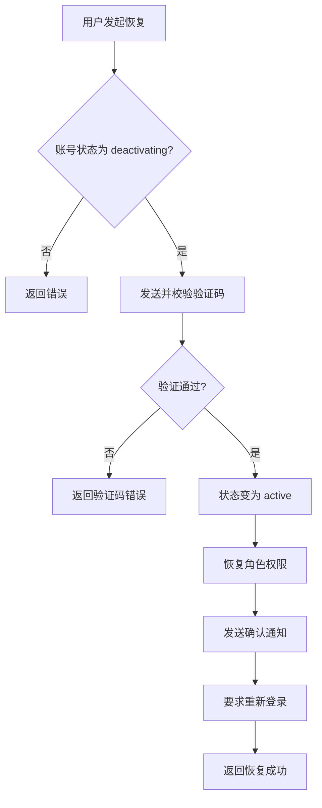

# 账号管理 · 账号生命周期

> 账号注销与恢复功能，包含 30 天宽限期机制和数据匿名化处理。

---

## 文档信息

| 项目 | 内容 |
|------|------|
| 文档密级 | 内部 |
| 文档版本 | V1.0.0 |
| 编写人 | CatPaw |
| 审核人 | - |
| 生效时间 | 2026-07-14 |
| 废弃时间 | - |
| 关联标签 | 需求PRD、账号模块、账号生命周期 |
| 关联目录 | 02-需求与产品设计/01-产品PRD/01-多租户底座/02-账号管理模块/03-账号生命周期 |

## 变更记录

| 版本 | 日期 | 变更内容 | 变更人 |
|------|------|----------|--------|
| V1.0.0 | 2026-07-14 | 创建文档 | CodeBuddy |
| V1.0.1 | 2026-07-16 | ARCH-005 修复：统一 deactivating 状态登录行为为「允许登录但仅开放恢复操作」，与登录认证文档和架构方案一致 | CatPaw |

---

## 一、账号状态机

### 1.1 状态流转图

### 1.2 状态说明

| 状态 | 说明 | 可执行操作 |
|------|------|-----------|
| `active` | 正常状态，账号可正常使用 | 所有业务操作 |
| `deactivating` | 注销宽限期（30 天），等待最终确认 | 仅可恢复账号，不可执行业务操作 |
| `deactivated` | 已注销，数据已匿名化，不可恢复 | 无任何操作权限 |

---

## 二、功能需求

### FR-ACCT-004：账号注销

| 项目 | 内容 |
|------|------|
| **优先级** | P0 |
| **描述** | 用户申请注销账号，进入 30 天宽限期 |
| **验收标准** | 注销后账号状态变为注销中，记录注销时间和到期时间，账号不可正常使用 |
| **前置条件** | 用户已登录，账号状态为正常 |

**详细规则：**

#### 注销流程

1. 用户发起注销请求，系统需二次确认
2. 用户确认后，账号状态从正常变为注销中
3. 记录注销开始时间和宽限期到期时间（注销开始时间 + 30 天）
4. 注销成功后发送确认通知（邮件 / 短信）

#### 注销中状态（deactivating）

- 用户可登录，但仅用于执行恢复操作，登录响应中标记状态为 deactivating，附带宽限期到期时间
- 用户不可执行任何业务操作（个人信息修改、密码修改等）
- 用户仅可执行恢复操作
- 用户在所有组织 / 团队 / 小组中的成员身份保留，但不可参与操作
- 用户的角色权限暂时失效
- **会话失效**：账号进入 deactivating 状态时，系统需立即使该账号所有活跃会话失效（Access Token 加入黑名单、Refresh Token 标记为撤销），恢复后必须重新登录

#### 已注销状态（deactivated）

- 用户数据需进行匿名化处理（用户名、手机号、邮箱等个人身份信息）
- 用户在所有组织 / 团队 / 小组中的成员身份保留，但角色权限清空
- 用户不可恢复
- 审计日志保留，但需匿名化处理

#### 审计要求

- 注销操作需记录审计日志
- 日志需记录注销时间、到期时间等信息

---

### FR-ACCT-005：账号恢复

| 项目 | 内容 |
|------|------|
| **优先级** | P0 |
| **描述** | 宽限期内取消注销，恢复账号 |
| **验收标准** | 恢复后账号状态变为正常，角色权限自动恢复，需重新登录 |
| **前置条件** | 账号状态为注销中 |

**详细规则：**

#### 恢复流程

1. 用户发起恢复请求，需通过身份验证（手机号 / 邮箱验证码）
2. 验证通过后，账号状态从注销中变为正常
3. 自动恢复之前的角色权限
4. 恢复成功后发送确认通知（邮件 / 短信）
5. 用户需重新登录

#### 恢复限制

- 仅注销中状态的账号可恢复
- 已注销状态的账号不可恢复
- 验证码需使用独立场景，与其他场景隔离

#### 角色恢复机制

- 恢复后需自动恢复用户在各组织 / 团队 / 小组中的角色权限
- 角色权限恢复为注销前的状态

#### 审计要求

- 恢复操作需记录审计日志
- 日志需记录恢复时间等信息

---

## 三、业务流程

### 3.1 账号注销流程

### 3.2 账号恢复流程

---

## 四、匿名化处理规则

### 4.1 匿名化时机

- 当账号状态从注销中变为已注销时（宽限期满）
- 系统需自动执行匿名化处理

### 4.2 匿名化原则

| 数据类型 | 处理原则 |
|----------|----------|
| 用户名 | 需替换为匿名标识，不可识别原用户 |
| 手机号 | 需替换为匿名标识，不可识别原用户 |
| 邮箱 | 需替换为匿名标识，不可识别原用户 |
| 头像 | 需替换为默认头像或清空 |
| 密码 | 需清空，不可恢复 |
| 成员关系 | 需保留成员关系记录，但角色权限需清空 |
| 审计日志 | 需保留，但个人身份信息需匿名化 |

> **核心约束**：绝不删除账号记录或成员关系记录，保护审计日志的完整性和可追溯性。

---

## 五、宽限期机制

### 5.1 宽限期时长

- 宽限期为 30 天（从注销开始时间计算）
- 宽限期精确到秒

### 5.2 宽限期到期处理

- 宽限期到期后，系统自动将账号状态从注销中变为已注销
- 系统自动执行匿名化处理
- **触发机制**：采用定时任务（每日凌晨扫描 `deactivating` 状态且 `deactivation_deadline < NOW()` 的账号）
- **兜底机制**：用户尝试登录 `deactivating` 账号时，若已超期则即时触发状态变更为 `deactivated` 并执行匿名化，拒绝登录

### 5.3 通知机制

- 注销成功后发送确认通知
- 宽限期到期前 3 天发送提醒通知（邮件 / 短信）

---

## 六、边界与异常处理

| 场景 | 处理方式 | 错误信息 |
|------|----------|----------|
| 注销时未二次确认 | 禁止注销，提示用户 | 请确认注销操作 |
| 注销时账号已在注销中 | 禁止注销，提示用户 | 账号已在注销宽限期中 |
| 注销时账号已注销 | 禁止注销，提示用户 | 账号已注销 |
| 恢复时验证码错误 | 禁止恢复，提示用户 | 验证码错误 |
| 恢复时验证码过期 | 禁止恢复，提示用户 | 验证码已过期 |
| 恢复时账号已注销 | 禁止恢复，提示用户 | 账号已永久注销，无法恢复 |
| 恢复时账号状态正常 | 禁止恢复，提示用户 | 账号状态正常，无需恢复 |
| 恢复时账号不存在 | 禁止恢复，提示用户 | 账号不存在 |
| 恢复时账号不在宽限期 | 禁止恢复，提示用户 | 账号不在注销宽限期内 |
| 未登录尝试注销 | 禁止访问，提示用户 | 请先登录 |

---

## 七、审计要求

### 7.1 注销账号日志

| 记录项 | 说明 |
|--------|------|
| 操作类型 | 账号注销 |
| 操作时间 | 注销发起时间 |
| 操作人 | 执行注销的用户 |
| 操作 IP | 用户操作的 IP 地址 |
| 注销开始时间 | 账号进入注销中状态的时间 |
| 到期时间 | 宽限期到期时间 |

### 7.2 恢复账号日志

| 记录项 | 说明 |
|--------|------|
| 操作类型 | 账号恢复 |
| 操作时间 | 恢复发起时间 |
| 操作人 | 执行恢复的用户 |
| 操作 IP | 用户操作的 IP 地址 |

---

## 八、关联 PRD 文档（平级）

- 账号管理模块 README：[./账号管理模块](./账号管理模块.md)
- 用户认证模块（注销后所有会话失效，重新登录）：[../01-用户认证模块/用户认证模块](../01-用户认证模块/用户认证模块.md)
- 审计日志模块：[../09-审计日志模块/审计日志模块](../09-审计日志模块/审计日志模块.md)
- 非功能需求：[../10-非功能需求/非功能需求](../10-非功能需求/非功能需求.md)

## 关联文档

> 以下为知识图谱自动推荐的交叉引用，建议人工审阅确认后保留。

- [组织管理模块](../03-组织管理模块/组织管理模块.md) — 共享术语：多租户、角色（置信度 0.75）
- [权限管理模块](../06-权限管理模块/权限管理模块.md) — 共享术语：多租户、审计、角色、账号（置信度 0.75）
- [PRD审核记录](../../审核记录/PRD审核记录.md) — 共享术语：多租户、审计、角色、账号（置信度 0.75）
