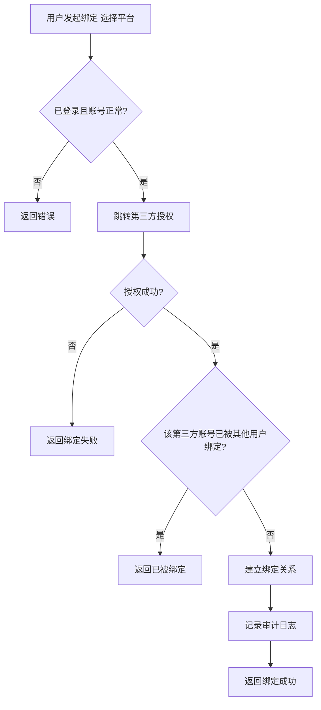
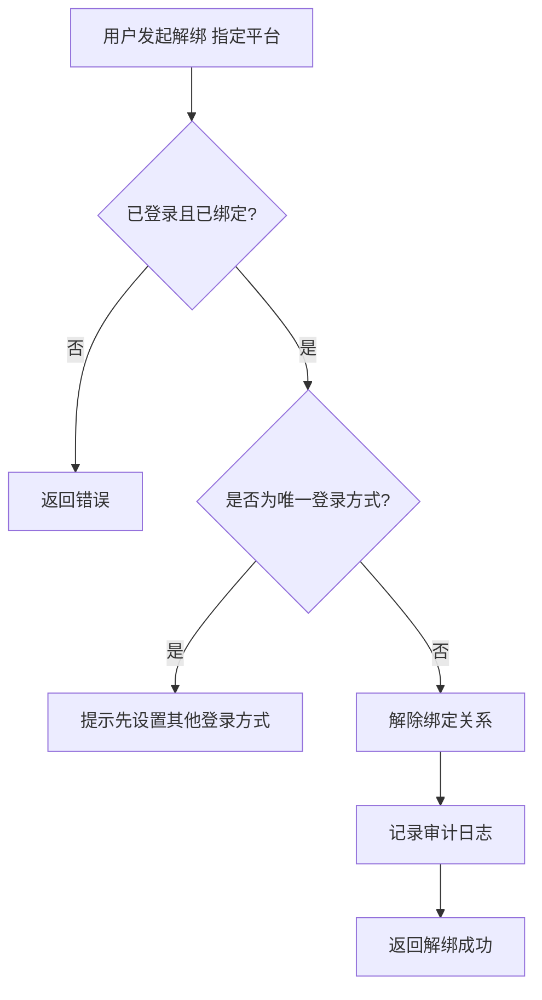

# 第三方身份绑定

> 用户绑定 / 解绑微信等第三方身份，支持多种第三方平台登录。

> **【延后 P2】**：本模块全部功能（FR-ACCT-006 / 007）延后到 P2 阶段。首期仅支持手机号 / 邮箱密码和验证码登录，不涉及第三方身份绑定。

---

## 文档信息

| 项目 | 内容 |
|------|------|
| 文档密级 | 内部 |
| 文档版本 | V1.0.0 |
| 编写人 | CatPaw |
| 审核人 | - |
| 生效时间 | 2026-07-14 |
| 废弃时间 | - |
| 关联标签 | 需求PRD、账号模块、第三方集成 |
| 关联目录 | 02-需求与产品设计/01-产品PRD/01-多租户底座/02-账号管理模块/04-第三方身份绑定 |

## 变更记录

| 版本 | 日期 | 变更内容 | 变更人 |
|------|------|----------|--------|
| V1.0.0 | 2026-07-19 | 文档新编 | CatPaw |

---

## 一、功能需求

### FR-ACCT-006：绑定第三方身份

| 项目 | 内容 |
|------|------|
| **优先级** | P2（延后） |
| **描述** | 用户绑定微信等第三方账号 |
| **验收标准** | 成功绑定第三方身份，支持通过第三方账号登录系统 |
| **前置条件** | 用户已登录，账号状态为正常 |

**详细规则：**
- 用户发起绑定请求，选择第三方平台类型
- 用户通过第三方平台的授权流程完成授权（如扫码、OAuth 授权等）
- 绑定成功后，用户可通过该第三方账号登录系统
- 一个用户可绑定多个不同类型的第三方账号
- 同一类型的第三方账号只能绑定一个（如一个用户只能绑定一个微信账号）
- 绑定操作需记录审计日志

> **说明**：FR-ACCT-006 延后到 P2 阶段，接入方案将在第三方集成统一方案中统一设计。

---

### FR-ACCT-007：解绑第三方身份

| 项目 | 内容 |
|------|------|
| **优先级** | P2（延后） |
| **描述** | 用户解绑已绑定的第三方账号 |
| **验收标准** | 成功解绑第三方身份，该第三方账号不再关联当前用户，不可通过该方式登录 |
| **前置条件** | 用户已登录，账号状态为正常，已绑定第三方身份 |

**详细规则：**
- 用户发起解绑请求，指定第三方平台类型
- 解绑后，用户不可再通过该第三方账号登录系统
- 如果用户仅有该第三方登录方式，解绑前需提示用户设置密码或绑定其他登录方式
- 解绑操作需记录审计日志

> **说明**：FR-ACCT-007 延后到 P2 阶段，接入方案将在第三方集成统一方案中统一设计。

---

## 二、支持的第三方平台

| 平台 | 说明 | 优先级 |
|------|------|--------|
| 微信 | 支持微信扫码登录 | P2 |
| GitHub | 支持 OAuth2.0 授权登录 | P2 |
| Google | 支持 OAuth2.0 授权登录 | P2 |

---

## 三、业务规则

### 3.1 绑定规则

| 规则 | 说明 |
|------|------|
| 唯一性约束 | 同一第三方平台的账号只能绑定到一个用户 |
| 多平台支持 | 一个用户可绑定多个不同平台的账号 |
| 绑定后登录 | 绑定成功后，用户可通过该平台账号登录 |

### 3.2 解绑规则

| 规则 | 说明 |
|------|------|
| 解绑后影响 | 解绑后不可通过该平台账号登录 |
| 唯一登录方式保护 | 如果用户仅有该第三方登录方式，需提示用户先设置其他登录方式 |

---

## 四、业务流程

### 4.1 绑定第三方身份流程

### 4.2 解绑第三方身份流程

---

## 五、边界与异常处理

| 场景 | 处理方式 | 错误信息 |
|------|----------|----------|
| 绑定的第三方账号已被其他用户绑定 | 禁止绑定，提示用户 | 该第三方账号已被绑定 |
| 解绑时账号仅有该登录方式 | 禁止解绑，提示用户 | 请先设置密码或绑定其他登录方式 |
| 解绑的第三方账号不存在 | 禁止解绑，提示用户 | 未绑定该第三方账号 |
| 账号已注销 | 禁止操作，提示用户 | 账号已注销 |
| 未登录 | 禁止访问，提示用户 | 请先登录 |

---

## 六、审计要求

### 6.1 绑定第三方身份日志

| 记录项 | 说明 |
|--------|------|
| 操作类型 | 绑定第三方身份 |
| 操作时间 | 绑定发起时间 |
| 操作人 | 执行绑定的用户 |
| 操作 IP | 用户操作的 IP 地址 |
| 第三方平台 | 绑定的第三方平台类型 |

### 6.2 解绑第三方身份日志

| 记录项 | 说明 |
|--------|------|
| 操作类型 | 解绑第三方身份 |
| 操作时间 | 解绑发起时间 |
| 操作人 | 执行解绑的用户 |
| 操作 IP | 用户操作的 IP 地址 |
| 第三方平台 | 解绑的第三方平台类型 |

---

## 七、关联 PRD 文档（平级）

- 账号管理模块 README：[账号管理模块](./账号管理模块.md)
- 用户认证模块 - 登录认证（第三方账号登录的认证流程）：[登录认证](../01-用户认证模块/02-登录认证.md)
- 审计日志模块：[审计日志模块](../09-审计日志模块/审计日志模块.md)
- 非功能需求：[非功能需求](../10-非功能需求/非功能需求.md)

## 关联文档

> 以下为知识图谱自动推荐的交叉引用，建议人工审阅确认后保留。

- [密码与安全](./02-密码与安全.md) — 共享术语：多租户、审计、账号（置信度 0.75）
- [账号生命周期](./03-账号生命周期.md) — 共享术语：多租户、审计、账号（置信度 0.75）
- [密码管理](../01-用户认证模块/03-密码管理.md) — 共享术语：多租户、审计、账号（置信度 0.75）
- [权限管理模块](../06-权限管理模块/权限管理模块.md) — 共享术语：多租户、审计、账号（置信度 0.75）
- [PRD审核记录](../../审核记录/PRD审核记录.md) — 共享术语：多租户、审计、账号（置信度 0.75）
