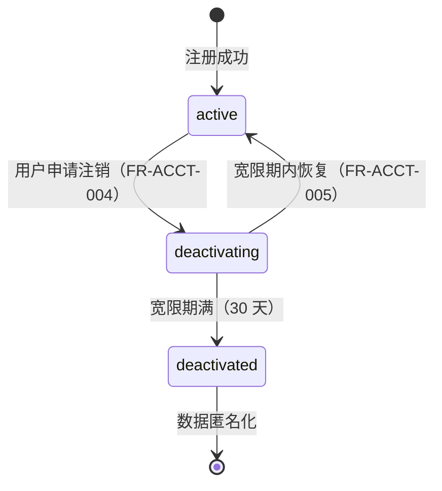

# 账号管理模块

> 账号管理模块负责已登录用户的个人信息管理、密码安全、账号全生命周期（注销与恢复）以及第三方身份绑定，是用户完成身份认证之后的账号自助操作入口。

---

## 文档信息

| 项目 | 内容 |
|------|------|
| 文档密级 | 内部 |
| 文档版本 | V1.0.0 |
| 编写人 | CatPaw |
| 审核人 | - |
| 生效时间 | 2026-07-14 |
| 废弃时间 | - |
| 关联标签 | 需求PRD、账号模块、账号管理 |
| 关联目录 | 02-需求与产品设计/01-产品PRD/01-多租户底座/02-账号管理模块 |

## 变更记录

| 版本 | 日期 | 变更内容 | 变更人 |
|------|------|----------|--------|
| V1.0.0 | 2026-07-14 | 创建文档 | CodeBuddy |

---

## 一、模块定位与边界

### 1.1 模块定位

账号管理模块是 XYFamily 多租户账号权限底座中，**已登录用户自助管理账号**的核心模块：

- **个人信息管理**：查看与修改昵称、头像、显示名等可编辑信息
- **密码安全**：已登录用户通过验证旧密码修改密码
- **账号生命周期**：账号注销（进入 30 天宽限期）与宽限期内恢复
- **第三方身份绑定**：绑定 / 解绑微信、GitHub、Google 等第三方账号（延后 P2）

本模块关注的是**已登录用户对自身账号的运营管理**，与用户认证模块（注册、登录、登出、Token、忘记密码重置）在职责上明确区分，后者负责身份认证流程。

### 1.2 模块边界

| 属于本模块 | 不属于本模块（其余模块负责） |
|------------|------------------------------|
| 个人信息查看与修改 | 注册 / 登录 / 登出 / Token 刷新（用户认证模块） |
| 已登录用户的修改密码 | 忘记密码重置（用户认证模块 - 密码管理） |
| 账号注销与恢复（宽限期、匿名化） | 账号创建（注册流程） |
| 第三方身份绑定 / 解绑 | 第三方登录的认证流程实现（用户认证模块，P2） |
| 个人信息的操作审计 | 业务操作审计（审计日志模块） |

> 修改密码（需登录、验证旧密码）归属本模块；密码重置（无需登录、验证码）归属用户认证模块，详见 [02-密码与安全](./02-密码与安全.md)。

---

## 二、子功能分组

| 序号 | 子功能 | 详细文档 | 功能需求数 | 优先级 |
|------|--------|----------|-----------|--------|
| 01 | 个人信息管理 | [01-个人信息管理](./01-个人信息管理.md) | 2 | P0 |
| 02 | 密码与安全 | [02-密码与安全](./02-密码与安全.md) | 1 | P0 |
| 03 | 账号生命周期 | [03-账号生命周期](./03-账号生命周期.md) | 2 | P0 |
| 04 | 第三方身份绑定 | [04-第三方身份绑定](./04-第三方身份绑定.md) | 2 | P2（延后） |

---

## 三、功能需求清单

### 3.1 P0 核心需求

| ID | 需求描述 | 优先级 | 子功能 | 验收标准 |
|----|----------|--------|--------|----------|
| FR-ACCT-001 | 获取个人信息 | P0 | 个人信息管理 | 用户可查看自己的账号基本信息（不含密码），手机号和邮箱脱敏显示 |
| FR-ACCT-002 | 更新个人信息 | P0 | 个人信息管理 | 用户可修改昵称、头像等可编辑字段，修改成功后信息即时更新 |
| FR-ACCT-003 | 修改密码 | P0 | 密码与安全 | 用户验证旧密码后可设置新密码，除当前登录会话外其他会话失效 |
| FR-ACCT-004 | 账号注销 | P0 | 账号生命周期 | 用户申请注销后进入 30 天宽限期，期间账号不可正常使用 |
| FR-ACCT-005 | 账号恢复 | P0 | 账号生命周期 | 宽限期内用户可通过验证码恢复账号，恢复后角色权限自动恢复 |

### 3.2 P2 延后需求

| ID | 需求描述 | 优先级 | 子功能 | 验收标准 |
|----|----------|--------|--------|----------|
| FR-ACCT-006 | 绑定第三方身份 | P2 | 第三方身份绑定 | 用户可绑定微信等第三方账号，支持通过第三方账号登录 |
| FR-ACCT-007 | 解绑第三方身份 | P2 | 第三方身份绑定 | 用户可解绑已绑定的第三方账号，解绑后不可通过该方式登录 |

---

## 四、业务流程（账号状态机）

### 4.1 状态流转图

### 4.2 状态说明

| 状态 | 说明 | 可执行操作 |
|------|------|-----------|
| `active` | 正常状态，账号可正常使用 | 所有业务操作 |
| `deactivating` | 注销宽限期（30 天），等待最终确认 | 仅可恢复账号，不可执行业务操作 |
| `deactivated` | 已注销，数据已匿名化，不可恢复 | 无任何操作权限 |

---

## 五、关联非功能需求

| ID | 需求描述 | 指标 | 关联功能 |
|----|----------|------|----------|
| NFR-SEC-001 | 密码存储 | 使用不可逆加密算法存储 | 修改密码 |
| NFR-SEC-006 | 数据隔离 | 组织间完全隔离 | 全局 |
| NFR-SEC-007 | 审计日志保留 | 保留 1 年，账号注销后匿名化 | 全部操作 |
| NFR-PERF-001 | API 响应时间 | 95% < 100ms | 全局 |

---

## 六、关联 PRD 文档（平级）

| 文档 | 路径 | 说明 |
|------|------|------|
| 多租户底座 PRD 总览 | [../多租户底座](../多租户底座.md) | 完整产品需求规格 |
| 个人信息管理 | [01-个人信息管理](./01-个人信息管理.md) | 个人信息查看与修改 |
| 密码与安全 | [02-密码与安全](./02-密码与安全.md) | 已登录修改密码 |
| 账号生命周期 | [03-账号生命周期](./03-账号生命周期.md) | 注销与恢复 |
| 第三方身份绑定 | [04-第三方身份绑定](./04-第三方身份绑定.md) | 第三方账号绑定 / 解绑 |
| 用户认证模块 | [../01-用户认证模块/用户认证模块](../01-用户认证模块/用户认证模块.md) | 注册、登录、Token、密码重置（职责边界区分） |
| 审计日志模块 | [../09-审计日志模块/审计日志模块](../09-审计日志模块/审计日志模块.md) | 操作审计日志 |
| 非功能需求 | [../10-非功能需求/非功能需求](../10-非功能需求/非功能需求.md) | 安全 / 性能等全局约束 |

## 关联文档

> 以下为知识图谱自动推荐的交叉引用，建议人工审阅确认后保留。

- [04-Token管理](../01-用户认证模块/04-Token管理.md) — 共享术语：多租户、账号（置信度 0.75）
- [01-注册认证](../01-用户认证模块/01-注册认证.md) — 共享术语：多租户、账号（置信度 0.75）
- [03-密码管理](../01-用户认证模块/03-密码管理.md) — 共享术语：多租户、账号（置信度 0.75）
- [权限管理模块](../06-权限管理模块/权限管理模块.md) — 共享术语：多租户、账号（置信度 0.75）
- [PRD审核记录](../../审核记录/PRD审核记录.md) — 共享术语：多租户、账号（置信度 0.75）
