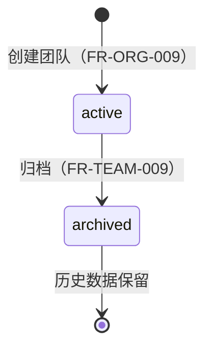

# 团队信息管理

> 团队信息查看、更新与归档。本文件为 V1.0.0 第一版，重新梳理团队信息管理需求，明确查看、更新与归档的产品需求、业务规则与状态约束。

---

## 文档信息

| 项目 | 内容 |
|------|------|
| 文档密级 | 内部 |
| 文档版本 | V1.0.0 |
| 编写人 | CatPaw |
| 审核人 | - |
| 生效时间 | 2026-07-14 |
| 废弃时间 | - |
| 关联标签 | 需求PRD、团队模块 |
| 关联目录 | 02-需求与产品设计/01-产品PRD/01-多租户底座/04-团队管理模块/01-团队信息管理 |

## 变更记录

| 版本 | 日期 | 变更内容 | 变更人 |
|------|------|----------|--------|
| V1.0.0 | 2026-07-14 | 创建文档 | CodeBuddy |

---

## 一、功能需求

### FR-TEAM-001：获取团队信息

| 项目 | 内容 |
|------|------|
| **优先级** | P0 |
| **描述** | 团队成员查看所属团队信息 |
| **所需权限点** | `team.read` |
| **验收标准** | 返回团队基本信息（名称、描述、成员数、小组数等） |

**详细规则：**
- 团队成员可查看所属团队信息
- 非团队成员不可查看（数据隔离）
- 权限继承：团队核心管理员（`team_core_admin`）、组织核心管理员（`organization_core_admin`）、SuperAdmin 均可查看
- 返回信息应包含：团队标识、名称、描述、状态、成员数、小组数、创建时间、更新时间

---

### FR-TEAM-002：更新团队信息

| 项目 | 内容 |
|------|------|
| **优先级** | P0 |
| **描述** | 团队管理员修改团队信息 |
| **所需权限点** | `team.update` |
| **验收标准** | 修改成功后返回更新后的团队信息，并记录审计日志 |

**详细规则：**
- 仅团队核心管理员（`team_core_admin`）或组织核心管理员（`organization_core_admin`）可修改（权限继承）
- 可修改字段：名称（name）、描述（description）
- 名称修改需在组织内唯一性校验（同一组织下团队名称不可重复）
- 名称长度限制：2–64 字符；描述长度限制：0–500 字符
- 仅 `active` 状态的团队可修改，`archived` 状态不可修改
- 修改操作记录审计日志（操作类型：`team.update`）
- 修改成功后相关权限缓存需失效

---

### FR-TEAM-009：归档团队

| 项目 | 内容 |
|------|------|
| **优先级** | P1 |
| **描述** | 软删除团队，归档后不可恢复 |
| **所需权限点** | `team.archive` |
| **验收标准** | 归档后团队状态变为 `archived`，数据保留但不可操作 |

**详细规则：**
- 团队核心管理员（`team_core_admin`）或组织核心管理员（`organization_core_admin`）可归档团队（权限继承）
- 归档为软删除，数据保留（不做物理删除）
- 归档后级联处理：
  - 团队状态变为 `archived`
  - 团队下所有小组同步归档（级联软删除）
  - 团队成员关系保留（数据可追溯），但成员不可再操作该团队
  - 历史数据可查询（仅 SuperAdmin 可查询归档团队）
- 归档操作的级联每一步均记录审计日志（操作类型分别为 `team.archive`、`group.delete`）
- 归档后该团队相关的权限上下文失效

---

## 二、团队状态

| 状态 | 说明 | 可执行操作 |
|------|------|-----------|
| `active` | 正常状态 | 所有团队操作 |
| `archived` | 已归档 | 仅 SuperAdmin 可查询历史数据 |

---

## 三、边界与异常处理

| 场景 | 处理方式 |
|------|----------|
| 非团队成员查看 | 拒绝访问（数据隔离） |
| 非团队核心管理员 / 组织核心管理员修改 | 拒绝访问 |
| 修改已归档团队 | 拒绝修改，提示团队已归档 |
| 归档已归档团队 | 拒绝，提示已归档 |
| 团队名称重复（同组织内） | 拒绝，提示名称已存在 |
| 团队名称超长 / 过短 | 拒绝，提示长度需在 2–64 字符 |
| 未传任何修改字段 | 拒绝，提示至少提供一个字段 |

---

## 四、关联文档

- [团队管理模块](./团队管理模块.md)
- [成员管理](./02-成员管理.md)
- [角色与权限](./03-角色与权限.md)
- [团队创建](../03-组织管理模块/04-团队创建.md)
- [权限管理模块](../06-权限管理模块/权限管理模块.md)
- [审计日志模块](../09-审计日志模块/审计日志模块.md)

## 关联文档

> 以下为知识图谱自动推荐的交叉引用，建议人工审阅确认后保留。

- [PRD审核记录](../../审核记录/PRD审核记录.md) — 共享术语：团队、多租户（置信度 0.75）
