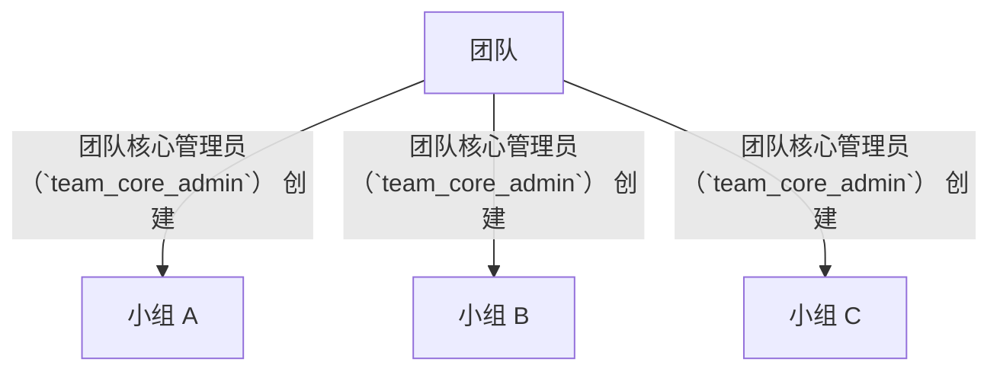

# PRD: 多租户底座-团队管理-小组创建

> 团队管理员在团队下创建小组。本文件为 V1.0.0 第一版，重新梳理小组创建的产品需求，明确接棒机制、团队-小组关系与最后管理员保护等业务规则。

---

## 文档信息

| 项目 | 内容 |
|------|------|
| 文档密级 | 内部 |
| 文档版本 | V1.0.0 |
| 编写人 | CatPaw |
| 审核人 | - |
| 生效时间 | 2026-07-14 |
| 废弃时间 | - |
| 关联标签 | 需求PRD、团队模块、小组模块 |
| 关联目录 | 02-需求与产品设计/01-产品PRD/01-多租户底座/04-团队管理模块/04-小组创建 |

## 变更记录

| 版本 | 日期 | 变更内容 | 变更人 |
|------|------|----------|--------|
| V1.0.0 | 2026-07-14 | 创建文档 | CodeBuddy |

---

## 一、功能需求

### FR-TEAM-008：创建小组

| 项目 | 内容 |
|------|------|
| **优先级** | P0 |
| **描述** | 团队管理员在团队下创建小组 |
| **验收标准** | 创建成功后返回小组信息，创建者自动成为小组管理员 |

**详细规则：**
- 仅 团队核心管理员（`team_core_admin`） 可创建小组（组织核心管理员 `organization_core_admin` 继承权限）
- 创建时需指定小组名称
- 可选指定小组描述
- **接棒机制**：创建者自动成为该小组的 小组核心管理员（`group_core_admin`）；或通过 `initial_admin` 参数指定另一个人作为初始管理员（走统一邀请流程，对方确认后生效）
- 小组名称在同一团队内唯一
- 小组名称长度限制：2–50 字符
- 创建操作记录审计日志

> 注：小组的完整管理能力（成员管理、小组信息维护、角色分配）由「小组管理模块」承载；本文件仅定义团队侧的「创建小组」入口与接棒机制。

---

## 二、团队与小组的关系

| 关系规则 | 说明 |
|----------|------|
| 一个团队可有多个小组 | 无上限 |
| 小组必须归属于一个团队 | 不存在无团队的小组 |
| 小组管理员由创建时指定 | 默认为创建者 |
| 团队管理员可管理所有小组 | 权限继承 |

---

## 三、最后管理员保护（小组层级）

小组层级同样遵循最后管理员保护：**小组中最后一个小组核心管理员不可被降级、移除或注销**，必须先通过邀请流程指定新的小组核心管理员。SuperAdmin 可强制降级例外（详见超级管理员模块）。

---

## 四、边界与异常处理

| 场景 | 处理方式 |
|------|----------|
| 非团队核心管理员（`team_core_admin`） 创建 | 拒绝访问 |
| 小组名称重复（同团队内） | 拒绝，提示名称已存在 |
| 指定的管理员不在团队中 | 拒绝，提示须先邀请其加入团队 |

---

## 五、关联文档

- [团队管理模块](./团队管理模块.md)
- [小组管理模块](../05-小组管理模块/小组管理模块.md)

## 关联文档

> 以下为知识图谱自动推荐的交叉引用，建议人工审阅确认后保留。

- [01-团队信息管理](./01-团队信息管理.md) — 共享术语：团队、多租户（置信度 0.75）
- [审计日志模块](../09-审计日志模块/审计日志模块.md) — 共享术语：团队、多租户、小组（置信度 0.75）
- [04-团队创建](../03-组织管理模块/04-团队创建.md) — 共享术语：团队、多租户（置信度 0.75）
- [02-成员管理](../05-小组管理模块/02-成员管理.md) — 共享术语：多租户、小组（置信度 0.75）
- [01-小组信息管理](../05-小组管理模块/01-小组信息管理.md) — 共享术语：多租户、小组（置信度 0.75）
- [权限管理模块](../06-权限管理模块/权限管理模块.md) — 共享术语：团队、多租户、小组（置信度 0.75）
- [PRD审核记录](../../审核记录/PRD审核记录.md) — 共享术语：团队、多租户、小组（置信度 0.75）
