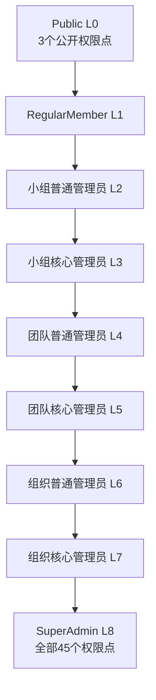
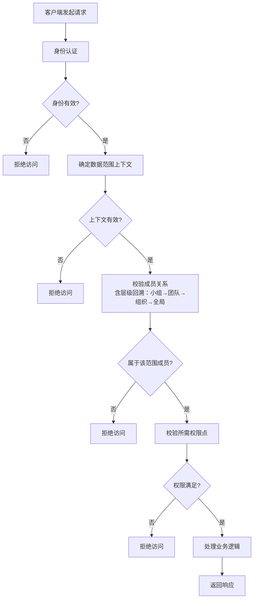

# PRD: 多租户底座-权限管理

> RBAC 权限管理模块。负责预定义角色与权限点的初始化、请求时权限点校验、数据范围（多租户）控制，以及跨层级的权限继承。所有业务接口的访问都必须经过本模块的权限校验。

---

## 文档信息

| 项目 | 内容 |
|------|------|
| 文档密级 | 内部 |
| 文档版本 | V1.0.0 |
| 编写人 | ClaudeCode |
| 审核人 | - |
| 生效时间 | 2026-07-14 |
| 废弃时间 | - |
| 关联标签 | 需求PRD、权限模块、核心文档 |
| 关联目录 | 02-需求与产品设计/01-产品PRD/01-多租户底座/06-权限管理模块 |

## 变更记录

| 版本 | 日期 | 变更内容 | 变更人 |
|------|------|----------|--------|
| V1.0.0 | 2026-07-14 | 基于最新角色体系重新梳理：组织/团队/小组管理员均拆分为「核心管理员」与「普通管理员」，共 9 种角色、45 个权限点，采用二维（范围层级 × 管理员层级）继承模型；作为第一版发布 | ClaudeCode |

---

## 一、模块定位

权限管理模块是整个账号权限底座的**核心引擎**，采用 RBAC（Role-Based Access Control，基于角色的访问控制）模型，通过「预定义角色 + 权限点矩阵」的组合实现精细化的访问控制和多租户数据隔离。

**核心职责：**

- **角色与权限点初始化**：系统启动时应初始化预定义角色（含 Public 第 0 层）和 45 个权限点，并建立角色→权限点映射。
- **请求时权限点校验**：所有受保护接口在业务处理前，必须校验当前账号在目标数据范围内是否拥有该接口所需的权限点，无权限应被拒绝。
- **数据范围控制**：权限校验不仅依赖「操作类型」，还强依赖「数据范围」（组织 / 团队 / 小组上下文），实现组织间完全的数据隔离。
- **权限继承**：高层级角色自动继承低层级角色的全部权限点，避免在每个接口重复配置。

**设计原则（产品约束）：**

- 仅提供预定义的角色，**不支持自定义角色**，保证权限模型的可预测性与可审计性。
- 组织 / 团队 / 小组的**管理员均区分「核心管理员」与「普通管理员」**，两者权限不同（详见第四节）。
- 角色与成员为「单角色」绑定：每个成员在每个数据范围内仅持有一个角色。
- 权限继承在初始化时固化为角色的权限点集合，运行时直接生效，无需实时计算继承链。
- 所有权限校验结果应可缓存以提升性能，并在角色 / 成员关系变更时失效。

---

## 二、子功能分组

| 序号 | 子功能 | 文档 | 功能需求 | 优先级 |
|------|--------|------|----------|--------|
| 01 | 角色与权限点初始化 | [01-角色与权限点初始化-V1.0.0.md](./01-角色与权限点初始化-V1.0.0.md) | FR-PERM-001 | P0 |
| 02 | 权限点校验 | [02-权限点校验-V1.0.0.md](./02-权限点校验-V1.0.0.md) | FR-PERM-002 | P0 |
| 03 | 数据范围控制 | [03-数据范围控制-V1.0.0.md](./03-数据范围控制-V1.0.0.md) | FR-PERM-003 | P0 |
| 04 | 权限继承 | [04-权限继承-V1.0.0.md](./04-权限继承-V1.0.0.md) | FR-PERM-004 | P0 |

---

## 三、功能需求清单

| ID | 需求描述 | 优先级 | 子功能 |
|----|----------|--------|--------|
| FR-PERM-001 | 预定义角色与权限点初始化 | P0 | 角色与权限点初始化 |
| FR-PERM-002 | 权限点校验 | P0 | 权限点校验 |
| FR-PERM-003 | 数据范围控制（多租户隔离） | P0 | 数据范围控制 |
| FR-PERM-004 | 权限继承 | P0 | 权限继承 |

---

## 四、角色体系（9 种角色）

### 4.1 角色清单

| 角色 | role_key | 层级 | 管理范围 | 说明 |
|------|----------|------|----------|------|
| Public | `public` | L0 | 无 | 公共角色，每个用户自动拥有，仅持 `auth.register` / `auth.login` / `auth.reset_password` 三个公开权限点 |
| RegularMember | `regular_member` | L1 | 个人 | 普通成员，具备基础操作权限（个人信息、自身密码、公开资源读取等） |
| 小组普通管理员 | `group_ordinary_admin` | L2 | 小组 | 小组普通管理员，仅负责小组成员管理（邀请 / 移除 / 列表）与资源读取，不可做结构性操作 |
| 小组核心管理员 | `group_core_admin` | L3 | 小组 | 小组核心管理员，在普通管理员基础上额外拥有修改 / 删除小组、分配 / 降级小组角色等结构性权限 |
| 团队普通管理员 | `team_ordinary_admin` | L4 | 团队 | 团队普通管理员，仅负责团队成员管理（邀请 / 移除 / 列表）与资源读取，不可做结构性操作 |
| 团队核心管理员 | `team_core_admin` | L5 | 团队 | 团队核心管理员，在普通管理员基础上额外拥有修改 / 归档团队、创建小组、分配 / 降级团队角色等结构性权限 |
| 组织普通管理员 | `organization_ordinary_admin` | L6 | 组织 | 组织普通管理员，仅负责组织成员管理（邀请 / 移除 / 列表）与资源读取，不可做结构性操作 |
| 组织核心管理员 | `organization_core_admin` | L7 | 组织 | 组织核心管理员，在普通管理员基础上额外拥有修改组织、创建团队、分配 / 降级组织角色、查看审计等结构性权限 |
| SuperAdmin | `super_admin` | L8 | 全局 | 超级管理员，游离于组织架构之外，管理所有组织与系统配置，持全部 45 个权限点 |

> 说明：SuperAdmin **不属于任何** organization / team / group 成员关系，其权限直接来自 `super_admin` 角色，无需先加入组织即可跨组织执行操作。

### 4.2 核心管理员 vs 普通管理员（权限差异定位）

| 能力类别 | 普通管理员 | 核心管理员 |
|----------|:--:|:--:|
| 成员管理（邀请 / 移除 / 列表） | ✅ | ✅ |
| 资源 / 范围信息读取 | ✅ | ✅ |
| 修改范围信息（组织 / 团队 / 小组） | ❌ | ✅ |
| 删除范围（小组删除） | ❌ | ✅ |
| 创建下级范围（团队建小组 / 组织建团队） | ❌ | ✅ |
| 分配本范围角色 | ❌ | ✅ |
| 降级本范围管理员 | ❌ | ✅ |
| 查看审计日志 | ❌ | ✅（组织核心） |

### 4.3 二维继承模型

权限继承为**二维**：

- **范围层级（纵向）**：组织 > 团队 > 小组。高层范围的核心 / 普通管理员，向下**只继承同层级**的低层范围权限。即：组织核心管理员向下继承「团队核心 + 小组核心」权限，但不继承「团队 / 小组普通」之外的额外内容；组织普通管理员向下继承「团队普通 + 小组普通」权限。
- **管理员层级（横向）**：同一范围内，核心管理员继承普通管理员的全部权限。

> 图中箭头表示「向上继承」：每个高层角色包含其下方所有角色的权限点。Public 为独立公共角色，不参与继承链。

---

## 五、权限点矩阵（45 个）

矩阵中 ✅ 表示该角色**有效拥有**该权限点（已含继承所得）。`P` 表示由 Public(L0) 拥有的公开权限点（`auth.register` / `auth.login` / `auth.reset_password`）。

### 5.1 认证相关权限点（5 个）

| 权限点 | 说明 | P (Public) | SuperAdmin | 组织核心 | 组织普通 | 团队核心 | 团队普通 | 小组核心 | 小组普通 | RegularMember |
|--------|------|:--:|:--:|:--:|:--:|:--:|:--:|:--:|:--:|:--:|
| auth.register | 注册账号 | ✅ | - | - | - | - | - | - | - | - |
| auth.login | 登录 | ✅ | - | - | - | - | - | - | - | - |
| auth.reset_password | 重置密码 | ✅ | - | - | - | - | - | - | - | - |
| auth.logout | 登出 | - | ✅ | ✅ | ✅ | ✅ | ✅ | ✅ | ✅ | ✅ |
| auth.refresh | 刷新 Token | - | ✅ | ✅ | ✅ | ✅ | ✅ | ✅ | ✅ | ✅ |

### 5.2 账号相关权限点（7 个）

| 权限点 | 说明 | SuperAdmin | 组织核心 | 组织普通 | 团队核心 | 团队普通 | 小组核心 | 小组普通 | RegularMember |
|--------|------|:--:|:--:|:--:|:--:|:--:|:--:|:--:|:--:|
| account.profile.read | 查看个人信息 | ✅ | ✅ | ✅ | ✅ | ✅ | ✅ | ✅ | ✅ |
| account.profile.update | 修改个人信息 | ✅ | ✅ | ✅ | ✅ | ✅ | ✅ | ✅ | ✅ |
| account.password.update | 修改密码 | ✅ | ✅ | ✅ | ✅ | ✅ | ✅ | ✅ | ✅ |
| account.deactivate | 注销账号 | ✅ | ✅ | ✅ | ✅ | ✅ | ✅ | ✅ | ✅ |
| account.undeactivate | 恢复账号 | ✅ | ✅ | ✅ | ✅ | ✅ | ✅ | ✅ | ✅ |
| account.third_party.bind | 绑定第三方账号 | ✅ | ✅ | ✅ | ✅ | ✅ | ✅ | ✅ | ✅ |
| account.third_party.unbind | 解绑第三方账号 | ✅ | ✅ | ✅ | ✅ | ✅ | ✅ | ✅ | ✅ |

### 5.3 组织相关权限点（9 个）

| 权限点 | 说明 | SuperAdmin | 组织核心 | 组织普通 | 团队核心 | 团队普通 | 小组核心 | 小组普通 | RegularMember |
|--------|------|:--:|:--:|:--:|:--:|:--:|:--:|:--:|:--:|
| org.create | 创建组织 | ✅ | - | - | - | - | - | - | - |
| org.read | 查看组织 | ✅ | ✅ | ✅ | ✅ | ✅ | ✅ | ✅ | ✅ |
| org.update | 修改组织 | ✅ | ✅ | - | - | - | - | - | - |
| org.member.invite | 邀请组织成员 | ✅ | ✅ | ✅ | - | - | - | - | - |
| org.member.remove | 移除组织成员 | ✅ | ✅ | ✅ | - | - | - | - | - |
| org.member.list | 组织成员列表 | ✅ | ✅ | ✅ | - | - | - | - | - |
| org.role.assign | 分配组织角色 | ✅ | ✅ | - | - | - | - | - | - |
| org.role.downgrade | 降级组织管理员 | ✅ | ✅ | - | - | - | - | - | - |
| org.team.create | 创建团队 | ✅ | ✅ | - | - | - | - | - | - |

### 5.4 团队相关权限点（9 个）

| 权限点 | 说明 | SuperAdmin | 组织核心 | 组织普通 | 团队核心 | 团队普通 | 小组核心 | 小组普通 | RegularMember |
|--------|------|:--:|:--:|:--:|:--:|:--:|:--:|:--:|:--:|
| team.read | 查看团队 | ✅ | ✅ | ✅ | ✅ | ✅ | ✅ | ✅ | ✅ |
| team.update | 修改团队 | ✅ | ✅ | - | ✅ | - | - | - | - |
| team.member.invite | 邀请团队成员 | ✅ | ✅ | ✅ | ✅ | ✅ | - | - | - |
| team.member.remove | 移除团队成员 | ✅ | ✅ | ✅ | ✅ | ✅ | - | - | - |
| team.member.list | 团队成员列表 | ✅ | ✅ | ✅ | ✅ | ✅ | - | - | - |
| team.role.assign | 分配团队角色 | ✅ | ✅ | - | ✅ | - | - | - | - |
| team.role.downgrade | 降级团队管理员 | ✅ | ✅ | - | ✅ | - | - | - | - |
| team.group.create | 创建小组 | ✅ | ✅ | - | ✅ | - | - | - | - |
| team.archive | 归档团队 | ✅ | ✅ | - | ✅ | - | - | - | - |

### 5.5 小组相关权限点（8 个）

| 权限点 | 说明 | SuperAdmin | 组织核心 | 组织普通 | 团队核心 | 团队普通 | 小组核心 | 小组普通 | RegularMember |
|--------|------|:--:|:--:|:--:|:--:|:--:|:--:|:--:|:--:|
| group.read | 查看小组 | ✅ | ✅ | ✅ | ✅ | ✅ | ✅ | ✅ | ✅ |
| group.update | 修改小组 | ✅ | ✅ | - | ✅ | - | ✅ | - | - |
| group.delete | 删除小组 | ✅ | ✅ | - | ✅ | - | ✅ | - | - |
| group.member.invite | 邀请小组成员 | ✅ | ✅ | ✅ | ✅ | ✅ | ✅ | ✅ | - |
| group.member.remove | 移除小组成员 | ✅ | ✅ | ✅ | ✅ | ✅ | ✅ | ✅ | - |
| group.member.list | 小组成员列表 | ✅ | ✅ | ✅ | ✅ | ✅ | ✅ | ✅ | - |
| group.role.assign | 分配小组角色 | ✅ | ✅ | - | ✅ | - | ✅ | - | - |
| group.role.downgrade | 降级小组管理员 | ✅ | ✅ | - | ✅ | - | ✅ | - | - |

### 5.6 审计相关权限点（3 个）

| 权限点 | 说明 | SuperAdmin | 组织核心 | 组织普通 | 团队核心 | 团队普通 | 小组核心 | 小组普通 | RegularMember |
|--------|------|:--:|:--:|:--:|:--:|:--:|:--:|:--:|:--:|
| audit.login.read | 查看登录日志 | ✅ | ✅ | - | - | - | - | - | - |
| audit.operation.read | 查看操作日志 | ✅ | ✅ | - | - | - | - | - | - |
| audit.query | 查询审计日志 | ✅ | ✅ | - | - | - | - | - | - |

### 5.7 超级管理员权限点（4 个）

| 权限点 | 说明 | SuperAdmin | 组织核心 | 组织普通 | 团队核心 | 团队普通 | 小组核心 | 小组普通 | RegularMember |
|--------|------|:--:|:--:|:--:|:--:|:--:|:--:|:--:|:--:|
| admin.config.read | 系统配置查看 | ✅ | - | - | - | - | - | - | - |
| admin.config.update | 系统配置修改 | ✅ | - | - | - | - | - | - | - |
| admin.force_downgrade | 强制降级 | ✅ | - | - | - | - | - | - | - |
| admin.audit.global | 全局审计 | ✅ | - | - | - | - | - | - | - |

> **统计**：认证 5 + 账号 7 + 组织 9 + 团队 9 + 小组 8 + 审计 3 + 超级管理员 4 = **45 个权限点**。

---

## 六、权限校验流程

**流程说明：**

| 步骤 | 说明 | 关联需求 |
|------|------|----------|
| 身份认证 | 校验请求者身份有效性 | - |
| 确定上下文 | 解析请求所处的组织 / 团队 / 小组数据范围 | FR-PERM-003 |
| 成员关系校验 | 校验用户是否属于该范围；若当前范围无成员则向上回溯 | FR-PERM-003 |
| 权限校验 | 校验用户在该范围下所拥有的权限点是否包含接口所需权限点 | FR-PERM-002 |
| 数据范围控制 | 确保用户仅能操作其范围内的数据 | FR-PERM-003 |

> 完整流程与子功能说明见各子功能文档；底座总览中的流程图见 [业务流程图 - 权限校验流程](../README.md#53-权限校验流程)。

---

## 七、关联非功能需求

| ID | 需求 | 指标 | 关联点 |
|----|------|------|--------|
| NFR-PERF-001 | API 响应时间 | 95% < 100ms | 权限校验性能 |
| NFR-SEC-002 | 登录限流 | 同 IP 5 分钟 5 次失败锁定 15 分钟 | 认证权限点 |
| NFR-SEC-006 | 数据隔离 | 组织间完全隔离 | 数据范围控制 |
| NFR-SEC-007 | 审计日志保留 | 保留 1 年，注销后匿名化 | 审计权限点 |

> 完整非功能需求见 [非功能需求模块](../08-非功能需求/README.md)。

---

## 八、关联文档

- [01-角色与权限点初始化](./01-角色与权限点初始化-V1.0.0.md)
- [02-权限点校验](./02-权限点校验-V1.0.0.md)
- [03-数据范围控制](./03-数据范围控制-V1.0.0.md)
- [04-权限继承](./04-权限继承-V1.0.0.md)
- [产品需求总览 - 权限管理模块](../README.md#36-权限管理模块)
- [业务流程图 - 权限校验流程](../README.md#53-权限校验流程)
- [组织角色与权限](../03-组织管理模块/03-角色与权限-V1.0.0.md)
- [团队角色与权限](../04-团队管理模块/03-角色与权限-V1.0.0.md)
- [小组角色与权限](../05-小组管理模块/03-角色与权限-V1.0.0.md)
- [审计日志模块](../09-审计日志模块/README.md)
- [超级管理员模块](../07-超级管理员模块/README.md)

---

## 九、关键产品决策

| 决策 | 说明 |
|------|------|
| 仅预定义角色 | 不支持自定义角色，保证权限模型可预测、可审计 |
| 管理员分核心 / 普通 | 组织 / 团队 / 小组管理员均区分核心管理员与普通管理员，普通管理员仅做成员管理与读取，核心管理员额外拥有结构性 / 管理性权限 |
| 二维继承 | 纵向（范围层级）仅继承**同层级**低层范围权限；横向（同范围）核心继承普通。避免普通管理员越级获得低层核心权限 |
| 单角色绑定 | 每个成员在每个数据范围内只有一个角色 |
| 权限继承固化 | 高层级角色在初始化时即包含其下所有低层角色的权限点，运行时直接生效，无需实时计算继承链 |
| 公共角色 | 3 个公开权限点由 Public 自动持有，公开操作无需进入权限校验 |
| 全局角色 | SuperAdmin 不依赖组织成员关系，可跨组织执行操作 |
