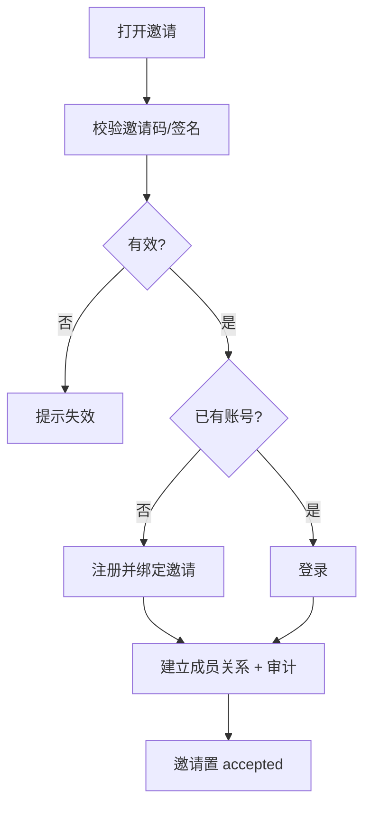

# 接受与加入邀请

> 邀请链路的闭环端：被邀请人打开邀请（链接/码/邮件），校验有效性后通过注册或登录加入目标 scope，建立成员关系并写入审计。

## 文档信息

| 项目 | 内容 |
|------|------|
| 文档密级 | 内部 |
| 文档版本 | V1.0.0 |
| 编写人 | CodeBuddy |
| 审核人 | - |
| 生效时间 | 2026-07-19 |
| 关联标签 | 产品需求、邀请、成员管理 |
| 关联目录 | 02-需求与产品设计/01-产品PRD/01-多租户底座/08-邀请管理模块 |

## 变更记录

| 版本 | 日期 | 变更内容 | 变更人 |
|------|------|----------|--------|
| V1.0.0 | 2026-07-19 | 文档新编 | CodeBuddy |

---

## 一、功能需求

| ID | 需求描述 | 优先级 | 验收标准 |
|----|----------|--------|----------|
| FR-INV-003 | 接受邀请（注册或登录加入） | P1 | 新用户走注册、存量用户走登录；成功后建立成员关系 |
| FR-INV-008 | 接受时落地邀请角色 | P1 | 成员关系 role 取自邀请指定的角色 |

## 二、业务流程

## 三、关键产品约束
- PC-INV-004：接受邀请须校验邀请码/链接签名，校验失败拒绝。
- PC-INV-006：接受成功后自动建立成员关系并写入审计日志。
- PC-INV-005：同一 scope + 同一被邀请人仅允许一条 pending 邀请（去重）。

## 四、关联文档
- 模块概述：[邀请管理模块](./邀请管理模块.md)
- 接口设计：[邀请接口](../../../../03-架构与方案设计/03-数据模型与契约/02-接口设计/08-邀请接口.md)
- 创建与发送：[创建与发送邀请](./01-创建与发送邀请.md)

## 五、附录
错误码 21002（失效/过期）、21003（已处理）、21004（签名失败）、21007（已在 scope）。详见 [邀请管理模块](./邀请管理模块.md#81-错误码邀请域-21xxxx)。
