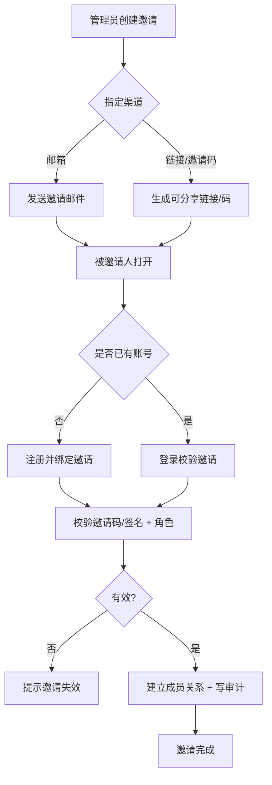

# 邀请管理模块

> P1 功能模块之一。允许组织/团队/小组的管理员通过邮箱、邀请链接或邀请码，邀请新成员或已有账号用户加入指定 scope 并指定角色；支持邀请的接受、拒绝、取消、过期与查询。目标用户为组织/团队/小组管理员；被邀请人可为新用户或存量账号。

## 文档信息

| 项目 | 内容 |
|------|------|
| 文档密级 | 内部 |
| 文档版本 | V1.0.0 |
| 编写人 | CodeBuddy |
| 审核人 | - |
| 生效时间 | 2026-07-19 |
| 关联标签 | 产品需求、多租户、成员管理、邀请 |
| 关联目录 | 02-需求与产品设计/01-产品PRD/01-多租户底座/08-邀请管理模块 |

## 变更记录

| 版本 | 日期 | 变更内容 | 变更人 |
|------|------|----------|--------|
| V1.0.0 | 2026-07-19 | 首次编写邀请管理模块 PRD（创建/发送、接受加入、拒绝取消、查询状态） | CodeBuddy |

---

## 一、模块定位与边界

### 1.1 定位
邀请管理是**成员加入租户的入口**，解决"如何把一个人纳入某个组织/团队/小组并赋予角色"。与组织管理（成员 CRUD）、权限管理（角色矩阵）协同：邀请负责"发出→接受"链路，接受成功后由成员关系表落地（见 [租户域 · invitations](../../../../03-架构与方案设计/03-数据模型与契约/01-数据库设计/02-租户域.md)）。

### 1.2 边界
- 邀请**不**创造账号：被邀请人接受时可走注册（创建账号）或登录已有账号两种路径。
- 邀请**不**直接分配权限：仅指定目标角色，实际权限由 RBAC 引擎在建立成员关系时生效。
- 邀请范围限定在邀请人所在 scope 的子树内（组织管理员可邀请至组织/团队/小组；团队管理员仅可邀请至本团队/小组）。

---

## 二、子功能分组

| 子功能 | 文档 | 核心能力 |
|--------|------|----------|
| 创建与发送邀请 | [01-创建与发送邀请.md](./01-创建与发送邀请.md) | 指定 scope/角色/渠道，生成邀请记录 |
| 接受与加入 | [02-接受与加入邀请.md](./02-接受与加入邀请.md) | 校验邀请码/链接，建立成员关系 |
| 拒绝与取消 | [03-拒绝与取消邀请.md](./03-拒绝与取消邀请.md) | 被邀请人拒绝、邀请人/管理员取消 |
| 邀请查询与状态管理 | [04-邀请查询与状态管理.md](./04-邀请查询与状态管理.md) | 列表、待处理、详情、过期失效 |

---

## 三、功能需求清单

| ID | 需求描述 | 优先级 | 验收标准 |
|----|----------|--------|----------|
| FR-INV-001 | 创建邀请（组织/团队/小组） | P1 | 管理员可针对自身 scope 子树创建邀请并指定角色 |
| FR-INV-002 | 多渠道发送（邮箱/链接/邀请码） | P1 | 支持三种渠道；邀请码可复制分享 |
| FR-INV-003 | 接受邀请（注册或登录加入） | P1 | 新用户走注册、存量用户走登录；成功后建立成员关系 |
| FR-INV-004 | 拒绝邀请 | P2 | 被邀请人可拒绝，状态置为 rejected |
| FR-INV-005 | 取消邀请 | P1 | 邀请人/管理员可取消未接受的邀请，状态置为 canceled |
| FR-INV-006 | 邀请查询（列表/待处理/详情） | P1 | 支持按 scope/状态/被邀请人查询 |
| FR-INV-007 | 邀请过期与失效 | P1 | 超期未接受自动失效；撤销/角色变更后失效 |
| FR-INV-008 | 邀请权限范围（指定角色） | P1 | 邀请必须携带目标角色，接受时落地 |

---

## 四、业务流程

---

## 五、关联非功能需求

- 性能：邀请列表查询 95% < 100ms（NFR-PERF-001）。
- 安全：邀请链接/码带签名与有效期，防篡改与重放（NFR-SEC-002、防重放）。
- 隔离：邀请记录全表 `org_id` 贯穿，跨组织不可见（NFR-SEC-006）。

---

## 六、关键产品约束

| ID | 约束 |
|----|------|
| PC-INV-001 | 邀请必须指定 scope（org/team/group）与目标角色 |
| PC-INV-002 | 邀请有效期默认 7 天，可配置 1–30 天 |
| PC-INV-003 | 单 scope 未接受邀请数量设上限，防止邀请刷量 |
| PC-INV-004 | 接受邀请须校验邀请码/链接签名，校验失败拒绝 |
| PC-INV-005 | 同一 scope + 同一被邀请人仅允许一条 pending 邀请（去重） |
| PC-INV-006 | 接受成功后自动建立成员关系并写入审计日志 |

---

## 七、关联文档

- 接口设计（草稿）：[08-邀请接口设计](../../../../03-架构与方案设计/03-数据模型与契约/02-接口设计/08-邀请接口.md)
- 标准接口（唯一来源）：[08-邀请接口](../../../../04-接口文档/01-标准接口/01-多租户底座/08-邀请接口.md)
- 数据模型：[租户域 · invitations](../../../../03-架构与方案设计/03-数据模型与契约/01-数据库设计/02-租户域.md)
- 组织/团队/小组管理模块：../03-组织管理模块/、../04-团队管理模块/、../05-小组管理模块/
- 权限管理模块：../06-权限管理模块/

---

## 八、附录

### 8.1 错误码（邀请域 21xxxx）

| 错误码 | 含义 | HTTP |
|--------|------|------|
| 21001 | 邀请不存在 | 404 |
| 21002 | 邀请已失效/过期 | 410 |
| 21003 | 邀请已被接受/已处理 | 409 |
| 21004 | 邀请码/签名校验失败 | 400 |
| 21005 | 无邀请权限（scope 越权） | 403 |
| 21006 | 邀请数量超限 | 429 |
| 21007 | 被邀请人已在该 scope | 409 |

### 8.2 审计字段
所有邀请写操作记录 `actor_id / org_id / scope / target_account / action / at`，留存 1 年（NFR-SEC-007）。
