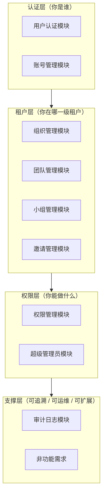
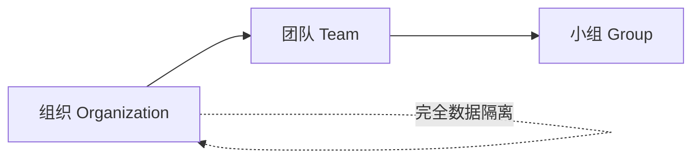

# 产品PRD

> XYFamily 产品需求文档（PRD）总入口。XYFamily 是一个通用多功能工具集平台，本 PRD 描述其**多租户账号权限底座**的完整产品需求，为后续业务工具接入提供统一的身份认证、权限管理与数据隔离能力。

---

## 文档信息

| 项目 | 内容 |
|------|------|
| 文档密级 | 内部 |
| 文档版本 | V1.0.0 |
| 编写人 | CatPaw |
| 审核人 | - |
| 生效时间 | 2026-07-14 |
| 废弃时间 | - |
| 关联标签 | 需求PRD、核心文档、导航 |
| 关联目录 | 02-需求与产品设计/01-产品PRD |

## 变更记录

| 版本 | 日期 | 变更内容 | 变更人 |
|------|------|----------|--------|
| V1.0.0 | 2026-07-14 | 创建文档 | CodeBuddy |

---

## 阅读指引

- **想快速了解全貌**：直接阅读 [多租户底座](./01-多租户底座/多租户底座.md)，其中合并了全部功能模块、非功能需求、业务流程与风险评估。
- **关注单个模块**：从下方[模块导航](#模块导航)进入对应模块文档，每个模块文档下还包含更细粒度的子功能需求（V1.0.0）。
- **了解需求由来**：先看 [多租户底座](./01-多租户底座/多租户底座.md)。

> 本 PRD 只描述产品需求（What），不含接口定义、数据库表结构等实现细节（How）。

---

## 关键指标

| 指标 | 说明 |
|------|------|
| 功能模块 | 9 大功能模块 + 非功能需求 |
| 角色体系 | 9 种预定义角色（含 Public 第 0 层），共 6 层继承 |
| 权限控制 | 45 个权限点矩阵，支持角色继承与数据范围控制 |
| 多租户 | 组织间完全数据隔离 |

---

## 模块导航

### 01-多租户底座

多租户账号权限底座的完整 PRD，涵盖 9 大功能模块及非功能需求、业务流程、约束条件与风险评估。

| 序号 | 模块 | 文档 | 说明 |
|------|------|------|------|
| - | 需求背景与目标 | [多租户底座](./01-多租户底座/多租户底座.md) | 需求来源、业务价值、目标用户、用户故事 |
| - | 完整 PRD | [多租户底座](./01-多租户底座/多租户底座.md) | 合并全部 9 大模块的完整需求文档 |
| 01 | 用户认证模块 | [用户认证模块](./01-多租户底座/01-用户认证模块/用户认证模块.md) | 注册、登录、密码管理、Token 管理 |
| 02 | 账号管理模块 | [账号管理模块](./01-多租户底座/02-账号管理模块/账号管理模块.md) | 个人信息、密码与安全、账号生命周期、第三方绑定 |
| 03 | 组织管理模块 | [组织管理模块](./01-多租户底座/03-组织管理模块/组织管理模块.md) | 组织信息、成员管理、角色与权限、团队创建 |
| 04 | 团队管理模块 | [团队管理模块](./01-多租户底座/04-团队管理模块/团队管理模块.md) | 团队信息、成员管理、角色与权限、小组创建 |
| 05 | 小组管理模块 | [小组管理模块](./01-多租户底座/05-小组管理模块/小组管理模块.md) | 小组信息、成员管理、角色与权限 |
| 06 | 权限管理模块 | [权限管理模块](./01-多租户底座/06-权限管理模块/权限管理模块.md) | 角色与权限点初始化、权限校验、数据范围控制、权限继承 |
| 07 | 超级管理员模块 | [超级管理员模块](./01-多租户底座/07-超级管理员模块/超级管理员模块.md) | 系统配置、强制降级、全局审计 |
| 08 | 邀请管理模块 | [邀请管理模块](./01-多租户底座/08-邀请管理模块/邀请管理模块.md) | 创建/发送、接受加入、拒绝取消、查询与状态 |
| 09 | 审计日志模块 | [审计日志模块](./01-多租户底座/09-审计日志模块/审计日志模块.md) | 登录审计、操作审计、日志查询 |
| 10 | 非功能需求 | [非功能需求](./01-多租户底座/10-非功能需求/非功能需求.md) | 性能、安全、兼容性、可扩展性 |

---

## 模块分层

多租户底座采用**组织 → 团队 → 小组**的三级租户结构，配合统一的认证与权限体系：

- **认证层**：用户认证模块、账号管理模块 —— 解决"你是谁"。
- **租户层**：组织管理、团队管理、小组管理模块、邀请管理模块 —— 解决"你在哪个租户、归属哪一级、如何加入"。
- **权限层**：权限管理模块、超级管理员模块 —— 解决"你能做什么"。
- **支撑层**：审计日志模块、非功能需求 —— 保障可追溯、可运维、可扩展。

### 分层架构图

### 租户层级结构

