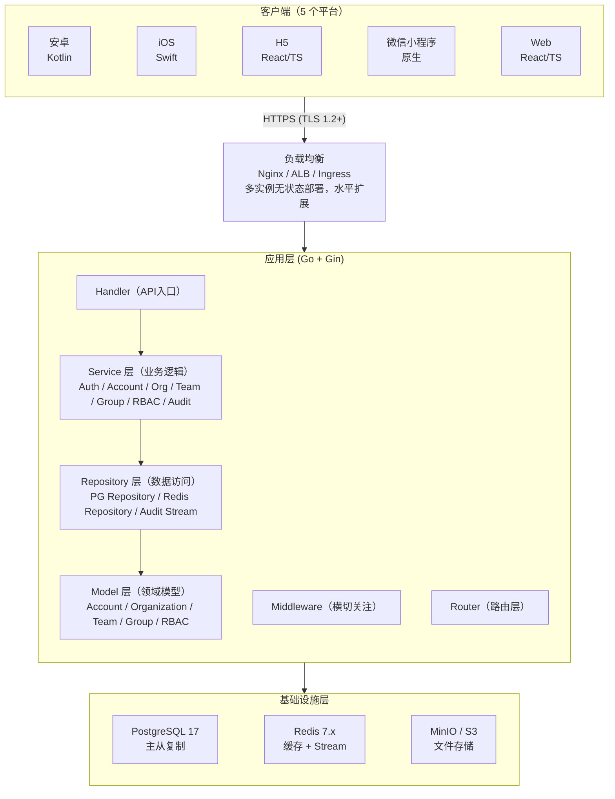
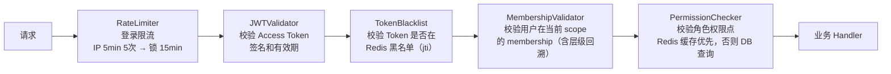
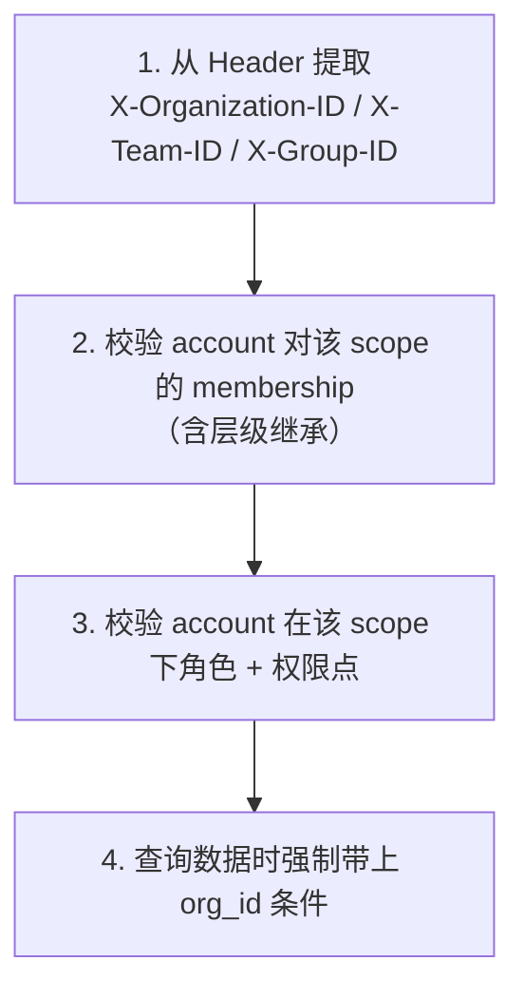
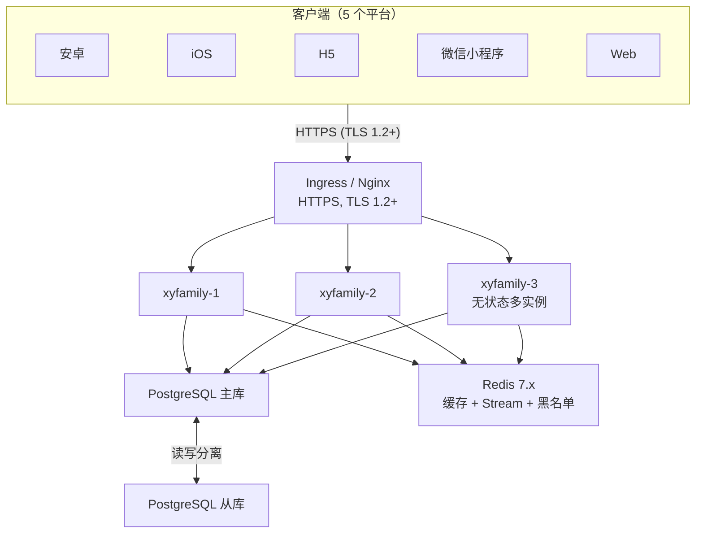

# 整体架构设计

> XYFamily 多租户账号权限底座整体技术架构。

---

## 文档信息

| 项目 | 内容 |
|------|------|
| 文档密级 | 内部 |
| 文档版本 | V1.0.0 |
| 编写人 | ClaudeCode |
| 审核人 | - |
| 生效时间 | 2026-07-12 |
| 废弃时间 | - |
| 关联标签 | 技术方案、系统基础、核心文档 |
| 关联目录 | 03-技术架构与方案设计/03.01-整体架构设计 |

## 变更记录

| 版本 | 日期 | 变更内容 | 变更人 |
|------|------|----------|--------|
| V1.0.0 | 2026-07-12 | 初始创建，基于 15 项已确定设计决策 | ClaudeCode |
| V1.0.1 | 2026-07-13 | 将全部 ASCII 图表替换为 Mermaid 图表，解决中英文混排对齐问题 | CatPaw |
| V1.0.2 | 2026-07-13 | 修正项目目录结构：与 04.01 全局开发规范对齐，补全缺失项 | CatPaw |

---

## 一、技术栈

### 后端

| 类别 | 技术选型 | 版本 | 说明 |
|------|---------|------|------|
| 语言 | Go | 1.22+ | |
| Web 框架 | Gin | latest | 高性能 HTTP 框架 |
| 数据库 | PostgreSQL | 17 | JSONB、全文检索支持 |
| 缓存/消息 | Redis | 7.x | 验证码、Token 黑名单、审计流、缓存 |
| 认证 | JWT (HS256) | - | Access Token 30min + Refresh Token 7天 |
| 密码存储 | bcrypt | cost=12 | |
| API 规范 | RESTful | /api/v1/ | JSON 响应 |
| 部署 | Docker + K8s | - | 无状态多实例 + 负载均衡 |
| 对象存储 | MinIO / S3 | - | 头像文件上传 |

### 前端（5 个平台）

| 平台 | 技术选型 | 说明 |
|------|---------|------|
| 安卓 | Kotlin + Jetpack Compose | Android 原生 App |
| iOS | Swift + SwiftUI | iOS 原生 App |
| H5 | React + TypeScript + Vite | 移动浏览器页面 |
| 微信小程序 | 原生 / uni-app | 微信生态小程序 |
| Web | React + TypeScript + Ant Design 5.x | PC 管理后台 |

---

## 二、分层架构



**调用规则**：Handler → Service → Repository → Model → 数据库/Redis。禁止跨层调用（Handler 不能直接调用 Repository）。

---

## 三、模块划分

| 模块 | 职责 | 对应表 |
|------|------|--------|
| **Auth** | 注册、登录、登出、Token 刷新/黑名单 | accounts, verification_codes |
| **Account** | 个人信息、密码、注销/恢复 | accounts, invitations |
| **Org** | 组织 CRUD、成员管理 | organizations, organization_members |
| **Team** | 团队 CRUD、成员管理 | teams, team_members |
| **Group** | 小组 CRUD、成员管理 | groups, group_members |
| **RBAC** | 角色/权限点初始化、权限校验 | roles, permissions, role_permissions |
| **Audit** | 登录/操作审计日志 | login_audit_logs, operation_audit_logs |
| **Admin** | 系统配置、强制降级、全局审计 | system_configs |

---

## 四、横切关注点（Middleware）

### 4.1 Auth 中间件链



| 中间件 | 职责 |
|--------|------|
| RateLimiter | 登录限流（IP 5min 5次 → 锁 15min） |
| JWTValidator | 校验 Access Token 签名和有效期 |
| TokenBlacklist | 校验 Token 是否在 Redis 黑名单（jti） |
| MembershipValidator | 校验用户在当前 scope 的 membership（含层级回溯） |
| PermissionChecker | 校验角色权限点（优先 Redis 缓存，否则 DB 查询 + 写入缓存） |

### 4.2 缓存设计

| 缓存 Key | TTL | 失效时机 |
|----------|-----|---------|
| `perm:account:{account_id}:org:{org_id}` | 24h | 角色变更、成员邀请/移除时主动删除 |
| `perm:account:{account_id}:team:{team_id}` | 24h | 同上 |
| `perm:account:{account_id}:group:{group_id}` | 24h | 同上 |
| `token:blacklist:{jti}` | Token 剩余有效期 | 自然过期 |

---

## 五、多租户隔离实现

**应用层隔离**（非 PG RLS），校验顺序：



**Context 传递**：
- `X-Organization-ID`：有状态请求必填（单组织用户可省略，后端自动推断）
- `X-Team-ID`：操作团队资源时必填
- `X-Group-ID`：操作小组资源时必填

**Token Claims**：`org_ids`（最多 10 个）+ `roles`（各组织下最高角色）+ `jti`

---

## 六、部署架构



---

## 七、项目目录结构

```
code/backend/
  go.mod                        # Go 1.22+，module xyfamily
  Makefile                      # build/run/test/lint/migrate 目标
  Dockerfile                    # 多阶段构建
  docker-compose.dev.yml        # 本地开发环境（PG 17 + Redis 7）

  cmd/xyfamily/
    main.go                     # 入口，启动 HTTP 服务 + 迁移 + 系统初始化

  internal/
    handler/                    # API 入口（按模块分包：auth/, account/, org/, team/, group/, rbac/, audit/, admin/）
    service/                    # 业务逻辑（按模块分包，与 handler 一一对应）
    repository/                 # 数据访问层（pg.go, redis.go, audit.go）
    model/                      # 领域模型（struct 定义）
    middleware/                 # 横切中间件（auth.go, rate_limit.go, permission.go, logging.go）
    init/                       # 系统初始化（roles/permissions, SuperAdmin, 迁移）

  pkg/
    jwt/                        # JWT 封装（签发、解析、黑名单校验）
    bcrypt/                     # 密码哈希封装（bcrypt cost=12）
    response/                   # 统一响应格式（Response 结构体、错误响应）
    errors/                     # 业务错误码定义（errno.go）
    logger/                     # 结构化 JSON 日志

  configs/
    config.yaml                 # 配置文件（环境变量覆盖）

  migrations/
    V001__init.sql              # 数据库迁移（按版本排序，升序执行）
    V002__...sql                # 后续增量迁移

  test/
    auth_test.go                # 认证模块测试
    integration_test.go         # 集成测试
```

---

## 八、关联文档

- [数据设计](../03.02-数据库设计/数据库设计-V1.0.0.md)
- [ADR 架构决策记录](../03.05-ADR架构决策记录/ADR架构决策记录-V1.0.0.md)
- [中间件专项方案](../03.03-中间件专项方案/中间件专项方案-V1.0.0.md)
- [核心技术专项方案](../03.04-核心技术专项方案/核心技术专项方案-V1.0.0.md)
