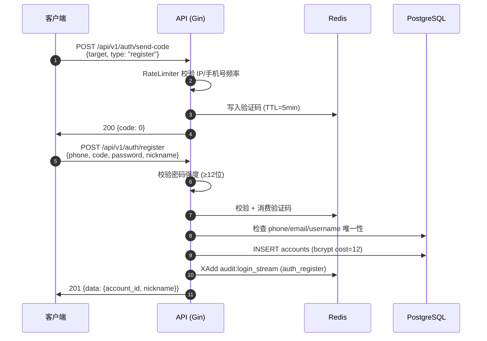
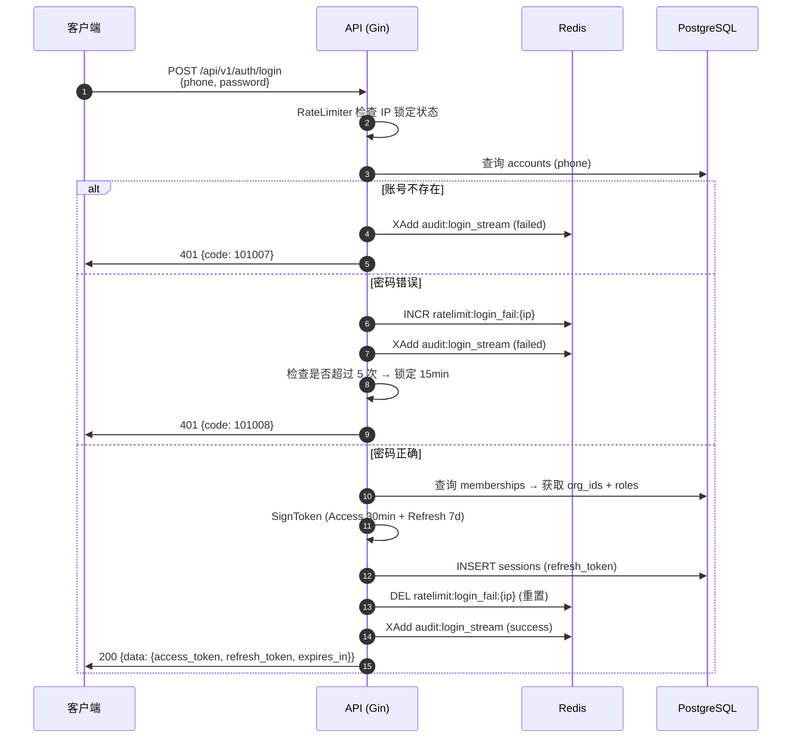
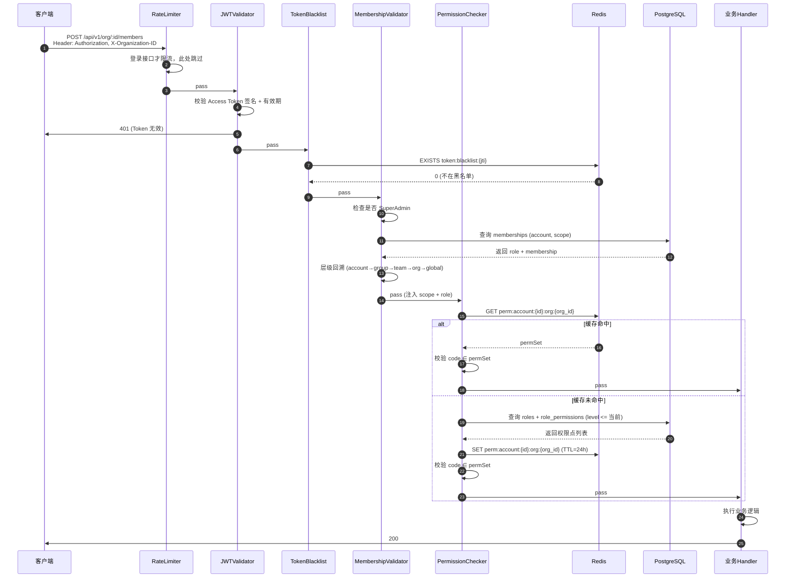
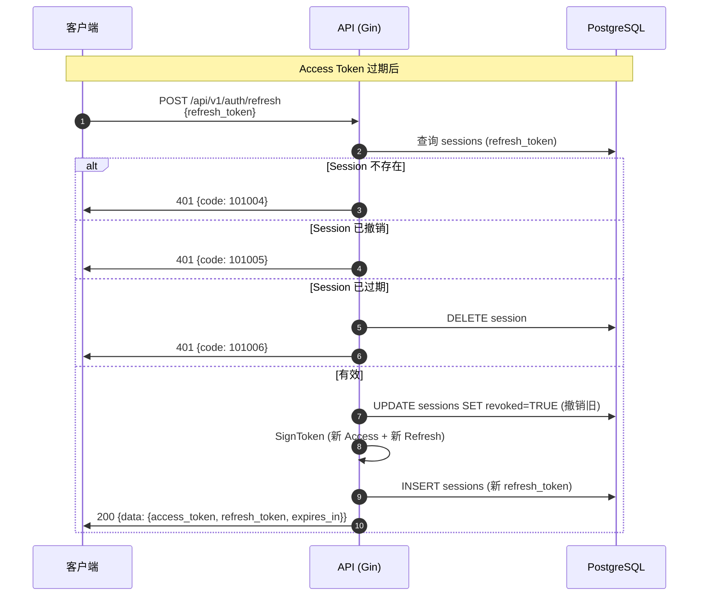
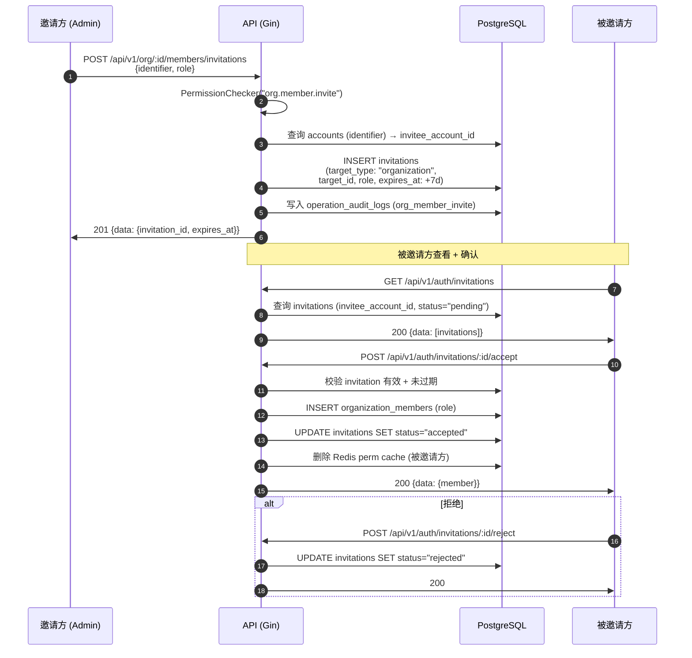

# 业务流程图集

> XYFamily 核心业务流程时序图：注册、登录、权限校验、Token 刷新、成员邀请。

---

## 文档信息

| 项目 | 内容 |
|------|------|
| 文档密级 | 内部 |
| 文档版本 | V1.0.0 |
| 编写人 | ClaudeCode |
| 审核人 | - |
| 生效时间 | 2026-07-12 |
| 废弃时间 | - |
| 关联标签 | 技术方案、核心文档 |
| 关联目录 | 03-技术架构与方案设计/03.06-业务流程图集 |

## 变更记录

| 版本 | 日期 | 变更内容 | 变更人 |
|------|------|----------|--------|
| V1.0.0 | 2026-07-12 | 初始创建，5 个核心流程时序图 | ClaudeCode |

---

## 一、注册流程

---

## 二、登录流程

---

## 三、权限校验流程

---

## 四、Token 刷新流程（Refresh Rotation）

---

## 五、成员邀请流程（统一邀请流）

---

## 六、关联文档

- [整体架构设计](../03.01-整体架构设计/整体架构设计-V1.0.0.md)
- [数据库设计](../03.02-数据库设计/数据库设计-V1.0.0.md)
- [中间件专项方案](../03.03-中间件专项方案/中间件专项方案-V1.0.0.md)
- [核心技术专项方案](../03.04-核心技术专项方案/核心技术专项方案-V1.0.0.md)
- [注册认证 PRD](../../02-需求与产品设计/02.02-产品PRD/01-用户认证模块/01-注册认证/注册认证-V1.0.0.md)
- [登录认证 PRD](../../02-需求与产品设计/02.02-产品PRD/01-用户认证模块/02-登录认证/登录认证-V1.0.0.md)
