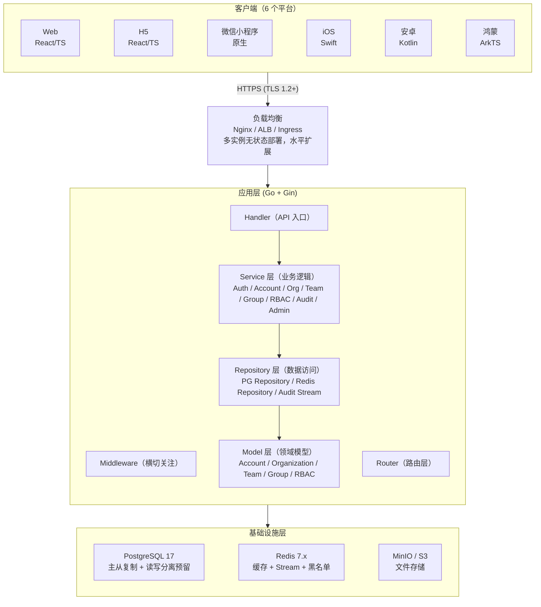
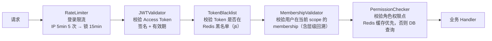
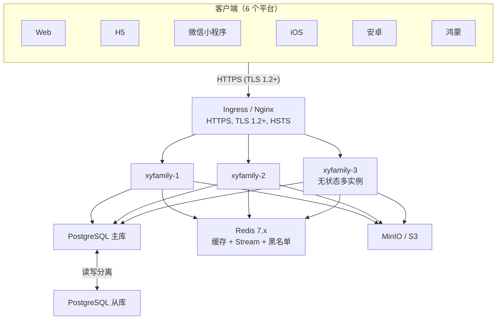

# 整体架构设计

> XYFamily 多租户账号权限底座整体技术架构。本文档是「03-架构与方案设计」的 **P1 基座文档**，基于产品 PRD（多租户底座 V1.0.0）重新梳理，定义技术栈、分层架构、模块边界、部署拓扑、请求处理链路总览与关键设计约束基线，为后续核心域方案（多租户隔离 / RBAC / JWT）、数据模型、接口契约、链路实现与横切专项提供统一基础。

---

## 文档信息

| 项目 | 内容 |
|------|------|
| 文档密级 | 内部 |
| 文档版本 | V1.1.0 |
| 编写人 | ClaudeCode |
| 审核人 | - |
| 生效时间 | 2026-07-15 |
| 废弃时间 | - |
| 关联标签 | 技术方案、系统基础、核心文档 |
| 关联目录 | 03-架构与方案设计 |

## 变更记录

| 版本 | 日期 | 变更内容 | 变更人 |
|------|------|----------|--------|
| V1.0.0 | 2026-07-12 | 初始创建，基于 15 项已确定设计决策 | ClaudeCode |
| V1.0.1 | 2026-07-13 | 将全部 ASCII 图表替换为 Mermaid 图表 | CatPaw |
| V1.0.2 | 2026-07-13 | 修正项目目录结构，与 04.01 全局开发规范对齐 | CatPaw |
| V1.1.0 | 2026-07-15 | 基于 PRD 重新梳理，作为 03 重构 P1 基座：校正关联目录与链接、新增 PRD→架构映射与关键约束基线、明确与 ADR 及后续分阶段文档的关系 | ClaudeCode |
| V1.1.1 | 2026-07-16 | 修正前端平台数量 5→6（补充鸿蒙 HarmonyOS）、补全项目目录结构（新增 web/h5/miniprogram/ios/android/harmony 六端）、同步更新分层与部署 Mermaid 图 | CatPaw |

---

## 一、文档定位与阅读指引

- **定位**：本仓库技术架构的总纲与基座，定义"用什么技术、怎么分层、怎么部署、请求怎么走"，并锁定贯穿全局的关键设计约束。
- **与 ADR 的关系**：本文中的关键取舍（单角色 RBAC、应用层隔离、Access 无状态 + Refresh 有状态等）均以 ADR 形式记录在《[ADR 架构决策记录](../01-基座/02-ADR架构决策记录.md)》中，本文只给结论与总览，决策依据以 ADR 为准。
- **与 PRD 的关系**：本架构完全服务于产品 PRD（多租户底座），PRD 描述"要做什么（What）"，本文与后续 03 文档描述"怎么做（How）"。PRD 来源：[产品 PRD 总览](../../02-需求与产品设计/01-产品PRD/产品PRD.md)。
- **阅读顺序建议**：本文 → ADR → P2 核心域（[03-多租户隔离](../02-核心域/README.md) / [RBAC](../02-核心域/README.md) / [JWT](../02-核心域/README.md)）→ P3 数据模型与契约（[04-数据库设计](../03-数据模型与契约/01-数据库设计/README.md) / [04-接口设计](../03-数据模型与契约/02-接口设计/README.md)）→ P4 链路实现（[05-中间件链](../04-链路实现/README.md) / [05-业务流程时序图集](../04-链路实现/README.md) / [05-审计日志](../04-链路实现/README.md)）→ P5 支撑域 → P6 横切专项 → P7 收口（NFR 落地映射）。

---

## 二、技术栈选型

选型依据来自 PRD 非功能需求（NFR）与既定基线：NFR-SEC-001（bcrypt cost 12）、NFR-SEC-004（Access 30min / Refresh 7d）、NFR-SEC-005（HS256 可升级 RS256）、NFR-SCAL-001（无状态水平扩展）、NFR-COMP-001（`/api/v1/`）、NFR-COMP-002（JSON）。

### 后端

| 类别 | 技术选型 | 版本 | 说明 / PRD 依据 |
|------|---------|------|------|
| 语言 | Go | 1.22+ | 高性能、适合无状态服务 |
| Web 框架 | Gin | latest | 高性能 HTTP 框架 |
| 数据库 | PostgreSQL | 17 | JSONB、全文检索；主从复制、读写分离预留（NFR-SCAL-002） |
| 缓存 / 会话 / 流 | Redis | 7.x | 验证码（TTL）、登录限流、Token 黑名单、权限缓存、审计 Stream |
| 认证 | JWT | HS256→RS256 | Access Token 30min（无状态）+ Refresh Token 7d（有状态，存 `sessions`） |
| 密码存储 | bcrypt | cost=12 | NFR-SEC-001 |
| API 规范 | RESTful | `/api/v1/` | JSON 请求/响应，UTF-8（NFR-COMP-001/002） |
| 部署 | Docker + K8s | - | 无状态多实例 + 负载均衡（NFR-SCAL-001） |
| 对象存储 | MinIO / S3 | - | 头像等文件上传 |

### 前端（6 个平台）

| 平台 | 技术选型 | 说明 |
|------|---------|------|
| Web | React + TypeScript + Ant Design 5.x | PC 管理后台（对应 `xyfamily-admin-design/`，M7） |
| H5 | React + TypeScript + Vite + Vant | 移动浏览器页面（M8） |
| 微信小程序 | 原生 / uni-app + TypeScript | 微信生态小程序（微信登录延后 P2，ADR-015，M8） |
| iOS | Swift + SwiftUI | iOS 原生 App（M9，移动端第一阶段） |
| 安卓 | Kotlin + Jetpack Compose | Android 原生 App（M10，移动端第二阶段） |
| 鸿蒙 | ArkTS + ArkUI | HarmonyOS 原生 App（M13，移动端第三阶段，上线后启动） |

### 基础设施

| 组件 | 作用 |
|------|------|
| 负载均衡 | Nginx / ALB / Ingress，HTTPS 终止，TLS ≥ 1.2，启用 HSTS（NFR-SEC-008） |
| PostgreSQL | 主库写入 + 从库读（读写分离预留） |
| Redis | 缓存 + 限流计数 + 黑名单 + 审计 Stream |
| MinIO / S3 | 文件存储（头像等） |

---

## 三、分层架构



**调用规则**：`Handler → Service → Repository → Model → 数据库/Redis`。禁止跨层调用（如 Handler 不能直接调用 Repository）；横切逻辑（鉴权、限流、审计）统一在 Middleware 与 Repository 边界处理。

---

## 四、模块划分

模块边界与 PRD 八大功能模块 + 支撑层一一对应，便于需求到实现的双向追溯。

| PRD 模块 | 服务模块 | 职责 | 数据模型（见 [04-数据库设计](../03-数据模型与契约/01-数据库设计/README.md)） |
|------|------|------|------|
| 用户认证 | **Auth** | 注册、登录、登出、Token 刷新/黑名单 | accounts、sessions、token_blacklist、（验证码存 Redis） |
| 账号管理 | **Account** | 个人信息、密码、注销/恢复、第三方绑定（P2） | accounts、invitations |
| 组织管理 | **Org** | 组织 CRUD、成员管理、创建团队 | organizations、org_members |
| 团队管理 | **Team** | 团队 CRUD、成员管理、创建小组 | teams、team_members |
| 小组管理 | **Group** | 小组 CRUD、成员管理 | groups、group_members |
| 权限管理 | **RBAC** | 角色/权限点初始化、权限校验、数据范围 | roles、permission_points、role_permissions |
| 超级管理员 | **Admin** | 系统配置、强制降级、全局审计 | system_configs |
| 审计日志 | **Audit** | 登录/操作审计日志 | audit_logs（追加不可篡改） |
| 支撑 | **Tenant Context** | 解析并校验 `X-Org/Team/Group-ID` 上下文 | 贯穿所有表（org_id 索引） |
| 支撑 | **Cache** | 权限/热点数据缓存 | Redis |
| 支撑 | **Notify** | 短信/邮件/站内通知（优雅降级） | 第三方集成（见 [06-第三方集成统一方案](../05-支撑域/README.md)） |

---

## 五、请求处理链路总览（核心）

所有需鉴权的请求都经过统一的横切中间件链，该链是后续 P4《中间件专项方案》的实现骨架，也是权限校验流程（PRD 5.3）的技术落地。



| 中间件 | 职责 | PRD / ADR 依据 |
|--------|------|------|
| RateLimiter | 登录限流（IP 5min 5 次 → 锁 15min，账号维度叠加） | NFR-SEC-002 |
| JWTValidator | 校验 Access Token 签名与有效期 | NFR-SEC-004/005 |
| TokenBlacklist | 校验 Token 是否在 Redis 黑名单（jti，登出/改密写入） | ADR-003 |
| MembershipValidator | 校验用户在当前 scope 的 membership（含 group→team→org→global 回溯） | FR-PERM-003、ADR-007 |
| PermissionChecker | 校验角色对应权限点（优先 Redis 缓存，否则 DB 查询 + 写缓存） | FR-PERM-002、ADR-007 |

> 链路结论：JWT 验证 → 黑名单校验 → 上下文（租户 scope）校验 → membership 校验（含回溯）→ 权限点校验 → 业务处理 → 响应。详细时序见 P4《业务流程时序图集》。

---

## 六、多租户隔离总览（详细见 [02-核心域](../02-核心域/README.md)）

PRD 要求"组织间完全数据隔离"（NFR-SEC-006）。本架构采用 **应用层隔离（非 PG RLS）**，理由与细节见 ADR-004。

- **三级租户模型**：`Organization → Team → Group`，组织间完全隔离，跨组织仅 SuperAdmin。
- **上下文传递**：通过 Header `X-Organization-ID` / `X-Team-ID` / `X-Group-ID` 显式携带租户上下文；单组织用户可省略，后端自动推断。
- **校验顺序**：提取上下文 → 校验 membership（含层级继承）→ 校验角色与权限点 → 查询数据强制带 `org_id` 条件。
- **Token Claims**：携带 `org_ids`（用户所属组织，最多 10 个）+ `roles`（各组织下最高角色）+ `jti`。

---

## 七、部署架构



**部署要点**：服务无状态，可水平扩展与负载均衡（NFR-SCAL-001、NFR-AVAIL-002 无单点）；PG 主从、读写分离预留（NFR-SCAL-002）；Redis 用 Sentinel 保证高可用；非核心依赖（通知）故障时核心认证/管理仍可用（NFR-AVAIL-003 优雅降级）。容灾与备份细节见 [06-横切专项 / 容灾多活与高可用](../06-横切专项/README.md)。

---

## 八、关键设计约束基线

以下约束贯穿全部 03 文档，决策依据见《[ADR 架构决策记录](../01-基座/02-ADR架构决策记录.md)》。

| 编号 | 约束 | 来源 |
|------|------|------|
| C1 | 单角色 RBAC：每个 `*_members` 含 `role` 字段，单容器内一账号一角色 | ADR-002 |
| C2 | 应用层多租户隔离（非 PG RLS），查询强制带 `org_id` | ADR-004、NFR-SEC-006 |
| C3 | Access 无状态 JWT + Refresh 有状态 `sessions` + Redis 黑名单 | ADR-003 |
| C4 | 三级租户 Organization→Team→Group，组织间完全隔离，跨组织仅 SuperAdmin | PRD、NFR-SEC-006 |
| C5 | 软删除 + 账号 30 天宽限期匿名化；绝不硬删除 `accounts` 与 `*_members` | ADR-006、ADR-010、NFR-SEC-007 |
| C6 | 安全常量：bcrypt cost 12、验证码 6 位/5min、登录限流 5/15min、Token 30min/7d、HS256→RS256 | NFR-SEC 全章 |
| C7 | 统一错误码体系：HTTP Status（401/403/404/429/500）+ 5 位业务 Code（10xxx~80xxx） | ADR-013 |
| C8 | 第三方登录（微信 OAuth2.0）与第三方绑定延后至 P2 | ADR-015 |
| C9 | 权限点矩阵 45 个 + Public（L0）角色，6 层继承 L5→L1 | ADR-008、FR-PERM-001~004 |

---

## 九、项目目录结构

```
code/
├── backend/                        # 后端服务（Go + Gin）
│   ├── go.mod                      # Go 1.22+，module xyfamily
│   ├── Makefile                    # build/run/test/lint/migrate 目标
│   ├── Dockerfile                  # 多阶段构建
│   ├── docker-compose.dev.yml      # 本地开发环境（PG 17 + Redis 7）
│   ├── cmd/xyfamily/
│   │   └── main.go                 # 入口，启动 HTTP 服务 + 迁移 + 系统初始化
│   ├── internal/
│   │   ├── handler/                # API 入口（按模块分包：auth/, account/, org/, team/, group/, rbac/, audit/, admin/）
│   │   ├── service/                # 业务逻辑（按模块分包，与 handler 一一对应）
│   │   ├── repository/             # 数据访问层（pg.go, redis.go, audit.go）
│   │   ├── model/                  # 领域模型（struct 定义）
│   │   ├── middleware/             # 横切中间件（auth.go, rate_limit.go, permission.go, logging.go）
│   │   └── init/                   # 系统初始化（roles/permissions, SuperAdmin, 迁移）
│   ├── pkg/
│   │   ├── jwt/                    # JWT 封装（签发、解析、黑名单校验）
│   │   ├── bcrypt/                 # 密码哈希封装（bcrypt cost=12）
│   │   ├── response/               # 统一响应格式（Response 结构体、错误响应）
│   │   ├── errors/                 # 业务错误码定义（errno.go）
│   │   └── logger/                 # 结构化 JSON 日志
│   ├── configs/
│   │   └── config.yaml             # 配置文件（环境变量覆盖）
│   ├── migrations/
│   │   ├── V001__init.sql          # 数据库迁移（按版本排序，升序执行）
│   │   └── V002__...sql            # 后续增量迁移
│   └── test/
│       ├── auth_test.go            # 认证模块测试
│       └── integration_test.go     # 集成测试
│
├── web/                            # Web 管理后台（React + TS + Ant Design 5.x，M7）
│   ├── src/
│   │   ├── api/                    # API 封装（Axios + 拦截器）
│   │   ├── store/                  # 状态管理（authStore / orgStore / permissionStore）
│   │   ├── pages/                  # 页面（login / dashboard / org / team / group / audit / admin）
│   │   ├── components/             # 公共组件
│   │   ├── layouts/                # 布局（侧边栏 + 顶栏）
│   │   ├── router/                 # 路由守卫 + 权限路由
│   │   └── utils/                  # 工具函数（permission.ts / download.ts）
│   ├── vite.config.ts
│   └── Dockerfile
│
├── h5/                             # H5 移动浏览器端（React + TS + Vant，M8）
│   ├── src/
│   │   ├── api/                    # API 封装
│   │   ├── store/                  # Zustand 状态管理
│   │   ├── pages/                  # 页面（auth / account / org / team / group）
│   │   ├── components/             # 公共组件
│   │   ├── hooks/                  # 自定义 Hook
│   │   └── services/               # secureStorage.ts / permission.ts
│   └── vite.config.ts
│
├── miniprogram/                    # 微信小程序端（原生 / uni-app + TS，M8）
│   ├── src/
│   │   ├── pages/                  # 页面（login / register / profile / org / team）
│   │   ├── components/             # 公共组件
│   │   ├── utils/                  # request.ts / token.ts / permission.ts
│   │   ├── store/                  # 状态管理
│   │   └── static/                 # 静态资源
│   └── app.vue
│
├── ios/                            # iOS 原生 App（Swift + SwiftUI，M9）
│   └── Xyfamily/
│       ├── Resources/              # Images.xcassets / Info.plist
│       ├── Common/                 # Network（URLSession 封装）/ DI / Utils
│       ├── Data/                   # Models / Repositories
│       ├── Domain/                 # UseCases
│       └── Presentation/           # Auth / Account / Organization / Team / Group / Common
│
├── android/                        # Android 原生 App（Kotlin + Compose，M10）
│   └── app/src/main/java/com/xyfamily/
│       ├── common/                 # network（Retrofit）/ di（Hilt）/ util
│       ├── data/                   # model / repository
│       ├── domain/                 # usecase
│       └── presentation/           # auth / account / org / team / group / rbac / common
│
└── harmony/                        # 鸿蒙 HarmonyOS App（ArkTS + ArkUI，M13，上线后启动）
    └── entry/src/main/ets/
        ├── network/                # @ohos.net.http 封装
        ├── pages/                  # ArkUI 页面（Login / Home / Account / Org / Team / Group）
        └── common/                 # 工具与公共组件
```

> **说明**：后端详细工程目录见 [全局开发规范](../../标准与规范/04-开发规范/01-全局开发规范)；各前端端详细目录结构见 [分端代码规范](../../标准与规范/03-分端代码规范/) 对应文档。各端里程碑与交付计划见 [项目里程碑](../../00-项目总览/00.03-项目里程碑/项目里程碑)。

---

## 十、关联文档

- [ADR 架构决策记录](../01-基座/02-ADR架构决策记录.md) — 关键架构决策与依据
- [数据库设计](../03-数据模型与契约/01-数据库设计/README.md) — 全量 PG DDL、枚举、索引、预初始化数据（P3）
- [接口设计](../03-数据模型与契约/02-接口设计/README.md) — 各模块 API 契约（P3）
- [中间件专项方案](../04-链路实现/README.md) — 链路中间件实现细节（P4）
- [核心域方案](../02-核心域/README.md) — 多租户隔离 / RBAC / JWT 落地（P2）
- [业务流程时序图集](../04-链路实现/README.md) — 端到端时序图（P4）
- [容灾多活与高可用](../06-横切专项/README.md) — 高可用与备份（P6）
- [产品 PRD 总览](../../02-需求与产品设计/01-产品PRD/产品PRD.md) — 需求来源（What）
