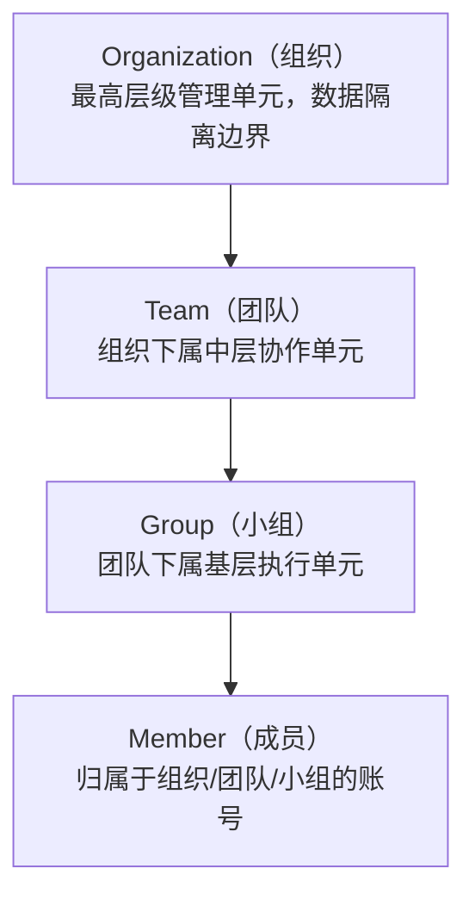
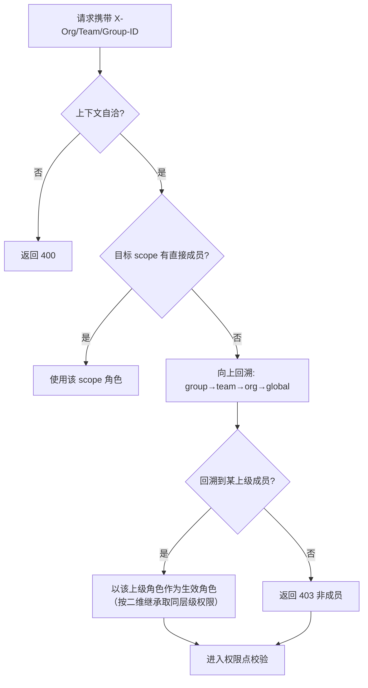

# 01-多租户隔离方案

> P2 核心域之一。定义 XYFamily 三级租户模型、数据隔离策略、租户上下文的传递与校验方式，以及跨组织访问边界。本方案是数据库设计（表结构贯穿 `org_id`）、接口设计（鉴权范围标注）与中间件链（MembershipValidator）的直接依据。

---

## 文档信息

| 项目 | 内容 |
|------|------|
| 文档密级 | 内部 |
| 文档版本 | V1.0.0 |
| 编写人 | ClaudeCode |
| 审核人 | - |
| 生效时间 | 2026-07-15 |
| 废弃时间 | - |
| 关联标签 | 技术方案、多租户、数据隔离、核心域 |
| 关联目录 | 03-架构与方案设计/02-核心域 |

## 变更记录

| 版本 | 日期 | 变更内容 | 变更人 |
|------|------|----------|--------|
| V1.0.0 | 2026-07-15 | 基于 PRD 多租户底座重新梳理，定义三级租户模型与隔离策略 | ClaudeCode |

---

## 一、定位与 PRD 来源

PRD 要求"组织间完全数据隔离"（NFR-SEC-006），并以「组织 → 团队 → 小组 → 成员」四级结构承载企业级多租户数据隔离与权限治理（见 [多租户底座 PRD](../02-需求与产品设计/01-产品PRD/01-多租户底座/多租户底座-V1.0.0.md) 与 [组织管理模块 PRD](../02-需求与产品设计/01-产品PRD/01-多租户底座/03-组织管理模块/组织管理模块-V1.0.0.md)）。

本方案回答三个核心问题：

1. **租户如何建模**：三级租户 + 成员关系的层次结构。
2. **数据如何隔离**：应用层隔离（非 PG RLS），强制 `org_id` 贯穿所有查询。
3. **请求如何判定归属**：通过 `X-Org/Team/Group-ID` 上下文 + 成员关系回溯，确定请求生效的作用域与角色。

决策依据见 [ADR-004 多租户隔离实现](../../01-基座/02-ADR架构决策记录.md)，约束基线见 [整体架构设计 C2/C4](../../01-基座/01-整体架构设计.md)。

---

## 二、三级租户模型

| 层级 | 实体 | 关键约束 | PRD 来源 |
|------|------|----------|----------|
| L3 组织 | `organizations` | 数据隔离边界；组织间完全隔离 | FR-ORG-001~009 |
| L2 团队 | `teams` | 隶属于某组织；含 `archived_at` 软归档 | FR-TEAM-001~009 |
| L1 小组 | `groups` | 隶属于某团队；含 `deleted_at` 软删除 | FR-GROUP-001~008 |
| 成员 | `*_members` | 复合唯一 `(scope_id, account_id)`；单角色列 `role` | FR-ORG/TEAM/GROUP-007 |

**关键语义**
- 一个组织下可有多个团队，一个团队下可有多个小组；所有团队/小组最终归属于唯一组织。
- 组织是租户边界，**组织间完全数据隔离**；同一账号在不同组织为相互独立的成员关系，权限互不影响。
- 父子关系由外键承载：`teams.org_id` → `organizations`，`groups.team_id` → `teams`（并冗余 `org_id` 便于索引与隔离校验）。

---

## 三、数据隔离策略

### 3.1 应用层隔离（非 RLS）

采用 **应用层隔离**（ADR-004），理由：

- 权限继承需要跨层表达（组织核心管理员可操作团队而不必先加入团队），RLS 难以表达层级回溯。
- 隔离逻辑集中在中间件，便于统一审计与测试。

**强制约束（C2）**
- 所有业务表携带 `org_id`（组织 id），作为隔离主键。
- 所有数据查询必须带 `org_id` 条件，缺失即拒绝（防止越权读取）。
- 跨组织访问（未通过全局 SuperAdmin）一律拒绝，返回 403。

### 3.2 软删除与隔离的共存

- 组织/团队/小组均使用 `deleted_at` / `archived_at` 软删除（ADR-006）；隔离查询需同时排除已删除行。
- 软删除不破坏父子外键与成员引用，保证审计完整性。

### 3.3 索引与性能

- 所有租户相关表 `org_id` 必带索引；`(scope_id, account_id)` 复合唯一索引保证成员唯一。
- 隔离过滤走索引前缀，避免全表扫描（NFR-PERF-001：95% < 100ms）。

---

## 四、租户上下文传递

每个需鉴权的请求通过 Header 显式携带其作用域上下文：

| Header | 含义 | 必填 |
|--------|------|------|
| `X-Organization-ID` | 目标组织 id | 组织/团队/小组域接口必填 |
| `X-Team-ID` | 目标团队 id | 团队/小组域接口必填 |
| `X-Group-ID` | 目标小组 id | 小组域接口必填 |

**推断规则**
- 单组织用户（仅属一个组织）可省略 `X-Organization-ID`，后端依据 Token Claims 中的 `org_ids` 自动推断。
- 多组织用户（≤10 个，见 Token Claims）必须显式指定，否则返回 400（上下文缺失）。
- 父子 scope 必须自洽：`X-Group-ID` 所属团队必须等于 `X-Team-ID`，其所属组织必须等于 `X-Organization-ID`；不一致返回 400。

---

## 五、上下文校验与层级回溯

权限校验前，必须先确定"当前账号在该 scope 的生效角色"。当目标 scope 无直接成员记录时，向上回溯上级 scope 的角色（见 [RBAC 权限引擎方案](./02-RBAC权限引擎方案.md) 的二维继承与 [数据范围控制 PRD](../02-需求与产品设计/01-产品PRD/01-多租户底座/06-权限管理模块/03-数据范围控制-V1.0.0.md)）。

**回溯示例**
- `organization_core_admin` 访问团队接口：虽不在该团队的 `team_members`，但凭组织级成员关系回溯获得授权（组织权限覆盖团队，对应团队核心层级）。
- `organization_ordinary_admin` 回溯到团队：仅具备团队普通管理员权限，不能执行团队结构性操作（纵向仅继承同层级）。

**全局角色例外**
- `super_admin` 不依赖任何成员关系，可跨组织执行操作，不受组织边界限制（ADR/PRD 角色体系 L8）。

---

## 六、与上下游方案的关系

| 下游方案 | 本方案提供什么 |
|----------|----------------|
| [数据库设计](../03-数据模型与契约/01-数据库设计/README.md) | 所有表 `org_id` 索引策略、`*_members` 复合唯一、软删约定 |
| [接口设计](../03-数据模型与契约/02-接口设计/README.md) | 各接口鉴权范围标注（需带哪些 `X-*` Header、何时 400/403） |
| [中间件链](../04-链路实现/README.md) | MembershipValidator 实现上下文校验 + 层级回溯 |
| [RBAC 权限引擎](./02-RBAC权限引擎方案.md) | 回溯得到的生效角色 → 权限点校验 |

---

## 七、关联文档

- [整体架构设计](../../01-基座/01-整体架构设计.md) — 约束基线 C2/C4、请求处理链路
- [ADR 架构决策记录](../../01-基座/02-ADR架构决策记录.md) — ADR-004（应用层隔离）、ADR-002（单角色）、ADR-006（软删除）
- [RBAC 权限引擎方案](./02-RBAC权限引擎方案.md) — 角色与权限点校验
- [JWT 鉴权链与 Token 方案](./03-JWT鉴权链与Token方案.md) — Token Claims 中的 `org_ids` / `roles`
- [多租户底座 PRD](../02-需求与产品设计/01-产品PRD/01-多租户底座/多租户底座-V1.0.0.md)
- [组织/团队/小组管理模块 PRD](../02-需求与产品设计/01-产品PRD/01-多租户底座/03-组织管理模块/组织管理模块-V1.0.0.md)
