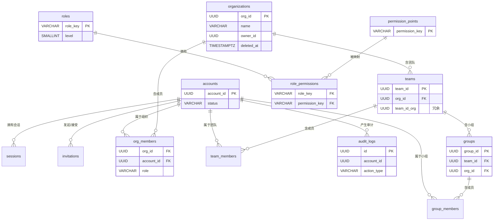

# 05-ER 图与全局约定

> P3 数据模型之五（全局汇总）。给出全部实体的 ER 关系图、跨域通用约定（UUID 主键、软删除、UTC、字符集、索引规范）、数据库预初始化顺序，以及枚举 / 状态汇总。本文件是 `01~04` 四份域文档的总入口与一致性基线。

---

## 文档信息

| 项目 | 内容 |
|------|------|
| 文档密级 | 内部 |
| 文档版本 | V1.0.0 |
| 编写人 | ClaudeCode |
| 审核人 | - |
| 生效时间 | 2026-07-15 |
| 关联标签 | 技术方案、数据库、ER图、全局约定 |
| 关联目录 | 03-架构与方案设计/03-数据模型与契约/01-数据库设计 |

## 变更记录

| 版本 | 日期 | 变更内容 | 变更人 |
|------|------|----------|--------|
| V1.0.0 | 2026-07-15 | 汇总 ER 图与全局约定 | ClaudeCode |

---

## 一、实体关系图（ER）

> 说明：父子归属由外键承载（`teams.org_id`→`organizations`，`groups.team_id`→`teams`），同时冗余 `org_id` 便于隔离校验与索引。`*_members` 复合唯一 `(scope_id, account_id)`。

---

## 二、跨域通用约定

| 约定 | 规则 | 依据 |
|------|------|------|
| 主键 | 所有表 `id UUID PK DEFAULT gen_random_uuid()` | ADR-005 |
| 业务标识 | 对外引用使用 `account_id` / `org_id` / `team_id` / `group_id`（各域 UNIQUE），隐藏内部 `id` | ADR-005 |
| 字符集 | `UTF-8`，`created_at` / `updated_at` 统一 `TIMESTAMPTZ`（服务端 UTC 存储，NFR-COMP-005） | NFR-COMP-005 |
| 软删除 | `deleted_at TIMESTAMPTZ`；`accounts` / `*_members` **绝不硬删除**（ADR-006）；所有查询排除 `deleted_at IS NULL` | ADR-006 |
| 隔离键 | 所有业务表带 `org_id`，查询强制带 `org_id` 条件（C2） | ADR-004、NFR-SEC-006 |
| 索引 | `org_id` 必带索引；唯一索引附加 `WHERE deleted_at IS NULL`；成员复合唯一 | NFR-PERF-001 |
| 审计表 | 仅追加，无 `updated_at` / `deleted_at`，禁止 UPDATE/DELETE | ADR-011 |
| PII 加密 | phone/email 等按 NFR-SEC-009 加密存储，应用层加解密 | NFR-SEC-009 |
| 密码 | bcrypt cost=12，仅存哈希，绝不落日志/审计明文 | NFR-SEC-001 |

---

## 三、数据库预初始化顺序

系统启动（[P1 init/](../02-需求与产品设计/.. ) 阶段）按以下顺序执行迁移 + 种子数据：

1. **DDL 迁移**：按依赖建表（先 `accounts`/`roles`/`permission_points`，再 `role_permissions`，再租户与成员表，最后 `audit_logs`/`system_configs`）。
2. **角色种子**：写入 9 个角色（`roles`）。
3. **权限点种子**：写入 45 个权限点（`permission_points`）。
4. **权限映射预填充**：按 [03-权限域 §四](./03-权限域.md) 固化展开写入 `role_permissions`。
5. **系统配置种子**：写入 `system_configs` 默认项（[03-权限域 §五](./03-权限域.md)）。
6. **SuperAdmin 初始化**：数据库为空时创建首个 SuperAdmin（[ADR-001](../../01-基座/02-ADR架构决策记录.md)，CLI/环境变量）。

> 迁移文件置于 `code/backend/migrations/`（见 [P1 §九](../../01-基座/01-整体架构设计.md)），按版本号升序执行。

---

## 四、枚举 / 状态汇总

| 维度 | 取值 |
|------|------|
| `accounts.status` | `active` / `deactivating` / `deactivated` |
| `*_members.role` | `regular_member` / `{scope}_ordinary_admin` / `{scope}_core_admin`（scope=group\|team\|organization）；SuperAdmin 不在此表 |
| `roles.level` | L0~L8 |
| `invitations.scope_type` | `organization` / `team` / `group` |
| `invitations.status` | `pending` / `accepted` / `rejected` / `expired` |
| `sessions` | `revoked_at` 非空即撤销 |
| `audit_logs.action_domain` | `login` / `org` / `team` / `group` / `account` / `system_config` |
| `audit_logs.result` | `success` / `failed` |
| 验证码 `type` | `register` / `login` / `reset_password` |

---

## 五、与上下游的关系

- 本文件汇总 [01-账号与认证域](./01-账号与认证域.md) / [02-租户域](./02-租户域.md) / [03-权限域](./03-权限域.md) / [04-审计域](./04-审计域.md)。
- 驱动 [接口设计](../02-接口设计/README.md) 的字段契约与错误码。
- 驱动 [P4 中间件链](../../../04-链路实现/01-中间件链专项方案.md) 的隔离校验与权限查询。

## 六、关联文档

- [整体架构设计](../../01-基座/01-整体架构设计.md) — 项目目录、约束基线
- [ADR 架构决策记录](../../01-基座/02-ADR架构决策记录.md) — ADR-001/004/005/006/011
- [P2 核心域](../../02-核心域/README.md) — 隔离 / RBAC / JWT
