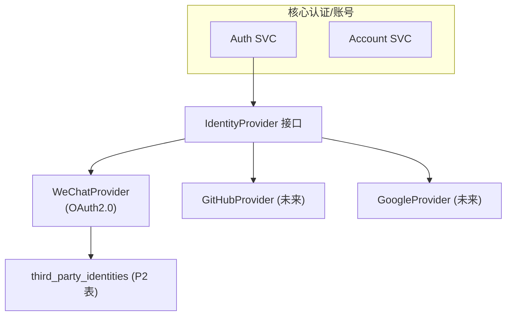
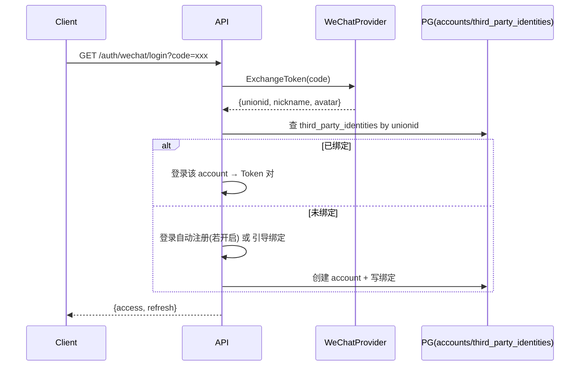

# 03-第三方集成统一方案

> P5 支撑域之三。定义第三方身份（微信登录、第三方账号绑定/解绑）的统一集成抽象与扩展点。**首版（P2 范围）延后**，依据 ADR-015；本文给出可落地的统一架构，保证后续接入不修改核心逻辑（NFR-SCAL-003）。

---

## 文档信息

| 项目 | 内容 |
|------|------|
| 文档密级 | 内部 |
| 文档版本 | V1.0.0 |
| 编写人 | ClaudeCode |
| 审核人 | - |
| 生效时间 | 2026-07-15 |
| 关联标签 | 技术方案、第三方、OAuth2、集成 |
| 关联目录 | 03-架构与方案设计/05-支撑域 |

## 变更记录

| 版本 | 日期 | 变更内容 | 变更人 |
|------|------|----------|--------|
| V1.0.0 | 2026-07-15 | 基于 ADR-015 定义第三方集成统一抽象（P2 范围） | ClaudeCode |
| V1.0.1 | 2026-07-16 | MIN-007 修复：标题描述从"P1 范围"更正为"P2 范围" | CatPaw |

---

## 一、范围与约束

- **首版延后**：微信登录（FR-AUTH-012）、登录自动注册（FR-AUTH-013）、绑定/解绑（FR-ACCT-006/007）均延后至 P2（ADR-015）。
- **设计目标**：定义统一 `IdentityProvider` 抽象，新增第三方仅需实现接口 + 配置，核心认证/账号逻辑不变（NFR-SCAL-003）。

---

## 二、统一抽象



**IdentityProvider 接口契约**

| 方法 | 说明 |
|------|------|
| `ExchangeToken(ctx, code)` | 用授权码换取第三方用户信息（openid/unionid/email） |
| `GetUserInfo(token)` | 拉取第三方资料 |
| `Link(accountID, profile)` | 绑定到本地账号（写 `third_party_identities`） |
| `Unlink(accountID, provider)` | 解绑 |

---

## 三、微信登录流程（P2）



---

## 四、数据模型（P2 启用）

`third_party_identities`（首版不建表，ADR-015）：

```sql
CREATE TABLE third_party_identities (
    id            UUID PRIMARY KEY DEFAULT gen_random_uuid(),
    account_id    UUID NOT NULL,
    provider      VARCHAR(32) NOT NULL,   -- wechat|github|google
    external_id   VARCHAR(128) NOT NULL,  -- unionid/openid
    profile       JSONB,
    created_at    TIMESTAMPTZ NOT NULL DEFAULT now(),
    UNIQUE (provider, external_id)
);
```

> 验证码 `type=bind` 场景（ADR-012）在绑定/解绑时启用。

---

## 五、账号关联策略

- **绑定**：需已登录 + 验证（[账号接口](../03-数据模型与契约/02-接口设计/02-账号接口.md) `account.third_party.bind`，P2）。
- **解绑**：保留至少一种登录方式（防账号不可登录）；解绑后不可再通过该第三方登录。
- **冲突**：同 external_id 已绑其他账号 → 拒绝重复绑定。

---

## 六、安全与合规

- 第三方 Token 不长期存储（仅用于交换/拉取）。
- 绑定操作记审计（FR-AUDIT-005 `account.third_party.bind/unbind`）。
- 遵循等保与隐私最小化（NFR-COMPL-001）。

---

## 七、关联文档

- [ADR-015 第三方登录延后](../../01-基座/02-ADR架构决策记录.md)
- [JWT 鉴权链](../../02-核心域/03-JWT鉴权链与Token方案.md)
- [账号接口](../03-数据模型与契约/02-接口设计/02-账号接口.md)
- 认证 PRD：../../02-需求与产品设计/01-产品PRD/01-多租户底座/01-用户认证模块/用户认证模块

## 关联文档


> 以下为知识图谱自动推荐的交叉引用，建议人工审阅确认后保留。

- [合规安全与数据治理](../../07-合规安全与数据治理/合规安全与数据治理.md) — 共享术语：合规、安全（置信度 0.75）
- [数据合规规范](../../07-合规安全与数据治理/01-数据合规规范/数据合规规范.md) — 共享术语：合规、安全（置信度 0.75）
- [安全应急处置](../../07-合规安全与数据治理/04-安全应急处置/安全应急处置.md) — 共享术语：合规、安全（置信度 0.75）
- [安全基线管理](../../07-合规安全与数据治理/03-安全基线管理/安全基线管理.md) — 共享术语：合规、安全（置信度 0.75）
- [数据分级治理](../../07-合规安全与数据治理/02-数据分级治理/数据分级治理.md) — 共享术语：合规、安全（置信度 0.75）
