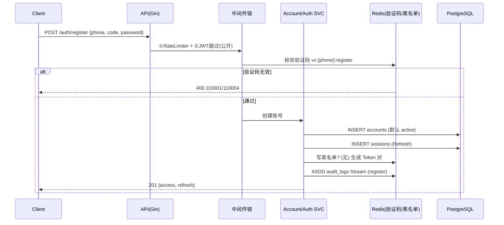
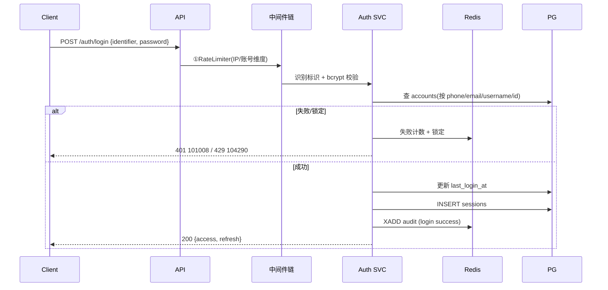
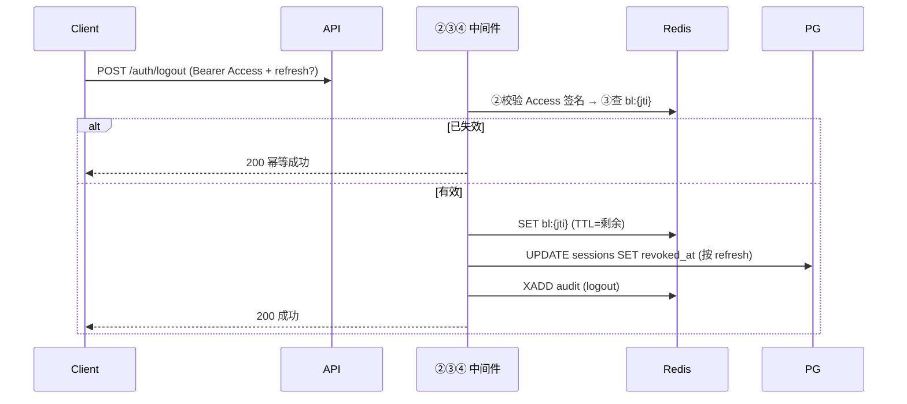
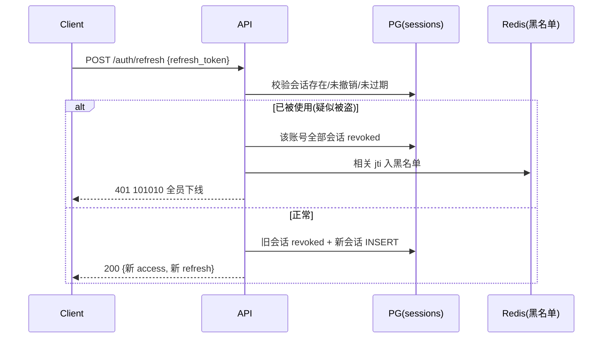
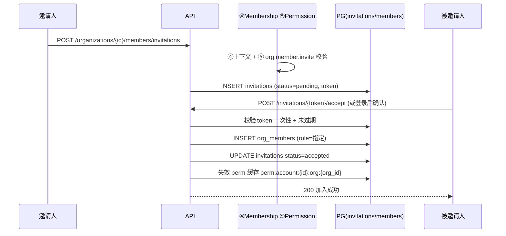
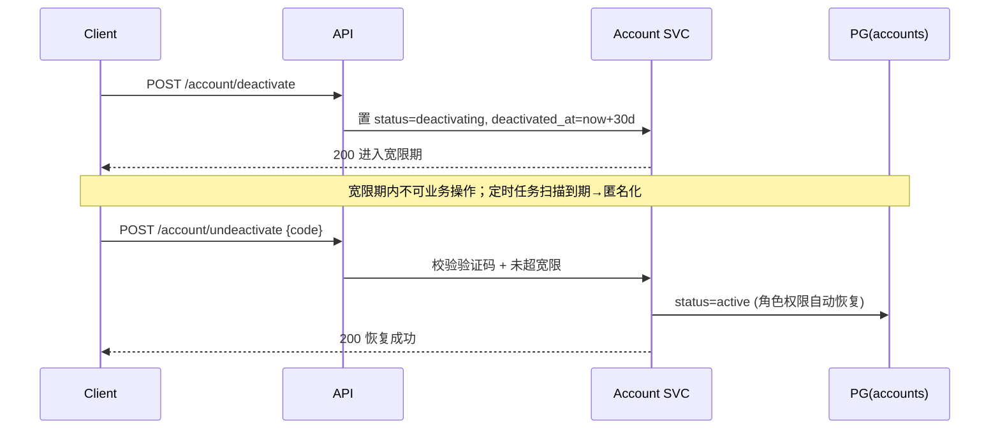
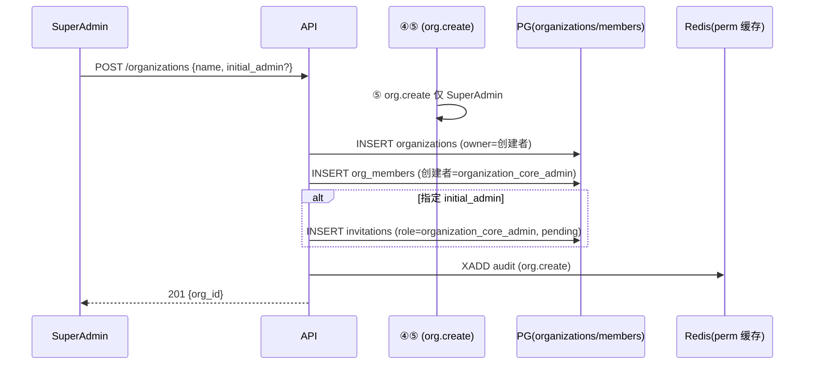
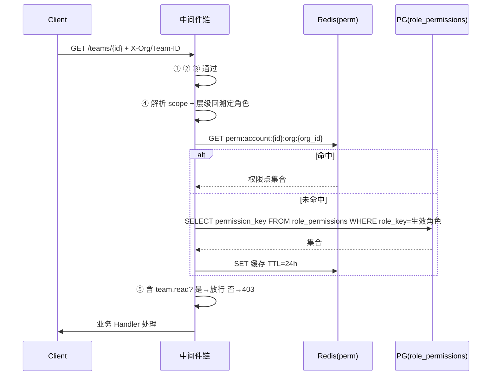

# 02-业务流程时序图集

> P4 链路实现之二。以 Mermaid 时序图呈现端到端核心流程，串联 [P2 三方案](../../03-核心域/README.md) 与 [P3 接口/库表](../04-数据模型与契约/README.md)，并标注中间件链（[01-中间件链专项方案](./01-中间件链专项方案.md)）介入点。覆盖：注册、登录、登出、刷新（Rotation）、邀请-接受、注销-恢复、组织创建、典型权限校验。

---

## 文档信息

| 项目 | 内容 |
|------|------|
| 文档密级 | 内部 |
| 文档版本 | V1.0.0 |
| 编写人 | ClaudeCode |
| 审核人 | - |
| 生效时间 | 2026-07-15 |
| 关联标签 | 技术方案、时序图、业务流程 |
| 关联目录 | 03-架构与方案设计/05-链路实现 |

## 变更记录

| 版本 | 日期 | 变更内容 | 变更人 |
|------|------|----------|--------|
| V1.0.0 | 2026-07-15 | 汇总核心流程时序图 | ClaudeCode |

---

## 一、注册流程（手机号 + 验证码）

---

## 二、登录流程（密码）

---

## 三、登出流程（幂等）

---

## 四、刷新 Token（Rotation）

---

## 五、邀请 → 接受（统一邀请流）

---

## 六、注销 → 恢复（宽限期）

---

## 七、组织创建（接棒机制）

---

## 八、典型权限校验（访问团队接口）

---

## 九、关联文档

- [中间件链专项方案](./01-中间件链专项方案.md)
- [P2 核心域](../../03-核心域/README.md)（隔离/RBAC/JWT）
- [P3 接口设计](../04-数据模型与契约/02-接口设计/README.md)
- [审计日志方案](./03-审计日志方案.md)
