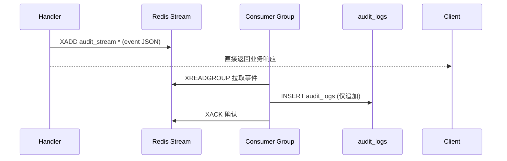

# 03-审计日志方案

> P4 链路实现之三。定义审计日志的**写入链路、存储、脱敏、匿名化与查询**实现，承接 [ADR-011（单表 + Redis Stream 异步）](../../02-基座/02-ADR架构决策记录.md) 与 [审计域库表](../04-数据模型与契约/01-数据库设计/04-审计域.md)、[审计接口](../04-数据模型与契约/02-接口设计/08-审计接口.md)。覆盖 FR-AUDIT-001~011，满足 NFR-SEC-007（保留 1 年、不可篡改、注销匿名化）。

---

## 文档信息

| 项目 | 内容 |
|------|------|
| 文档密级 | 内部 |
| 文档版本 | V1.0.0 |
| 编写人 | ClaudeCode |
| 审核人 | - |
| 生效时间 | 2026-07-15 |
| 关联标签 | 技术方案、审计、异步、合规 |
| 关联目录 | 03-架构与方案设计/05-链路实现 |

## 变更记录

| 版本 | 日期 | 变更内容 | 变更人 |
|------|------|----------|--------|
| V1.0.0 | 2026-07-15 | 基于 ADR-011 与审计 PRD 定义审计实现方案 | ClaudeCode |

---

## 一、写入链路（异步不阻塞）



- **依据**：ADR-011、NFR-PERF-006（P99 < 1s）。
- 主流程不等待落库；Stream 保证至少一次（at-least-once），consumer group + `XACK` 防重复消费。
- 断点续写：消费者崩溃后从未 `XACK` 的 pending 列表（`XPENDING`）恢复，不丢数据。

---

## 二、事件结构

推入 Stream 的事件 JSON（与 `audit_logs` 字段对齐）：

```json
{
  "account_id": "uuid|null",
  "org_id": "uuid|null",
  "action_domain": "login|org|team|group|account|system_config",
  "action_type": "auth.login",
  "target_type": "organization",
  "target_id": "uuid|null",
  "result": "success|failed",
  "failure_reason": "password_error|...",
  "details": { "before": {}, "after": {} },
  "ip_address": "1.2.3.4",
  "user_agent": "..."
}
```

---

## 三、脱敏与防篡改

| 要求 | 实现 | 依据 |
|------|------|------|
| 凭证不落明文 | `details` 中密码/Token/验证码一律不记录；密码变更仅记 `{"changed":true}` | FR-AUDIT-005/010 |
| PII 加密存储 | phone/email 入库加密；查询/导出展示按需脱敏（`138****0000`） | NFR-SEC-009、FR-AUDIT-010 |
| 仅追加不可篡改 | `audit_logs` 无 `updated_at`/`deleted_at`，应用层禁止 UPDATE/DELETE；SuperAdmin 亦不可改 | FR-AUDIT-009 |
| 匿名化不可逆 | 注销后 `account_id` 关联 PII 替换为 `anon_` 前缀，逻辑单向 | NFR-SEC-007 |

---

## 四、保留与匿名化策略

| 策略 | 实现 |
|------|------|
| 保留期 | 默认 365 天（可 SuperAdmin 配置 `audit.retention_days`，FR-ADMIN-004） |
| 到期处理 | 定时任务清理超过保留期的日志（软归档至冷存储 / 删除，按合规要求） |
| 账号注销 | 触发 `account.deactivate` 流程后，由 [P5 账号生命周期](../../06-支撑域/01-账号生命周期与身份方案.md) 对 `audit_logs` 中该账号 PII 匿名化 |
| 防丢失 | Stream 持久化 + PG 主从；详见 [P6 容灾多活](../../07-横切专项/02-容灾多活与高可用.md) |

---

## 五、查询实现

- **本组织查询**（FR-AUDIT-007）：`organization_core_admin` 经 [审计接口](../04-数据模型与契约/02-接口设计/08-审计接口.md) 查询，强制 `org_id = 当前组织`，防越权。
- **全局查询**（FR-AUDIT-008）：SuperAdmin 查全部，额外支持 `org_id` 过滤。
- **分页/筛选**：索引 `(account_id/org_id, created_at DESC)`，按时间倒序分页；操作类型/结果过滤。
- **详情**：返回完整 `details` 前后快照（脱敏后）。

---

## 六、监控与告警

- Stream 积压（pending 持续增长）告警：consumer 消费滞后（NFR-OBS-003）。
- 落库失败率告警（写入 PG 异常）。

---

## 七、关联文档

- [ADR-011 审计日志双表+Stream](../../02-基座/02-ADR架构决策记录.md)
- [审计域库表](../04-数据模型与契约/01-数据库设计/04-审计域.md)
- [审计接口](../04-数据模型与契约/02-接口设计/08-审计接口.md)
- [中间件链专项方案](./01-中间件链专项方案.md)（⑥ Audit）
- 审计 PRD：../../02-需求与产品设计/01-产品PRD/01-多租户底座/09-审计日志模块/审计日志模块-V1.0.0.md
