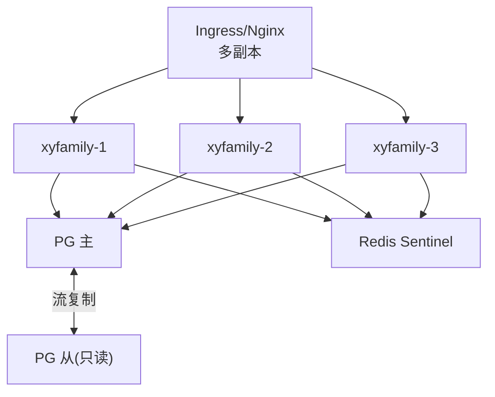

# 02-容灾多活与高可用

> P6 横切专项之二。定义系统高可用与容灾备份体系，覆盖 NFR-AVAIL-001~004（SLA 99.9%、无单点、优雅降级、限流熔断）与 NFR-BACKUP-001~003（备份、RTO<4h、RPO<15min、异地容灾）。承接 [P1 部署架构](../../01-基座/01-整体架构设计.md)。

---

## 文档信息

| 项目 | 内容 |
|------|------|
| 文档密级 | 内部 |
| 文档版本 | V1.0.0 |
| 编写人 | ClaudeCode |
| 审核人 | - |
| 生效时间 | 2026-07-15 |
| 关联标签 | 技术方案、高可用、容灾、备份 |
| 关联目录 | 03-架构与方案设计/06-横切专项 |

## 变更记录

| 版本 | 日期 | 变更内容 | 变更人 |
|------|------|----------|--------|
| V1.0.0 | 2026-07-15 | 基于非功能需求定义高可用与容灾方案 | ClaudeCode |

---

## 一、高可用架构（NFR-AVAIL-002 无单点）

- **应用无状态**：多实例 + 负载均衡，实例故障自动摘除（NFR-SCAL-001、NFR-AVAIL-002）。
- **PG 高可用**：主从流复制；主故障 Sentinel/Patroni 自动切换。
- **Redis 高可用**：Sentinel 保证，缓存层不阻塞核心。

---

## 二、数据库扩展与读写分离（NFR-SCAL-002）

- 主库写入，从库读（读写分离预留）；读多写少查询（组织信息、权限）走从库。
- 隔离查询强制带 `org_id`，索引前缀保证性能（NFR-PERF-001）。
- 分库分表预留：租户规模增长时可按 `org_id` 范围分片（NFR-SCAL-005）。

---

## 三、备份与恢复（NFR-BACKUP）

| 策略 | 实现 |
|------|------|
| 全量备份 | 每日 PG `pg_basebackup` + `pg_dump` 逻辑备份 |
| 增量备份 | WAL 连续归档（PITR） |
| 保留期 | ≥ 30 天（NFR-BACKUP-001） |
| RTO / RPO | RTO < 4h，RPO < 15min（NFR-BACKUP-002） |
| 异地容灾 | 备份异步复制到异地存储；重大故障切换恢复（NFR-BACKUP-003） |
| Redis | AOF + RDB 持久化；Stream 消费位点保障审计不丢 |

---

## 四、优雅降级与熔断（NFR-AVAIL-003/004）

| 依赖 | 降级行为 |
|------|----------|
| 通知（短信/邮件） | 故障时不阻断认证/管理核心（NFR-AVAIL-003） |
| 审计 Stream | 消费滞后时主流程仍返回，积压告警（[审计方案](../04-链路实现/03-审计日志方案.md)） |
| 权限缓存 | Redis 不可用回退 DB 查询（[缓存设计](../05-支撑域/02-缓存设计方案.md)） |

- **限流熔断**：异常流量限流（登录/刷新频控），故障依赖熔断保护（NFR-AVAIL-004）。

---

## 五、多租户规模（NFR-SCAL-005）

- 实例水平扩容支撑并发在线 ≥10000（NFR-PERF-004）。
- 租户数 / 用户数持续增长时，容量通过加节点 + 分片线性扩容。

---

## 六、关联文档

- [整体架构设计](../../01-基座/01-整体架构设计.md)（部署架构 §七）
- [缓存设计方案](../05-支撑域/02-缓存设计方案.md)
- [审计日志方案](../04-链路实现/03-审计日志方案.md)
- 非功能需求 PRD：../../02-需求与产品设计/01-产品PRD/01-多租户底座/08-非功能需求/非功能需求-V1.0.0.md
