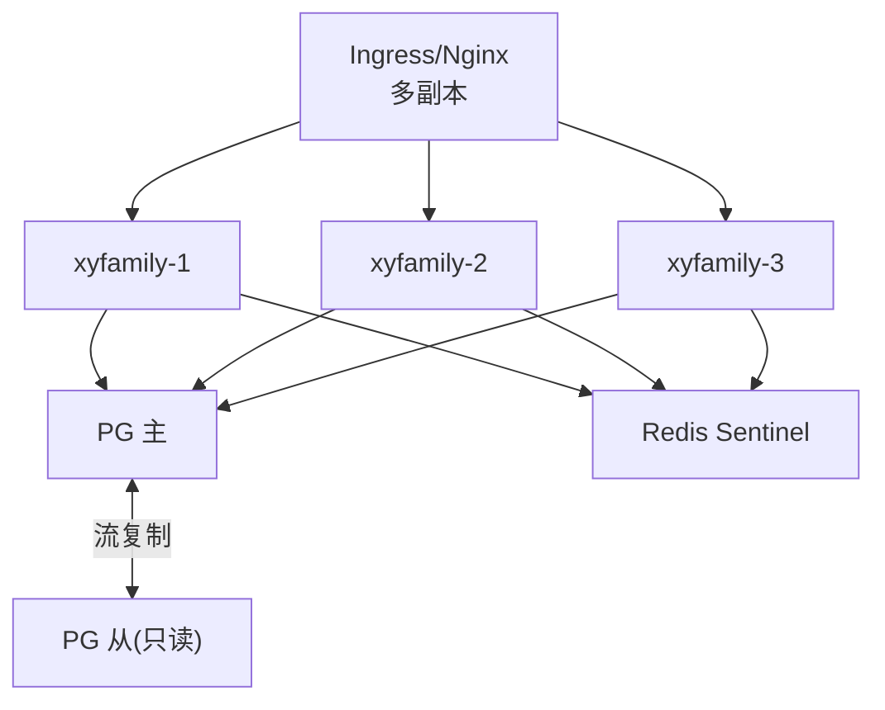

# 容灾多活与高可用

> P6 横切专项之二。定义系统高可用与容灾备份体系，覆盖 NFR-AVAIL-001~004（SLA 99.9%、无单点、优雅降级、限流熔断）与 NFR-BACKUP-001~003（备份、RTO<4h、RPO<15min、异地容灾）。承接 [整体架构设计](../01-基座/01-整体架构设计.md)。

---

## 文档信息

| 项目 | 内容 |
|------|------|
| 文档密级 | 内部 |
| 文档版本 | V1.0.0 |
| 编写人 | ClaudeCode |
| 审核人 | - |
| 生效时间 | 2026-07-15 |
| 关联标签 | 技术方案、高可用、容灾、备份 |
| 关联目录 | 03-架构与方案设计/06-横切专项 |

## 变更记录

| 版本 | 日期 | 变更内容 | 变更人 |
|------|------|----------|--------|
| V1.0.0 | 2026-07-15 | 基于非功能需求定义高可用与容灾方案 | ClaudeCode |
| V1.1.0 | 2026-07-16 | ARCH-015 修复：补充 Redis AOF 策略与 Sentinel 切换期间 Stream 消息可靠性评估 | CatPaw |

---

## 一、高可用架构（NFR-AVAIL-002 无单点）

- **应用无状态**：多实例 + 负载均衡，实例故障自动摘除（NFR-SCAL-001、NFR-AVAIL-002）。
- **PG 高可用**：主从流复制；主故障 Sentinel/Patroni 自动切换。
- **Redis 高可用**：Sentinel 保证，缓存层不阻塞核心。

---

## 二、数据库扩展与读写分离（NFR-SCAL-002）

- 主库写入，从库读（读写分离预留）；读多写少查询（组织信息、权限）走从库。
- 隔离查询强制带 `org_id`，索引前缀保证性能（NFR-PERF-001）。
- 分库分表预留：租户规模增长时可按 `org_id` 范围分片（NFR-SCAL-005）。

---

## 三、备份与恢复（NFR-BACKUP）

| 策略 | 实现 |
|------|------|
| 全量备份 | 每日 PG `pg_basebackup` + `pg_dump` 逻辑备份 |
| 增量备份 | WAL 连续归档（PITR） |
| 保留期 | ≥ 30 天（NFR-BACKUP-001） |
| RTO / RPO | RTO < 4h，RPO < 15min（NFR-BACKUP-002） |
| 异地容灾 | 备份异步复制到异地存储；重大故障切换恢复（NFR-BACKUP-003） |
| Redis | AOF（`appendfsync everysec`）+ RDB 持久化；Stream 消费位点保障审计不丢 |

### 三-A、Redis Stream 持久化与 Sentinel 切换可靠性评估（ARCH-015 修复）

> **背景**：审计日志依赖 Redis Stream 异步投递（ADR-011）。Sentinel 模式下主节点故障切换时，未持久化的 Stream 消息可能丢失。

#### AOF 策略

| 策略 | 说明 | 选用 |
|------|------|:--:|
| `appendfsync always` | 每次写入都 fsync，最安全但性能极差 | ✗ |
| `appendfsync everysec` | 每秒 fsync 一次，最多丢1s 数据，性能与安全平衡 | ✅ |
| `appendfsync no` | 依赖 OS 调度，可能丢数十秒数据 | ✗ |

**选用 `everysec`**：兼顾性能与安全，审计消息最多丢失 1 秒窗口的数据。

#### Sentinel 切换期间消息丢失评估

| 阶段 | 影响 | 消息丢失窗口 |
|------|------|-------------|
| 主节点故障前最后1s | AOF 未 fsync 的数据可能丢失 | ≤ 1s |
| Sentinel 选举+切换 | 新主就绪前写入失败，客户端重试 | 0（客户端重试） |
| 新主就绪后 | 恢复正常，消费者从新主读取 | 0 |

**最坏丢失窗口**：≤ 1 秒的审计事件（`appendfsync everysec` 策略下）。

#### 补偿与监控

1. **客户端重试**：生产者 `XADD` 失败时本地缓存 + 重试（最多 3 次，间隔指数退避）。
2. **Consumer 保障**：Consumer 在 PG 落库成功后才 `XACK`（结合 ARCH-003 的 `event_id` 幂等去重），即使消息重复消费也不会产生重复记录。
3. **监控告警**：
   - Stream 积压（`XPENDING` 长度持续增长）→ 告警（已在审计方案 §六 定义）
   - Redis Sentinel 切换事件 → 告警，运维确认审计消息完整性
   - 每日对账：审计日志写入量 vs 业务操作量差异检测
4. **可接受性结论**：审计日志为异步非阻断链路，1s 丢失窗口在业务可接受范围内。关键操作（注销、角色变更）的审计同时写 PG（同步），不依赖 Stream。

---

## 四、优雅降级与熔断（NFR-AVAIL-003/004）

| 依赖 | 降级行为 |
|------|----------|
| 通知（短信/邮件） | 故障时不阻断认证/管理核心（NFR-AVAIL-003） |
| 审计 Stream | 消费滞后时主流程仍返回，积压告警（[审计日志方案](../04-链路实现/03-审计日志方案.md)） |
| 权限缓存 | Redis 不可用回退 DB 查询（[缓存设计方案](../05-支撑域/02-缓存设计方案.md)） |

- **限流熔断**：异常流量限流（登录/刷新频控），故障依赖熔断保护（NFR-AVAIL-004）。

---

## 五、多租户规模（NFR-SCAL-005）

- 实例水平扩容支撑并发在线 ≥10000（NFR-PERF-004）。
- 租户数 / 用户数持续增长时，容量通过加节点 + 分片线性扩容。

---

## 六、关联文档

- [整体架构设计](../01-基座/01-整体架构设计.md)（部署架构 §七）
- [缓存设计方案](../05-支撑域/02-缓存设计方案.md)
- [审计日志方案](../04-链路实现/03-审计日志方案.md)
- 非功能需求 PRD：../../02-需求与产品设计/01-产品PRD/01-多租户底座/10-非功能需求/非功能需求

## 关联文档

> 以下为知识图谱自动推荐的交叉引用，建议人工审阅确认后保留。

- [租户域](../03-数据模型与契约/01-数据库设计/02-租户域.md) — 共享术语：多租户、数据库（置信度 0.75）
