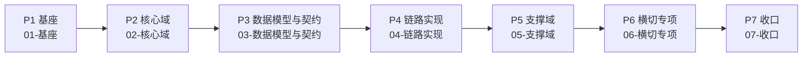

# 架构与方案设计

> XYFamily 多租户账号权限底座「03-架构与方案设计」总入口。本文档合并原 README（导航）与总览（阅读指南），定义文档地图、阶段划分、依赖关系、PRD 追溯与关键设计约束基线，为后续逐阶段方案设计提供统一锚点。

---

## 文档信息

| 项目 | 内容 |
|------|------|
| 文档密级 | 内部 |
| 文档版本 | V1.0.0 |
| 编写人 | ClaudeCode |
| 审核人 | - |
| 生效时间 | 2026-07-15 |
| 废弃时间 | - |
| 关联标签 | 技术方案、系统基础、文档入口 |
| 关联目录 | 03-架构与方案设计 |

---

## 一、文档定位与阅读指引

- **定位**：本仓库技术架构的总纲与入口，定义"有哪些设计文档、按什么顺序读、彼此如何依赖"，并锁定贯穿全局的关键设计约束。
- **与 PRD 的关系**：PRD（多租户底座）描述"要做什么（What）"，本文与后续 03 各文档描述"怎么做（How）"。PRD 来源：[产品PRD](../02-需求与产品设计/01-产品PRD/产品PRD.md)。
- **设计原则**：先基座后核心、先设计后契约、先链路后横切、最后收口核对。每个阶段内部文档有序号，天然体现依赖链。
- **旧目录说明**：原 `03-技术架构与方案设计/`（扁平文件、README 指向失效编号路径）保留为历史快照，**不再更新**；新内容全部落在本文档所在目录。

---

## 二、阶段总览与文档地图

| 阶段 | 文件夹 | 文档 | 状态 | 说明 |
|------|--------|------|------|------|
| P1 基座 | [XYFamily Wiki - 知识库](../README.md) | [整体架构设计](./01-基座/01-整体架构设计.md)、[ADR架构决策记录](./01-基座/02-ADR架构决策记录.md) | ✅ 已编写 | 技术栈、分层、模块、部署、请求链路、约束基线；ADR 机制 + 15 条决策 |
| P2 核心域 | [核心域](02-核心域/核心域.md) | 01-多租户隔离方案、02-RBAC权限引擎方案、03-JWT鉴权链与Token方案 | ✅ 已编写 | 决定领域模型与关键约束（隔离/RBAC/JWT） |
| P3 数据模型与契约 | [数据模型与契约](03-数据模型与契约/数据模型与契约.md) | [数据库设计](03-数据模型与契约/01-数据库设计/数据库设计.md)（按域 5 份）、[接口设计](03-数据模型与契约/02-接口设计/接口设计.md)（按模块 8 份） | ✅ 已编写 | 强依赖 P2 领域模型 |
| P4 链路实现 | [链路实现](04-链路实现/链路实现.md) | 01-中间件链专项方案、02-业务流程时序图集、03-审计日志方案 | ✅ 已编写 | 把 P2 抽象 + P3 契约落地为流程 |
| P5 支撑域 | [支撑域](05-支撑域/支撑域.md) | 01-账号生命周期与身份方案、02-缓存设计方案、03-第三方集成统一方案 | ✅ 已编写 | 彼此解耦，可并行 |
| P6 横切专项 | [横切专项](06-横切专项/横切专项.md) | 01-安全专项方案、02-容灾多活与高可用、03-可观测性方案 | ✅ 已编写 | 需对全貌有把控，放靠后 |
| P7 收口 | [收口](07-收口/收口.md) | 01-非功能需求落地映射、02-ADR汇总定稿 | ✅ 已编写 | 验收清单 + 决策归档 |

---

## 三、阶段依赖关系

**关键依赖说明**
- 核心域（P2）先定：租户隔离策略决定 `org_id` 如何贯穿所有表；RBAC 决定角色/权限表结构；JWT 决定 `sessions`/`token_blacklist` 形态。
- 数据模型（P3）必须在 P2 之后：数据库设计直接来自核心域的领域模型，接口设计又依赖数据库结构与 P2 的鉴权链约定。
- 链路实现（P4）是"设计落地"枢纽：中间件链实现 P2 抽象 + P3 契约，时序图把前序方案串成端到端视图。
- 支撑域（P5）彼此解耦可并行；横切专项（P6）需对全貌有把控放靠后；收口（P7）做全局核对。
- ADR 边决策边记，在 P1/P2 每做关键决策即落一条，最后于 P7 汇总定稿。

---

## 四、PRD 模块追溯

| 架构阶段 | 对应 PRD |
|---------|---------|
| P2 核心域 / P3 数据契约 | `01-多租户底座` 全部 9 模块（认证/账号/组织/团队/小组/权限/超管/审计/非功能） |
| P4 链路实现 | 业务流程图集、审计模块 |
| P6 横切 | `10-非功能需求` 全章 |
| P7 收口 | `10-非功能需求` 逐条映射 |

---

## 五、关键设计约束基线

以下约束贯穿全部 03 文档，决策依据见 [ADR架构决策记录](./01-基座/02-ADR架构决策记录.md)。

| 编号 | 约束 | 来源 |
|------|------|------|
| C1 | 单角色 RBAC：每个 `*_members` 含 `role` 字段，单容器内一账号一角色 | ADR-002 |
| C2 | 应用层多租户隔离（非 PG RLS），查询强制带 `org_id` | ADR-004、NFR-SEC-006 |
| C3 | Access 无状态 JWT + Refresh 有状态 `sessions` + Redis 黑名单 | ADR-003 |
| C4 | 三级租户 Organization→Team→Group，组织间完全隔离，跨组织仅 SuperAdmin | PRD、NFR-SEC-006 |
| C5 | 软删除 + 账号 30 天宽限期匿名化；绝不硬删除 `accounts` 与 `*_members` | ADR-006、ADR-010、NFR-SEC-007 |
| C6 | 安全常量：bcrypt cost 12、验证码 6 位/5min、登录限流 5/15min、Token 30min/7d、HS256→RS256 | NFR-SEC 全章 |
| C7 | 统一错误码体系：HTTP Status（401/403/404/429/500）+ 5 位业务 Code（10xxx~80xxx） | ADR-013 |
| C8 | 第三方登录（微信 OAuth2.0）与第三方绑定延后至 P2 | ADR-015 |
| C9 | 权限点矩阵 45 个 + Public（L0）角色，6 层继承 L5→L1 | ADR-008、FR-PERM-001~004 |

---

## 六、关联文档

- [整体架构设计](./01-基座/01-整体架构设计.md) — P1 基座，技术栈/分层/部署/链路
- [ADR架构决策记录](./01-基座/02-ADR架构决策记录.md) — 关键架构决策与依据
- [核心域](02-核心域/核心域.md) — 多租户隔离 / RBAC / JWT（P2）
- [数据模型与契约](03-数据模型与契约/数据模型与契约.md) — 数据库设计 / 接口设计（P3）
- [链路实现](04-链路实现/链路实现.md) — 中间件链 / 时序图集 / 审计日志（P4）
- [支撑域](05-支撑域/支撑域.md) — 账号生命周期 / 缓存 / 第三方集成（P5）
- [横切专项](06-横切专项/横切专项.md) — 安全 / 容灾高可用 / 可观测性（P6）
- [收口](07-收口/收口.md) — NFR 落地映射 / ADR 汇总（P7）
- [产品PRD](../02-需求与产品设计/01-产品PRD/产品PRD.md) — 需求来源（What）
