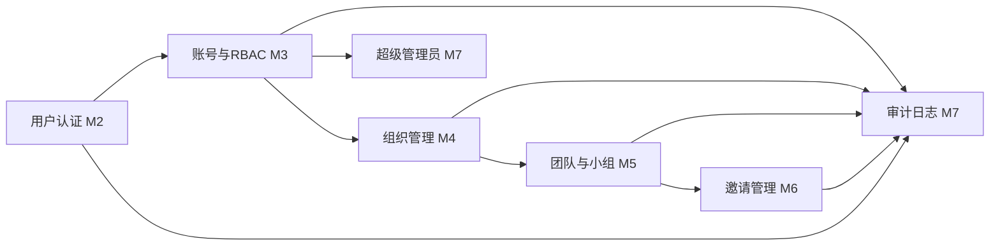
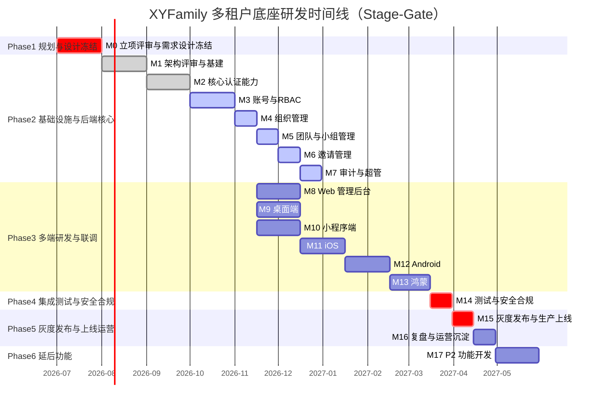

# 多租户底座

> Stage 1 是 XYFamily 项目的详细设计主体，目标是交付一套稳定、可扩展的多租户账号权限底座，为后续业务工具（插件）与生态扩展提供统一的身份认证、权限管理与数据隔离能力。本 Stage 共 6 个 Phase、18 个里程碑（M0–M17），并在关键节点设置 G0–G4 五道评审门禁。

---

## 文档信息

| 项目 | 内容 |
|------|------|
| 文档密级 | 内部 |
| 文档版本 | V1.0.0 |
| 编写人 | CodeBuddy |
| 审核人 | - |
| 生效时间 | 2026-07-18 |
| 废弃时间 | - |
| 关联标签 | Stage1、多租户底座、里程碑 |
| 关联目录 | 03-里程碑/01-多租户底座 |

## 变更记录

| 版本 | 日期 | 变更内容 | 变更人 |
|------|------|----------|--------|
| V1.0.0 | 2026-07-19 | 文档新编 | CatPaw |

---

## 1. Stage 定位与目标

- **业务目标**：构建统一身份管理、多租户隔离（组织→团队→小组三级）、精细化权限控制（9 角色 + 45 权限点）、可扩展架构。
- **技术目标**：满足非功能需求（API 95% < 100ms、登录 95% < 200ms、吞吐 ≥ 1000 req/s、bcrypt cost12、JWT、审计保留 1 年）。
- **交付目标**：后端 + Web 端 + 桌面端 + 小程序端 + 移动端（iOS / Android / 鸿蒙）四端原型对齐交付。

## 2. Phase 分组与里程碑总表

| 里程碑 | 名称 | 所属 Phase | 关联门禁 | 交付端 | 优先级 | 状态 |
|--------|------|-----------|----------|--------|--------|------|
| M0 | 立项评审与需求设计冻结 | Phase 1 规划与设计冻结 | G0 | 全端 | P0 | 待开始|
| M1 | 技术架构评审与基础设施搭建 | Phase 2 基础设施与后端核心 | G1 | 后端 | P0 | 待开始 |
| M2 | 核心认证能力 | Phase 2 基础设施与后端核心 | - | 后端 | P0 | 待开始 |
| M3 | 账号管理与 RBAC 权限引擎 | Phase 2 基础设施与后端核心 | - | 后端 | P0 | 待开始|
| M4 | 组织管理 | Phase 2 基础设施与后端核心 | - | 后端 | P0 | 待开始|
| M5 | 团队与小组管理 | Phase 2 基础设施与后端核心 | - | 后端 | P0 | 待开始|
| M6 | 邀请管理 | Phase 2 基础设施与后端核心 | - | 后端 | P0 | 待开始 |
| M7 | 审计日志与超级管理员 | Phase 2 基础设施与后端核心 | G2 | 后端 | P1 | 待开始 |
| M8 | Web 管理后台 | Phase 3 多端研发与联调 | - | Web 端 | P0 | 待开始 |
| M9 | 桌面端 | Phase 3 多端研发与联调 | - | 桌面端 | P1 | 待开始 |
| M10 | 小程序端 | Phase 3 多端研发与联调 | - | 小程序端 | P1 | 待开始 |
| M11 | iOS 原生 App | Phase 3 多端研发与联调 | - | 移动端(iOS) | P1 | 待开始 |
| M12 | Android 原生 App | Phase 3 多端研发与联调 | - | 移动端(安卓) | P1 | 待开始 |
| M13 | 鸿蒙 HarmonyOS | Phase 3 多端研发与联调 | - | 移动端(鸿蒙) | P2 | 待开始 |
| M14 | 集成测试与安全合规审查 | Phase 4 集成测试与安全合规 | G3 | 全端 | P0 | 待开始 |
| M15 | 灰度发布与生产上线 | Phase 5 灰度发布与上线运营 | G4 | 全端 | P0 | 待开始 |
| M16 | 迭代复盘与运营沉淀 | Phase 5 灰度发布与上线运营 | - | 全端 | P1 | 待开始 |
| M17 | P2 功能开发（延后功能） | Phase 6 延后功能与持续迭代 | - | 全端 | P2 | 待开始|

## 3. 模块依赖关系

> 认证 → 权限引擎 → 三级租户 → 审计/超管 构成后端核心的依赖主链；前端多端（M8–M13）均依赖后端核心（G2 通过）后并行启动。

## 4. 门禁状态

| 门禁 | 名称 | 状态 | 说明 |
|------|------|------|------|
| G0 | 立项评审 | 待开始 | 待 M0 立项评审与 PRD 评审 |
| G1 | 技术方案评审 | 待开始 | 待 M1 技术架构评审与基建 |
| G2 | 后端转测门禁 | 待开始 | 待 M7 完成后组织转测评审 |
| G3 | 测试 / 安全合规评审 | 待开始 | 待 M14 |
| G4 | 发布评审 RRR | 待开始 | 待 M15 |

## 5. 数据统计

| 指标 | 数值 |
|------|------|
| 功能模块 | 9 大模块 + 非功能需求 |
| 功能需求 | 约 65 条（P0 / P1 首期，P2 延后） |
| 角色 / 权限 | 9 角色 + 45 权限点 |
| 租户层级 | 组织 → 团队 → 小组 |
| 里程碑总数 | 18（M0–M17） |
| 评审门禁 | 5（G0–G4） |

## 6. 研发时间线（甘特图）

> 以下为 Stage 1 参考排期，以月（M）与半月（15d）为粒度；实际以 Sprint 节奏滚动调整。

---

## 7. 风险摘要

详见顶层 [里程碑](../里程碑.md#7-风险登记册-risk-register) 与各里程碑「风险评估」章节。重点关注：跨组织数据隔离（RISK-003）、JWT 密钥管理（RISK-001）、多端联调接口一致性（RISK-007）。

---

## 8. 关联文档

- 顶层里程碑：[里程碑](../里程碑.md)
- 多租户底座 PRD：[多租户底座](../../04-需求与产品设计/01-产品PRD/01-多租户底座/多租户底座.md)
- 原型与 UI 设计：[原型与UI设计](../../04-需求与产品设计/02-原型与UI设计/原型与UI设计.md)
- Phase 1：[Phase1-规划与设计冻结](./01-Phase1-规划与设计冻结/Phase1-规划与设计冻结.md)
- Phase 2：[Phase2-基础设施与后端核心](./02-Phase2-基础设施与后端核心/Phase2-基础设施与后端核心.md)
- Phase 3：[Phase3-多端研发与联调](./03-Phase3-多端研发与联调/Phase3-多端研发与联调.md)
- Phase 4：[Phase4-集成测试与安全合规](./04-Phase4-集成测试与安全合规/Phase4-集成测试与安全合规.md)
- Phase 5：[Phase5-灰度发布与上线运营](./05-Phase5-灰度发布与上线运营/Phase5-灰度发布与上线运营.md)
- Phase 6：[Phase6-延后功能与持续迭代](./06-Phase6-延后功能与持续迭代/Phase6-延后功能与持续迭代.md)
