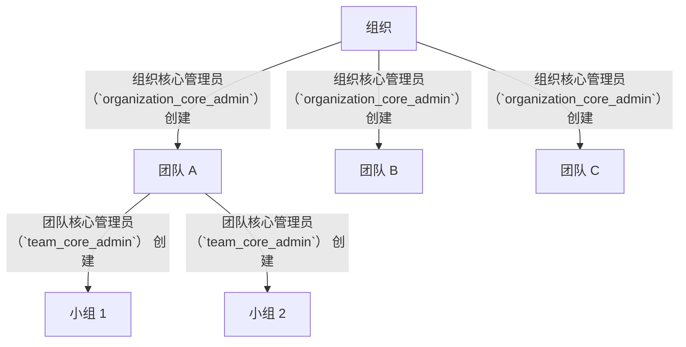

# 团队创建

> 组织管理员在组织下创建团队。本文件为 V1.0.0 第一版，明确接棒机制、组织-团队关系与最后管理员保护等产品需求与业务规则。

---

## 文档信息

| 项目 | 内容 |
|------|------|
| 文档密级 | 内部 |
| 文档版本 | V1.0.0 |
| 编写人 | CatPaw |
| 审核人 | - |
| 生效时间 | 2026-07-14 |
| 废弃时间 | - |
| 关联标签 | 需求PRD、组织模块、团队模块 |
| 关联目录 | 04-需求与产品设计/01-产品PRD/01-多租户底座/03-组织管理模块/04-团队创建 |

## 变更记录

| 版本 | 日期 | 变更内容 | 变更人 |
|------|------|----------|--------|
| V1.0.0 | 2026-07-19 | 文档新编 | CatPaw |

---

## 一、功能需求

### FR-ORG-009：创建团队

| 项目 | 内容 |
|------|------|
| **优先级** | P0 |
| **描述** | 组织管理员在组织下创建团队；创建者或指定的人成为团队管理员 |
| **验收标准** | 创建成功后返回团队信息，团队管理员身份即时生效 |

#### 功能目标
在组织内建立中层协作单元（团队），作为小组与成员的容器，承载组织内的协作分区。

#### 用户故事
> 作为组织管理员，我希望在组织下创建一个团队并指定其管理者，以便按业务线划分协作空间。

#### 前置条件
- 操作者已认证，角色为 组织核心管理员（`organization_core_admin`）（或 SuperAdmin）。
- 目标组织存在且未逻辑删除。

#### 触发场景
- 管理员在组织内点击「创建团队」，填写名称并可选指定初始团队管理员。

#### 详细业务流程
1. 组织管理员提交创建团队请求，填写团队名称，并可选择性填写描述与初始团队管理员指定。
2. 系统校验操作者权限为组织管理员或超级管理员；否则拒绝。
3. 系统校验团队名称：必填、长度 2–64 字符、同组织内唯一。
4. 若未指定初始管理员：创建者自动成为团队管理员。
5. 若指定初始管理员：
   - 已注册用户 → 创建待确认邀请（统一邀请流），对方确认后成为团队管理员。
   - 未注册用户 → 创建待确认邀请并生成一次性邀请链接，注册确认后生效。
   - 若以账号标识指定，该校验目标必须已属于本组织；否则提示须先邀请其加入组织。
6. 系统创建团队记录，团队管理员身份即时生效。
7. 记录创建团队的审计日志。
8. 返回团队信息。

> 注：团队的完整管理能力（成员管理、小组管理、团队信息维护）由「团队管理模块」承载；本文件仅定义组织侧的「创建团队」入口与接棒机制。

#### 字段业务约束

| 字段 | 必填 | 业务约束 |
|------|------|----------|
| 组织标识（org_id） | 是 | 目标组织的唯一标识 |
| 团队名称（name） | 是 | 长度 2–64 字符；同组织内唯一；允许中英文、数字、空格及 `-_&()·` |
| 描述（description） | 否 | 长度 0–500 字符 |
| 初始管理员（initial_admin） | 否 | 存在时需指定其标识与角色 |
| 初始管理员标识 | 条件必填 | 当指定初始管理员时必填；取值为手机号、邮箱或账号标识 |
| 初始管理员角色 | 否 | 取值为团队管理员，默认团队管理员 |

---

## 二、组织与团队的关系

| 关系规则 | 说明 |
|----------|------|
| 一个组织可有多个团队 | 无上限（建议合理控制） |
| 团队必须归属于一个组织 | 不存在无组织的团队 |
| 团队管理员由创建时指定 | 默认为创建者（接棒机制可指定他人） |
| 组织管理员可管理所有团队 | 组织管理员继承团队管理权限 |
| 数据隔离 | 团队数据随组织隔离，跨组织不可见 |

---

## 三、最后管理员保护（团队层级）

团队层级同样遵循最后管理员保护：**团队中最后一个团队管理员不可被降级、移除或注销**，必须先通过邀请流程指定新的团队管理员。超级管理员可强制降级例外（详见超级管理员模块）。

---

## 四、边界与异常处理

| 场景 | 处理方式 |
|------|----------|
| 非组织管理员创建 | 拒绝创建 |
| 团队名称重复（同组织内） | 提示名称已存在 |
| 指定的管理员不在组织中 | 提示须先邀请其加入组织 |
| 组织不存在 / 已删除 | 视为不存在 |
| 名称长度 / 格式不合规 | 提示长度需在 2–64 字符 |
| 并发创建同名团队 | 以首次成功为准，后续返回冲突 |

---

## 五、关联文档

- [组织管理模块](./组织管理模块.md)
- [团队管理模块](../04-团队管理模块/团队管理模块.md)

## 关联文档

> 以下为知识图谱自动推荐的交叉引用，建议人工审阅确认后保留。

- [权限管理模块](../06-权限管理模块/权限管理模块.md) — 共享术语：团队、多租户（置信度 0.75）
