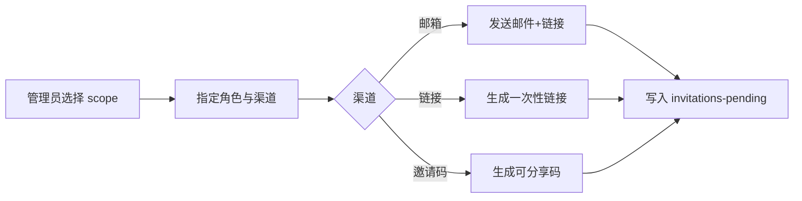

# 创建与发送邀请

> 邀请链路的发起端：管理员针对自身 scope 子树创建邀请，指定目标角色与发送渠道（邮箱 / 链接 / 邀请码），生成待接受的邀请记录。

## 文档信息

| 项目 | 内容 |
|------|------|
| 文档密级 | 内部 |
| 文档版本 | V1.0.0 |
| 编写人 | CodeBuddy |
| 审核人 | - |
| 生效时间 | 2026-07-19 |
| 关联标签 | 产品需求、邀请、成员管理 |
| 关联目录 | 04-需求与产品设计/01-产品PRD/01-多租户底座/08-邀请管理模块 |

## 变更记录

| 版本 | 日期 | 变更内容 | 变更人 |
|------|------|----------|--------|
| V1.0.0 | 2026-07-19 | 文档新编 | CodeBuddy |

---

## 一、功能需求

| ID | 需求描述 | 优先级 | 验收标准 |
|----|----------|--------|----------|
| FR-INV-001 | 创建邀请（组织/团队/小组） | P1 | 管理员可针对自身 scope 子树创建邀请 |
| FR-INV-002 | 多渠道发送（邮箱/链接/邀请码） | P1 | 三种渠道均可用；邀请码可复制分享 |
| FR-INV-008 | 邀请指定目标角色 | P1 | 邀请携带角色，接受时落地 |

## 二、业务流程

## 三、关键产品约束
- PC-INV-001：邀请必须指定 scope 与目标角色。
- PC-INV-003：单 scope 未接受邀请数量设上限，防刷。

## 四、关联文档
- 模块概述：[邀请管理模块](./邀请管理模块.md)
- 接口设计：[邀请接口](../../../../05-架构与方案设计/03-数据模型与契约/02-接口设计/08-邀请接口.md)
- 接受与加入：[接受与加入邀请](./02-接受与加入邀请.md)

## 五、附录
错误码 21001（不存在）、21005（越权）、21006（超限）。详见 [邀请管理模块](./邀请管理模块.md#81-错误码邀请域-21xxxx)。
