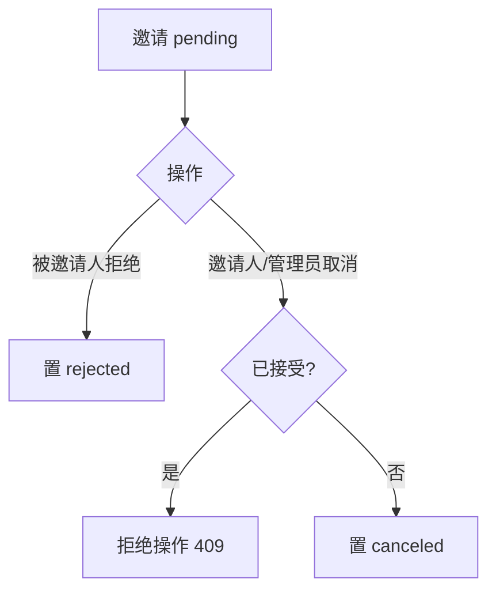

# 拒绝与取消邀请

> 邀请的负向生命周期：被邀请人可拒绝邀请；邀请人或管理员可取消未接受的邀请。两者均将邀请置为终态（rejected / canceled），不可再被接受。

## 文档信息

| 项目 | 内容 |
|------|------|
| 文档密级 | 内部 |
| 文档版本 | V1.0.0 |
| 编写人 | CodeBuddy |
| 审核人 | - |
| 生效时间 | 2026-07-19 |
| 关联标签 | 产品需求、邀请、成员管理 |
| 关联目录 | 04-需求与产品设计/01-产品PRD/01-多租户底座/08-邀请管理模块 |

## 变更记录

| 版本 | 日期 | 变更内容 | 变更人 |
|------|------|----------|--------|
| V1.0.0 | 2026-07-19 | 文档新编 | CodeBuddy |

---

## 一、功能需求

| ID | 需求描述 | 优先级 | 验收标准 |
|----|----------|--------|----------|
| FR-INV-004 | 拒绝邀请 | P2 | 被邀请人可拒绝，状态置为 rejected |
| FR-INV-005 | 取消邀请 | P1 | 邀请人/管理员可取消未接受的邀请，状态置为 canceled |
| FR-INV-008 | 取消仅对未接受邀请有效 | P1 | 已 accepted 的邀请不可取消 |

## 二、业务流程

## 三、关键产品约束
- PC-INV-005：同一 scope + 同一被邀请人仅允许一条 pending 邀请；拒绝/取消后释放该名额。

## 四、关联文档
- 模块概述：[邀请管理模块](./邀请管理模块.md)
- 接口设计：[邀请接口](../../../../06-架构与方案设计/03-数据模型与契约/02-接口设计/08-邀请接口.md)

## 五、附录
错误码 21003（已处理，不可重复操作）。详见 [邀请管理模块](./邀请管理模块.md#81-错误码邀请域-21xxxx)。
