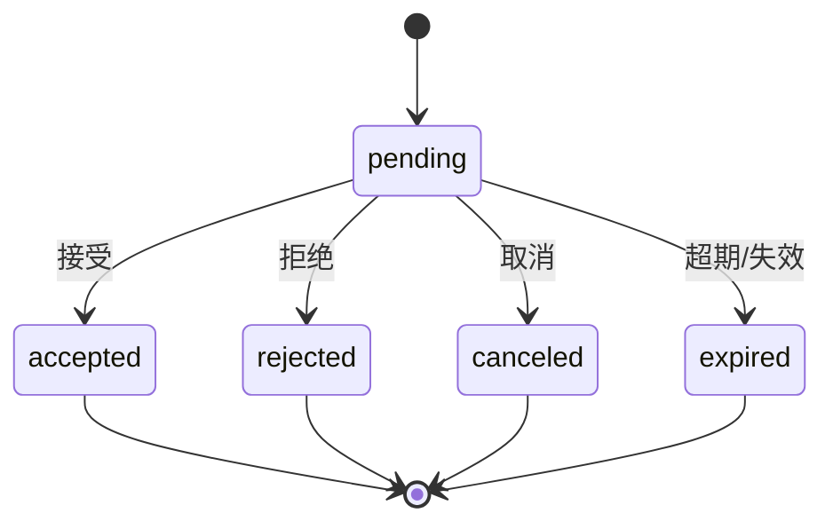

# 邀请查询与状态管理

> 邀请的可观测能力：管理员按 scope/状态/被邀请人查询邀请列表与详情；被邀请人查询"待我处理"的邀请；系统对超期未接受的邀请自动失效。

## 文档信息

| 项目 | 内容 |
|------|------|
| 文档密级 | 内部 |
| 文档版本 | V1.0.0 |
| 编写人 | CodeBuddy |
| 审核人 | - |
| 生效时间 | 2026-07-19 |
| 关联标签 | 产品需求、邀请、成员管理 |
| 关联目录 | 04-需求与产品设计/01-产品PRD/01-多租户底座/08-邀请管理模块 |

## 变更记录

| 版本 | 日期 | 变更内容 | 变更人 |
|------|------|----------|--------|
| V1.0.0 | 2026-07-19 | 文档新编 | CodeBuddy |

---

## 一、功能需求

| ID | 需求描述 | 优先级 | 验收标准 |
|----|----------|--------|----------|
| FR-INV-006 | 邀请查询（列表/待处理/详情） | P1 | 支持按 scope/状态/被邀请人查询 |
| FR-INV-007 | 邀请过期与失效 | P1 | 超期未接受自动失效；撤销/角色变更后失效 |

## 二、状态模型

## 三、关键产品约束
- PC-INV-002：邀请有效期默认 7 天，可配置 1–30 天；过期自动转 expired。
- PC-INV-005：同一 scope + 同一被邀请人仅允许一条 pending 邀请。

## 四、关联文档
- 模块概述：[邀请管理模块](./邀请管理模块.md)
- 接口设计：[邀请接口](../../../../05-架构与方案设计/03-数据模型与契约/02-接口设计/08-邀请接口.md)

## 五、附录
错误码 21002（已失效/过期）。详见 [邀请管理模块](./邀请管理模块.md#81-错误码邀请域-21xxxx)。
