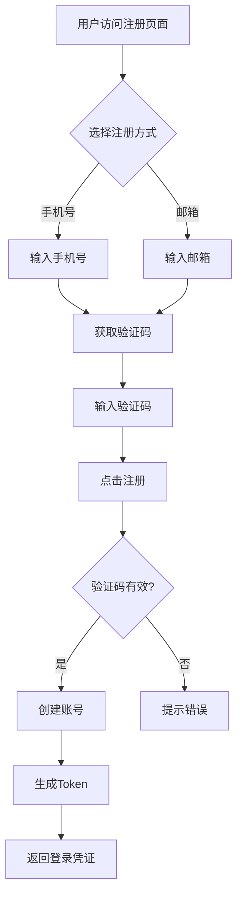
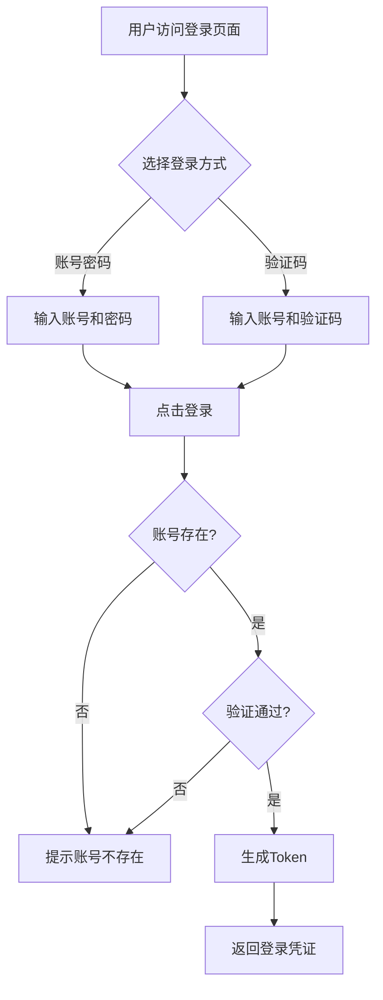
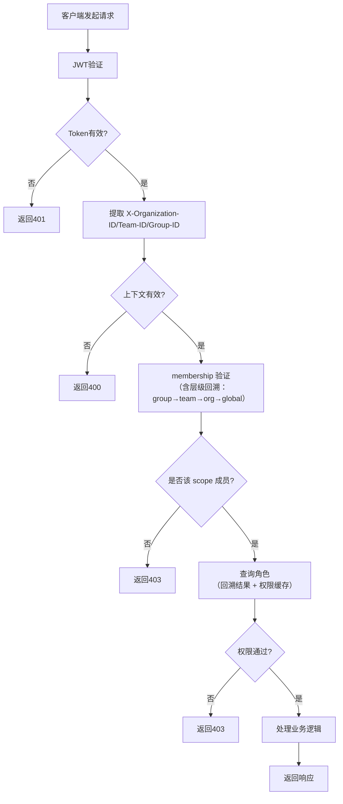
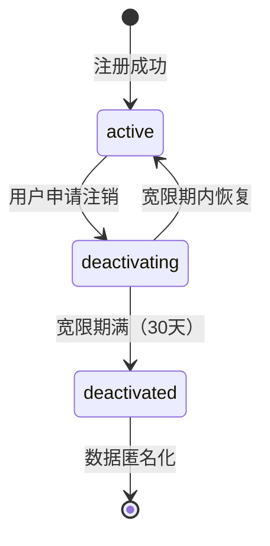
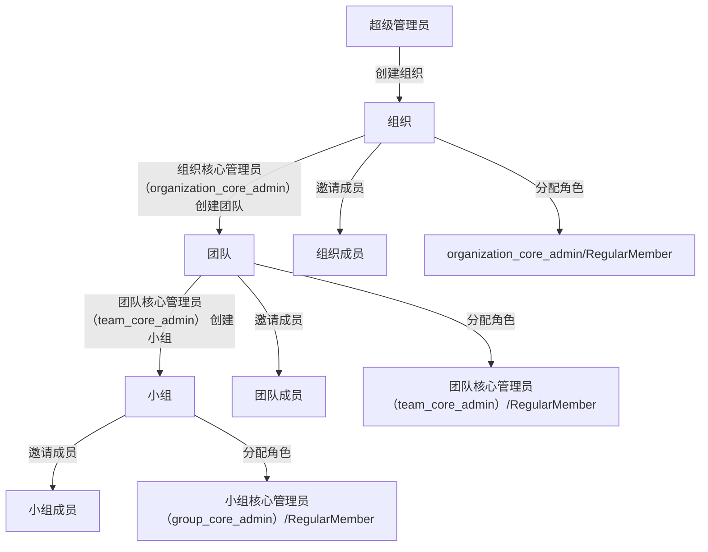

# 多租户底座

> XYFamily 多租户账号权限底座 - 产品需求文档

---

## 文档信息

| 项目 | 内容 |
|------|------|
| 文档密级 | 内部 |
| 文档版本 | V1.0.1 |
| 编写人 | - |
| 审核人 | - |
| 生效时间 | 2026-07-10 |
| 废弃时间 | - |
| 关联标签 | 需求PRD、权限模块、核心文档 |
| 关联目录 | 04-需求与产品设计/01-产品PRD/01-多租户底座 |

## 变更记录

| 版本 | 日期 | 变更内容 | 变更人 |
|------|------|----------|--------|
| V1.0.1 | 2026-07-19 | 文档新编 | - |

---

## 目录

1. [需求来源与背景](#1-需求来源与背景)
2. [详细用户故事](#2-详细用户故事)
3. [功能需求规格](#3-功能需求规格)
4. [非功能需求](#4-非功能需求)
5. [业务流程图](#5-业务流程图)
6. [约束条件与风险评估](#6-约束条件与风险评估)

---

## 1. 需求来源与背景

### 1.1 业务价值

XYFamily 是一个通用多功能工具集平台，当前阶段需要构建**多租户账号权限底座**，为后续业务工具的接入提供统一的身份认证、权限管理和数据隔离能力。

**核心业务价值：**
- **统一身份管理**：支持多种登录方式，跨组织身份复用
- **多租户隔离**：组织间完全数据隔离，满足企业级安全合规
- **精细化权限控制**：9 种预定义角色（含 Public 第 0 层）+ 45 个权限点矩阵
- **可扩展性架构**：分层设计，便于后续业务工具快速接入

### 1.2 战略意义

- **奠定平台基础**：账号权限底座决定平台安全性和可扩展性
- **加速业务落地**：统一认证鉴权框架减少重复开发
- **提升用户体验**：统一登录、跨组织协作能力

### 1.3 目标用户

| 用户角色 | 描述 |
|----------|------|
| 普通用户 | 使用平台业务工具的终端用户 |
| 小组管理员 | 管理小组内成员和权限 |
| 团队管理员 | 管理团队内小组和成员 |
| 组织管理员 | 管理整个组织的团队和成员 |
| 超级管理员 | 全局管理所有组织和系统配置 |

---

## 2. 详细用户故事

| ID | 角色 | 场景 | 目标 |
|----|------|------|------|
| US-001 | 新用户 | 首次使用平台 | 通过手机号/邮箱注册账号 |
| US-002 | 已有用户 | 日常登录 | 使用多种方式登录系统 |
| US-003 | 超级管理员 | 系统初始化 | 创建组织并指定核心管理员 |
| US-004 | 组织管理员 | 团队管理 | 创建团队、邀请成员、分配角色 |
| US-005 | 团队管理员 | 小组管理 | 创建小组、管理小组成员 |
| US-006 | 小组管理员 | 权限管理 | 管理小组成员角色和权限 |
| US-007 | 普通用户 | 个人管理 | 修改个人信息、绑定第三方账号、注销账号 |
| US-008 | 超级管理员 | 审计监控 | 查看登录日志和操作审计日志 |

---

## 3. 功能需求规格

### 3.1 用户认证模块

**模块总览：**

- [用户认证模块](./01-用户认证模块/用户认证模块.md)

**子模块：**

- [注册认证](./01-用户认证模块/01-注册认证.md)
- [登录认证](./01-用户认证模块/02-登录认证.md)
- [密码管理](./01-用户认证模块/03-密码管理.md)
- [Token管理](./01-用户认证模块/04-Token管理.md)

| ID | 需求描述 | 优先级 | 验收标准 |
|----|----------|--------|----------|
| FR-AUTH-001 | 手机号+验证码注册 | P0 | 验证通过后创建账号，返回登录凭证 |
| FR-AUTH-002 | 邮箱+验证码注册 | P0 | 验证通过后创建账号，返回登录凭证 |
| FR-AUTH-003 | 手机号+密码登录 | P0 | 验证通过后返回登录凭证 |
| FR-AUTH-004 | 手机号+验证码登录 | P0 | 验证通过后返回登录凭证 |
| FR-AUTH-005 | 邮箱+密码登录 | P0 | 验证通过后返回登录凭证 |
| FR-AUTH-006 | 邮箱+验证码登录 | P0 | 验证通过后返回登录凭证 |
| FR-AUTH-007 | 用户名+密码登录 | P0 | 验证通过后返回登录凭证 |
| FR-AUTH-008 | 用户ID+密码登录 | P0 | 验证通过后返回登录凭证 |
| FR-AUTH-009 | Token刷新 | P0 | 使用Refresh Token获取新Access Token |
| FR-AUTH-010 | 登出 | P0 | 清除会话并使Token失效 |
| FR-AUTH-011 | 密码重置 | P0 | 通过验证码重置密码 |
| FR-AUTH-012 | 微信登录 | P2 | 【延后】扫码登录，未绑定手机号/邮箱时需先绑定 |
| FR-AUTH-013 | 登录自动注册 | P2 | 【延后】账号不存在时自动注册 |

### 3.2 账号管理模块

**模块总览：**

- [账号管理模块](./02-账号管理模块/账号管理模块.md)

**子模块：**

- [个人信息管理](./02-账号管理模块/01-个人信息管理.md)
- [密码与安全](./02-账号管理模块/02-密码与安全.md)
- [账号生命周期](./02-账号管理模块/03-账号生命周期.md)
- [第三方身份绑定](./02-账号管理模块/04-第三方身份绑定.md)

| ID | 需求描述 | 优先级 | 验收标准 |
|----|----------|--------|----------|
| FR-ACCT-001 | 获取个人信息 | P0 | 返回账号信息（不含密码哈希） |
| FR-ACCT-002 | 更新个人信息 | P0 | 修改昵称、头像等信息 |
| FR-ACCT-003 | 修改密码 | P0 | 验证旧密码并更新新密码 |
| FR-ACCT-004 | 账号注销 | P0 | 进入30天宽限期，期间可恢复 |
| FR-ACCT-005 | 账号恢复 | P0 | 宽限期内取消注销 |
| FR-ACCT-006 | 绑定第三方身份 | P2 | 【延后】绑定微信等第三方账号 |
| FR-ACCT-007 | 解绑第三方身份 | P2 | 【延后】解绑已绑定的第三方账号 |

### 3.3 组织管理模块

**模块总览：**

- [组织管理模块](./03-组织管理模块/组织管理模块.md)

**子模块：**

- [组织信息管理](./03-组织管理模块/01-组织信息管理.md)
- [成员管理](./03-组织管理模块/02-成员管理.md)
- [角色与权限](./03-组织管理模块/03-角色与权限.md)
- [团队创建](./03-组织管理模块/04-团队创建.md)

| ID | 需求描述 | 优先级 | 验收标准 |
|----|----------|--------|----------|
| FR-ORG-001 | 创建组织 | P0 | 超级管理员创建组织 |
| FR-ORG-002 | 获取组织信息 | P0 | 组织成员可查看 |
| FR-ORG-003 | 更新组织信息 | P0 | 组织管理员可修改 |
| FR-ORG-004 | 邀请成员 | P0 | 通过手机号/邮箱邀请 |
| FR-ORG-005 | 移除成员 | P0 | 组织管理员可移除 |
| FR-ORG-006 | 获取成员列表 | P0 | 组织管理员可查看 |
| FR-ORG-007 | 分配角色 | P0 | 分配组织核心管理员（`organization_core_admin`）/RegularMember |
| FR-ORG-008 | 降级核心管理员 | P0 | 组织管理员或超级管理员可降级 |
| FR-ORG-009 | 创建团队 | P0 | 组织管理员可创建 |

### 3.4 团队管理模块

**模块总览：**

- [团队管理模块](./04-团队管理模块/团队管理模块.md)

**子模块：**

- [团队信息管理](./04-团队管理模块/01-团队信息管理.md)
- [成员管理](./04-团队管理模块/02-成员管理.md)
- [角色与权限](./04-团队管理模块/03-角色与权限.md)
- [小组创建](./04-团队管理模块/04-小组创建.md)

| ID | 需求描述 | 优先级 | 验收标准 |
|----|----------|--------|----------|
| FR-TEAM-001 | 获取团队信息 | P0 | 团队成员可查看 |
| FR-TEAM-002 | 更新团队信息 | P0 | 团队管理员可修改 |
| FR-TEAM-003 | 邀请成员 | P0 | 团队管理员可邀请 |
| FR-TEAM-004 | 移除成员 | P0 | 团队管理员可移除 |
| FR-TEAM-005 | 获取成员列表 | P0 | 团队管理员可查看 |
| FR-TEAM-006 | 分配角色 | P0 | 分配 团队核心管理员（`team_core_admin`）/RegularMember |
| FR-TEAM-007 | 降级核心管理员 | P0 | 团队管理员或组织管理员可降级 |
| FR-TEAM-008 | 创建小组 | P0 | 团队管理员可创建 |
| FR-TEAM-009 | 归档团队 | P1 | 软删除团队 |

### 3.5 小组管理模块

**模块总览：**

- [小组管理模块](./05-小组管理模块/小组管理模块.md)

**子模块：**

- [小组信息管理](./05-小组管理模块/01-小组信息管理.md)
- [成员管理](./05-小组管理模块/02-成员管理.md)
- [角色与权限](./05-小组管理模块/03-角色与权限.md)

| ID | 需求描述 | 优先级 | 验收标准 |
|----|----------|--------|----------|
| FR-GROUP-001 | 获取小组信息 | P0 | 小组成员可查看 |
| FR-GROUP-002 | 更新小组信息 | P0 | 小组管理员可修改 |
| FR-GROUP-003 | 删除小组 | P0 | 软删除小组 |
| FR-GROUP-004 | 邀请成员 | P0 | 小组管理员可邀请 |
| FR-GROUP-005 | 移除成员 | P0 | 小组管理员可移除 |
| FR-GROUP-006 | 获取成员列表 | P0 | 小组管理员可查看 |
| FR-GROUP-007 | 分配角色 | P0 | 分配小组核心管理员（`group_core_admin`）/RegularMember |
| FR-GROUP-008 | 降级核心管理员 | P0 | 小组管理员或团队管理员可降级 |

### 3.6 权限管理模块

**模块总览：**

- [权限管理模块](./06-权限管理模块/权限管理模块.md)

**子模块：**

- [角色与权限点初始化](./06-权限管理模块/01-角色与权限点初始化.md)
- [权限点校验](./06-权限管理模块/02-权限点校验.md)
- [数据范围控制](./06-权限管理模块/03-数据范围控制.md)
- [权限继承](./06-权限管理模块/04-权限继承.md)

| ID | 需求描述 | 优先级 | 验收标准 |
|----|----------|--------|----------|
| FR-PERM-001 | 预定义角色初始化 | P0 | 系统启动时初始化 9 种角色（含 Public 第 0 层）和 45 个权限点 |
| FR-PERM-002 | 权限点校验 | P0 | 请求时校验用户权限 |
| FR-PERM-003 | 数据范围控制 | P0 | 权限根据数据范围生效 |
| FR-PERM-004 | 权限继承 | P0 | 高层级角色继承低层角色权限 |

### 3.7 超级管理员模块

**模块总览：**

- [超级管理员模块](./07-超级管理员模块/超级管理员模块.md)

| ID | 需求描述 | 优先级 | 验收标准 |
|----|----------|--------|----------|
| FR-ADMIN-001 | 超级管理员初始化 | P0 | 系统首次启动时可创建首个 SuperAdmin |
| FR-ADMIN-002 | 超级管理员游离态与权限边界 | P0 | SuperAdmin 不隶属任何组织架构，权限直达全局 |
| FR-ADMIN-003/004 | 系统配置查看与修改 | P1 | 查看与修改系统配置，修改即时生效并记录审计 |
| FR-ADMIN-005 | 强制降级 | P1 | 强制降级任意层级管理员为 RegularMember |
| FR-ADMIN-006 | 全局审计日志查看 | P1 | 跨组织查看全部登录与操作审计日志 |
| FR-ADMIN-007 | 高危操作二次确认 | P1 | 强制降级、保留期缩短等高危操作前二次确认 |

### 3.8 邀请管理模块

**模块总览：**

- [邀请管理模块](./08-邀请管理模块/邀请管理模块.md)

| ID | 需求描述 | 优先级 | 验收标准 |
|----|----------|--------|----------|
| FR-INV-001 | 创建邀请（组织/团队/小组） | P1 | 管理员可针对自身 scope 子树创建邀请 |
| FR-INV-002 | 多渠道发送（邮箱/链接/邀请码） | P1 | 支持三种渠道；邀请码可复制 |
| FR-INV-003 | 接受邀请（注册或登录加入） | P1 | 成功后建立成员关系 |
| FR-INV-004 | 拒绝邀请 | P2 | 状态置为 rejected |
| FR-INV-005 | 取消邀请 | P1 | 取消未接受邀请，置 canceled |
| FR-INV-006 | 邀请查询（列表/待处理/详情） | P1 | 支持按条件查询 |
| FR-INV-007 | 邀请过期与失效 | P1 | 超期自动失效 |
| FR-INV-008 | 邀请指定目标角色 | P1 | 接受时落地角色 |

### 3.9 审计日志模块

**模块总览：**

- [审计日志模块](./09-审计日志模块/审计日志模块.md)

| ID | 需求描述 | 优先级 | 验收标准 |
|----|----------|--------|----------|
| FR-AUDIT-001 | 登录审计日志 | P1 | 记录登录尝试（成功/失败） |
| FR-AUDIT-002~005 | 操作审计日志（组织/团队/小组/账号域） | P1 | 记录关键操作，含前后快照 |
| FR-AUDIT-006 | 审计日志查询 | P1 | 支持按条件查询 |

---

## 4. 非功能需求

### 4.1 性能需求

| ID | 需求描述 | 指标 |
|----|----------|------|
| NFR-PERF-001 | API响应时间 | 95% < 100ms |
| NFR-PERF-002 | 登录请求响应时间 | 95% < 200ms |
| NFR-PERF-003 | 系统吞吐量 | ≥1000 req/s |
| NFR-PERF-004 | 数据库连接池 | 最大100，最小10 |

### 4.2 安全需求

| ID | 需求描述 | 指标 |
|----|----------|------|
| NFR-SEC-001 | 密码存储 | bcrypt，cost factor 12 |
| NFR-SEC-002 | 登录限流 | 同一IP 5分钟5次失败，锁定15分钟 |
| NFR-SEC-003 | 验证码安全 | 6位数字，有效期5分钟 |
| NFR-SEC-004 | Token安全 | Access Token 30min，Refresh Token 7天 |
| NFR-SEC-005 | Token签名 | HS256（可升级RS256） |
| NFR-SEC-006 | 数据隔离 | 组织间完全隔离 |
| NFR-SEC-007 | 审计日志保留 | 保留1年，账号注销后匿名化 |
| NFR-SEC-008 | HTTPS | 所有接口必须HTTPS |

### 4.3 兼容性需求

| ID | 需求描述 | 指标 |
|----|----------|------|
| NFR-COMP-001 | API版本 | /api/v1/ |
| NFR-COMP-002 | JSON格式 | 所有接口请求/响应JSON |
| NFR-COMP-003 | 跨域支持 | CORS |

### 4.4 可扩展性需求

| ID | 需求描述 | 指标 |
|----|----------|------|
| NFR-SCAL-001 | 水平扩展 | 支持无状态部署 |
| NFR-SCAL-002 | 数据库扩展性 | 预留读写分离 |
| NFR-SCAL-003 | 第三方认证扩展 | 预留OAuth2.0扩展点 |

---

## 5. 业务流程图

### 5.1 注册流程

**流程说明：**

| 步骤 | 说明 | 关联需求 |
|------|------|----------|
| 选择注册方式 | 手机号或邮箱 | FR-AUTH-001/002 |
| 获取验证码 | 发送 6 位数字验证码，有效期 5 分钟 | NFR-SEC-003 |
| 验证码校验 | 校验有效性和尝试次数 | FR-AUTH-001/002 |
| 创建账号 | 生成默认用户名和头像 | FR-AUTH-001/002 |
| 生成 Token | Access Token 30min + Refresh Token 7天 | NFR-SEC-004 |

### 5.2 登录流程

> **注**：微信登录（FR-AUTH-012）和登录自动注册（FR-AUTH-013）延后到 P2，首期登录流程仅含密码登录和验证码登录两条路径。

**流程说明：**

| 步骤 | 说明 | 关联需求 |
|------|------|----------|
| 选择登录方式 | 密码/验证码（【延后 P2】微信登录） | FR-AUTH-003~008 |
| 账号校验 | 检查账号是否存在 | FR-AUTH-003~008 |
| 验证 | 密码bcrypt比对/验证码校验 | NFR-SEC-001/003 |
| 登录限流 | IP 5分钟5次失败锁定15分钟 | NFR-SEC-002 |
| 生成 Token | Access Token + Refresh Token | NFR-SEC-004 |
| 审计日志 | 记录登录尝试 | FR-AUDIT-001 |

### 5.3 权限校验流程

**流程说明：**

| 步骤 | 说明 | 关联需求 |
|------|------|----------|
| JWT 验证 | 校验 Token 签名、有效期和黑名单（jti） | NFR-SEC-004/005 |
| 提取上下文 | 从 Header 获取 org_id/team_id/group_id | FR-PERM-003 |
| membership 验证 | 校验用户是否属于该 scope；若当前 scope 无 membership 则向上回溯（group→team→org→global） | FR-PERM-003 |
| 权限校验 | 查询角色对应的权限点列表（优先查权限缓存），校验所需权限点 | FR-PERM-002 |
| 数据范围控制 | 确保用户只能操作其范围内的数据 | FR-PERM-003 |

### 5.4 账号注销流程

**流程说明：**

| 状态 | 说明 | 关联需求 |
|------|------|----------|
| active | 正常状态 | - |
| deactivating | 注销宽限期（30天） | FR-ACCT-004 |
| 恢复 | 宽限期内可恢复 | FR-ACCT-005 |
| deactivated | 已注销，数据匿名化 | NFR-SEC-007 |

### 5.5 组织架构管理流程

**流程说明：**

| 步骤 | 说明 | 关联需求 |
|------|------|----------|
| 创建组织 | 仅 SuperAdmin | FR-ORG-001 |
| 创建团队 | 组织核心管理员（organization_core_admin） | FR-ORG-009 |
| 创建小组 | 团队核心管理员（team_core_admin） | FR-TEAM-008 |
| 邀请成员 | 各级管理员 | FR-ORG-004/FR-TEAM-003/FR-GROUP-004 |
| 分配角色 | 各级管理员 | FR-ORG-007/FR-TEAM-006/FR-GROUP-007 |

---

## 6. 约束条件与风险评估

### 6.1 约束条件

**业务约束：** 组织间数据完全隔离、仅预定义 9 种角色（含 Public 第 0 层）、账号注销 30 天宽限期、【延后】微信登录需绑定手机号/邮箱

**合规约束：** 审计日志保留 1 年、账号注销后匿名化处理

### 6.2 风险评估

| ID | 风险描述 | 概率 | 影响 | 应对措施 |
|----|----------|------|------|----------|
| RISK-001 | JWT密钥泄露 | 低 | 高 | 安全密钥管理，定期轮换 |
| RISK-002 | 暴力破解密码 | 中 | 高 | 登录限流、验证码 |
| RISK-003 | 跨组织数据泄露 | 低 | 高 | 强制上下文校验 |
| RISK-004 | Token过期体验差 | 中 | 中 | 自动刷新机制 |
| RISK-005 | 数据库性能瓶颈 | 中 | 中 | 合理索引，预留读写分离 |
| RISK-006 | 短信/邮箱发送失败 | 中 | 中 | 多服务商故障切换 |

## 关联文档

> 以下为知识图谱自动推荐的交叉引用，建议人工审阅确认后保留。

- [多租户底座](../../../08-接口文档/02-错误码/01-多租户底座.md) — 共享术语：团队、小组、权限、认证、账号（置信度 0.75）
