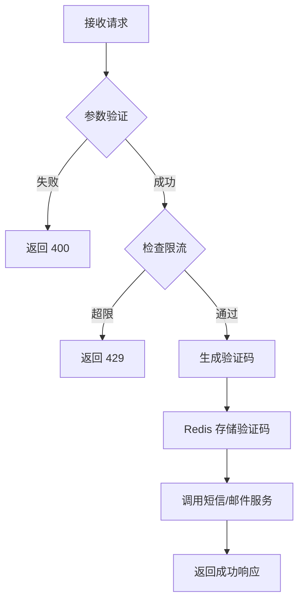
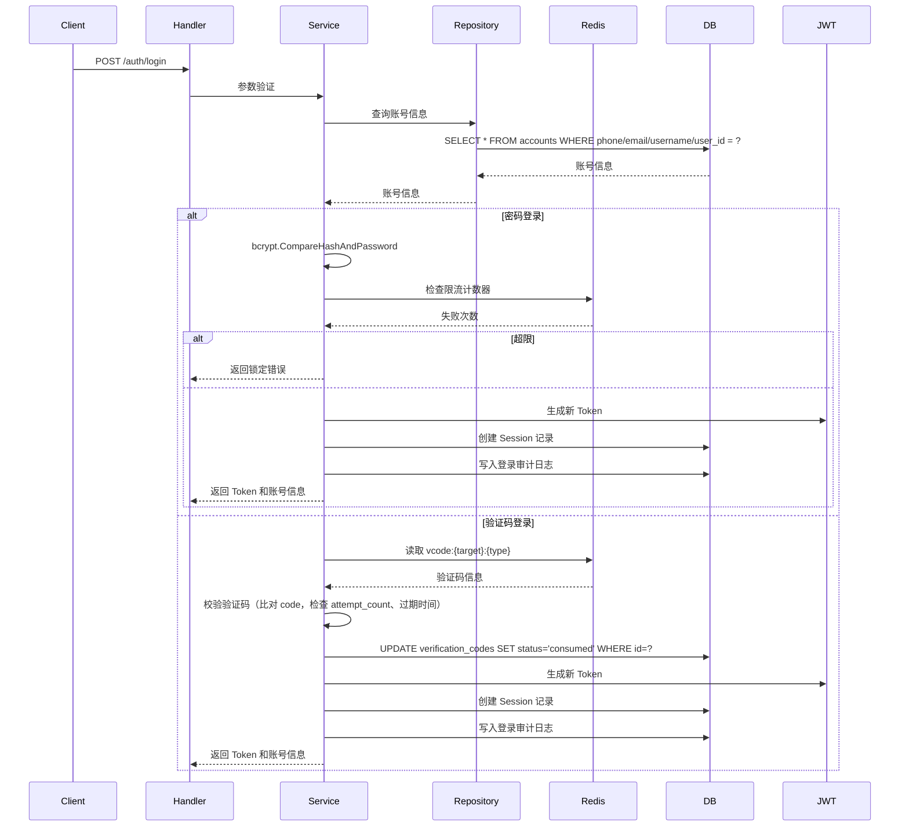
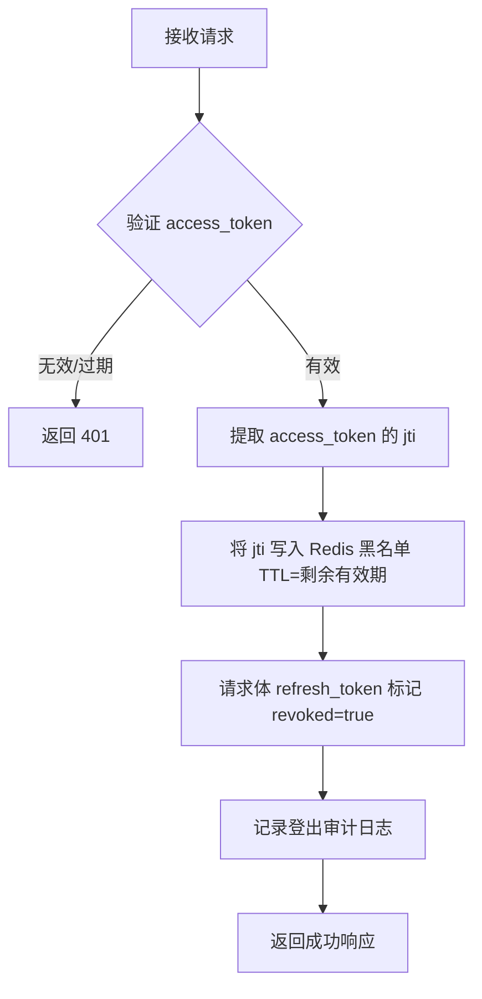
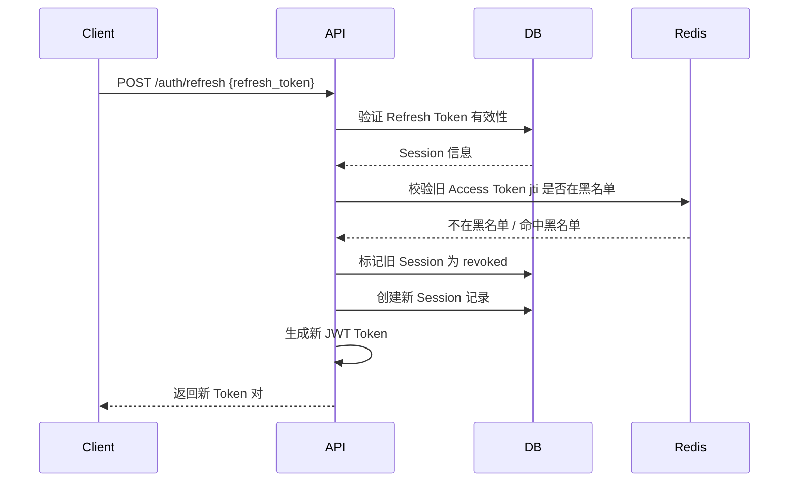

# 认证模块接口设计

> Auth 模块接口定义与详细设计（注册、登录、登出、Token 刷新、密码重置）。

---

## 文档信息

| 项目 | 内容 |
|------|------|
| 文档密级 | 内部 |
| 文档版本 | V1.0.0 |
| 编写人 | CatPaw |
| 审核人 | - |
| 生效时间 | 2026-07-13 |
| 废弃时间 | - |
| 关联标签 | 接口文档、模块设计、核心文档 |
| 关联目录 | 05-接口与模块落地文档/接口设计 |

## 变更记录

| 版本 | 日期 | 变更内容 | 变更人 |
|------|------|----------|--------|
| V1.0.0 | 2026-07-13 | 合并原接口总览认证部分 + 认证模块详细设计 + 用户认证流程数据流转 | CatPaw |

---

## 模块概述

Auth 模块负责用户身份认证相关的所有功能，是系统的安全入口。

**核心功能**：
- 用户注册（手机/邮箱）
- 用户登录（密码/验证码，6 种方式）
- Token 管理（Access/Refresh）
- 登出与安全控制
- 密码重置

**业务边界**：
```
Auth Module
├── 注册认证子域
│   ├── 验证码发送 (send-code)
│   ├── 用户注册 (register)
│   └── 注册验证
├── 登录认证子域
│   ├── 密码登录 (login)
│   ├── 验证码登录 (login)
│   └── 限流控制
├── Token 管理子域
│   ├── Access Token 刷新 (refresh)
│   ├── Token 黑名单 (logout)
│   └── Token 验证
└── 密码管理子域
    ├── 密码重置 (reset-password)
    └── 密码策略
```

**依赖关系**：
- **数据库表**：`accounts`, `verification_codes`, `sessions`
- **缓存**：Redis（验证码、Token 黑名单、限流计数器）
- **外部服务**：短信/邮件服务

---

## 1. 发送验证码

| 项目 | 内容 |
|------|------|
| 方法 | `POST` |
| 路径 | `/api/v1/auth/send-code` |
| 认证 | ❌ 公开 |
| 限流 | ✅ 单目标 1次/60s，同 IP 5次/5min |

### 请求体

```json
{
  "target": "13800138000",
  "type": "register"
}
```

| 参数 | 类型 | 必填 | 说明 |
|------|------|------|------|
| target | string | ✅ | 手机号（11 位数字）或邮箱（RFC 5322） |
| type | enum | ✅ | `register` / `login` / `reset_password` |

### 业务流程



**Redis 缓存策略**：
```
Key: vcode:{target}:{type}
Value: {"code": "123456", "attempt_count": 0, "created_at": "2026-07-13T10:00:00Z"}
TTL: 300s（5 分钟）
```

**限流数据**：
```
Key: rate_limit:vcode:ip:{ip}
Value: {"count": 3, "last_request": "2026-07-12T10:01:00Z"}
```

### 成功响应

```json
{
  "code": 0,
  "message": "success",
  "detail": null,
  "data": {
    "expires_in": 300
  },
  "pagination": null
}
```

### 错误响应

```json
{
  "code": 114290,
  "message": "发送频率超限",
  "detail": "单手机号发送频率超限，请稍后重试",
  "data": null,
  "pagination": null
}
```

### 错误码

| HTTP | 业务 Code | 说明 |
|------|----------|------|
| 400 | 100001 | 验证码类型不合法 |
| 429 | 114290 | 发送频率超限（手机号） |
| 429 | 114291 | 发送频率超限（IP） |
| 400 | 110004 | 验证码尝试次数超限 |

---

## 2. 注册

| 项目 | 内容 |
|------|------|
| 方法 | `POST` |
| 路径 | `/api/v1/auth/register` |
| 认证 | ❌ 公开 |
| HTTP Status | 201 Created |

> **接口合并说明**：PRD 原始设计区分短信注册（`/register/sms`）和邮箱注册（`/register/email`）两个接口。为降低接口数量、统一客户端逻辑，本期合并为单一 `/auth/register` 接口，通过 `phone`/`email` 二选一字段区分。

### 请求体

```json
{
  "phone": "13800138000",
  "code": "123456",
  "password": "Str0ng@Pass#2024",
  "nickname": "张三"
}
```

| 参数 | 类型 | 必填 | 说明 |
|------|------|------|------|
| phone | string | ⚠️ | phone/email 至少提供一个 |
| email | string | ⚠️ | phone/email 至少提供一个 |
| code | string | ✅ | 6 位验证码 |
| password | string | ✅ | ≥12 位，含大小写+数字+特殊字符 |
| nickname | string | 否 | 默认 "用户{account_id 后 4 位}" |

### 业务流程

**验证码校验**采用 **Redis 读取 + 数据库标记** 的分离模式：
1. **读取验证**：从 Redis 读取 `vcode:{target}:{type}`，对比用户提交的验证码，校验 `attempt_count` 未超限、未过期。
2. **标记已用**：验证通过后，在数据库中将该验证码标记为已消费。

**数据库操作序列**：
```sql
BEGIN TRANSACTION;
-- 1. 检查唯一约束（phone/email/username 全局唯一）
SELECT id FROM accounts WHERE phone = ? OR email = ? OR username = ?;

-- 2. 创建账号（password 使用 bcrypt(cost=12) 加密后写入）
INSERT INTO accounts (phone, email, username, password_hash, nickname)
VALUES (?, ?, ?, ?, ?);

-- 3. 标记验证码为已使用
UPDATE verification_codes SET status = 'consumed', used_at = NOW() WHERE id = ? AND status = 'pending';

-- 4. 写入操作审计日志
INSERT INTO operation_audit_logs (account_id, operation_type, target_type, details, ip_address, created_at)
VALUES (?, 'auth_register', 'account', '{}', ?, NOW());
COMMIT;
```

### 成功响应

```json
{
  "code": 0,
  "message": "success",
  "detail": null,
  "data": {
    "account_id": "uuid",
    "nickname": "张三",
    "phone": "13800138000",
    "created_at": "2026-07-13T10:00:00Z"
  },
  "pagination": null
}
```

### 错误响应

```json
{
  "code": 200002,
  "message": "手机号已被注册",
  "detail": "该手机号 13800138000 已被注册",
  "data": null,
  "pagination": null
}
```

### 错误码

| HTTP | 业务 Code | 说明 |
|------|----------|------|
| 400 | 200001 | 密码强度不足 |
| 400 | 200002 | 手机号已被注册 |
| 400 | 200003 | 邮箱已被注册 |
| 400 | 110001 | 验证码错误 |
| 400 | 110002 | 验证码已过期 |

### 安全考虑

1. **密码加密**：使用 bcrypt(cost=12) 哈希存储
2. **防重放**：验证码一次性使用，Redis 校验失败则不进入数据库
3. **敏感信息**：响应中不包含密码相关字段
4. **审计日志**：记录注册操作

---

## 3. 登录

| 项目 | 内容 |
|------|------|
| 方法 | `POST` |
| 路径 | `/api/v1/auth/login` |
| 认证 | ❌ 公开 |
| 限流 | ✅ 单 IP 5次失败/5min → 锁 15min |

> **接口合并说明**：PRD 原始设计区分密码登录（`/login/password`）和验证码登录（`/login/sms-code`）。本期合并为单一 `/auth/login` 接口，通过请求体字段组合自动识别登录方式。

### 登录方式（6 种）

1. 手机+密码：`phone` + `password`
2. 邮箱+密码：`email` + `password`
3. 用户名+密码：`username` + `password`
4. 账号ID+密码：`user_id` + `password`
5. 手机+验证码：`phone` + `code`
6. 邮箱+验证码：`email` + `code`

### 请求体

```json
{
  "phone": "13800138000",
  "password": "Str0ng@Pass#2024"
}
```

| 参数 | 类型 | 必填 | 说明 |
|------|------|------|------|
| phone | string | ⚠️ | phone/email/username/user_id 任选一个 |
| email | string | ⚠️ | |
| username | string | ⚠️ | |
| user_id | string | ⚠️ | account_id（UUID） |
| password | string | 条件 | 密码登录必填，验证码登录不填 |
| code | string | 条件 | 验证码登录必填，密码登录不填 |

### 业务流程



**账号状态判定**：

| 状态 | 登录行为 | 说明 |
|------|----------|------|
| `active` | 允许登录 | 正常账号 |
| `deactivating` | 允许登录 | 注销宽限期内，允许登录查看进度或取消注销 |
| `deactivated` | 拒绝登录 | 已注销，返回错误码 `200004` |

**数据库操作**：
```sql
-- 查询账号基本信息（允许 active 和 deactivating 状态登录，拒绝已注销账号）
SELECT account_id, phone, email, nickname, status, deactivated_at, last_login_at
FROM accounts WHERE phone = ? AND status IN ('active', 'deactivating');

-- 查询密码哈希（单独查询）
SELECT password_hash FROM accounts WHERE account_id = ?;

-- 创建 Session 记录（refresh_token 为 UUID，7 天有效期）
INSERT INTO sessions (account_id, refresh_token, device_info, ip_address, expires_at)
VALUES (?, ?, ?, ?, ?);
```

**JWT Claims 结构**：
```go
type CustomClaims struct {
    AccountID      string     `json:"account_id"`
    OrgIDs         []string   `json:"org_ids"` // 最多10个组织
    Roles          []string   `json:"roles"`   // 各组织最高角色
    JTI            string     `json:"jti"`     // Token 唯一标识
    StandardClaims            // 标准 claims
}
```

**Redis 限流数据**：
```
Key: rate_limit:login:ip:{ip}
Value: {"count": 3, "failed_attempts": 1, "locked_until": null, "last_attempt": "2026-07-12T10:05:00Z"}
TTL: 900s（15 分钟）
```

### 成功响应

```json
{
  "code": 0,
  "message": "success",
  "detail": null,
  "data": {
    "access_token": "eyJhbGci...",
    "refresh_token": "uuid",
    "expires_in": 1800,
    "account": {
      "account_id": "uuid",
      "nickname": "张三",
      "avatar_url": null
    },
    "account_status": "active"
  },
  "pagination": null
}
```

> **账号状态 `deactivating` 的处理**：处于注销宽限期的账号允许登录，但 `data.account_status = "deactivating"`，响应中附带宽限期到期时间：

```json
{
  "code": 0,
  "message": "success",
  "detail": "账号处于注销宽限期，可在个人中心取消注销",
  "data": {
    "access_token": "eyJhbGci...",
    "refresh_token": "uuid",
    "expires_in": 1800,
    "account": {
      "account_id": "uuid",
      "nickname": "张三",
      "avatar_url": null
    },
    "account_status": "deactivating",
    "deactivation_expires_at": "2026-08-12T10:00:00Z"
  },
  "pagination": null
}
```

### 错误响应

```json
{
  "code": 101008,
  "message": "密码错误",
  "detail": "密码不匹配，剩余尝试次数 4",
  "data": null,
  "pagination": null
}
```

### 错误码

| HTTP | 业务 Code | 说明 |
|------|----------|------|
| 401 | 101007 | 账号不存在 |
| 401 | 101008 | 密码错误 |
| 401 | 101009 | 账号已注销（deactivated） |
| 429 | 104290 | 登录失败过多已锁定 |
| 400 | 110001 | 验证码错误 |
| 400 | 110002 | 验证码已过期 |
| 400 | 110003 | 验证码已被使用 |
| 400 | 200007 | 账号处于注销宽限期，无法登录 |

---

## 4. 登出

| 项目 | 内容 |
|------|------|
| 方法 | `POST` |
| 路径 | `/api/v1/auth/logout` |
| 认证 | ✅ |

> **认证说明**：本接口必须**同时**携带 `Authorization` Header（access_token）和请求体 `refresh_token`。缺一不可。

### 请求 Header

```
Authorization: Bearer <access_token>
```

### 请求体

```json
{
  "refresh_token": "uuid"
}
```

| 参数 | 类型 | 必填 | 说明 |
|------|------|------|------|
| refresh_token | string | ✅ | 当前会话的 Refresh Token |

### 业务流程



**后端处理逻辑**：
1. **解析 access_token**：校验 Header 中的 JWT，提取 `jti`（Token 唯一标识）。
2. **写入 Access Token 黑名单**：将 `jti` 写入 Redis 黑名单，TTL 设为该 access_token 的剩余有效期，登出中间件据此拦截后续请求。
3. **撤销 Refresh Token**：在数据库中将请求体携带的 `refresh_token` 对应 Session 标记为 `revoked = true`。
4. **审计日志**：记录登出操作。

```sql
-- 标记请求体中的 refresh_token 为已撤销
UPDATE sessions SET revoked = true, updated_at = NOW() WHERE refresh_token = ?;
```

**Redis 黑名单**：
```
Key: token:blacklist:{jti}
Value: revoked
TTL: token_expiry - current_time
```

### 成功响应

```json
{
  "code": 0,
  "message": "success",
  "detail": null,
  "data": null,
  "pagination": null
}
```

### 错误码

| HTTP | 业务 Code | 说明 |
|------|----------|------|
| 401 | 101001 | 缺少 Token |
| 401 | 101002 | Token 无效或已过期 |

---

## 5. 刷新 Token

| 项目 | 内容 |
|------|------|
| 方法 | `POST` |
| 路径 | `/api/v1/auth/refresh` |
| 认证 | ❌（凭 Refresh Token） |
| 限流 | ✅ |

### 请求体

```json
{
  "refresh_token": "uuid"
}
```

| 参数 | 类型 | 必填 | 说明 |
|------|------|------|------|
| refresh_token | string | ✅ | 当前会话的 Refresh Token |

### 业务流程



**安全机制**：
1. **Token Rotation**：每次刷新生成全新 Refresh Token，旧 Token 立即撤销（Session `revoked = true`）
2. **撤销检测**：校验 Session 是否被标记为 revoked
3. **黑名单校验**：生成新 Access Token 前，确认旧的 access_token jti 不在 Redis 黑名单中

**数据库操作**：
```sql
BEGIN TRANSACTION;
-- 1. 验证 Refresh Token（未撤销、未过期）
SELECT * FROM sessions
WHERE refresh_token = ? AND revoked = false AND expires_at > NOW();

-- 2. 标记旧 Session 为撤销状态
UPDATE sessions SET revoked = true, updated_at = NOW() WHERE refresh_token = ?;

-- 3. 创建新 Session（实现 Refresh Token Rotation）
INSERT INTO sessions (account_id, refresh_token, device_info, ip_address, expires_at)
VALUES (?, ?, ?, ?, ?);
COMMIT;
```

**Redis 黑名单校验**：
```
// 校验旧 Access Token 的 jti 是否在黑名单中
GET token:blacklist:{jti}

// 若命中黑名单，拒绝刷新并返回：
{
  "code": 101003,
  "message": "Token 已被撤销",
  "detail": "该令牌已被撤销，请重新登录",
  "data": null,
  "pagination": null
}
```

### 成功响应

```json
{
  "code": 0,
  "message": "success",
  "detail": null,
  "data": {
    "access_token": "eyJhbGci...",
    "refresh_token": "uuid-new",
    "expires_in": 1800
  },
  "pagination": null
}
```

### 错误码

| HTTP | 业务 Code | 说明 |
|------|----------|------|
| 401 | 101003 | Token 已被撤销（黑名单） |
| 401 | 101004 | Refresh Token 无效 |
| 401 | 101005 | Refresh Token 已撤销 |
| 401 | 101006 | Refresh Token 已过期 |

---

## 6. 重置密码

| 项目 | 内容 |
|------|------|
| 方法 | `POST` |
| 路径 | `/api/v1/auth/reset-password` |
| 认证 | ❌ 公开 |
| 限流 | ✅ |

### 请求体

```json
{
  "phone": "13800138000",
  "code": "123456",
  "new_password": "New@Strong#Pass2024"
}
```

| 参数 | 类型 | 必填 | 说明 |
|------|------|------|------|
| phone | string | ✅ | 手机号 |
| code | string | ✅ | 6 位验证码 |
| new_password | string | ✅ | ≥12 位，含大小写+数字+特殊字符 |

### 业务流程

1. 从 Redis 读取验证码 `vcode:{phone}:reset_password`，校验验证码
2. 验证通过后，在数据库中标记验证码为已使用
3. 更新密码哈希（bcrypt cost=12）
4. **撤销该账号所有现有 Session**（防止异地会话被劫持）
5. 写入操作审计日志

**副作用**：更新密码哈希 → 撤销所有 Session → 写入操作审计日志。

### 成功响应

```json
{
  "code": 0,
  "message": "success",
  "detail": null,
  "data": null,
  "pagination": null
}
```

### 错误码

| HTTP | 业务 Code | 说明 |
|------|----------|------|
| 400 | 200001 | 密码强度不足 |
| 400 | 110001 | 验证码错误 |
| 400 | 110002 | 验证码已过期 |
| 404 | 200404 | 账号不存在 |

---

## 安全设计

### 密码安全

| 项目 | 值 |
|------|-----|
| 哈希算法 | bcrypt |
| Cost | 12 |
| 最小长度 | 12 位字符 |
| 复杂度要求 | 大小写字母 + 数字 + 特殊字符 |

### Token 安全

| 项目 | 值 |
|------|-----|
| 签名算法 | HS256 |
| Access Token 有效期 | 30 分钟（无状态） |
| Refresh Token 有效期 | 7 天（有状态，存储于 `sessions` 表） |
| 黑名单机制 | 登出时将 access_token 的 `jti` 加入 Redis 黑名单 |
| Token Rotation | 每次刷新创建新 Session，旧 Session 标记 `revoked = true` |

### 防暴力破解

| 策略 | 规则 |
|------|------|
| 验证码防护 | 登录失败需输入验证码 |
| IP 限流 | 5次失败/5分钟 → 锁定15分钟 |
| 账户锁定 | 连续失败超限临时锁定账户 |
| 验证码发送限流 | 单手机号 1次/60s，同 IP 5次/5min |

---

## 性能优化

### Redis 缓存层级

| 缓存类型 | Key 格式 | TTL | 用途 |
|----------|----------|-----|------|
| 验证码 | `vcode:{target}:{type}` | 300s | 减轻数据库压力 |
| Token 黑名单 | `token:blacklist:{jti}` | 动态（=Token 剩余有效期） | 登出/改密码后拦截 |
| 限流计数器 | `rate_limit:login:{ip}` | 900s（15分钟） | 防暴力破解 |
| 验证码发送限流 | `rate_limit:vcode:ip:{ip}` | 300s（5分钟） | 防短信轰炸 |

### 数据库索引

```sql
-- accounts 表索引
CREATE INDEX idx_accounts_phone ON accounts(phone);
CREATE INDEX idx_accounts_email ON accounts(email);
CREATE INDEX idx_accounts_username ON accounts(username);

-- sessions 表索引
CREATE INDEX idx_sessions_refresh_token ON sessions(refresh_token);
CREATE INDEX idx_sessions_account_id ON sessions(account_id);
```

---

## 关联文档

| 文档 | 路径 |
|------|------|
| README | [../README.md](../README.md) |
| 接口规范 | [../接口规范-V1.0.0.md](../接口规范-V1.0.0.md) |
| 错误码 | [../错误码-V1.0.0.md](../错误码-V1.0.0.md) |
| 数据库设计 | [数据库设计-V1.0.0.md](../../03-技术架构与方案设计/03.02-数据库设计/数据库设计-V1.0.0.md) |
| 中间件专项方案 | [中间件专项方案-V1.0.0.md](../../03-技术架构与方案设计/03.03-中间件专项方案/中间件专项方案-V1.0.0.md) |
