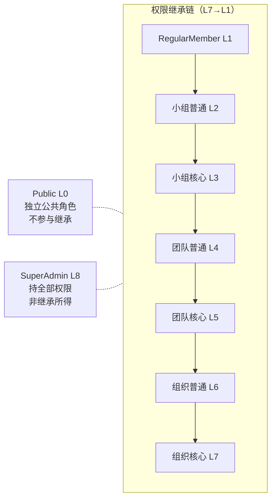

# RBAC权限引擎方案

> P2 核心域之二。定义 RBAC 角色体系、45 权限点矩阵的结构、二维继承模型、单角色绑定、权限继承的预填充固化，以及权限缓存与数据范围控制策略。本方案驱动数据库设计（`roles` / `permission_points` / `role_permissions`）与接口/中间件层的权限校验。

---

## 文档信息

| 项目 | 内容 |
|------|------|
| 文档密级 | 内部 |
| 文档版本 | V1.0.0 |
| 编写人 | ClaudeCode |
| 审核人 | - |
| 生效时间 | 2026-07-15 |
| 废弃时间 | - |
| 关联标签 | 技术方案、RBAC、权限引擎、核心域 |
| 关联目录 | 05-架构与方案设计/02-核心域 |

## 变更记录


| 版本 | 日期 | 变更内容 | 变更人 |
|------|------|----------|--------|
| V1.0.0 | 2026-07-19 | 文档新编 | ClaudeCode |

---

## 一、定位与 PRD 来源

PRD 权限管理模块（[权限管理模块](../../04-需求与产品设计/01-产品PRD/01-多租户底座/06-权限管理模块/权限管理模块.md)）要求：

- 预定义角色初始化（FR-PERM-001）、请求时权限点校验（FR-PERM-002）、数据范围控制（FR-PERM-003）、权限继承（FR-PERM-004）。
- 仅预定义角色、单角色绑定、二维继承、继承自初始化固化。

决策依据：[ADR架构决策记录](../01-基座/02-ADR架构决策记录.md)、[ADR架构决策记录](../01-基座/02-ADR架构决策记录.md)、[ADR架构决策记录](../01-基座/02-ADR架构决策记录.md)；约束基线 [整体架构设计](../01-基座/01-整体架构设计.md)。

---

## 二、角色体系（9 种角色）

每个成员在每个数据范围内仅绑定一个角色（单角色，ADR-002）。角色层级 L0~L8：

| 角色 | role_key | 层级 | 管理范围 | 说明 |
|------|----------|------|----------|------|
| Public | `public` | L0 | 无 | 公共角色，每用户自动拥有，仅持 3 个公开权限点 |
| RegularMember | `regular_member` | L1 | 个人 | 普通成员，基础操作权限 |
| 小组普通管理员 | `group_ordinary_admin` | L2 | 小组 | 小组成员管理 + 资源读取，无结构性操作 |
| 小组核心管理员 | `group_core_admin` | L3 | 小组 | 在普通基础上加修改/删除小组、分配/降级角色 |
| 团队普通管理员 | `team_ordinary_admin` | L4 | 团队 | 团队成员管理 + 资源读取 |
| 团队核心管理员 | `team_core_admin` | L5 | 团队 | 加修改/归档团队、创建小组、分配/降级角色 |
| 组织普通管理员 | `organization_ordinary_admin` | L6 | 组织 | 组织成员管理 + 资源读取 |
| 组织核心管理员 | `organization_core_admin` | L7 | 组织 | 加修改组织、创建团队、分配/降级角色、查看审计 |
| SuperAdmin | `super_admin` | L8 | 全局 | 跨组织管理所有组织与系统配置，持全部 45 权限点 |

> SuperAdmin **不属于任何** organization/team/group 成员关系，权限直接来自 `super_admin` 角色（见 [多租户隔离方案](./01-多租户隔离方案.md) 全局角色例外）。

---

## 三、权限点矩阵（45 个）

完整矩阵（认证 5 + 账号 7 + 组织 9 + 团队 9 + 小组 8 + 审计 3 + 超级管理员 4）以 [权限管理模块](../../04-需求与产品设计/01-产品PRD/01-多租户底座/06-权限管理模块/权限管理模块.md#五权限点矩阵) 为权威来源，本方案不重复罗列，仅规定其**结构化落地方式**（见第五节）。

矩阵关键特征：
- `public` 持 3 个公开权限点：`auth.register` / `auth.login` / `auth.reset_password`，**不进入**常规权限校验（公开操作）。
- `super_admin` 持全部 45 个权限点。
- 其余角色的有效权限 = 自身权限 + 继承所得（见第四节）。

---

## 四、二维继承模型

权限继承为**二维**（PRD [权限继承](../../04-需求与产品设计/01-产品PRD/01-多租户底座/06-权限管理模块/04-权限继承.md)）：

- **范围层级（纵向）**：组织(L7/L6) > 团队(L5/L4) > 小组(L3/L2)。高层范围角色向下**只继承同层级**低层范围权限：
  - 组织核心(L7) 继承 团队核心(L5) + 小组核心(L3)
  - 组织普通(L6) 继承 团队普通(L4) + 小组普通(L2)
- **管理员层级（横向）**：同一范围内，核心继承普通（如小组核心 L3 继承小组普通 L2）。
- 两个维度叠加构成由低到高的线性链：



> **ARCH-010 修复**：Public（L0）是独立公共角色，仅持 3 个公开权限点，不进入常规权限校验；SuperAdmin（L8）持全部 45 权限点，非继承所得。两者均**不参与继承链**，图中以虚线标注其独立性。继承链仅包含 RegularMember(L1) → 组织核心(L7)。
>
> 关键约束：纵向继承**只取同层级**，避免“普通管理员越级获得低层范围核心权限”的悖论。

---

## 五、权限继承的预填充（固化）实现

采用 **预填充固化**（ADR-007 + PRD 继承方案）：在初始化 `role_permissions` 时，高层角色的映射记录 = 自身权限点 + 其下所有低层角色权限点。

**优势**
- 运行时权限校验只需查询"当前角色的权限点集合"，**无需递归计算继承链**，降低延迟（NFR-PERF-001：95% < 100ms）。
- 数据范围控制与层级回溯在 MembershipValidator 完成（见 [多租户隔离方案](./01-多租户隔离方案.md)），PermissionChecker 仅做"集合包含"判断。

**各角色有效权限构成（含继承）**

| 角色 | 有效权限点构成 |
|------|----------------|
| Public(L0) | 3 个公开权限点 |
| RegularMember(L1) | 自身权限点 |
| 小组普通(L2) | 小组普通 + RegularMember |
| 小组核心(L3) | 小组核心 + 小组普通 + RegularMember |
| 团队普通(L4) | 团队普通 + 小组全部 + RegularMember |
| 团队核心(L5) | 团队核心 + 团队普通 + 小组全部 + RegularMember |
| 组织普通(L6) | 组织普通 + 团队普通 + 小组全部 + RegularMember |
| 组织核心(L7) | 组织核心 + 组织普通 + 团队核心 + 小组核心 + RegularMember |
| SuperAdmin(L8) | 全部 45 个权限点 |

**变更与刷新**
- 角色/权限矩阵调整后，需重新执行初始化以重新预填充映射。
- 重新预填充后，必须失效相关账号的权限缓存（见第六节），确保下次请求加载最新权限。

---

## 六、权限缓存策略

依据 ADR-007：权限校验高频且对延迟敏感，引入 Redis 缓存有效权限集。

> **ARCH-002 修复**：缓存键从 org 级别精细化到 scope 级别，避免同一 org 下不同 team/group 角色混淆导致越权。

| 项目 | 策略 |
|------|------|
| 缓存键 | `perm:account:{account_id}:{scope_type}:{scope_id}`（scope_type=org\|team\|group，scope_id=对应 ID） |
| 缓存值 | 该账号在该 scope 下的有效权限点集合（含回溯展开后的角色权限） |
| TTL | 24h |
| 写入 | PermissionChecker 未命中时查 DB 并回填；数据范围由 MembershipValidator 先确定生效 scope 与角色 |
| 失效 | 角色/成员关系变更（分配/降级/移除/邀请接受）、权限矩阵重新预填充时，主动删除相关 key |
| 降级 | 缓存不可用时回退 DB 查询（不阻断业务，仅性能下降） |
| 缓存粒度说明 | 每个账号在每个 scope（org/team/group）下各有一条缓存记录。MembershipValidator 确定请求的生效 scope 后，取对应 scope 的缓存。虽然缓存条目增多，但逻辑更清晰，避免 org 级别缓存混淆不同 scope 角色。命中率通过 scope 级别缓存仍可达标。 |

> 命中率目标 ≥ 95%（NFR-PERF-008，详见 [XYFamily Wiki - 知识库](../../README.md)）。

---

## 七、数据范围控制（与隔离协同）

权限点校验必须结合数据范围（组织/团队/小组上下文）生效（FR-PERM-003）：

- 权限不是全局生效，而是绑定在请求携带的 scope 上下文中（见 [多租户隔离方案](./01-多租户隔离方案.md)）。
- 高层范围管理员自动覆盖其下级范围，但仅覆盖**同层级**权限（纵向继承约束）。
- 跨范围越权访问、上下文缺失/非法，均被拒绝（400/403）。
- 全局操作（SuperAdmin 系统配置、全局审计）无需 scope，由 `super_admin` 角色直接判定。

---

## 八、校验流程总览

```mermaid
flowchart TD
    A[请求] --> B[JWT 验证 + 黑名单]
    B --> C[提取 X-Org/Team/Group-ID]
    C --> D[MembershipValidator<br/>层级回溯确定生效角色]
    D --> E[PermissionChecker<br/>查 Redis 权限集(缓存优先)]
    E --> F{包含接口所需权限点?}
    F -->|否| G[返回 403]
    F -->|是| H[业务 Handler]
```

详细链路见 [链路实现](../04-链路实现/链路实现.md) 与 [链路实现](../04-链路实现/链路实现.md)。

---

## 九、关联文档

- [整体架构设计](../01-基座/01-整体架构设计.md) — 约束基线 C1/C7/C9、请求处理链路
- [ADR架构决策记录](../01-基座/02-ADR架构决策记录.md) — ADR-002/007/008
- [多租户隔离方案](./01-多租户隔离方案.md) — 上下文校验与层级回溯
- [JWT鉴权链与Token方案](./03-JWT鉴权链与Token方案.md) — Token Claims 中的 `roles`
- [数据库设计](../03-数据模型与契约/01-数据库设计/数据库设计.md) — `roles`/`permission_points`/`role_permissions` 落库与预初始化
- [权限管理模块](../../04-需求与产品设计/01-产品PRD/01-多租户底座/06-权限管理模块/权限管理模块.md)
