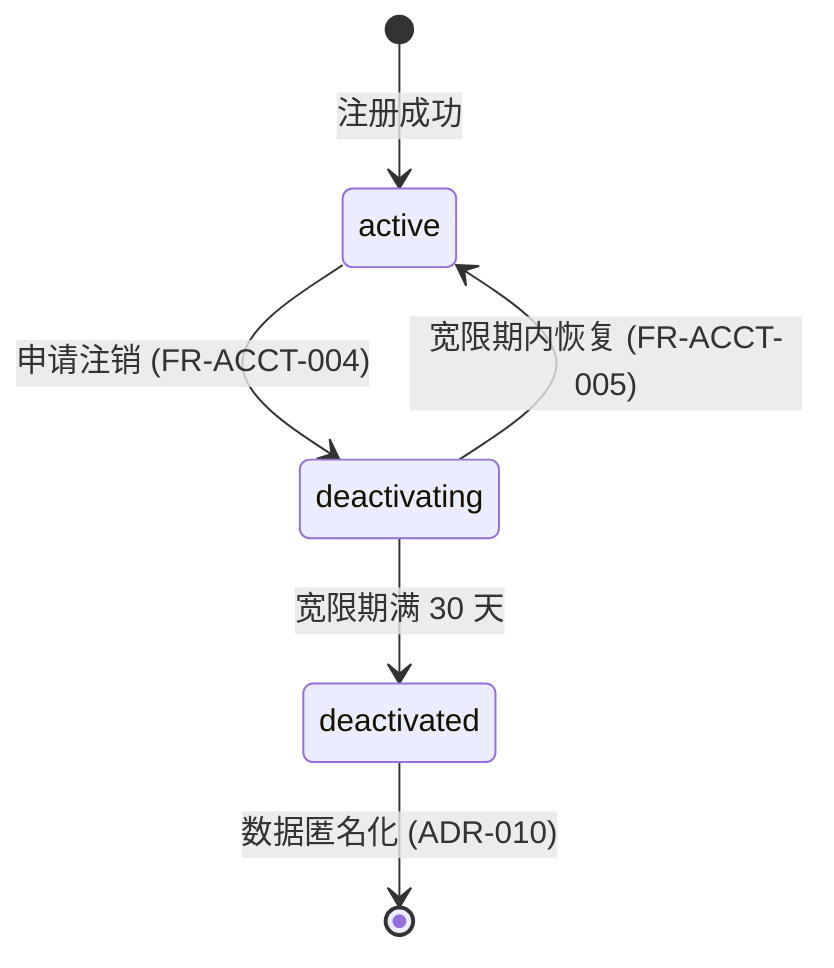

# 账号生命周期与身份方案

> P5 支撑域之一。定义账号从注册到注销、宽限期、匿名化、恢复的全生命周期状态机与定时任务，并明确身份标识体系。承接 [账号与认证域](../03-数据模型与契约/01-数据库设计/01-账号与认证域.md#二accounts账号主表)、[JWT鉴权链与Token方案](../02-核心域/03-JWT鉴权链与Token方案.md) 会话规则，依据 ADR-006/010 与账号 PRD（FR-ACCT-004/005）。

---

## 文档信息

| 项目 | 内容 |
|------|------|
| 文档密级 | 内部 |
| 文档版本 | V1.0.0 |
| 编写人 | ClaudeCode |
| 审核人 | - |
| 生效时间 | 2026-07-15 |
| 关联标签 | 技术方案、账号、生命周期、身份 |
| 关联目录 | 05-架构与方案设计/05-支撑域 |

## 变更记录

| 版本 | 日期 | 变更内容 | 变更人 |
|------|------|----------|--------|
| V1.0.0 | 2026-07-19 | 文档新编 | ClaudeCode |

---

## 一、身份标识体系（ADR-005）

| 标识 | 作用 | 备注 |
|------|------|------|
| `id` | 数据库主键 UUID | 对外隐藏 |
| `account_id` | 业务聚合根 UUID | 所有对外引用（成员、审计、Token Claims `sub`） |
| `phone` / `email` / `username` | 登录标识，各自全局唯一 | 至少其一非空 |
| `password_hash` | bcrypt cost=12 | 可空（第三方注册未绑定） |

---

## 二、生命周期状态机

| 状态 | 说明 | 可执行操作 |
|------|------|------------|
| `active` | 正常 | 全部业务 |
| `deactivating` | 注销宽限期（30 天） | 仅可恢复；业务操作拒绝 |
| `deactivated` | 已匿名化 | 无任何权限 |

---

## 三、关键流程与实现

### 3.1 注销（进入宽限期）
- 接口 `POST /account/deactivate`（[账号接口](../03-数据模型与契约/02-接口设计/02-账号接口.md)）。
- 置 `status=deactivating`，`deactivated_at = now() + 30d`（配置 `account.deactivate_grace_days`）。
- 保留成员身份与角色（便于恢复），仅标记不可操作。
- 撤销当前 Access（黑名单）+ 全部 Refresh 会话。

### 3.2 恢复（宽限期内）
- 接口 `POST /account/undeactivate`（需验证码）。
- 校验未超 `deactivated_at` → `status=active`，角色权限自动恢复（membership 未删）。
- 超宽限期 → 拒绝（`200007`）。

### 3.3 匿名化（宽限期满，定时任务）
- 每日定时扫描 `deactivated_at <= now()` 且 `status=deactivating` 的账号。
- 执行：PII 替换 `anon_` 前缀（nickname/phone/email/username 清空或替换）；`password_hash` 置空；`deleted_at` 置位；membership 的 `role` 清空（保留行，ADR-006）。
- 不可逆（与宽限期内恢复区分）。

### 3.3-A、匿名化兜底机制（ARCH-014 修复）

> **背景**：PRD 审查 ADV-008 建议增加兜底机制——若定时任务故障，到期账号将长期处于 deactivating 状态，PII 未匿名化，违反 NFR-SEC-007 与 NFR-COMPL-001。

- **触发时机**：用户尝试登录 `status=deactivating` 的账号时，检查 `deactivated_at`。
- **条件**：`deactivated_at <= now()`（已超宽限期）。
- **即时处理**：
  1. 状态变更为 `deactivated`；
  2. 执行匿名化流程（同 §3.3）；
  3. 撤销该账号所有会话；
  4. 返回 `101009`（账号已注销），拒绝登录。
- **并发控制**：使用分布式锁 `lock:anonymize:{account_id}` 防止定时任务与登录兜底同时执行匿名化。
- **审计**：兜底匿名化触发时记录审计日志（`action_type=account.deactivate`，`details` 标注 `trigger=login_fallback`）。
- **告警**：兜底触发时发送告警（定时任务可能故障），运维确认定时任务健康。

### 3.4 登录态约束
- `deactivating`：允许登录但标记状态，禁止业务操作（PRD 认证 §4.2）。
- `deactivated`：拒绝登录（`101009`）。

---

## 四、与上下游的关系

| 下游 | 本方案提供 |
|------|------------|
| [JWT鉴权链与Token方案](../02-核心域/03-JWT鉴权链与Token方案.md) | 注销 → 会话撤销/黑名单 |
| [审计日志方案](../04-链路实现/03-审计日志方案.md) | 注销/恢复审计 + 匿名化 |
| [账号接口](../03-数据模型与契约/02-接口设计/02-账号接口.md) | 状态字段契约 |

## 五、关联文档

- [账号与认证域](../03-数据模型与契约/01-数据库设计/01-账号与认证域.md)
- [ADR架构决策记录](../01-基座/02-ADR架构决策记录.md) / [ADR架构决策记录](../01-基座/02-ADR架构决策记录.md)
- 账号 PRD：../../04-需求与产品设计/01-产品PRD/01-多租户底座/02-账号管理模块/账号管理模块
