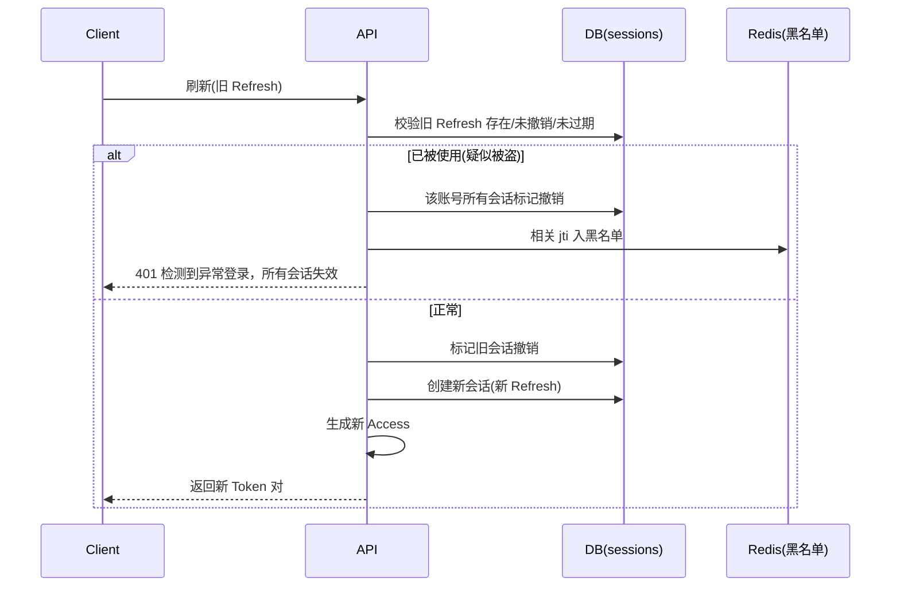

# JWT鉴权链与Token方案

> P2 核心域之三。定义双 Token 机制（Access + Refresh）、Token 上下文 Claims、签名与轮换、黑名单/失效、Refresh Rotation、防重放与多端会话安全。本方案驱动数据库设计（`sessions` / `token_blacklist`）、接口设计（登录/刷新/登出契约）与中间件链（JWTValidator / TokenBlacklist）。

---

## 文档信息

| 项目 | 内容 |
|------|------|
| 文档密级 | 内部 |
| 文档版本 | V1.0.0 |
| 编写人 | ClaudeCode |
| 审核人 | - |
| 生效时间 | 2026-07-15 |
| 废弃时间 | - |
| 关联标签 | 技术方案、JWT、Token、会话、核心域 |
| 关联目录 | 06-架构与方案设计/02-核心域 |

## 变更记录

| 版本 | 日期 | 变更内容 | 变更人 |
|------|------|----------|--------|
| V1.0.0 | 2026-07-19 | 文档新编 | CatPaw |

---

## 一、定位与 PRD 来源

PRD Token 管理模块（[Token管理](../../04-需求与产品设计/01-产品PRD/01-多租户底座/01-用户认证模块/04-Token管理.md)）定义：

- Token 刷新（FR-AUTH-009）：Refresh 有效且未撤销时返回新 Access + 新 Refresh。
- 登出（FR-AUTH-010）：同时使 Access 与 Refresh 失效。
- 非功能：Access 30min / Refresh 7d（NFR-SEC-004）、HS256 可升级 RS256（NFR-SEC-005）。

决策依据：[ADR架构决策记录](../01-基座/02-ADR架构决策记录.md)；约束基线 [整体架构设计](../01-基座/01-整体架构设计.md)。

---

## 二、双 Token 机制

| Token | 形态 | 有效期 | 存储 | 说明 |
|-------|------|--------|------|------|
| Access Token | 无状态 JWT | 30min | 客户端内存（减少持久化泄露） | 业务请求凭证，自然过期 |
| Refresh Token | 有状态 | 7d | 安全持久化（HttpOnly Cookie / Keychain） | 存于 `sessions` 表，支持主动撤销 |

- 鉴权链路：JWTValidator 校验 Access 签名+有效期 → TokenBlacklist 校验 jti → 进入租户上下文与权限校验。
- 客户端建议每 25 分钟静默刷新 Access，避免 30min 过期打断体验。

---

## 三、Token Claims（上下文）

依据 PRD 2.1 上下文要求，Access Token 载荷至少包含：

| Claim | 说明 | 用途 |
|-------|------|------|
| `sub` | 账号 ID（UUID `account_id`） | 身份识别 |
| `jti` | Token 唯一标识 | 黑名单校验 |
| `org_ids` | 用户所属组织 ID 列表（≤10） | 多租户隔离、自动推断组织上下文 |
| `roles` | 各组织下最高角色（如 `{org_id: role_key}`） | 权限判定（与 MembershipValidator 回溯结果配合） |
| `iat` / `exp` | 签发 / 过期时间 | 时效控制 |

> Refresh Token 不携带业务明文，仅关联账号、设备、客户端 IP，便于安全审计与主动撤销。

---

## 四、签名与轮换

- 算法：HS256（首期）→ 可平滑升级 RS256（NFR-SEC-005，升级方案见 [ADR架构决策记录](../01-基座/02-ADR架构决策记录.md#adr-016jwt-签名算法升级与密钥轮换方案)）。
- 密钥管理：生产环境密钥来自密钥管理服务（KMS）或环境变量，定期轮换（建议 90 天）；轮换期间允许新旧密钥短暂共存（按 JWT Header `kid` 头区分）。
- `kid` 头规则：每个密钥分配唯一 `kid`，签发时写入 Header；验证时按 `kid` 查找对应密钥，未找到则拒绝。
- 防伪造：Access Token 签名失败即 401；不信任客户端声明的任何权限字段，权限以服务端 `role_permissions` 为准。

---

## 五、黑名单机制

用于"主动失效"无状态 Access Token（ADR-003）：

| 写入时机 | 写入内容 | TTL |
|----------|----------|-----|
| 登出 | Access Token 的 `jti` | = Access 剩余有效期 |
| 修改密码 | 当前 Access 的 `jti` | = Access 剩余有效期 |
| 密码重置 | 该账号全部会话相关 `jti` | = Access 剩余有效期 |

- 存储：Redis，key 如 `bl:{jti}`，TTL 避免永久存储。
- 校验：每次请求在 JWTValidator 之后查黑名单，命中即 401（Token 已被撤销）。

---

## 六、Refresh Token Rotation

依据 PRD FR-AUTH-009，采用 **一次性使用（One-Time Use）** 机制：

- 刷新成功后旧 Refresh 立即作废；仅第一个请求成功返回新 Token 对（唯一约束/分布式锁防并发）。
- 后续请求携带旧 Refresh（已被使用）→ 判定为被盗用，触发安全告警并撤销该账号所有会话。
- 携带新 Refresh（已收到新对）→ 幂等返回新 Access。

---

## 七、会话管理规则

| 操作 | 会话影响 | 说明 |
|------|----------|------|
| 登录成功 | 创建会话 | 写入 `sessions` |
| 刷新 Token | 旧会话撤销 + 新会话创建 | Rotation |
| 登出 | 撤销当前会话 + Access jti 入黑名单 | 支持单设备登出 |
| 修改密码 | 当前 Access jti 入黑名单，其他会话撤销 | 保留当前会话 |
| 密码重置 | 该账号所有会话撤销 | 需重新登录 |
| 账号注销 | 所有会话撤销 | 无法继续使用 |

- 会话清理：定期清理已过期且已撤销的会话记录，保留 ≥30 天用于审计。
- 登出幂等：Token 已失效仍返回成功。

---

## 八、防重放与多端会话安全

| 措施 | 说明 |
|------|------|
| 短效 Access | 30min 减少泄露窗口 |
| 黑名单 | 登出/改密即时失效 |
| Refresh Rotation | 旧 Refresh 重用即告警并全员下线 |
| 设备/IP 关联 | Refresh 绑定账号、设备、客户端 IP，异常可审计 |
| 限流 | 刷新频率超限返回 429（与登录限流共用 RateLimiter） |
| 多端 | 多设备各自独立会话；支持单设备登出与全局下线 |

### 8.1 闲置超时自动登出（ARCH-009 修复，NFR-SEC-011）

> **背景**：Access Token 30min 自然过期不等于“闲置超时”——用户活跃使用时也会过期。NFR-SEC-011 要求无操作时自动登出。

- **实现方案**：采用「前端静默刷新 + 后端滑动窗口」组合策略：
  1. 前端每次用户操作（点击/输入/滚动）后，在 Access Token 剩余有效期 < 5min 时触发静默刷新；
  2. 若用户无操作，前端不触发静默刷新，Access Token 30min 后自然过期，达到闲置超时效果；
  3. 后端在 Refresh 接口检查 `sessions.last_activity_at`，若距上次活动 > 30min 则拒绝刷新，要求重新登录。
- **`sessions` 表新增字段**：`last_activity_at TIMESTAMPTZ`，每次请求由中间件更新（异步，不阻塞主流程）。

### 8.2 异地/新设备登录提醒（ARCH-009 修复，NFR-SEC-011）

> **背景**：NFR-SEC-011 要求异地或新设备登录时发送提醒。

- **实现方案**：
  1. 登录成功时，对比当前请求 IP 与该账号历史登录 IP（查 `sessions` 表最近 10 条记录的 `client_ip`）；
  2. 若当前 IP 不在历史列表中，或 `user_agent` 与历史记录不匹配，判定为“异地/新设备登录”；
  3. 将提醒事件推入 Redis Stream（`notify_stream`），由通知 consumer 异步发送短信/邮件/站内通知（通知降级策略见 [第三方集成统一方案](../05-支撑域/03-第三方集成统一方案.md)）；
  4. 提醒内容包含登录时间、IP 地址（脱敏）、设备类型；不阻断登录流程。

---

## 九、跨存储事务失败处理策略（ARCH-004 修复）

> **背景**：登出/改密/重置操作需同时写 Redis（黑名单）和 PG（sessions 撤销），跨两个存储无分布式事务保证。

### 9.1 操作顺序与失败处理

| 操作 | 步骤 | 失败处理 |
|------|------|----------|
| **登出** | ① PG `UPDATE sessions SET revoked_at` → ② Redis `SET bl:{jti}` | ① 失败：返回 500，不做后续；② 失败：返回成功（PG 已撤销 Refresh，Access 最长 30min 自然过期），记录补偿日志，后台任务重试写入黑名单 |
| **修改密码** | ① PG 撤销其他会话 → ② Redis 写入多个 jti 黑名单 | 同上：优先 PG，Redis 失败时补偿重试 |
| **密码重置** | ① PG 撤销全部会话 → ② Redis 批量写入黑名单 | 同上：优先 PG，Redis 失败时补偿重试 |

### 9.2 设计原则

- **PG 为强一致主操作**：sessions 撤销是安全基线，必须成功。
- **Redis 黑名单为加速手段**：黑名单的目的是让 Access Token 立即失效而非 30min 后自然过期。若 Redis 写入失败，安全性降级但不破坏（Access 最长 30min 窗口期）。
- **补偿机制**：Redis 写入失败时，记录补偿日志（`compensation_log` 表或 Redis Stream），后台任务每分钟扫描并重试写入，最多重试 3 次。
- **告警**：Redis 黑名单写入失败时触发告警（[可观测性方案](../06-横切专项/03-可观测性方案.md)），运维确认 Redis 健康。

### 9.3 不一致场景分析

| 场景 | PG 状态 | Redis 状态 | 影响 | 恢复 |
|------|---------|------------|------|------|
| 正常 | ✅ 撤销 | ✅ 黑名单 | Access 立即失效，Refresh 不可用 | — |
| Redis 失败 | ✅ 撤销 | ❌ 未写入 | Access 30min 内仍可用，Refresh 不可用 | 补偿任务重试或自然过期 |
| PG 失败 | ❌ 未撤销 | ❌ 未写入 | 操作失败，返回 500 | 用户重试 |

---

## 十、与上下游方案的关系

| 下游方案 | 本方案提供什么 |
|----------|----------------|
| [XYFamily Wiki - 知识库](../../README.md) | `sessions`（Refresh 有状态）、`token_blacklist` 结构 |
| [接口设计](../03-数据模型与契约/02-接口设计/接口设计.md) | 登录/刷新/登出/改密契约与错误码 |
| [链路实现](../04-链路实现/链路实现.md) | JWTValidator、TokenBlacklist 实现 |
| [链路实现](../04-链路实现/链路实现.md) | 登录/登出/刷新/异常行为审计 |

---

## 十一、关联文档

- [整体架构设计](../01-基座/01-整体架构设计.md) — 约束基线 C3/C6、请求处理链路
- [ADR架构决策记录](../01-基座/02-ADR架构决策记录.md) — ADR-003
- [多租户隔离方案](./01-多租户隔离方案.md) — Token Claims 的 `org_ids` / `roles` 如何用于隔离
- [RBAC权限引擎方案](./02-RBAC权限引擎方案.md) — `roles` 的权限展开
- [Token管理](../../04-需求与产品设计/01-产品PRD/01-多租户底座/01-用户认证模块/04-Token管理.md)
